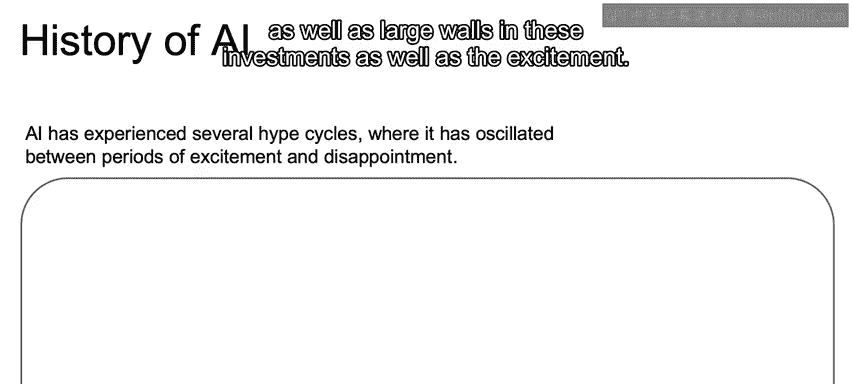
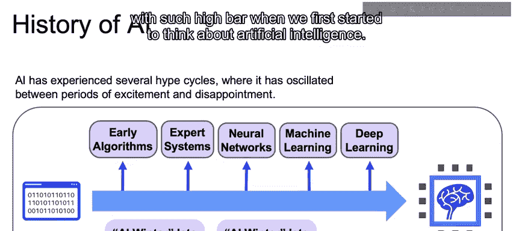
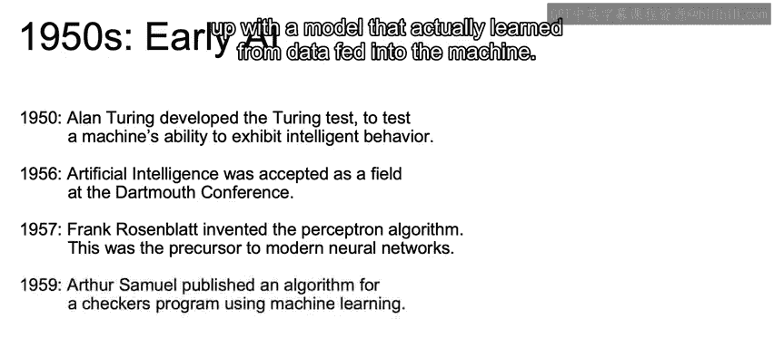
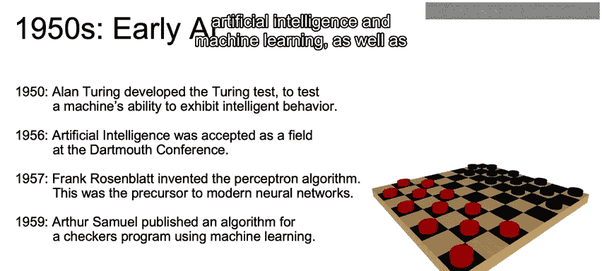
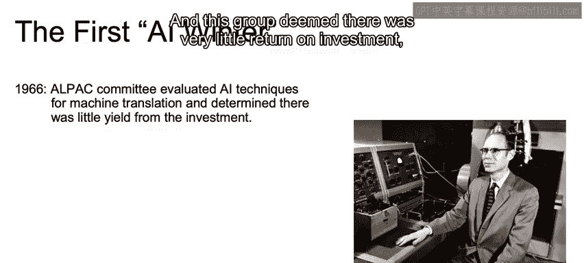
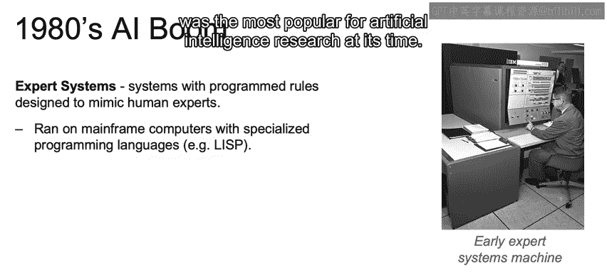
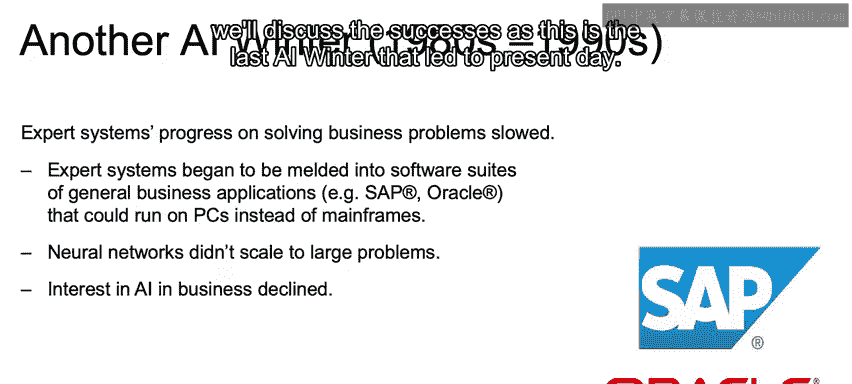

# 006：人工智能的历史 🤖

在本节课中，我们将回顾人工智能的发展历程，了解它是如何从早期的概念演变为今天激动人心的技术。我们将看到人工智能经历的几个关键周期，包括投资热潮与低谷，以及推动其发展的里程碑事件。

---

## 人工智能的兴衰周期 📈📉

人工智能的发展并非一帆风顺，它经历了多次投资与期望的起伏周期。

以下是人工智能历史上的主要兴衰阶段：

*   **1950年代：开端与兴奋** - 人工智能术语被正式提出，首批投资和承诺开始被广泛讨论。
*   **1960-70年代：第一次AI寒冬** - 实际成果未能达到最初的期望，导致投资热情减退。
*   **1980年代：第二次繁荣** - 基于规则的专家系统在商业中得到应用，同时神经网络理论取得突破。
*   **1980年代末-90年代：第二次AI寒冬** - 专家系统和神经网络在实际应用中的局限性再次导致投资减少。
*   **1990年代末-2000年代初：机器学习崛起** - 机器学习在语音识别、搜索引擎等任务上取得成功。
*   **现今：深度学习时代** - 深度学习取得重大突破，在图像分类、机器翻译等复杂问题上超越了传统机器学习方法。

我们看到，人工智能的发展经历了起起落落，最终在深度学习领域迎来了新的高潮，实现了许多最初设定的高难度目标。

---

## 早期里程碑（1950年代）🚀

上一节我们概述了人工智能的兴衰周期，本节中我们来看看其诞生之初的关键事件。

以下是1950年代奠定人工智能基础的重要时刻：

*   **1950年：图灵测试** - 艾伦·图灵提出了“图灵测试”，用于评估机器是否能表现出与人类无异的智能行为。其核心思想是：计算机能否充分模仿人类，以至于一个心存疑虑的评判者无法区分对话方是人类还是机器？
*   **1956年：达特茅斯会议** - 在这次会议上，“人工智能”这一术语被首次提出，人工智能作为一个研究领域被正式确立。来自不同领域的研究者一致认为，在计算机中模拟智能行为是可以实现的。
*   **1957年：感知机算法** - 弗兰克·罗森布拉特发明了感知机算法，它是现代神经网络的前身。该算法展示了如何让模型从输入的数据中进行学习，这在当时引起了巨大轰动。
*   **1959年：机器学习术语的普及** - 阿瑟·塞缪尔发表了一个西洋跳棋程序算法，该程序能够根据棋盘当前状态和过往见过的位置来学习下一步走法。阿瑟·塞缪尔因推广“机器学习”这一术语而备受赞誉。

因此，在1950年代，我们见证了“人工智能”和“机器学习”这些关键术语的出现，以及作为深度学习前身的感知机算法的诞生。

---

## 第一次AI寒冬 ❄️

在经历了早期的兴奋之后，正如预期的那样，人工智能迎来了第一次低谷期，即“AI寒冬”。

以下是导致第一次AI寒冬的几个关键事件：

*   **1966年：机器翻译评估** - 机器翻译（特别是俄英互译）是当时人工智能的主要目标之一。美国政府委派的七人科学家委员会评估后认为，机器翻译的投资回报率很低，这给人工智能的热潮带来了沉重打击。
*   **1969年：感知机的局限性** - 马文·明斯基的研究指出了罗森布拉特感知机算法的重大局限性，这再次打击了人们对人工智能的信心。
*   **1973年：莱特希尔报告** - 著名的英国应用数学家詹姆斯·莱特希尔发表报告，指出过去几十年的研究成果远未达到当初的高期望，导致各国政府大幅削减了对人工智能研究的资助。

这些重要的公开报告导致政府大幅削减AI研究经费，从而引发了第一次AI寒冬。

---

## 第二次繁荣与寒冬 🔄

上一节我们了解了第一次AI寒冬，本节中我们来看看人工智能如何再次复兴，并随后陷入新的低谷。

在1980年代，人工智能迎来了第二次繁荣。

以下是1980年代的主要进展：

*   **专家系统的流行** - 专家系统风靡一时。这些系统通过编程规则来模拟人类专家，其理念是将不同领域的专家知识以事实和规则的形式硬编码到机器中。它们运行在强大的大型机上，使用Lisp等专用编程语言。专家系统获得了巨大普及，人工智能首次大规模进入商业世界。
*   **反向传播算法的提出** - 杰弗里·辛顿等人发表了关于反向传播算法的著作，这可能是深度学习最重要的算法。它允许多层网络利用给定数据更好地更新其参数。这引发了巨大兴奋，因为研究者理论上可以训练能够从新数据中学习的复杂多层模型。

然而，在80年代末到90年代，我们遭遇了第二次AI寒冬。

以下是导致第二次寒冬的原因：

*   **专家系统进展缓慢** - 专家系统在解决商业问题上的进展放缓，主要原因是它们无法学习，并且在接收到异常输入时可能犯严重错误。
*   **硬件平台变迁** - 专家系统开始被整合到能在个人电脑上运行的通用商业应用软件套件中，对大型机的投资随之减少。
*   **神经网络扩展性不足** - 神经网络无法扩展到大型问题。曾引发巨大兴奋的反向传播算法，在应用于大型数据集和大型网络时面临许多实现上的问题。

考虑到这些因素，利用人工智能推动商业发展的热情再次消退。

---

## 总结 📚

本节课中，我们一起学习了人工智能从诞生至今的波澜壮阔的历史。我们看到了它如何从1950年代的概念萌芽，经历数次“繁荣-寒冬”的周期，最终在深度学习的推动下达到新的高度。关键里程碑包括图灵测试的提出、感知机算法的发明、专家系统的兴衰以及反向传播算法等理论突破。理解这段历史有助于我们把握人工智能技术的发展脉络和未来趋势。