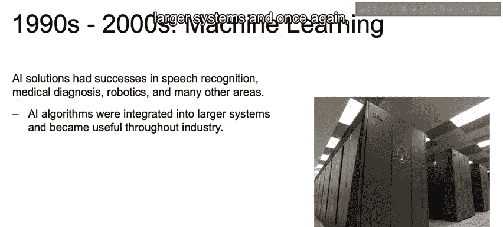
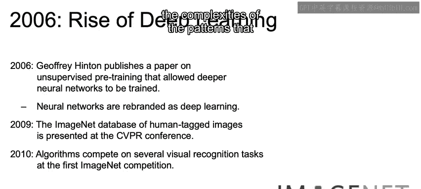
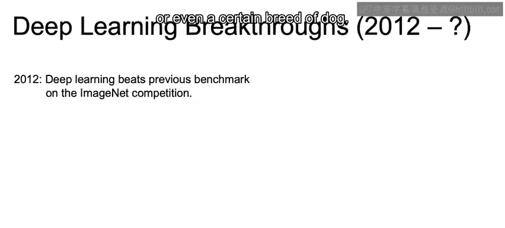
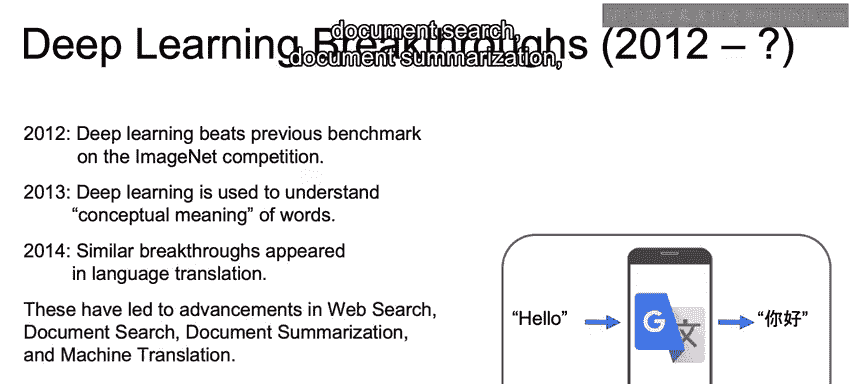
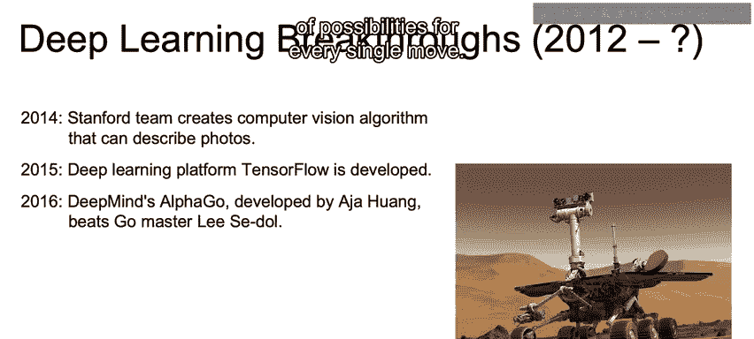
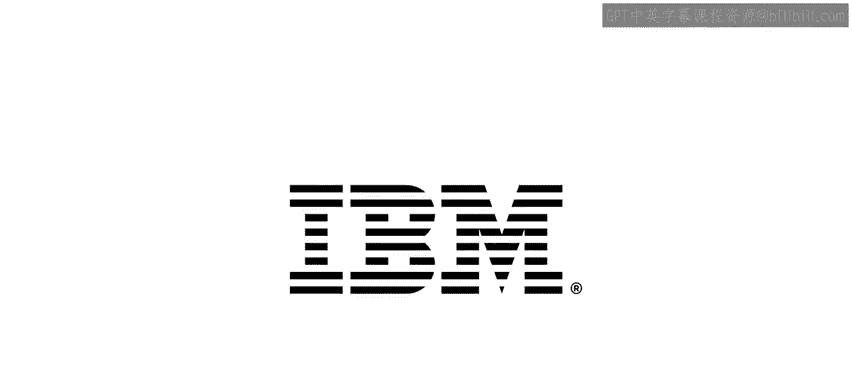

# 007：机器学习和深度学习的历史 📜

在本节课中，我们将回顾人工智能在20世纪90年代至21世纪初的发展历程，了解经典机器学习技术如何走向成熟，以及深度学习如何克服早期限制并取得突破性进展。

上一节我们介绍了人工智能的早期发展与寒冬期，本节中我们来看看它在现代是如何复兴并取得惊人成就的。

## 20世纪90年代至21世纪初的兴起 🚀

20世纪90年代至21世纪初，采用经典机器学习技术的人工智能解决方案开始兴起。人工智能在语音识别、医疗诊断、机器人技术等众多领域取得成功。人工智能算法被集成到更大的系统中，并再次在整个工业界变得有用。

以下是该时期的一些关键里程碑：

*   **1996年**：IBM的“深蓝”计算机完成了首次在正式比赛中击败国际象棋世界冠军的壮举。
*   **搜索引擎革命**：谷歌凭借其**PageRank算法**革新了搜索引擎领域，该算法用于对网页进行排名和显示搜索结果。其核心思想可简化为：一个网页的重要性取决于链接到它的其他网页的数量和质量。
*   **2006年**：深度学习先前的主要限制——**梯度消失和梯度爆炸问题**——通过杰弗里·辛顿等人在无监督预训练方面的算法进步得以克服。随着能够训练更深（更多层）的网络，神经网络被重新命名为“深度学习”。
*   **2009年**：ImageNet数据库发布。这是一个开创性的数据集，为数百万张图像提供了此前数据从业者无法轻易获得的标签。
*   **2010年**：在首届ImageNet竞赛中，各种算法在多项视觉识别任务上展开竞争。这极大地增加了算法通过大量样本学习复杂模式（例如构成猫、狗甚至特定犬种的特征）的机会。

## 深度学习的突破性进展 🎬

如果将深度学习的起伏比作一部电影，那么2012年的竞赛无疑是这部电影的高潮。

*   **2012年**：一个使用卷积神经网络（CNN）的深度学习模型——**AlexNet**——在ImageNet竞赛中取得了前五错误率15.3%的成绩，以超过10.8个百分点的优势击败了其他对手。
*   **2013年**：深度学习被用于通过海量文本数据学习词语的概念含义，即**词向量**表示。
*   **2014年**：在机器翻译任务上出现类似突破，利用了**循环神经网络（RNN）** 等概念，实现了20世纪60年代的主要目标之一。
*   **2014年**：斯坦福大学的研究人员将计算机视觉提升到新高度，模型能够为照片生成描述性标题（例如“比赛中投球的棒球运动员”），而不仅仅是识别物体。
*   **2015年**：最流行的深度学习库之一——**TensorFlow**——发布，使深度学习更强大、更易用。2019年的2.0版本整合了高级API **Keras**，进一步提升了易用性和灵活性。
*   **2016年**：DeepMind的**AlphaGo**击败了围棋世界冠军。围棋因其每一步棋的可能性空间极其庞大，被认为比国际象棋复杂得多。
*   **2018年**：谷歌旗下的自动驾驶出租车服务**Waymo**开始在凤凰城郊区提供载客服务。
*   **2019年**：IBM的**Project Debater**与人类冠军辩手进行了一场引人入胜的辩论，展示了就一个主题进行论证、倾听人类回应并据此反驳的能力。

以上只是人工智能发展到今天众多重要成果中的一部分。在下一节中，我们将更深入地探讨是什么让当前这个人工智能时代如此特别。

---

本节课中我们一起学习了人工智能在近几十年的复兴之路，从经典机器学习的广泛应用，到深度学习突破技术瓶颈并在图像识别、自然语言处理、游戏博弈等领域的革命性进展。这段历史展示了算法创新、数据积累和计算能力提升共同推动着人工智能的快速发展。