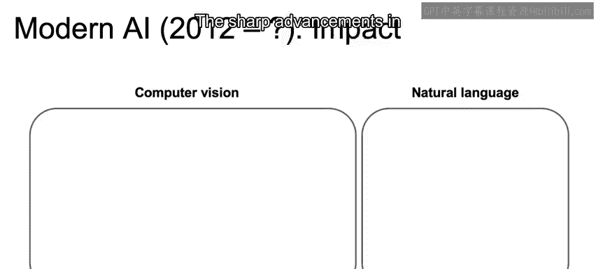
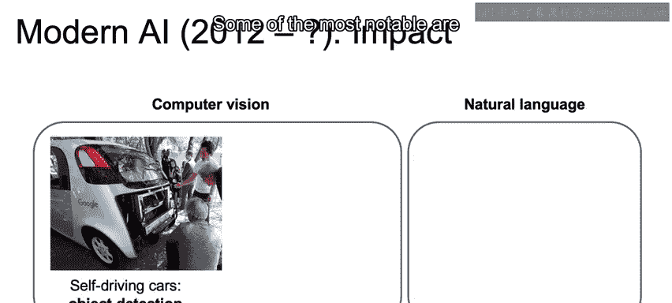
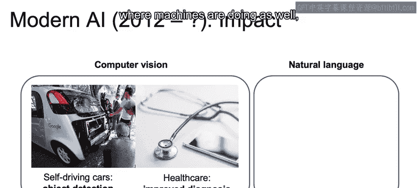
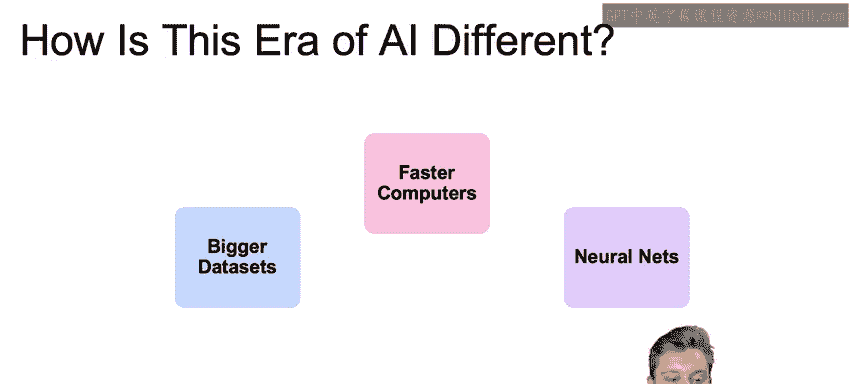
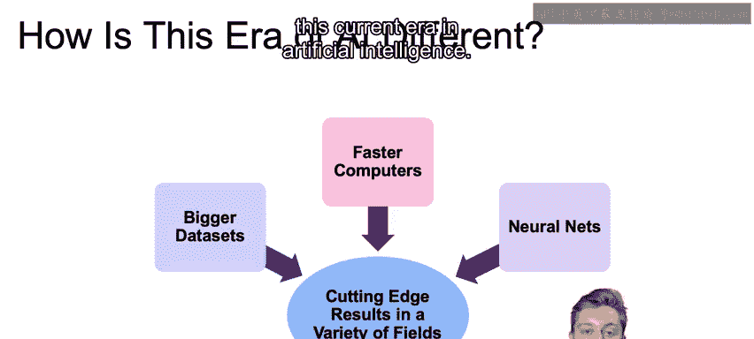
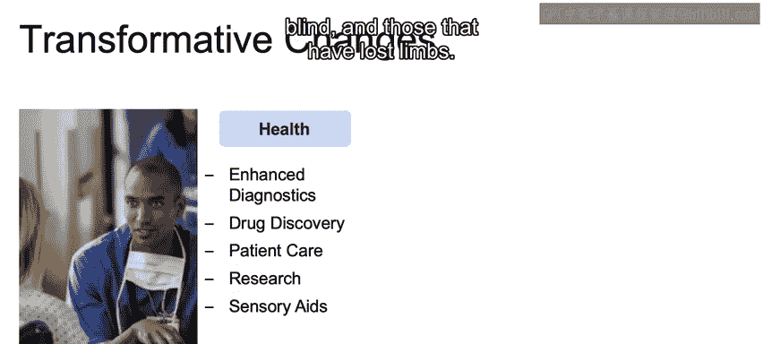
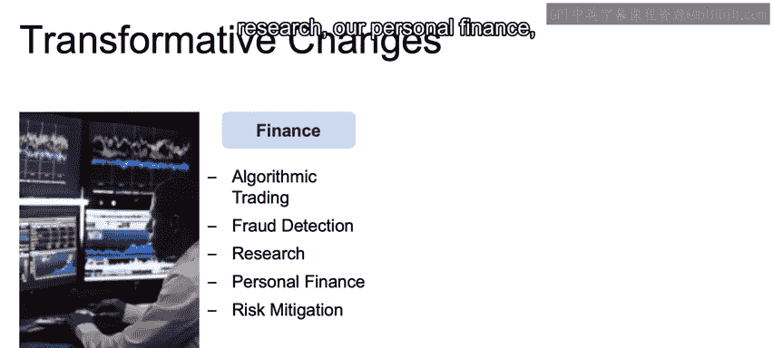
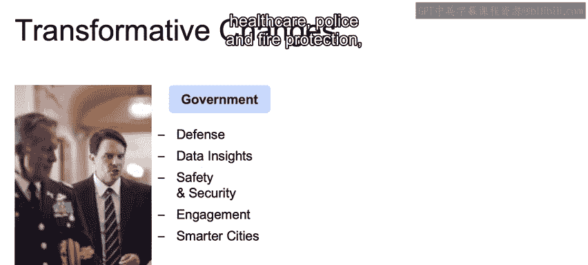
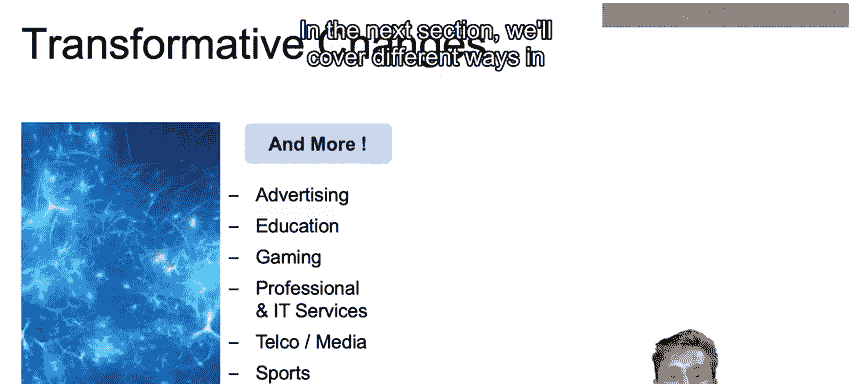
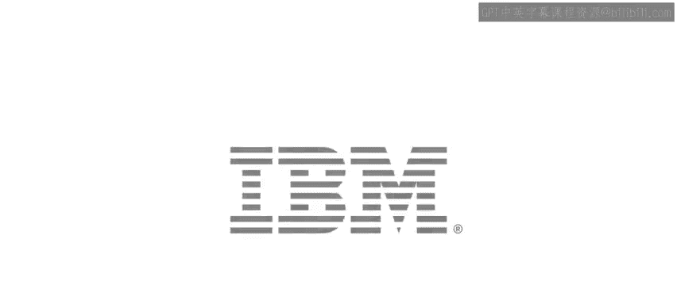

# 008：现代人工智能 🌐

在本节课中，我们将深入探讨当今的人工智能格局，以更好地理解我们目前所处的位置，以及为何这个时代与众不同。

## 概述

我们将审视当前人工智能的两个高速增长与创新领域：计算机视觉和自然语言处理。接着，我们将分析驱动当前人工智能时代蓬勃发展的关键因素。最后，我们会概览人工智能正在深刻变革的众多行业，理解其如何像“新电力”一样渗透到各个角落。

---

## 当今人工智能的核心领域 🚀

上一节我们回顾了人工智能的历史，本节中我们来看看当前推动人工智能发展的两大前沿领域。

**计算机视觉**和**自然语言处理**是当前见证急剧增长和创新的两大空间。

计算机视觉的显著进步正在影响多个领域，其中最引人注目的包括：
*   **自动驾驶**：汽车正发展到能够自主驾驶的阶段。
*   **医疗诊断**：计算机视觉现已用于审阅不同的成像模态，如X光和MRI，以诊断疾病。我们正快速接近机器诊断能力与医疗专家相当甚至更优的水平。

同样，**自然语言处理**也蓬勃发展，其在翻译、情感判定、新闻文章聚类、论文撰写等诸多方面的能力都取得了巨大进步。

---

## 为何这个时代与众不同？🔍

了解了当前的重点领域后，我们不禁要问：这个人工智能时代有何不同？主要因素有以下几点。

以下是驱动现代人工智能革命的三个核心要素：

1.  **更庞大的数据集**：我们现在拥有比以往更庞大、更多样化的数据集。以ImageNet为例，它开启了利用大型数据集训练模型以学习复杂模式的机会。云基础设施使得海量数据存储成本更低，加之层出不穷的新数据捕获方式，使我们能够构建更庞大、更细致的数据集，以学习跨众多领域的基础模式。
2.  **更快的计算机**：我们现在能够使用强大的硬件进行数据处理和存储。上世纪80年代驱动专家系统的大型机每月成本约20万美元，而如今我们放在膝上的计算机更强大、更快速。
3.  **神经网络的兴起**：在过去的十年里，神经网络终于起飞并被证明是成功的。深度学习领域持续不断的创新，带来了行业内切实可行的成果。

这一切共同促成了多个领域的尖端成果。

---

## 人工智能的日常应用实例 📱

理论因素推动了发展，那么在实际生活中，人工智能如何体现呢？我们可以从身边的事物思考。

我们可以想想手机：如何使用面部解锁手机，它们如何识别我们的声音，如何查看照片并识别出我们或朋友的照片。
我们有商店（如Amazon Go），可以走进去拿起商品，而无需前往收银台结账。
我们的家居正由声音驱动，告诉它我们想播放音乐，或希望开关电灯。
所有这些都由当前的人工智能时代所驱动。

---

## 人工智能驱动的行业变革 🏥🏭

人工智能的影响远不止于消费电子，它正在重塑整个产业格局。在接下来的内容中，我将重点介绍一部分正被人工智能深度驱动的行业样本，希望无论您身处哪个行业，都能感同身受，并展示人工智能如何像新电力一样被所有行业使用。

*   **医疗健康**：如前所述，人工智能用于辅助医学影像分析，计算机通常能做出与医疗专业人员一样准确甚至更准确的诊断。在药物发现方面，辉瑞公司利用IBM Watson的机器学习来助力药物发现和寻找免疫肿瘤药物。患者护理以及医疗行业内的AI研究也由人工智能驱动，它帮助推进了针对聋哑人、盲人和截肢者的感官辅助设备。
*   **工业**：我们现在能够自动化工厂工作以提高效率并降低成本。我们能够监控未来系统故障并提前安排维护。能够增强和优化农业生产。现场自动化能够以更快的速度跟踪销售、库存和交付需求。
*   **金融**：算法交易、欺诈检测、研究、个人理财、风险缓解，所有这些都由人工智能驱动。
*   **能源**：人工智能被用于定位和提取石油和天然气储量。我们有智能电网，其本质是优化电网以实现更高效的基础设施。我们还能够改善行业内的整体运营，并且正在学习利用人工智能来节约能源。
*   **政府**：人工智能应用于国防和威胁识别（回想我们的冷战例子和今天的情况），获取所有主要问题的洞察（无论是来自天气、流行病的威胁，还是更好地理解公民的需求）。它利用国内外更多数据来驱动安全与安保，能够增强政府与公民之间的互动，并帮助建设智慧城市以优化交通、医疗、警察和消防保护以及能源分配等。
*   **交通**：我们有自动驾驶汽车、用于配送的自动化卡车运输。人工智能在航空航天领域应用广泛，用于优化模拟、维护和原型设计。它能够为航运提出最优路线和时间安排。人工智能还借助搭载机器学习算法的无人机，帮助在可能对人类初始探索过于危险的区域搜索和检测失踪人员，从而助力搜救领域。
*   **其他领域**：我们还有个性化广告、个性化教育（能够识别学生知道和不知道的内容，并据此制定个性化课程）。游戏能够利用人工智能的许多最新进展，为玩家提供更类人的体验。服务业能够快速自动化许多响应，减少解决许多常见问题所需的时间和人力。
*   **电信与媒体**：我们可以想想媒体如何利用人工智能帮助消费者定义直接匹配其兴趣的内容。在体育领域，高级分析正在驱动总经理招募球员的方式，以及优化票价和其他商业运营。

由此可见人工智能渗透到所有行业的程度，以及为何这个人工智能时代与以往任何时代都不同。

---

## 总结

本节课中，我们一起学习了现代人工智能的格局。我们首先聚焦于当前取得突破的**计算机视觉**和**自然语言处理**两大领域。然后，我们分析了驱动本次人工智能浪潮的三个关键因素：**更庞大的数据集**、**更快的计算机**以及**神经网络的兴起**。最后，我们广泛浏览了人工智能正在变革的众多行业，从医疗、工业到金融、交通等，认识到人工智能已成为像电力一样的基础性力量，正在重塑我们的世界和日常生活。

在下一节中，我们将介绍人工智能应用到我们日常生活中的不同方式。