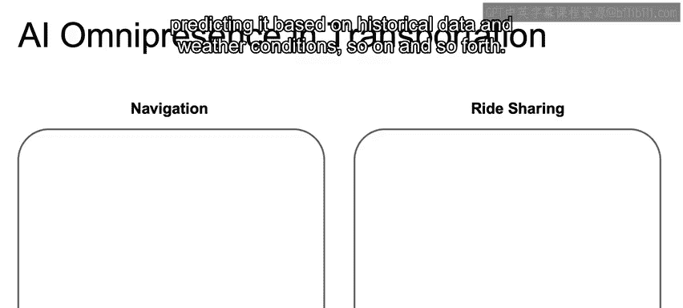
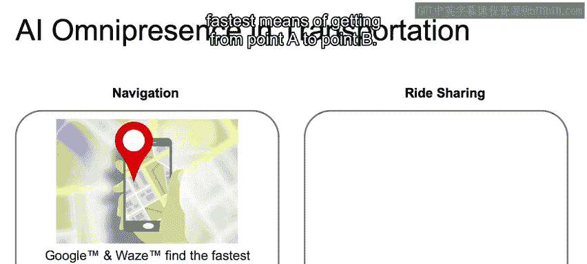
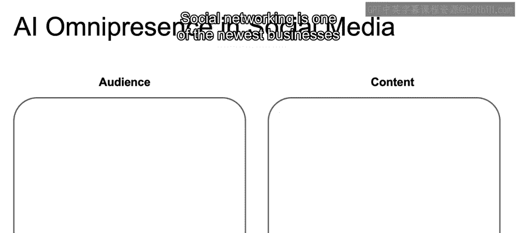
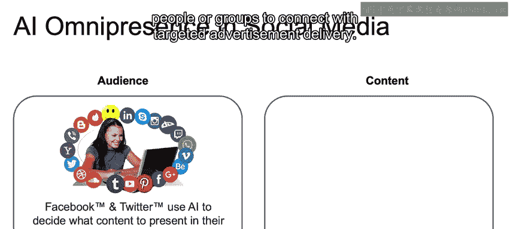
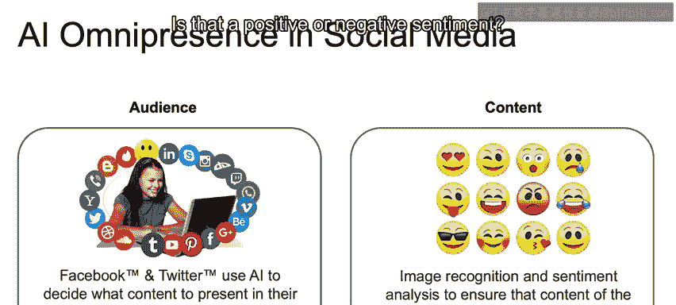
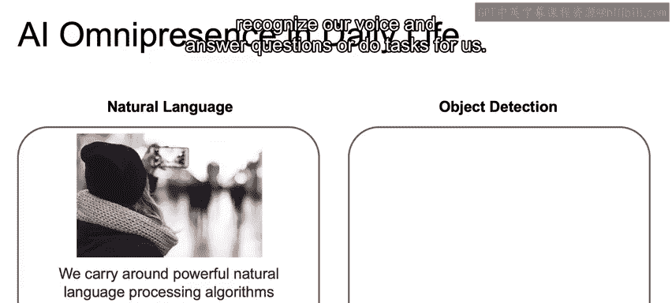
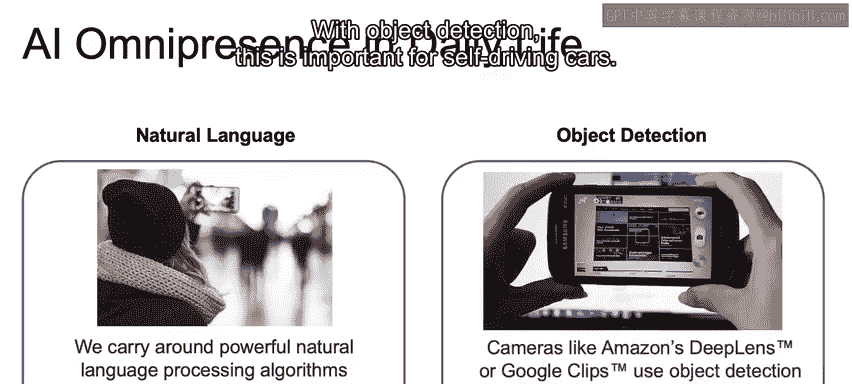
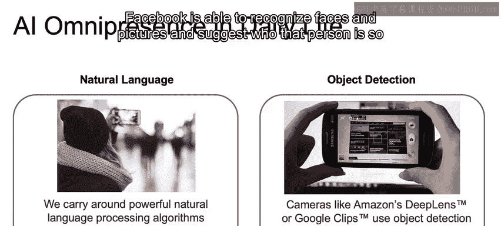
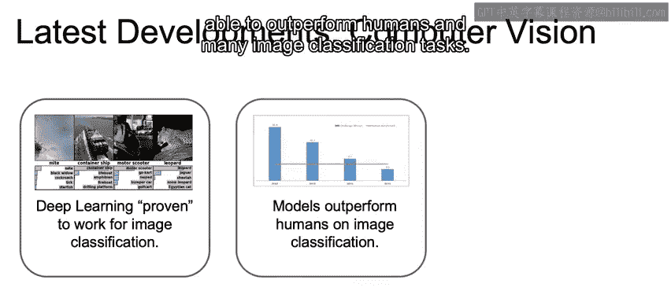
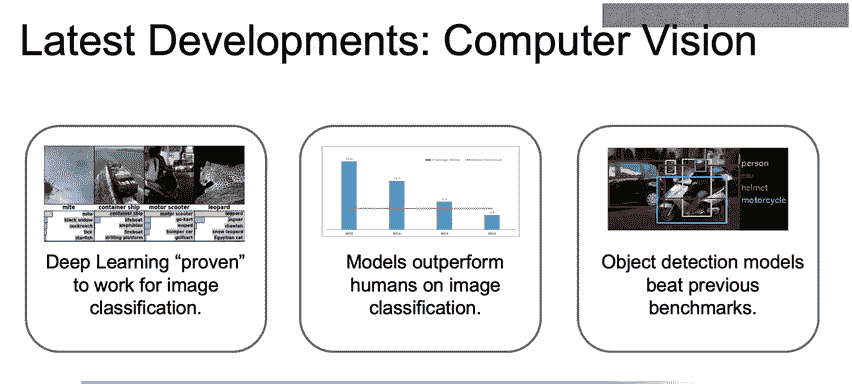

# 009：人工智能的日常应用 🚗📱

在本节课中，我们将简要探讨人工智能在我们日常生活中的实际应用。我们将看到，人工智能技术已经深入到个人出行、社交媒体、自然语言处理以及计算机视觉等多个领域，并持续推动着这些领域的创新与发展。

---

## 个人出行领域的应用 🚕

上一节我们回顾了人工智能的历史发展，本节中我们来看看它在个人出行中的具体应用。

计算两点之间的最短路径是一个在人工智能出现之前就存在的经典问题。如今，这个问题变得更加复杂，因为算法需要整合实时交通信息，或基于历史数据和天气条件进行预测。

Google Maps 和 Waze 等应用已经能够综合所有这些因素，不断优化其算法，为用户提供从A点到B点的最快路线方案。

在共享出行领域，Uber 和 Lyft 能够根据供需关系（而非固定费率）来动态定价。这种供需关系可以通过人工智能技术进行实时更新。

以下是人工智能在出行领域带来的主要改变：
*   **路径规划**：整合实时交通、历史数据与天气，计算最优路线。
*   **动态定价**：利用AI模型根据实时供需调整价格。

---

## 社交媒体行业的应用 📱

接下来，我们将目光转向蓬勃发展的社交媒体行业，这是探索人工智能应用的最新领域之一。

人工智能现在能够识别与个人相关的内容，推荐可能感兴趣的人或群组进行连接，并实现精准的广告投放。

我们还看到图像识别和情感分析技术的应用，以确保平台呈现的内容符合我们期望的氛围。人工智能已成功应用于识别内容的情感倾向，例如判断一篇餐厅评论是正面还是负面的。

以下是人工智能在社交媒体中的关键应用：
*   **内容推荐**：向用户推荐相关的帖子、人或群组。
*   **精准广告**：根据用户画像和行为进行定向广告投放。
*   **内容审核**：利用图像识别和情感分析确保内容安全与合规。

---

## 自然语言与计算机视觉的应用 🗣️👁️

现在，让我们探讨人工智能在理解人类语言和视觉世界方面的强大能力。

在我们的日常生活中，自然语言处理技术已经产品化。例如，我们手机上的Siri或家中的Alexa可以识别我们的语音，回答问题或执行任务。

物体检测技术对于自动驾驶汽车至关重要。同时，Facebook能够识别照片中的人脸并建议标签，从而方便用户与朋友分享照片。

在计算机视觉领域，正如我们在课程中深入讨论的，深度学习在图像分类任务上已被证明非常有效，甚至在许多任务中超越了人类的表现。

如今，我们看到这项技术应用于实时检测，这对于未来推广自动驾驶汽车将非常重要。

展望未来，这项技术可以用于诸如遗留行李检测等场景。系统可以自动检测到无人看管的行李，这有可能挽救生命。这类系统将依赖于前沿的、实时运行的物体检测技术。由此可见，人工智能如何能够实时应用于实际场景。

---

## 总结与预告 📚

本节课我们一起学习了人工智能在多个日常领域的实际应用案例，包括智能出行、社交媒体、自然语言处理和计算机视觉。我们看到，AI不再是遥远的概念，而是切实改善我们生活效率与体验的工具。

至此，我们关于人工智能历史及其现代应用的讨论就告一段落了。在下一个视频中，我们将介绍常见的机器学习工作流程以及相关词汇，为你学习后续课程做好准备。