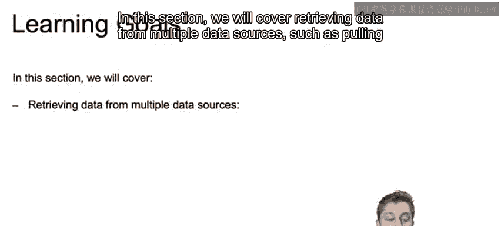
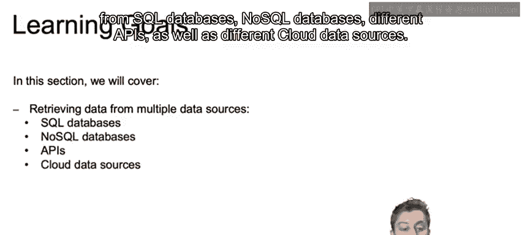
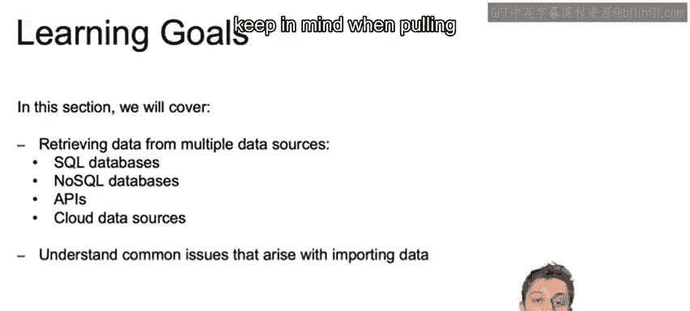
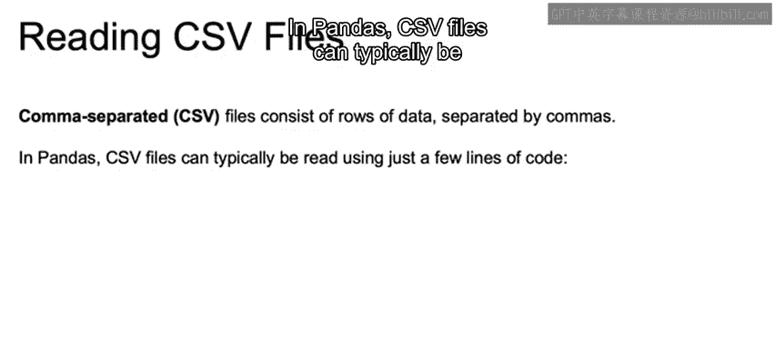
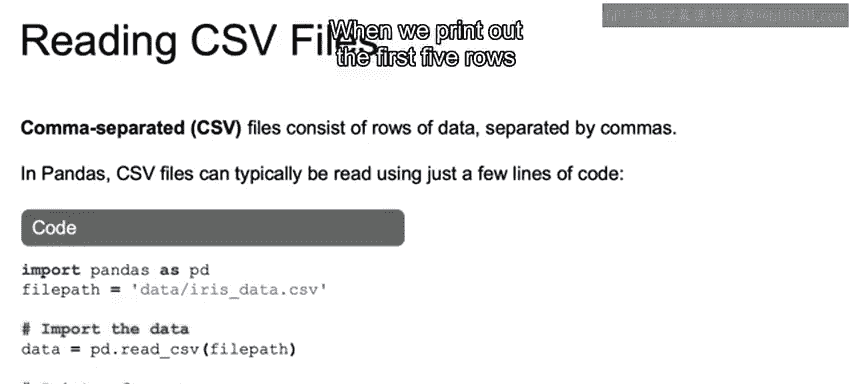
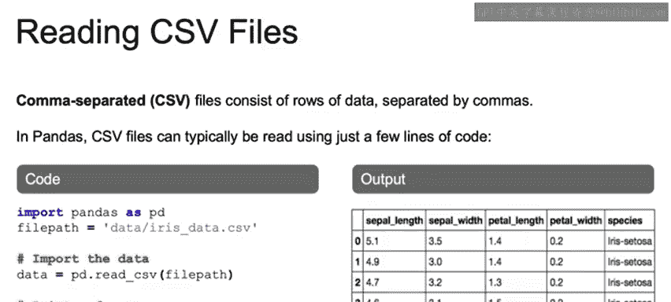
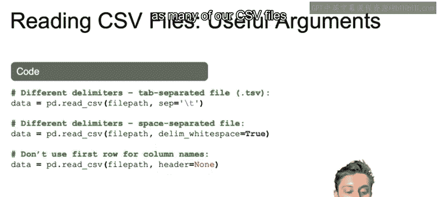
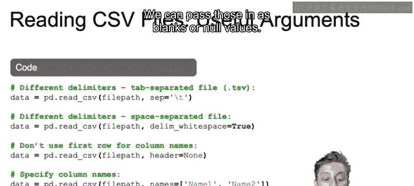
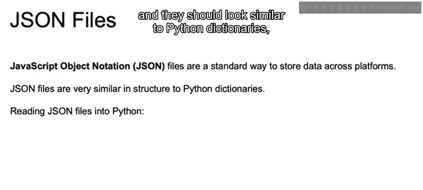
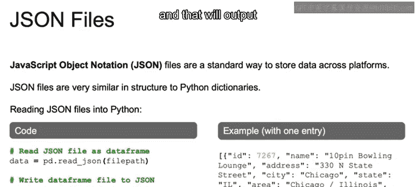

# 011：从CSV和JSON文件中检索数据 📂

在本节课中，我们将要学习如何从不同的数据源中检索数据，特别是从CSV和JSON文件中读取数据。我们将介绍使用Pandas库进行数据读取的基本方法，并探讨一些实用的参数和技巧。





## 概述



数据是机器学习的基石，而数据通常存储在各种格式的文件中。本节我们将重点介绍两种常见的数据格式：CSV和JSON。我们将学习如何使用Python的Pandas库来读取这些文件，并将其转换为易于处理的数据结构。

## 从CSV文件中读取数据



CSV文件是一种以逗号分隔值的文本文件，常用于存储表格数据。在Pandas中，读取CSV文件通常只需要几行代码。

以下是读取CSV文件的基本步骤：

1. 导入Pandas库。
2. 设置文件路径变量，指向CSV文件的位置。
3. 使用`pd.read_csv()`函数读取文件，并将结果保存为Pandas DataFrame。



```python
import pandas as pd
file_path = 'data/iris.csv'
data = pd.read_csv(file_path)
print(data.head())
```



执行上述代码后，你将看到DataFrame的前五行数据，包括列名和对应的值。

### 有用的`read_csv`参数

在读取CSV文件时，`read_csv`函数提供了一些有用的参数，可以帮助你处理不同的数据格式。

以下是几个常用的参数：

- **`sep`**：指定分隔符。例如，对于制表符分隔的文件，可以使用`sep='\t'`。
- **`delim_whitespace`**：如果数据以空格分隔，可以设置`delim_whitespace=True`。
- **`header`**：指定哪一行作为列名。如果文件的第一行是空行，可以设置`header=0`。
- **`names`**：手动指定列名，传入一个列名列表。
- **`na_values`**：指定哪些值应被视为空值。例如，可以将字符串"NA"或数值99标记为空值。

```python
data = pd.read_csv(file_path, sep='\t', header=0, names=['col1', 'col2'], na_values=['NA', 99])
```



## 从JSON文件中读取数据

JSON文件是一种轻量级的数据交换格式，常用于NoSQL数据库和API数据交换。JSON文件的结构类似于Python字典，由键值对组成。

以下是读取JSON文件的基本步骤：



1. 使用Pandas的`read_json()`函数读取JSON文件。
2. 传入文件路径，并将结果保存为DataFrame。

```python
data = pd.read_json('data/example.json')
print(data.head())
```



### JSON文件的参数

如果读取JSON文件时遇到问题，可以查看`read_json`函数的`orient`参数。该参数定义了JSON文件的结构，常见选项包括`split`、`records`、`index`、`columns`和`values`。根据JSON文件的实际结构选择合适的`orient`值。

此外，你还可以使用`data.to_json()`方法将DataFrame写入JSON文件。

```python
data.to_json('output.json', orient='records')
```

## 总结



在本节课中，我们一起学习了如何从CSV和JSON文件中检索数据。我们介绍了使用Pandas库读取这些文件的基本方法，并探讨了一些实用的参数和技巧。掌握这些技能将帮助你在机器学习项目中更高效地处理数据。