# 012：从数据库、API和云中检索数据 📊

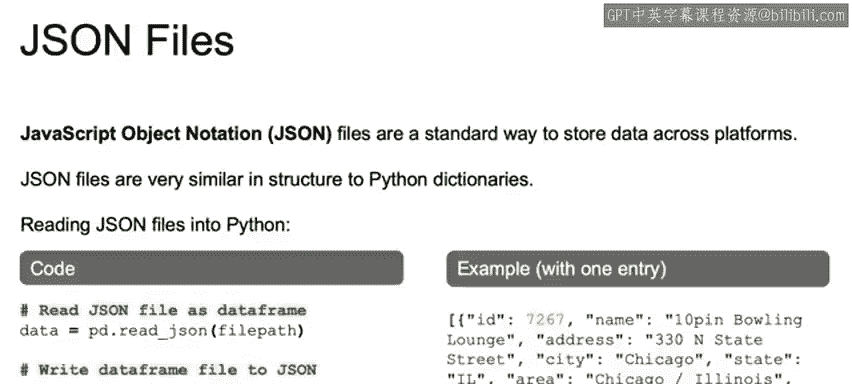

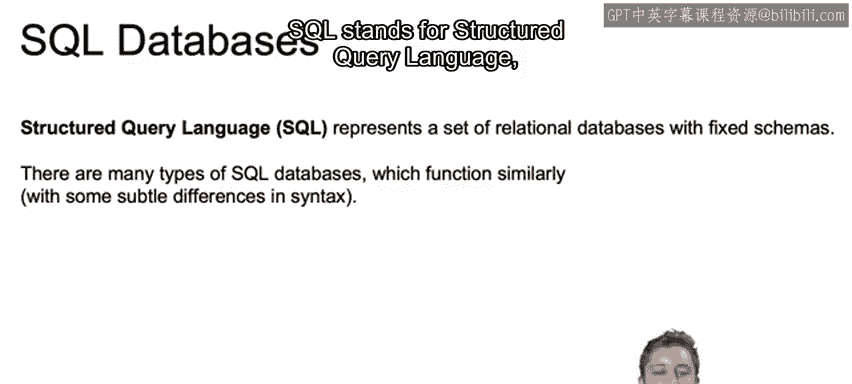

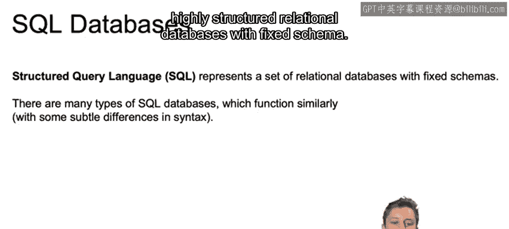

在本节课中，我们将学习如何从不同类型的数据库、API以及云端数据源中检索数据。这是数据科学工作流程中获取数据的关键步骤。

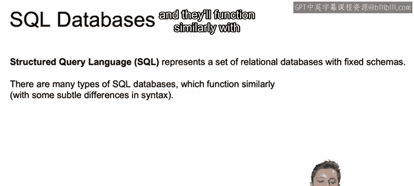

---

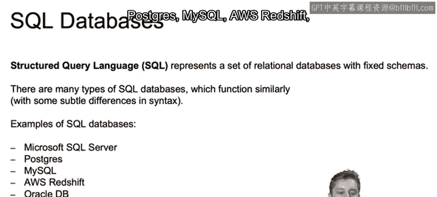

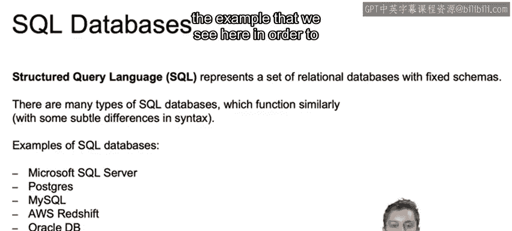

## 使用SQL数据库

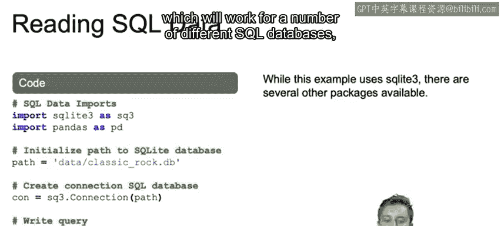

上一节我们介绍了数据的基本格式，本节中我们来看看如何从结构化的SQL数据库中提取数据。SQL代表结构化查询语言，它用于操作具有固定模式的高度结构化关系型数据库。

以下是几种常见的SQL数据库示例：
*   Microsoft SQL Server
*   Postgres
*   MySQL
*   AWS Redshift
*   Oracle DB
*   IBM的DB2系列

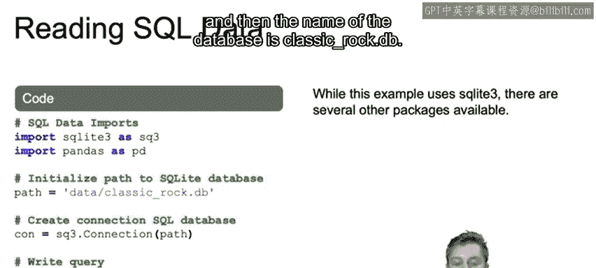

使用正确的Python库并稍作语法调整，你就能连接到工作环境中使用的数据库，并参考以下示例从中提取数据。

### 连接SQLite数据库示例

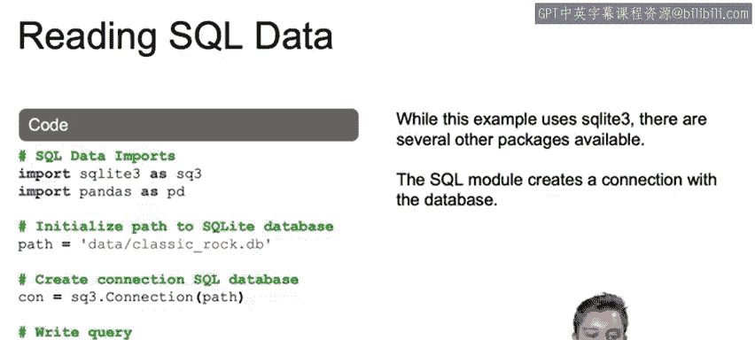

我们将以SQLite 3为例。其他流行的库包括适用于多种SQL数据库的SQLAlchemy、用于Postgres的Psycopg2以及用于DB2系列的ibm_db。

观察左侧代码，首先导入必要的库：
```python
import sqlite3
import pandas as pd
```

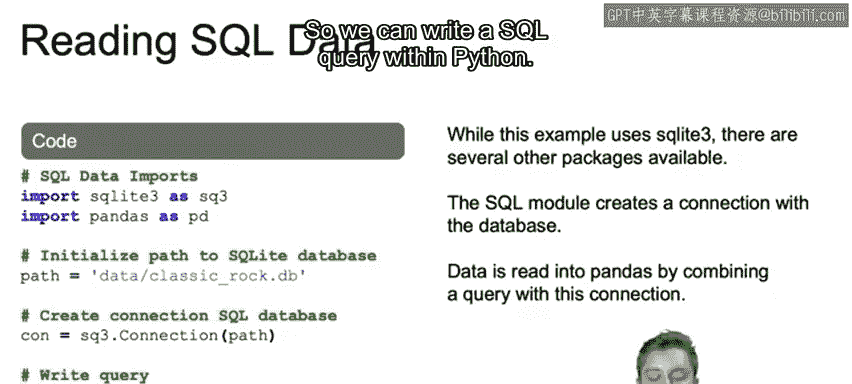

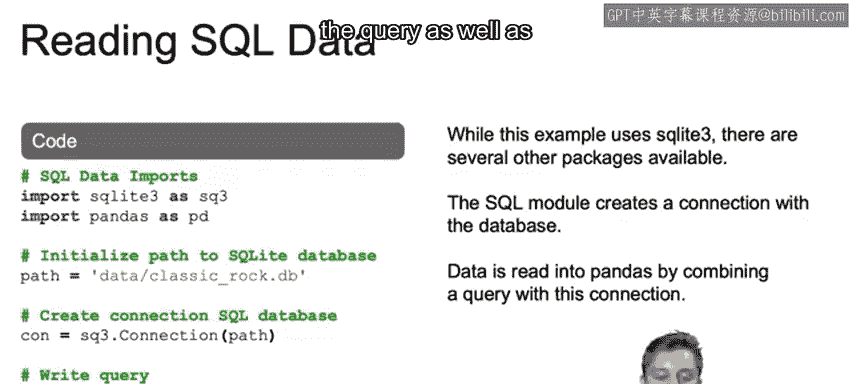

下一步是初始化SQLite数据库的路径。我们将变量`path`设置为数据库所在文件夹和数据库文件名的字符串。
```python
path = ‘data/classic_rock.db‘
```

使用这个路径，我们可以建立与数据库的连接。我们通过调用`sqlite3`库中的`connect`函数并传入刚刚创建的路径参数来实现。
```python
con = sqlite3.connect(path)
```
现在，变量`con`就代表了这个数据库连接。

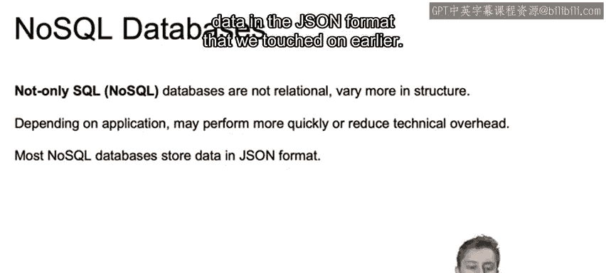

接着，我们编写实际的查询语句。我们可以在Python中直接写出SQL查询字符串。
```python
query = “SELECT * FROM rockongs“
```
这里，`rockongs`是我们数据库中的一个表，`SELECT *`表示选择所有数据。然后，我们将这个查询字符串和之前建立的连接传入pandas的`read_sql`函数。
```python
df = pd.read_sql(query, con)
```
这将输出一个我们熟悉的pandas DataFrame。

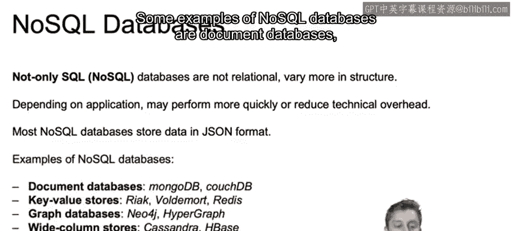

---

## 使用NoSQL数据库

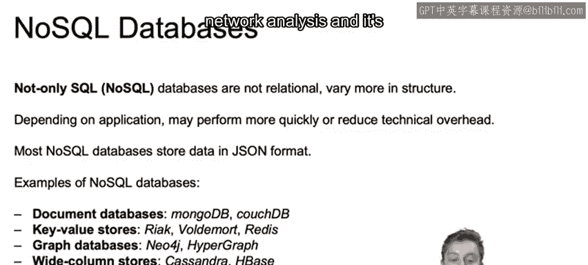

我们已经学习了如何使用SQL，现在让我们进入NoSQL数据库的世界。NoSQL是非关系型数据库，其结构更加多样化。根据应用场景，与SQL格式的结构相比，NoSQL可能性能更快或技术开销更少。

大多数NoSQL数据库以我们之前提到的JSON格式存储数据。

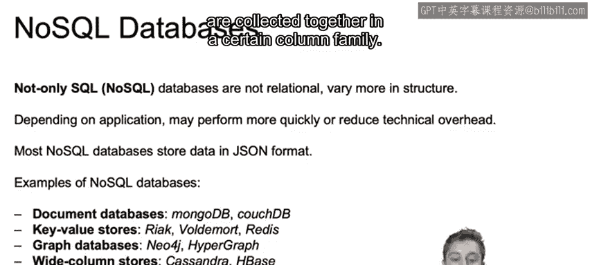

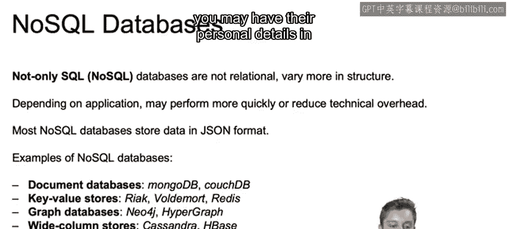

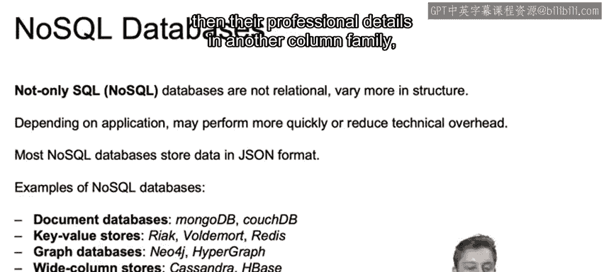

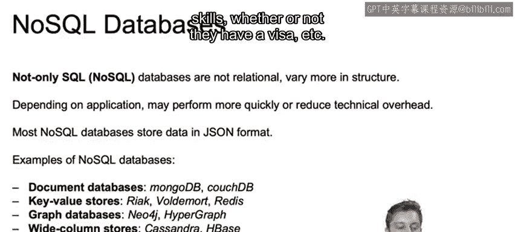

以下是NoSQL数据库的一些例子：
*   **文档数据库**：包含文档，每个文档就像一个观测值。可以想象JSON文件，每个字典就是一个文档。
*   **键值类型数据库**：基于键值对，键是查找索引（如ID），值是对应的信息（如一个人的姓名、年龄、地址等）。
*   **图数据库**：用于网络分析，擅长维护关系。例如LinkedIn中，你的一度、二度、三度人脉关系就是通过图数据库来维护的。
*   **宽列族数据库**：将所有列收集在特定的列族中。例如，一个人的“个人详情”可能在一个列族（包含姓名、地点、年龄等列），而“职业详情”在另一个列族（包含经验、技能、是否有签证等列）。


### 连接MongoDB数据库示例

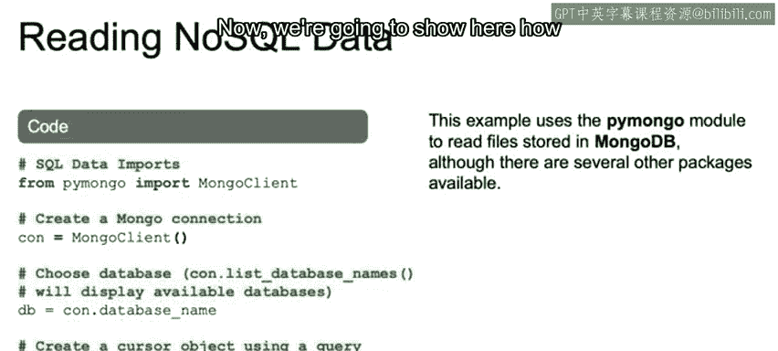

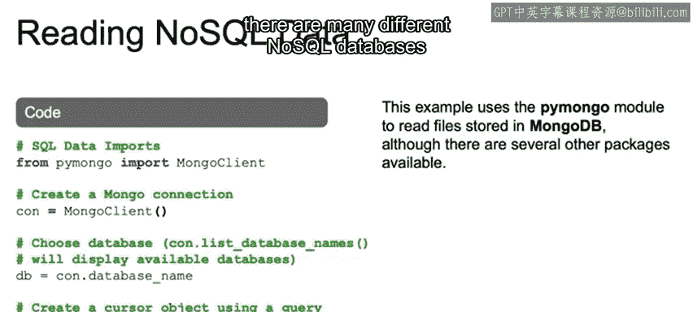

让我们看看从NoSQL数据库读取数据所需的Python代码。这里我们将展示如何从非常流行的MongoDB数据库中提取数据。当然，如前所述，我们可以连接许多不同类型的NoSQL数据库。

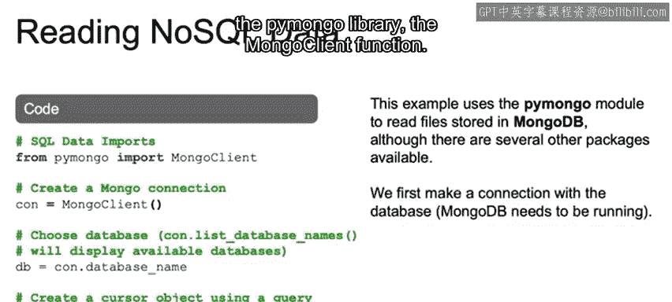

首先需要建立连接。观察代码，我们从`pymongo`库导入`MongoClient`函数。
```python
from pymongo import MongoClient
```
我们通过设置变量`con`等于`MongoClient()`来创建MongoDB连接。在括号内，我们可以传入路径参数。如果数据库在云端，可能需要包含用户名和密码来指定数据库的实际位置。
```python
con = MongoClient(“your_connection_string_here“)
```

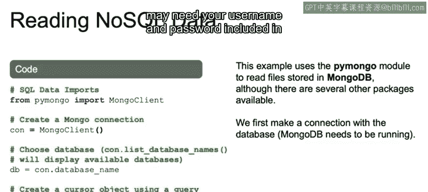

从这个连接中，我们可以获取不同的数据库。如果想查看可用的数据库，可以使用`con.list_database_names()`。在我们的示例中，连接将具有`database_name`属性（或你为数据库命名的其他名称）。
```python
db = con.database_name
```
这行代码将变量`db`设置为名为`database_name`的特定数据库。

接着，我们读入数据。为了将其导入pandas，我们需要指定一个查询。我们通过`db`指定数据库，数据库会有多个集合名称（类似于SQL中的表）。然后我们对该集合使用`.find()`方法，并传入一个查询条件。
```python
cursor = db.collection_name.find({})
```
这个查询应该是一个MongoDB查询字符串，类似于SQL查询字符串。如果我们想选择该集合中的所有数据（类似`SELECT *`），只需传入空的花括号`{}`。我们将结果标记为`cursor`。

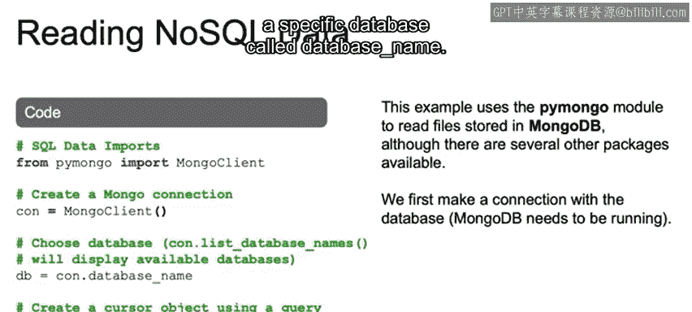

现在，`cursor`是一个生成器对象，里面包含了所有的JSON文档。为了将其转换为pandas DataFrame，我们使用`list()`函数传入游标，得到一个Python字典列表。
```python
documents = list(cursor)
```
一旦我们有了Python字典列表，就可以将其传入pandas的`DataFrame`函数。
```python
df = pd.DataFrame(documents)
```
这样，数据就以我们熟悉的pandas DataFrame格式可用了。

---

## 使用API和云端数据

现在让我们简要讨论一下如何使用API和访问云端数据。许多数据提供商通过应用程序编程接口（API）提供数据。例如，如果你想获取不同的推文，可以通过API接入Twitter。同样，你也可以从亚马逊获取营销数据（这在商业中很常见）。这使得从数据源快速连接到你的Python笔记本变得很容易。

此外，网上也有许多不同格式的可用数据集。正如我们在左侧看到的，我们可以连接到加州大学欧文分校机器学习库中的一个可用示例。

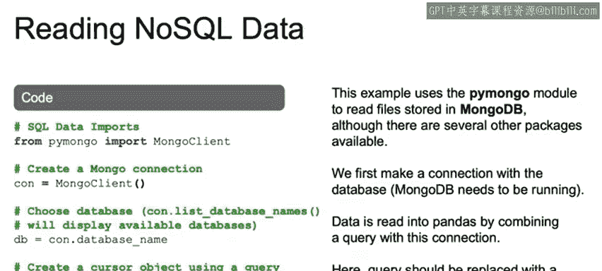

我们需要做的就是定义URL。我们设置`data_url`等于一个字符串（就像点击下载CSV链接一样），然后使用pandas的`read_csv`函数，传入这个`data_url`。
```python
data_url = “https://archive.ics.uci.edu/ml/machine-learning-databases/iris/iris.data“
df = pd.read_csv(data_url)
```
这将把`df`设置为一个你现在可以访问的pandas DataFrame。

---

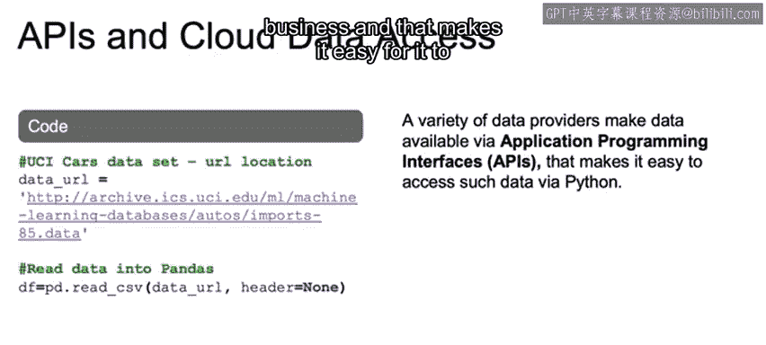

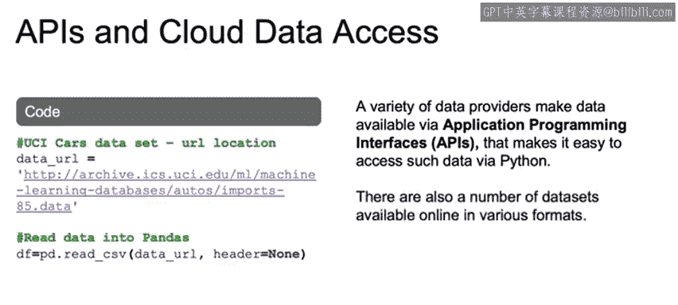

## 总结

本节课中我们一起学习了如何从多种来源检索数据。

我们首先介绍了如何使用SQL数据库从具有结构的关系型数据库中提取数据，这将在实验环节中实践。

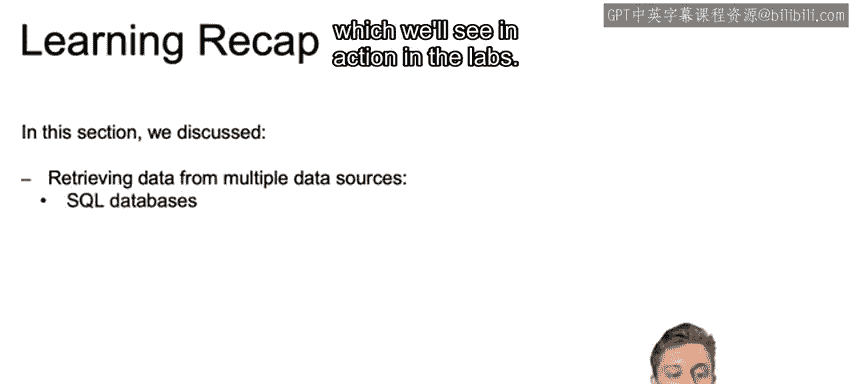

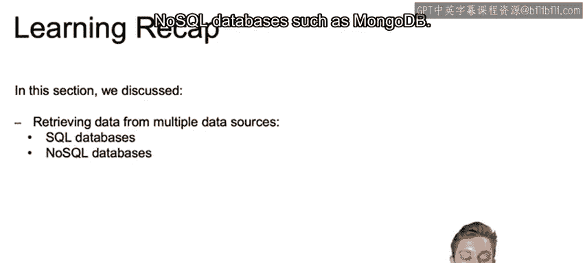

我们也看到了如何从NoSQL数据库（如MongoDB）中获取非结构化数据。

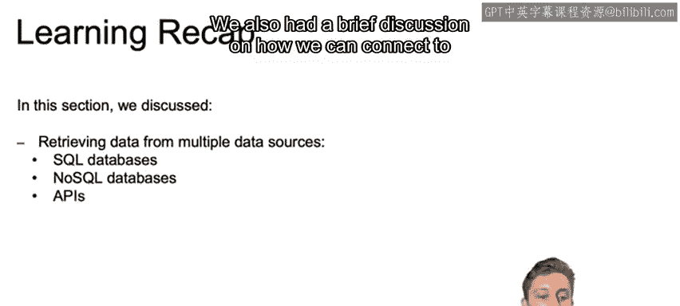

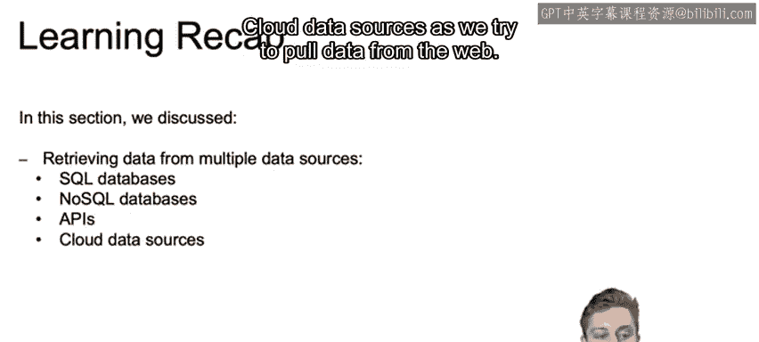

我们还简要讨论了如何连接到不同的API或云端数据源，以便从网络获取数据。

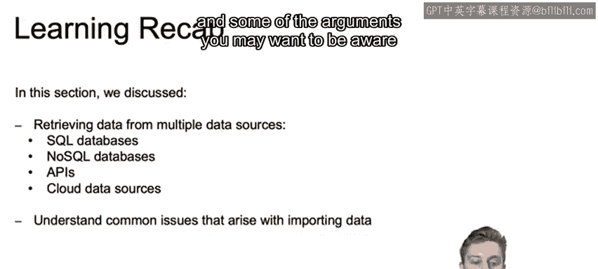

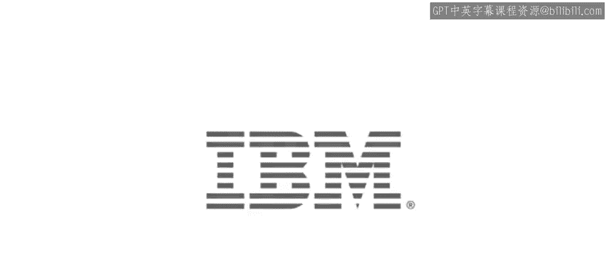

最后，我们简要讨论了一些在尝试以正确格式导入数据时可能出现的常见问题，以及你在后续使用函数时可能需要了解或传入的一些参数。