# 019：使用可视化进行探索性数据分析 📊


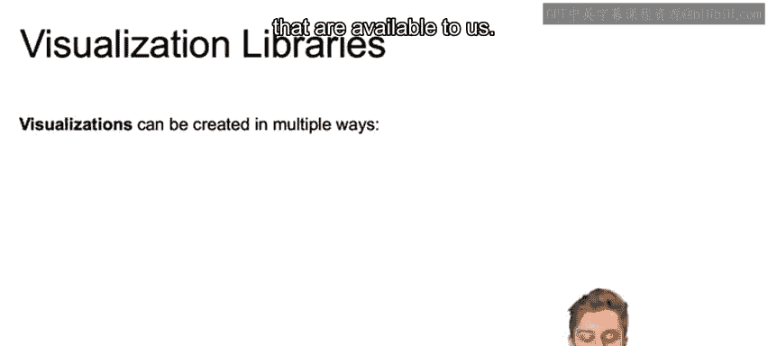

在本节课中，我们将学习如何使用Python中的可视化库进行探索性数据分析。我们将介绍Matplotlib、Pandas和Seaborn这三个核心库，并通过实例演示如何创建散点图、直方图和条形图等基本图表。


## 可视化库简介 📚

上一节我们介绍了数据探索的重要性，本节中我们来看看Python中常用的数据可视化工具。


以下是三个主要的Python可视化库：


*   **Matplotlib**：这是Python中创建图表和图形的主要库。它非常灵活，功能丰富，是进行Python可视化的基础。
*   **Pandas**：我们之前接触过的Pandas库，实际上为Matplotlib提供了一个便捷的包装函数。与使用原生Matplotlib相比，它可以更轻松地快速创建图表。虽然它不如原生Matplotlib灵活和强大，但通常已经足够使用。
*   **Seaborn**：这是一个构建在Matplotlib之上的库。它能创建非常美观的图表，并提供了创建具有统计意义的图表的简写方法，例如线性模型图、成对相关性图等。如果仅使用Matplotlib，创建这些图表将花费很长时间。

另外，一旦导入Seaborn，它的样式偏好就会被Matplotlib采用。这意味着如果你导入了Seaborn，然后回头使用Matplotlib，你的图表看起来仍然会保持Seaborn提供的漂亮可视化格式。


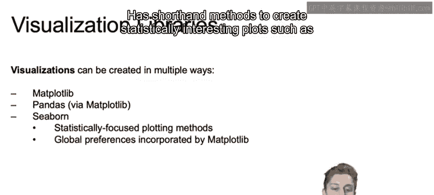


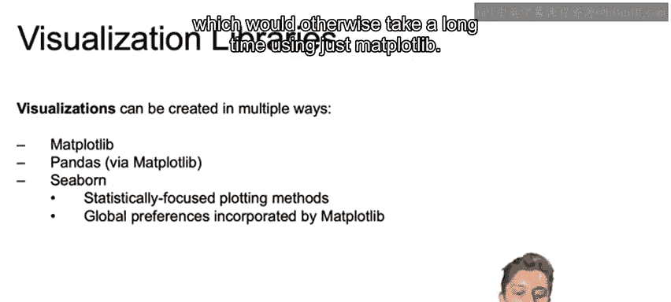

## 使用Matplotlib创建基础图表 📈

现在让我们深入实际创建一些图表。我们将从使用Matplotlib创建一个基础的散点图开始。

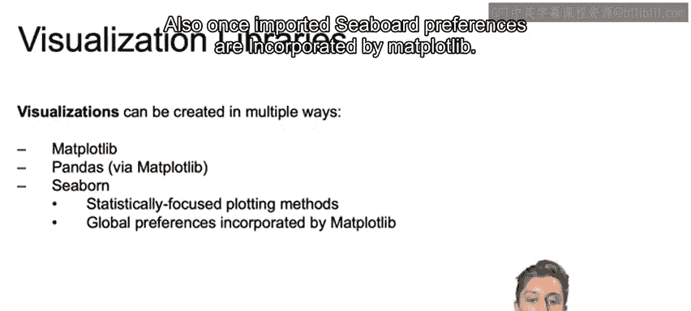

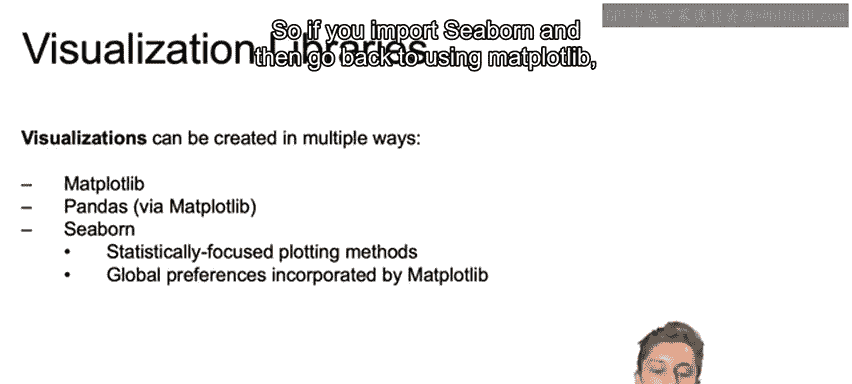

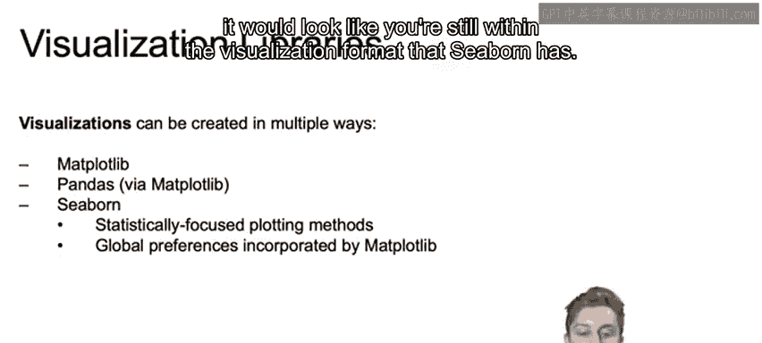

当我们使用Matplotlib时，通常会导入`matplotlib.pyplot`子模块，并通常将其简写为`plt`。

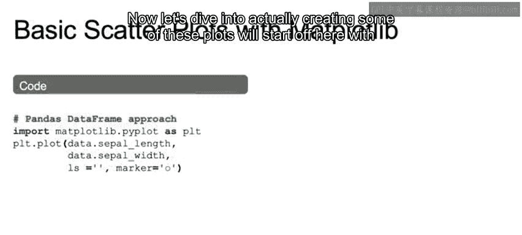

```python
import matplotlib.pyplot as plt
```

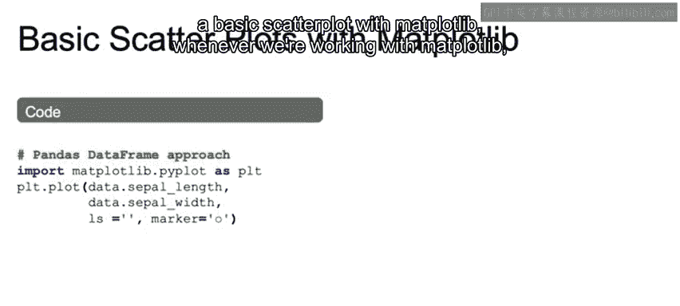


在Jupyter Notebook中使用Matplotlib时需要注意一点：在开始绘图之前，为了让图表能显示在笔记本中，需要运行一行特殊的命令。

```python
%matplotlib inline
```


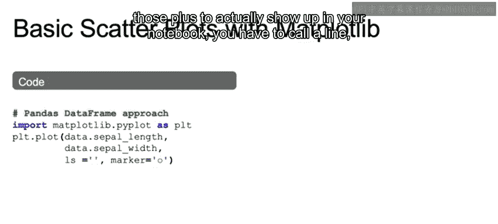

这行命令允许图表直接显示在Notebook中。

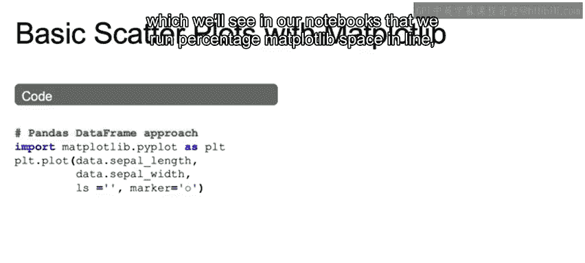

### 创建散点图

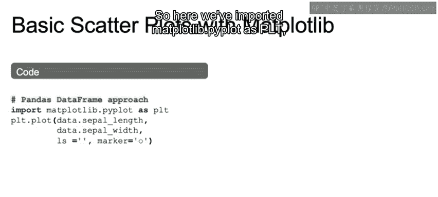

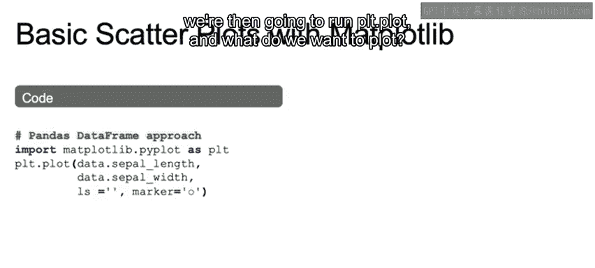


以下代码演示了如何创建一个基础的散点图。

```python
plt.plot(df['sepal_length'], df['sepal_width'], ls='', marker='o')
```


*   `df['sepal_length']` 和 `df['sepal_width']` 分别作为X轴和Y轴的数据。
*   `ls=''` 代表线型为空，因为我们绘制的是散点图，不需要连线。
*   `marker='o'` 设置标记点为圆形。还有其他选项，例如 `'^'` 代表三角形，`'x'` 代表叉号等。


执行上述代码后，我们将得到萼片长度与萼片宽度关系的散点图。

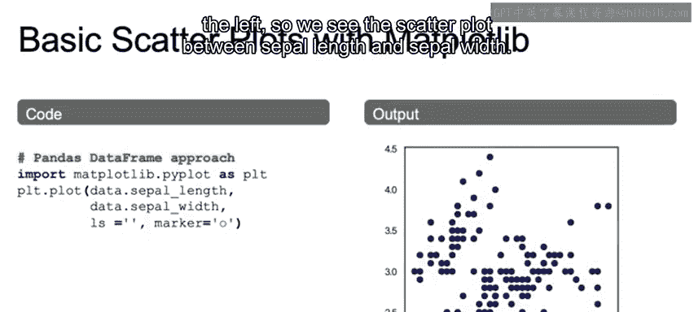

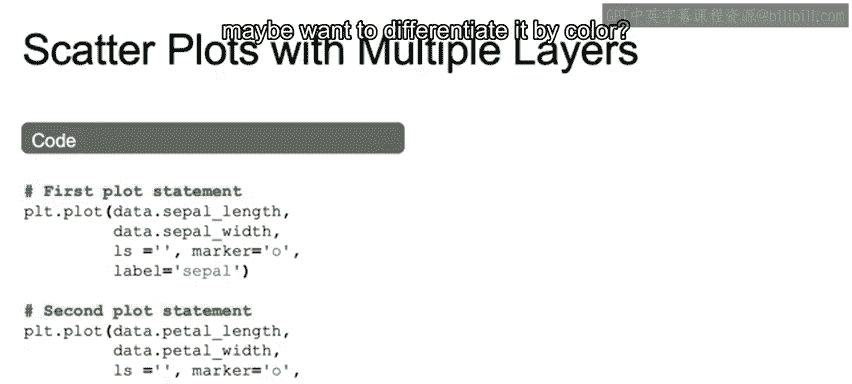

### 创建多层散点图


如果我们想创建多层散点图，例如用不同颜色区分不同数据集，只要不重新初始化绘图，我们可以连续调用`plt.plot`。

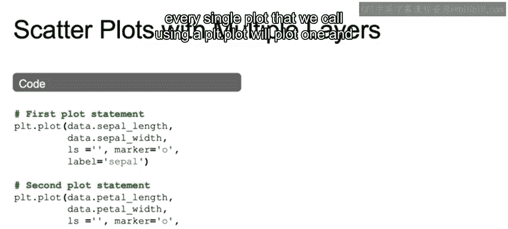

```python
plt.plot(df['sepal_length'], df['sepal_width'], ls='', marker='o', label='sepal')
plt.plot(df['petal_length'], df['petal_width'], ls='', marker='o', label='petal')
plt.legend()
```

*   第一个`plot`绘制萼片数据，并设置标签为`'sepal'`。
*   第二个`plot`绘制花瓣数据，并设置标签为`'petal'`。
*   Matplotlib会自动为不同数据集分配不同颜色。
*   调用`plt.legend()`会显示图例。

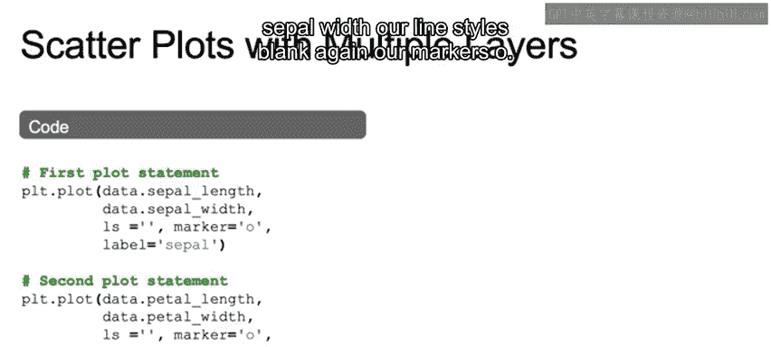


最终，我们将得到一个包含两种颜色散点图的图表，绿色代表花瓣长度和宽度，蓝色代表萼片长度和宽度。


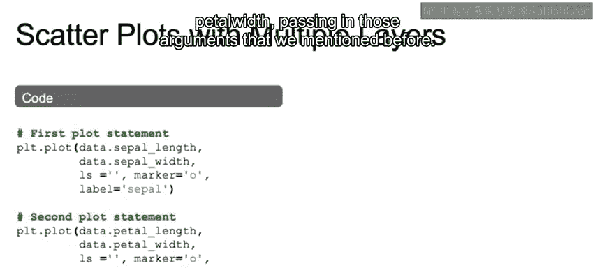

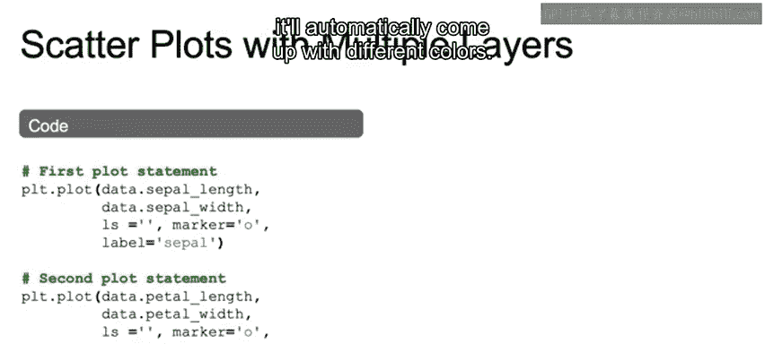

### 创建直方图

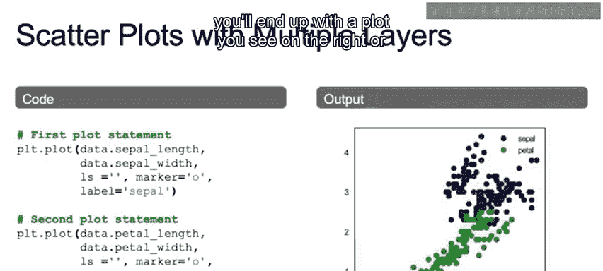

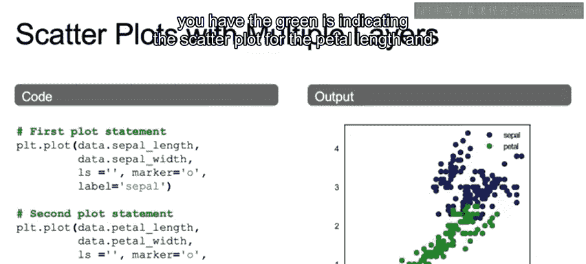

我们也可以绘制直方图来查看单个变量的分布。直方图只需要传入一列数据。

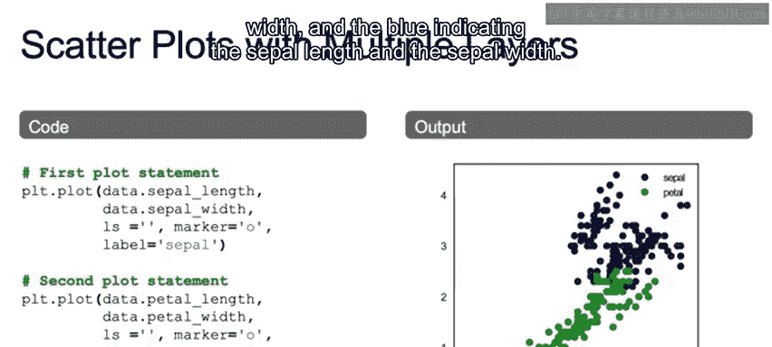

```python
plt.hist(df['sepal_length'], bins=20)
```


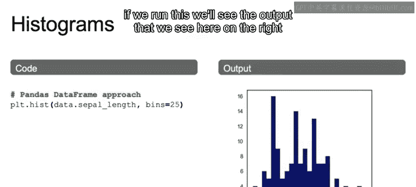

*   这里我们传入`sepal_length`列。
*   `bins=20`参数指定了直方图的柱子数量。

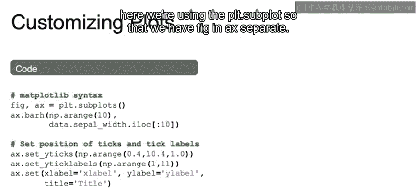


运行代码后，我们将看到该列数据的分布情况。

## 自定义图表样式 🎨

我们可以通过多种方式自定义图表。这里我们使用`plt.subplots()`方法，这是一种更面向对象的绘图方式。

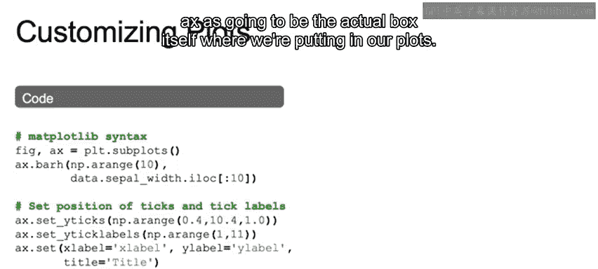

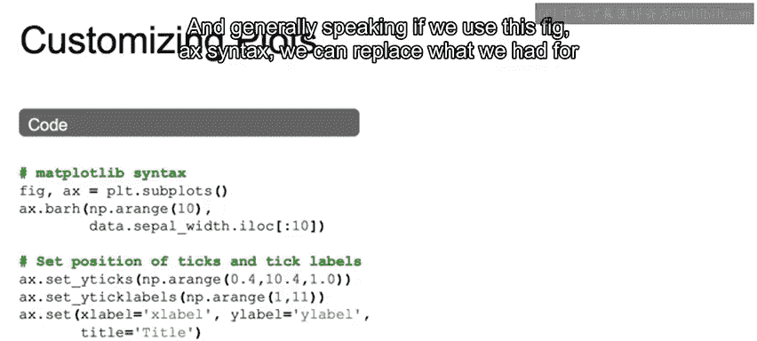

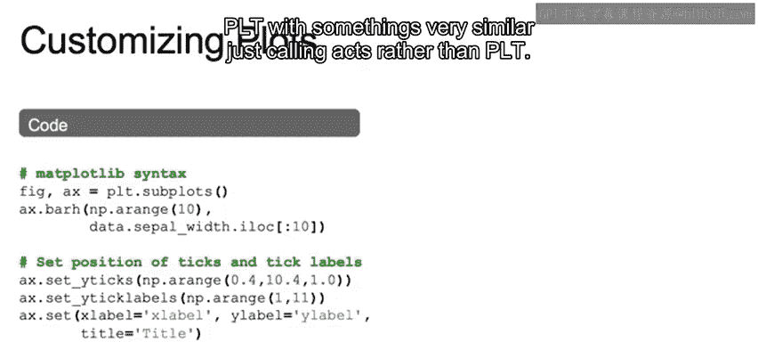

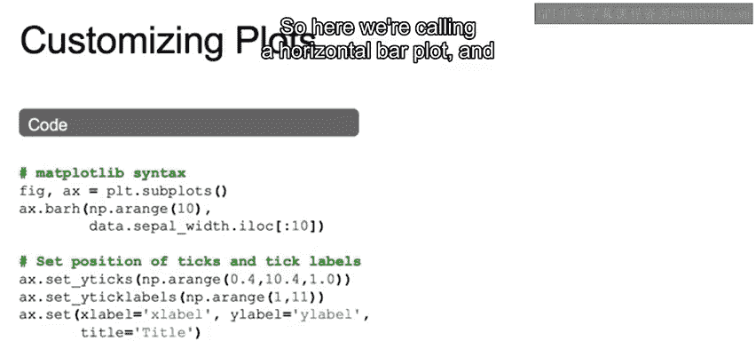

```python
fig, ax = plt.subplots()
ax.barh(np.arange(10), df['sepal_width'].iloc[:10])
```

*   `fig`代表整个图形窗口。
*   `ax`代表图形中的坐标轴，是我们放置图表的地方。
*   使用`ax.barh`创建水平条形图，其参数与`plt.barh`类似。
*   `np.arange(10)`生成0到9的序列作为Y轴位置。
*   `df['sepal_width'].iloc[:10]`取萼片宽度的前10个值作为条形长度。

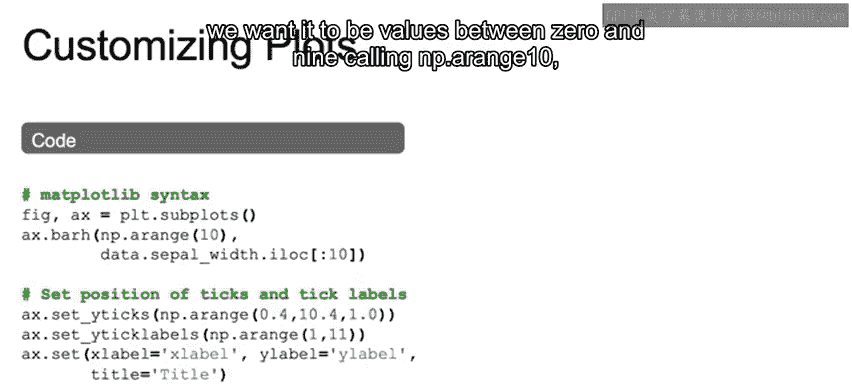


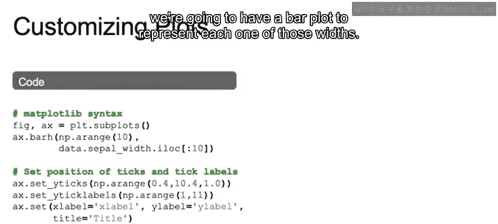

接下来，我们可以设置具体的刻度标签。

```python
ax.set_yticks(np.arange(0.4, 10.4, 1))
ax.set_yticklabels(np.arange(1, 11))
ax.set_xlabel('X Label')
ax.set_ylabel('Y Label')
ax.set_title('Title')
```

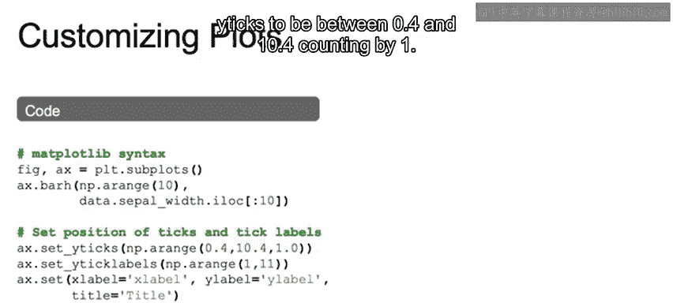


*   `ax.set_yticks`设置Y轴刻度位置为0.4到10.4，步长为1。这样刻度会位于每个条形的中间，而不是默认的0到10。
*   `ax.set_yticklabels`设置Y轴刻度标签为1到10（注意Python范围不包含最后一个值）。
*   `ax.set_xlabel`、`ax.set_ylabel`和`ax.set_title`分别设置X轴标签、Y轴标签和图表标题。

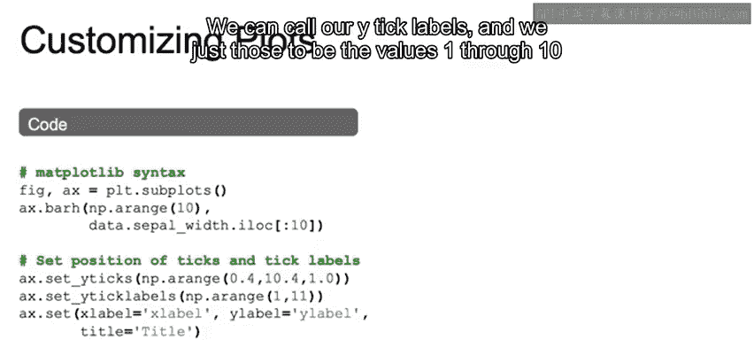


最终，我们得到一个带有自定义标题、轴标签和刻度的水平条形图，其中每个条形代表前10个萼片宽度值。

## 总结 📝

本节课中我们一起学习了如何使用Python进行数据可视化探索。


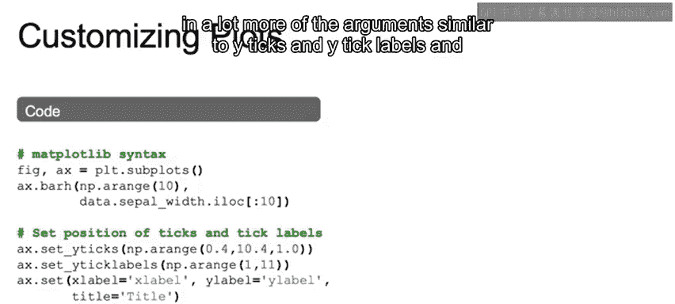

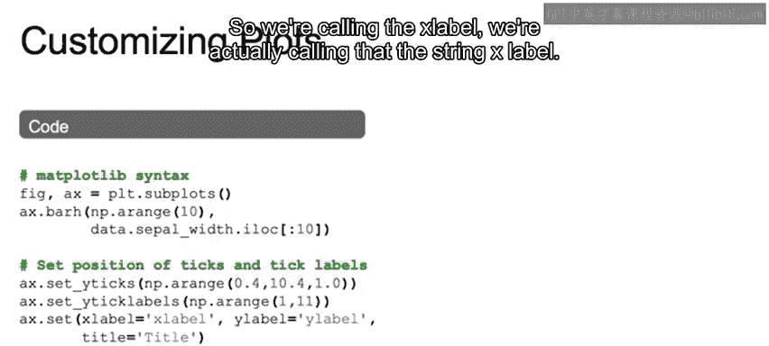

我们首先介绍了Matplotlib、Pandas和Seaborn这三个核心可视化库的特点和适用场景。然后，我们重点使用Matplotlib，逐步演示了如何创建基础的散点图、包含多个数据系列的多层散点图以及查看数据分布的直方图。最后，我们学习了如何使用`plt.subplots()`进行更面向对象的图表绘制，并自定义了图表的刻度、标签和标题，使图表更具可读性和专业性。


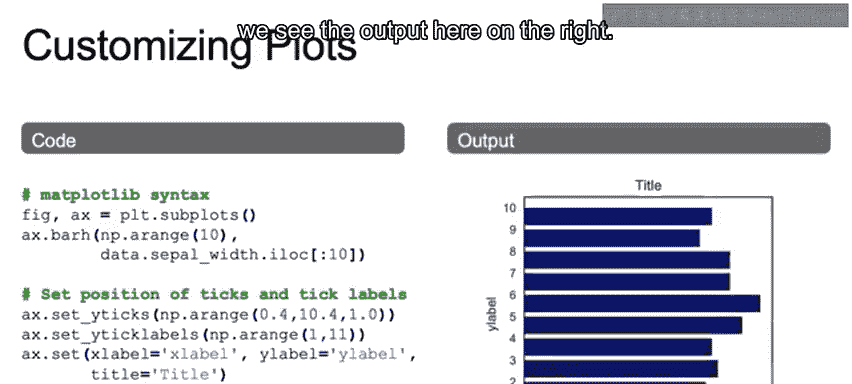

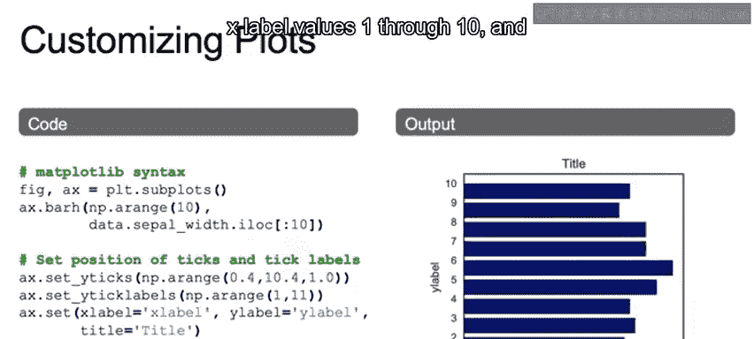

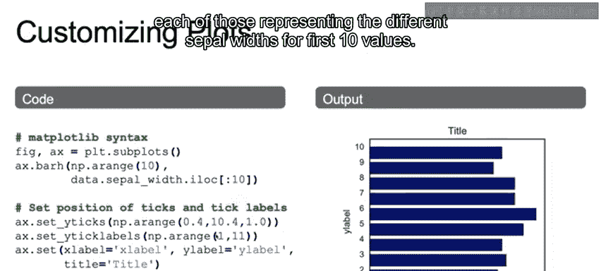

掌握这些基础的可视化技能，是进行有效探索性数据分析的关键第一步。