# 021：探索性数据分析（EDA）笔记本解决方案（第一部分）🔍

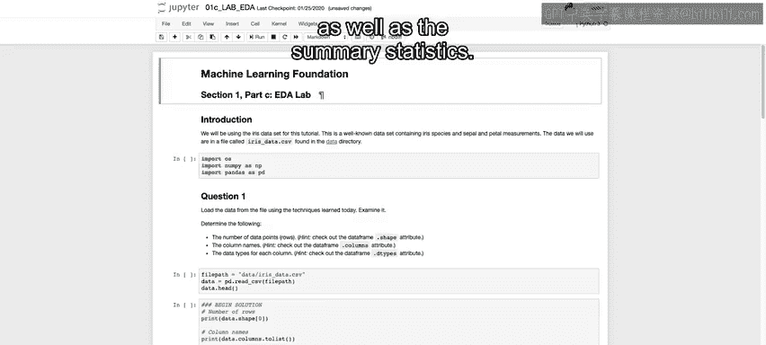

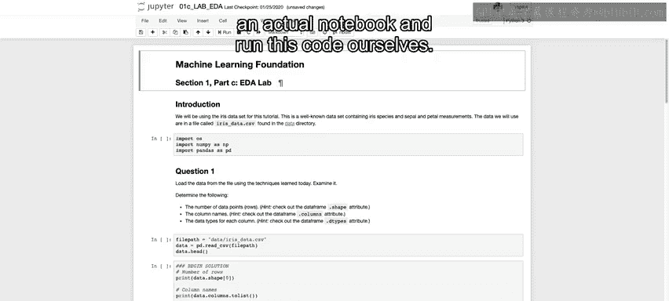

在本节课中，我们将学习如何在实际的Jupyter笔记本中运行Python代码，以进行数据探索。我们将使用Iris数据集，并完成数据加载、基本信息查看以及数据清洗等初步步骤。

---

在上一节课程中，我们简要了解了如何使用Python代码生成各种可视化图表和汇总统计信息。本节中，我们将深入到一个实际的笔记本中，亲自运行这些代码。

我们将使用之前讨论过的Iris数据集。第一步是导入必要的库。

以下是需要导入的核心库及其作用：
*   **`os`**：允许我们访问操作系统。
*   **`numpy`**：我们将频繁使用的数值计算库。
*   **`pandas`**：在进入可视化之前，我们将使用这个库进行大部分的数据操作。

导入这些库的代码如下：
```python
import os
import numpy as np
import pandas as pd
```

---

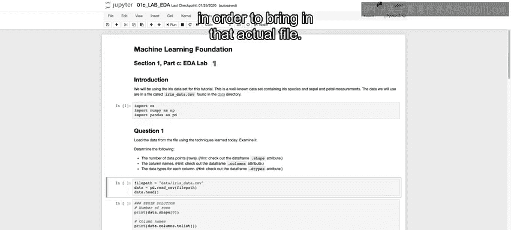

## 问题一：加载数据并查看基本信息

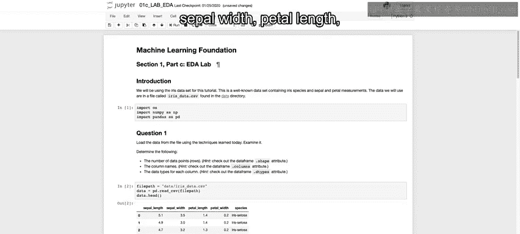

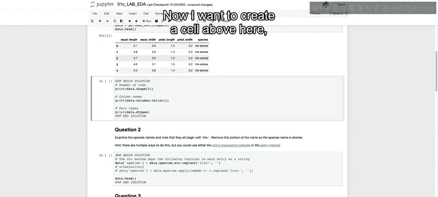

我们的第一个任务是使用已学技术从文件加载数据，并确定以下信息：
1.  数据点的数量（行数）。
2.  列名。
3.  各列的数据类型。

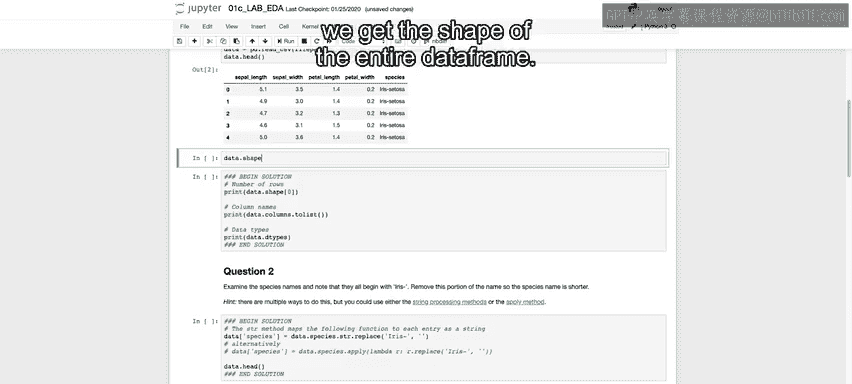

我们有一个提示：使用Pandas DataFrame的`.shape`、`.columns`和`.dtypes`属性。

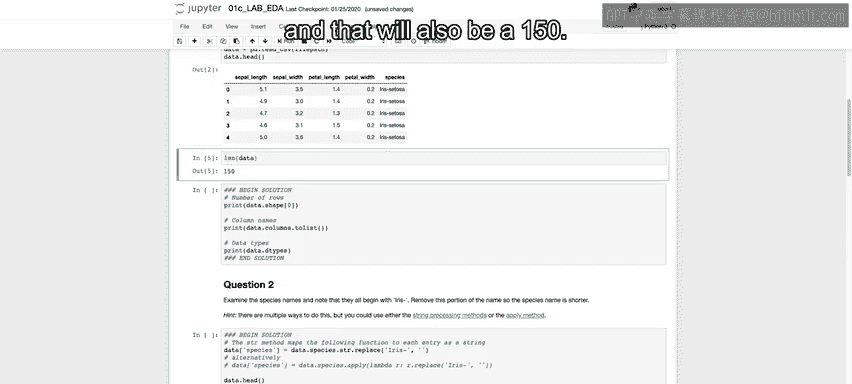

首先，我们引入文件。设置文件路径变量，然后使用`pandas.read_csv`读取文件。接着，使用`data.head()`查看前五行数据。

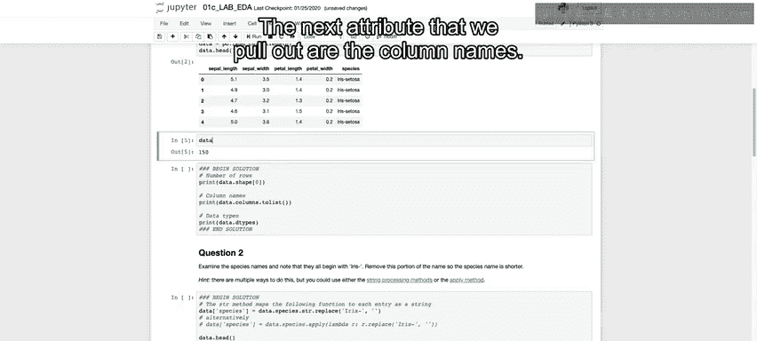

```python
file_path = ‘./data/iris_data.csv’
data = pd.read_csv(file_path)
data.head()
```

运行上述代码后，我们可以看到包含不同特征（萼片长度、萼片宽度、花瓣长度、花瓣宽度）以及不同物种的前五行数据。

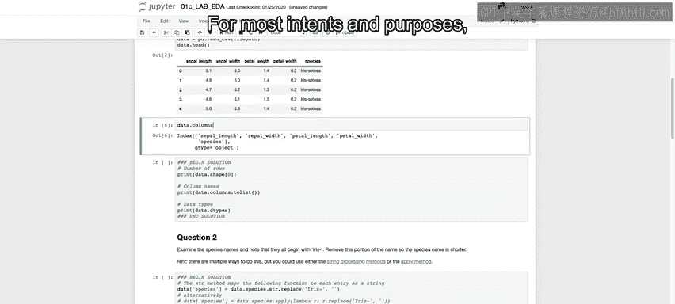

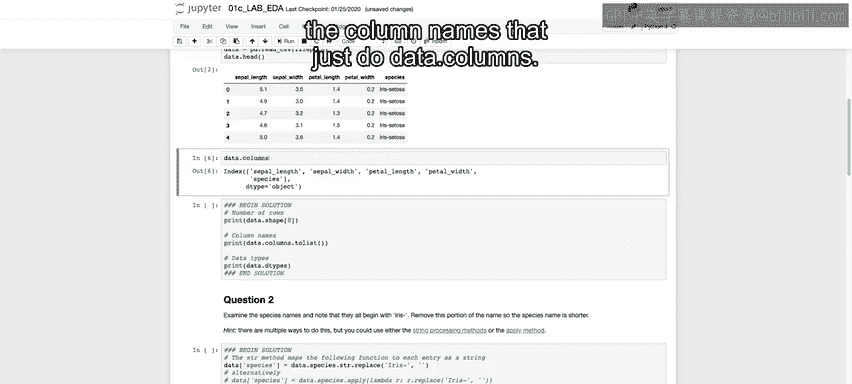

现在，我们分别查看每个属性的作用。运行`data.shape`可以获得整个DataFrame的形状。我们关心行数，因此选择第一个值（在Python中是索引0的值）来获取行数。我们也可以使用`len(data)`，结果同样是150。

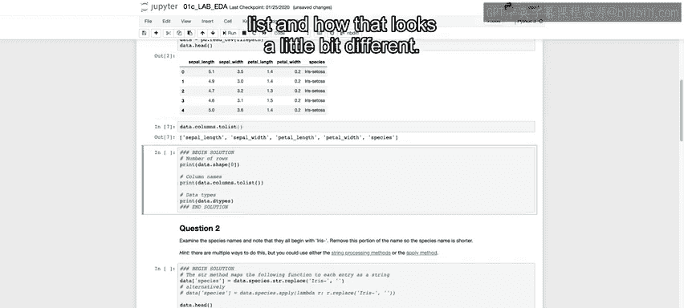

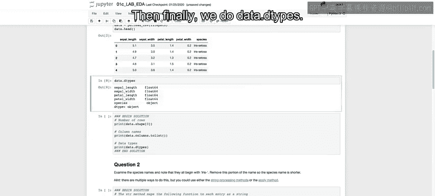

接下来，我们提取列名。可以运行`data.columns`。为了便于查看和操作，我们将其转换为列表类型。

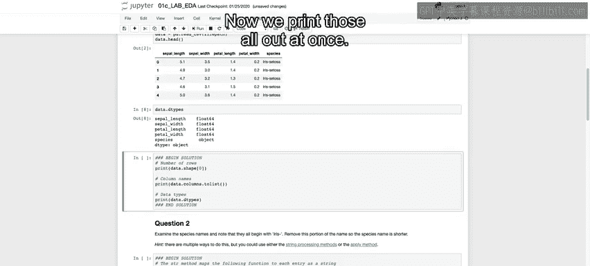

最后，我们运行`data.dtypes`来查看每一列的数据类型。我们可以看到，前四个特征列都是浮点数（float），而最后一列（目标变量）是对象（object）类型，这是合理的，因为它不是数值。

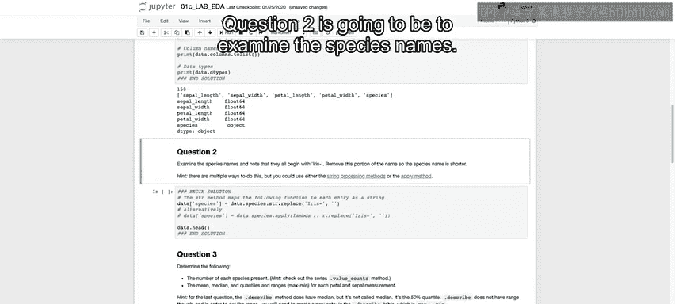

现在，我们将这些信息一次性打印出来。

```python
print(“Number of rows:”, data.shape[0])
print(“Column names:”, list(data.columns))
print(“Data types:\n”, data.dtypes)
```

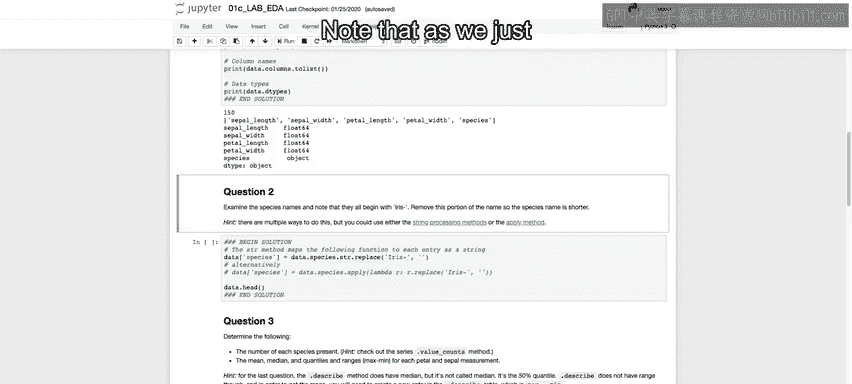

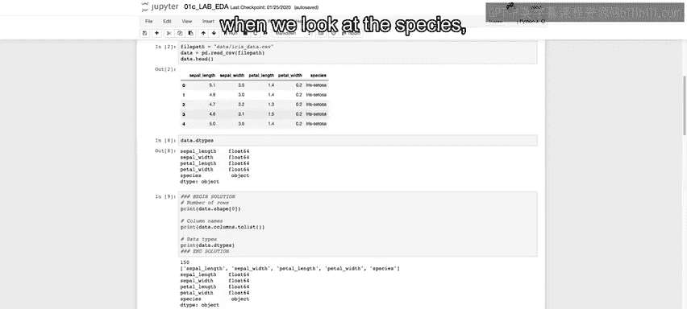

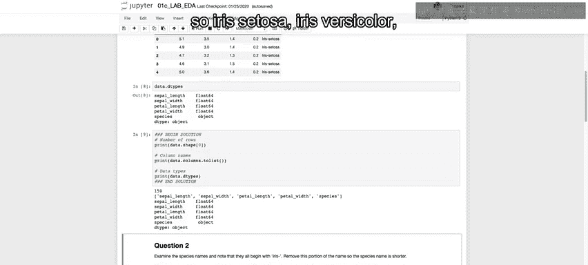

---

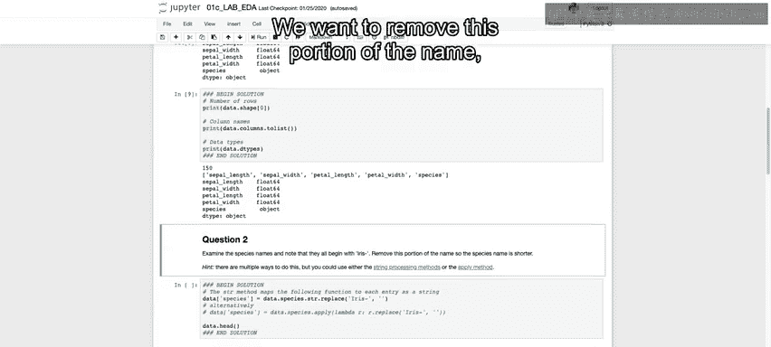

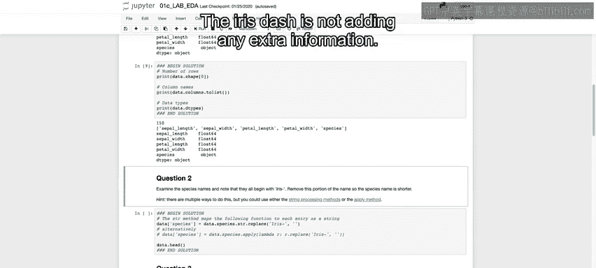

## 问题二：清洗物种名称

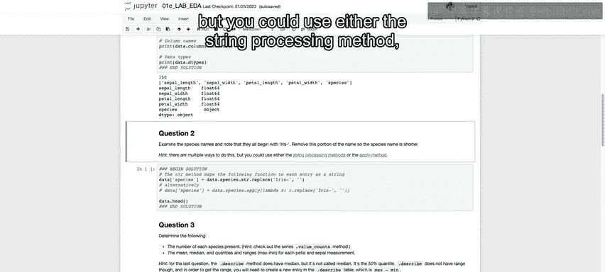

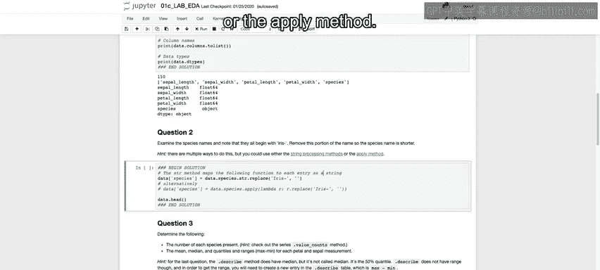

第二个问题是检查物种名称。正如我们之前在查看数据头部时所看到的，物种名称前都带有“iris-”前缀（例如iris-setosa，iris-versicolor）。我们希望移除名称的这个部分，因为“iris-”没有提供额外信息。

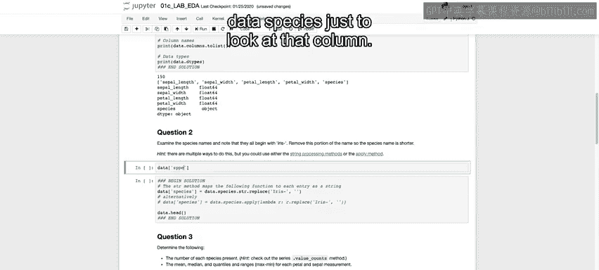

提示有多种方法可以做到这一点，可以使用字符串处理方法，也可以使用`apply`方法。现在，我将向你展示这两种方法。

首先，我们查看`data[‘species’]`这一列，确认其内容。

我们将首先使用`apply`方法（解决方案中未使用此方法）。我们使用`lambda`函数，对于每个输入`x`，输出从第5个字符开始往后的部分（索引从0开始）。运行后，我们可以看到每个单词开头的“iris”已被移除。

```python
# 方法一：使用 apply 和 lambda 函数
data[‘species’] = data[‘species’].apply(lambda x: x[5:])
```

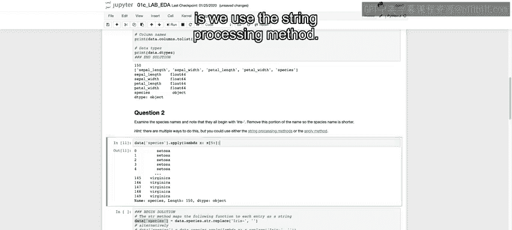

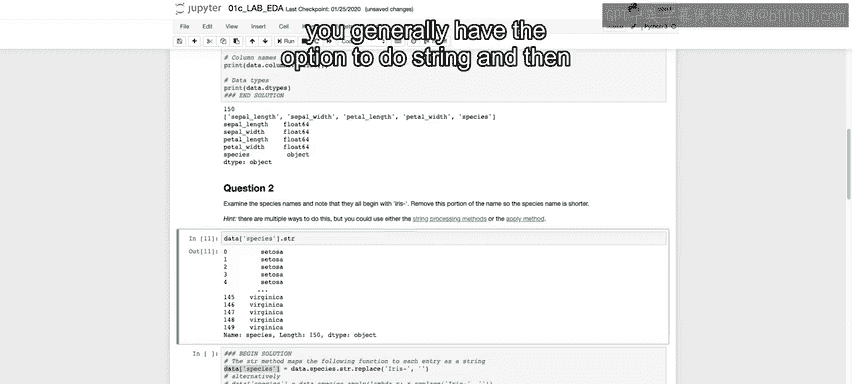

然而，在提供的解决方案中，使用的是字符串处理方法。当处理的列是字符串类型时，通常可以使用`.str`访问器，其后有多种可用方法。这里我们将使用`.replace`方法。

我们使用`.str.replace(‘Iris-‘, ”)`将“Iris-”替换为空字符串。运行后，我们再次查看数据头部，会发现前五行中的物种名称不再带有“iris-”前缀。

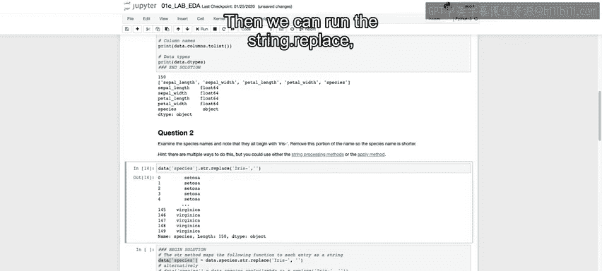

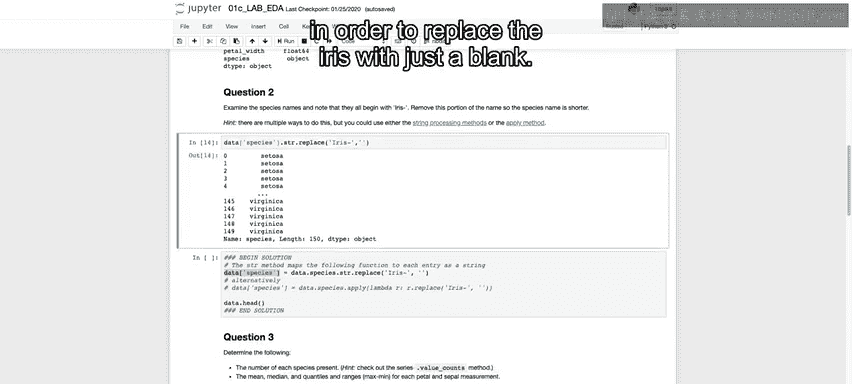

```python
# 方法二：使用字符串替换方法
data[‘species’] = data[‘species’].str.replace(‘Iris-‘, ”)
data.head()
```

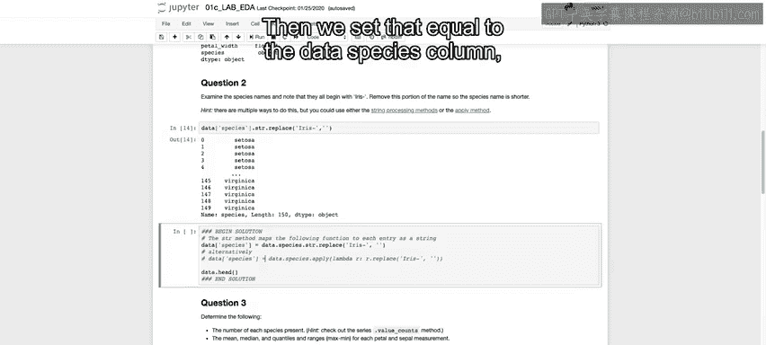

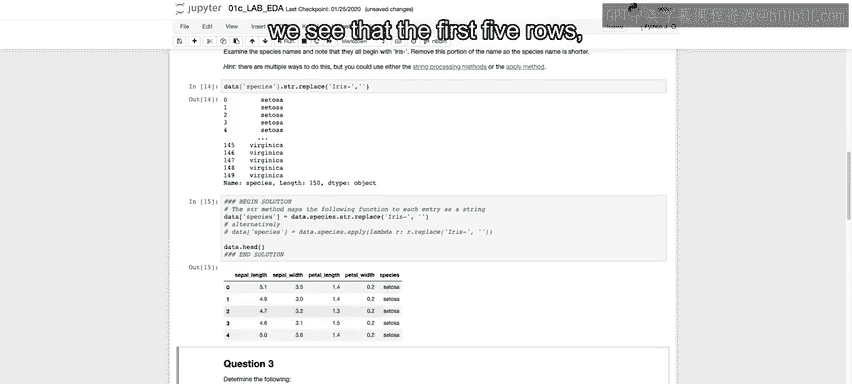

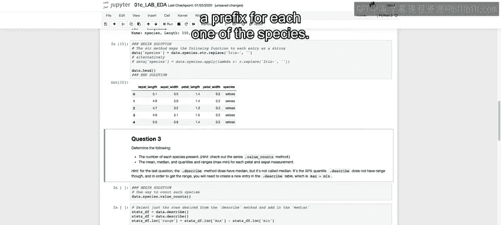

---

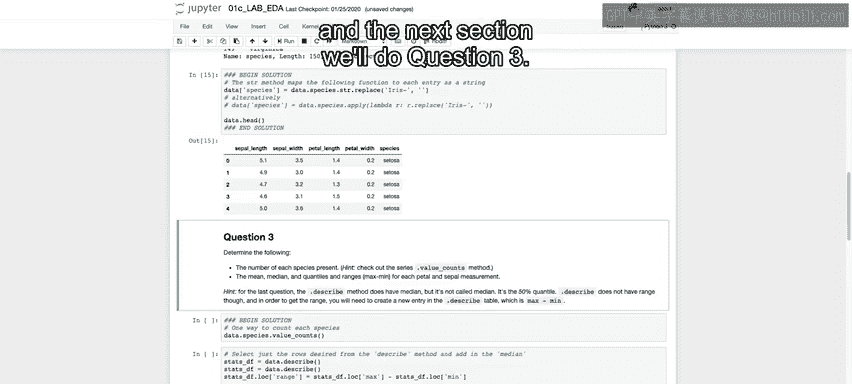


本节课中，我们一起学习了如何加载Iris数据集、查看其基本维度信息（如行数、列名和数据类型），并掌握了两种清洗数据中冗余字符串的方法（使用`apply`函数和字符串的`replace`方法）。在下一节中，我们将继续第三个问题的探索。