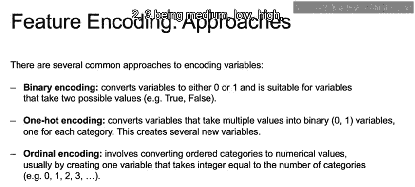

# 027：特征编码 🧩

在本节课中，我们将学习特征编码。特征编码是数据预处理的关键步骤，它涉及将非数值型特征（如分类或有序特征）转换为数值型特征，以便机器学习模型能够处理。

上一节我们介绍了变量选择和特征变换的必要性。本节中，我们来看看如何对不同类型的特征进行编码。

## 特征编码概述

变量选择涉及选择要包含在模型中的特征集。然而，变量通常需要经过变换才能被纳入模型。除了对数变换和多项式变换，这还包括**编码**和**缩放**。

*   **编码**：将非数值特征（如分类或有序特征）转换为数值特征。
*   **缩放**：转换数值数据的尺度，使它们具有可比性。

合适的缩放或编码方法取决于特征的类型。

## 编码的应用场景

编码通常应用于分类特征。它将非数值型取值转换为数值型取值。主要有两种处理方式：

*   **名义数据**：分类变量的取值没有内在顺序，例如颜色（红、蓝、绿）或婚姻状况（已婚/未婚）。
*   **有序数据**：分类数据具有某种内在顺序，例如温度（冷、温、热）或等级（高、中、低）。

## 常见的编码方法

以下是几种常见的特征编码方法：

### 1. 二进制编码
二进制编码将变量转换为 **0** 或 **1**。它适用于只能取两个可能值的变量，例如性别（男/女）、婚姻状况（已婚/未婚）。可以将其视为任何具有“真/假”属性的变量，例如“是否已婚”为真则编码为1，为假则编码为0。

### 2. 独热编码
独热编码是二进制编码的扩展，它将可能取多个值的变量转换为多个二进制变量列，每个类别对应一列。这会创建多个新变量。

例如，假设我们有一个“颜色”列，取值为红、蓝、绿。我们会将这一列拆分为三个新列，分别命名为“红”、“蓝”、“绿”。如果原始数据中某行的颜色是红色，则在“红”列标记为 **1**，在“蓝”和“绿”列标记为 **0**。我们将在后续的实践练习中看到具体应用。

### 3. 序数编码
序数编码涉及将有序类别转换为数值。通常，这是通过创建一个变量来实现的，该变量取等于类别数量的整数值。

例如，如果有低、中、高三个等级，可以将其转换为：低=**1**，中=**2**，高=**3**。

使用这种方法时，必须考虑类别之间的顺序或间隔是否重要，因为你为“低与中”以及“中与高”之间分配了一个固定的距离，而这个距离在现实中可能并不存在。

随着你对如何处理具有顺序的分类数据越来越熟悉，你将能够更好地决定是使用这种（1, 2, 3）的序数编码，还是坚持使用独热编码（但会丢失列中类别的顺序信息）。

---

本节课中，我们一起学习了特征编码的三种主要方法：**二进制编码**、**独热编码**和**序数编码**。理解这些方法及其适用场景，是准备数据、构建有效机器学习模型的重要基础。