# 033：估计与推断概述 📊

在本节课中，我们将学习一些基础的统计学概念，这些概念对于机器学习之旅以及数据驱动的决策制定至关重要。

## 概述

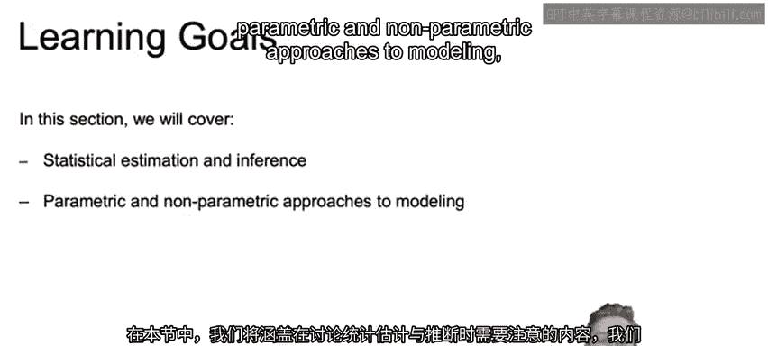

本节我们将探讨在讨论统计学中的估计与推断时需要注意的事项，区分参数化与非参数化建模方法，介绍现实世界中常见的统计分布，并简要对比频率学派与贝叶斯统计学。

---

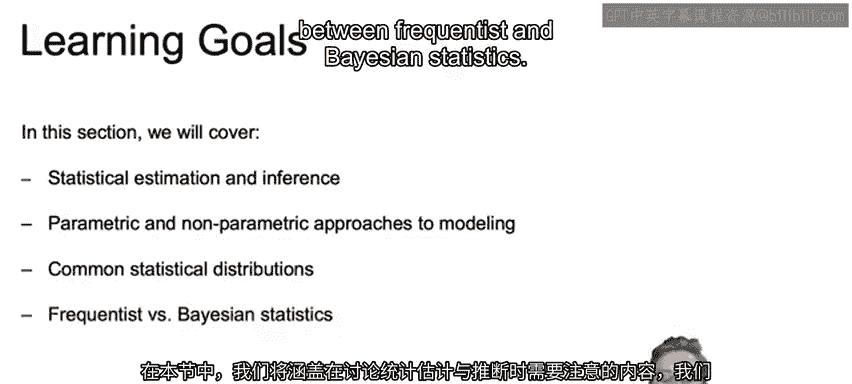

## 估计与推断的区别

上一节我们介绍了机器学习的基础，本节中我们来看看统计学中的两个核心概念：估计与推断。

**估计** 是指从样本数据中计算某个参数的近似值，例如均值。计算均值的公式为：

\[
\bar{x} = \frac{\sum_{i=1}^{n} x_i}{n}
\]

其中，\(\bar{x}\) 是样本均值，\(x_i\) 是每个样本值，\(n\) 是样本数量。

**统计推断** 则更进一步，它试图理解总体数据的潜在分布，不仅包括均值等点估计，还包括如标准误等参数。标准误的公式为：

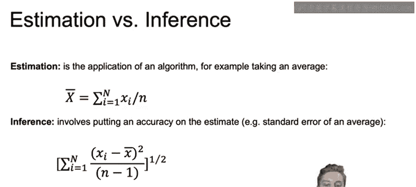

\[
SE = \sqrt{\frac{\sum_{i=1}^{n} (x_i - \bar{x})^2}{n-1}}
\]

机器学习与统计推断非常相似，两者都利用样本数据来推断真实世界总体分布的特性。

---

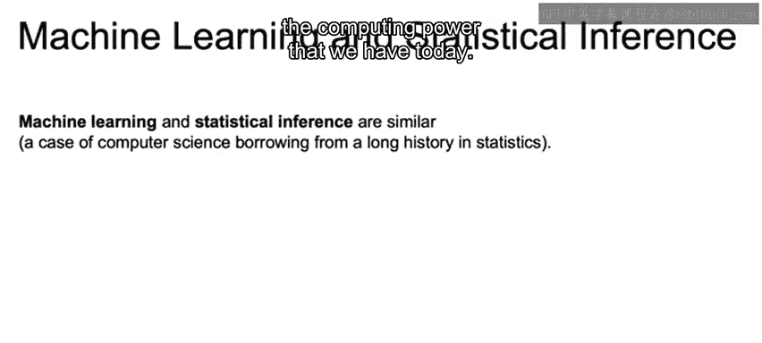

## 参数化与非参数化方法

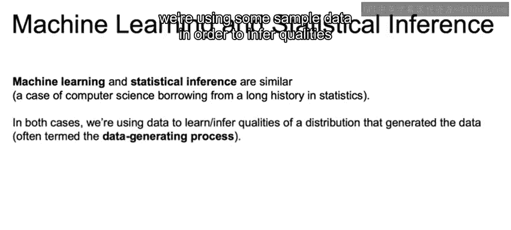

在建模时，我们可以选择不同的方法。以下是两种主要方法的区别：

*   **参数化方法**：假设数据遵循特定的分布（如正态分布），并用有限数量的参数（如均值和方差）来描述该分布。
*   **非参数化方法**：不对数据的潜在分布做强烈假设，模型结构更多地由数据本身决定，灵活性更高。

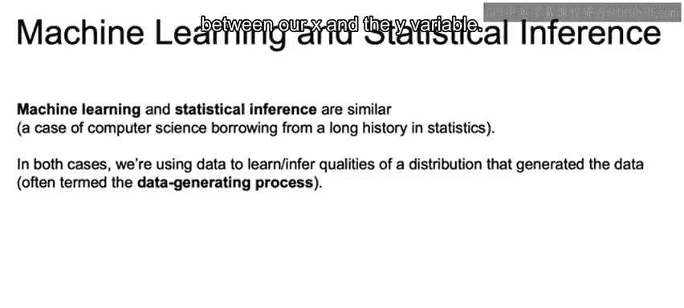

---

## 常见统计分布

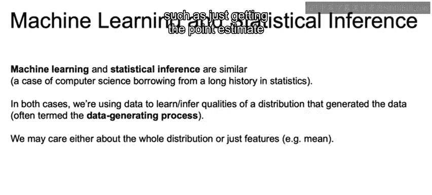

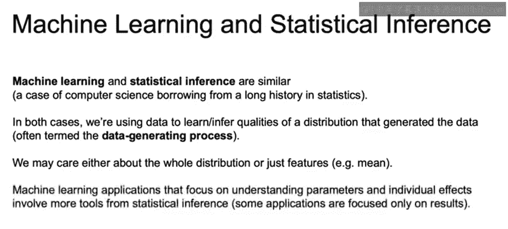

在现实世界的数据分析中，我们会遇到多种统计分布。了解它们有助于我们选择合适的模型。

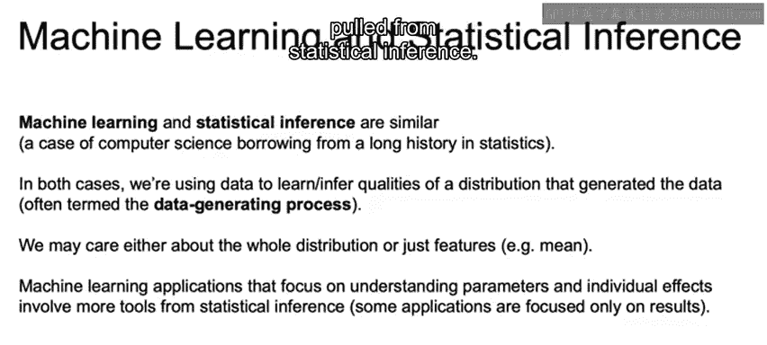

以下是几种常见的分布：

1.  **正态分布**：钟形曲线，广泛存在于自然和社会现象中。
2.  **均匀分布**：所有结果出现的可能性相同。
3.  **二项分布**：描述在固定次数的独立试验中“成功”次数的概率分布。
4.  **泊松分布**：描述在固定时间或空间内随机事件发生次数的概率分布。

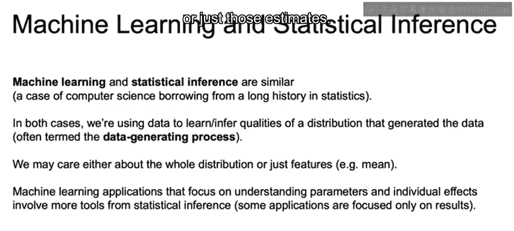

---

## 频率学派与贝叶斯统计学

统计学主要有两大思想流派：频率学派和贝叶斯学派。

**频率学派** 认为概率是长期频率的极限，参数是固定但未知的，通过数据进行估计。

**贝叶斯学派** 将概率视为对某事件发生的信念度，参数本身是随机变量，拥有概率分布（先验分布），并通过数据更新为后验分布。

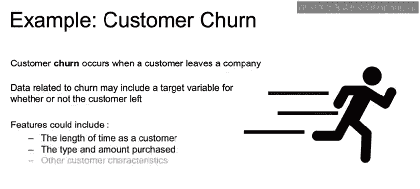

两者的核心区别在于对概率的解释以及对参数不确定性的处理方式。

---

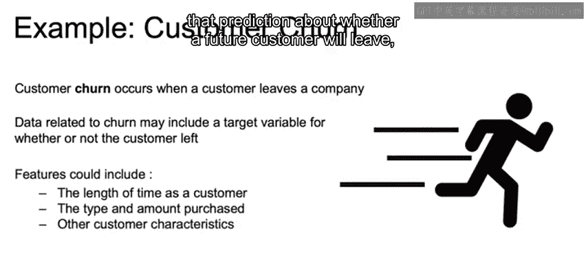

## 业务案例：客户流失分析

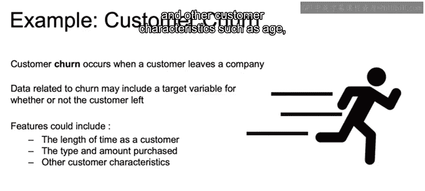

为了使概念更具体，我们引入一个贯穿课程的商业案例：客户流失预测。

客户流失数据包含一个目标变量，用于标记客户是否已经离开公司。显然，我们希望降低流失率。

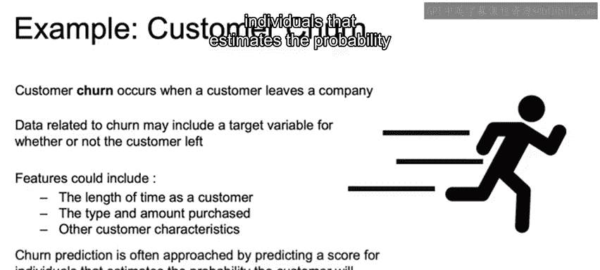

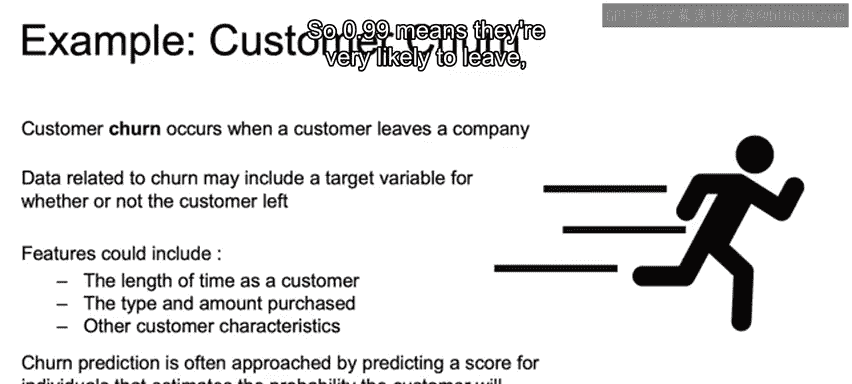

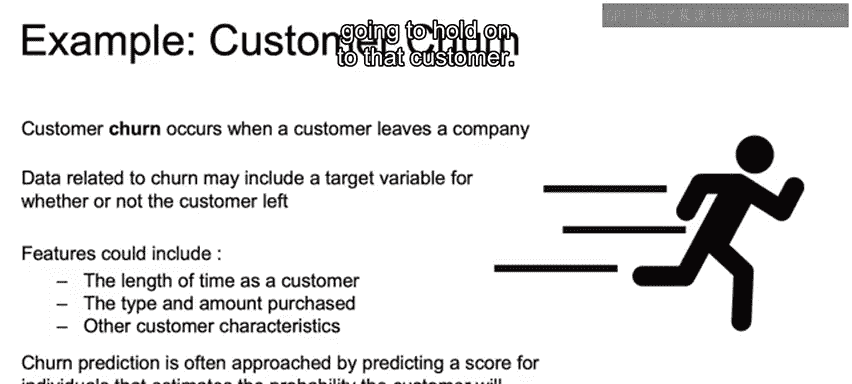

数据还包括帮助我们预测未来客户是否会流失的特征，例如：

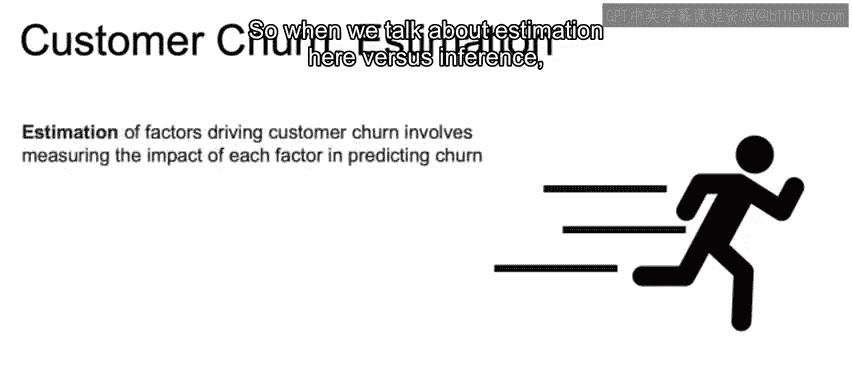

*   客户成为客户的时间长度
*   客户的购买类型和金额
*   其他客户特征，如年龄、地理位置等

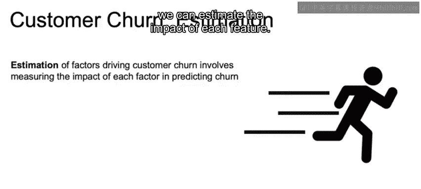

流失预测通常通过为个体预测一个分数来实现，该分数估计了客户离开的概率。例如，0.99 表示极有可能离开，0.01 表示很可能留住。

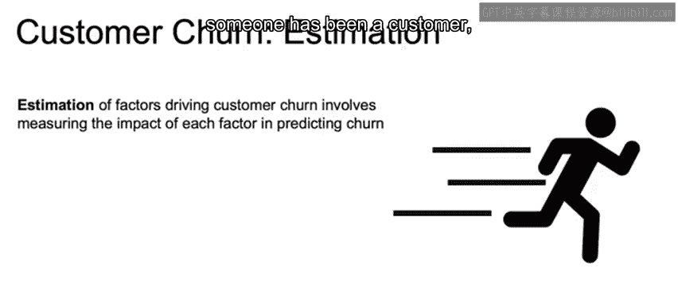

---

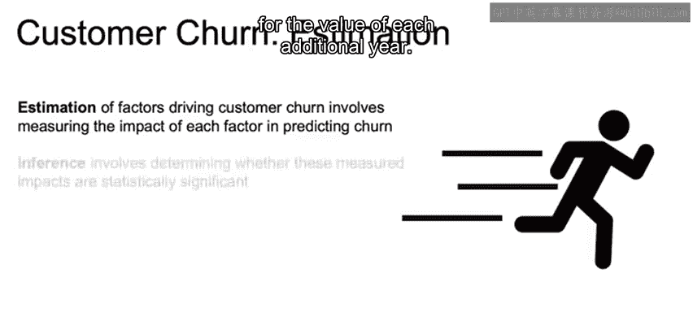

## 在案例中应用估计与推断

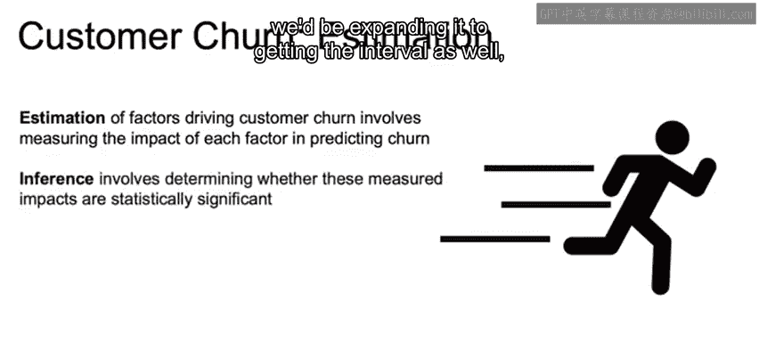

现在，我们可以在客户流失的背景下理解估计与推断。

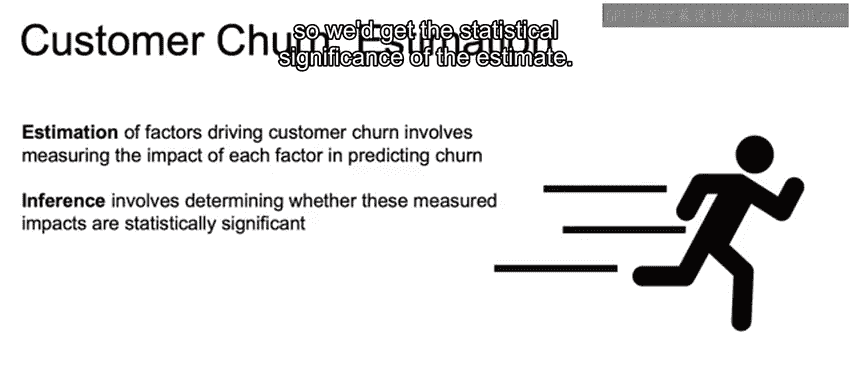

我们可以**估计**每个特征的影响。例如，可以估计：“客户成为客户的每增加一年，其流失的可能性降低20%”。这里，20% 是对“每增加一年”这个特征价值的点估计。

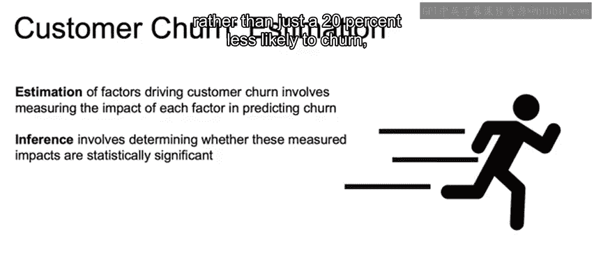

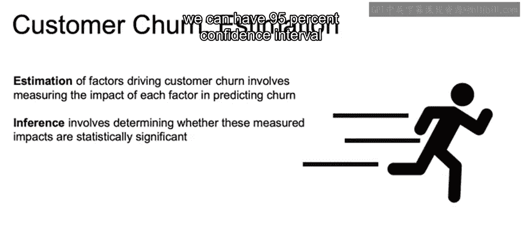

当我们进行**推断**时，我们会扩展这一点，获取估计的区间。例如，我们不仅说“降低20%”，还可以给出该估计的95%置信区间，比如效应在19%到21%之间。这样我们就相当确信，客户每多留存一年，其流失可能性降低的幅度大约在20%左右。

反之，如果95%置信区间是-10%到50%，则意味着我们非常不确定效应是否是20%。点估计是20%，但实际上它可能产生负面效应，也可能有更强的正面效应，我们缺乏足够的统计显著性来做出确定判断。

---

## 总结

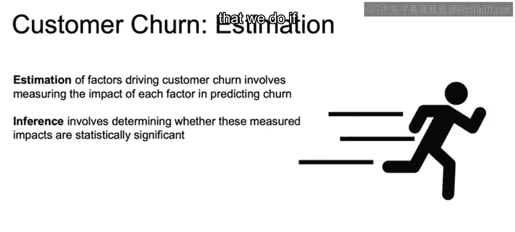

本节课我们一起学习了统计学中估计与推断的核心区别，了解了参数化与非参数化建模方法，认识了常见的统计分布，并对比了频率学派与贝叶斯统计学的基本思想。最后，通过客户流失预测的业务案例，我们看到了这些概念在实际问题中的应用。理解这些基础概念将为后续的机器学习模型学习打下坚实的基础。