# 034：客户流失数据探索分析示例 📊

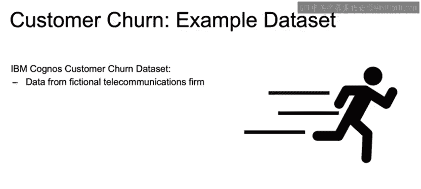

在本节课中，我们将学习如何对一个真实的客户流失数据集进行探索性数据分析。我们将使用IBM的Telco客户流失数据集，通过多种可视化方法来理解客户特征与流失行为之间的关系。

## 数据集介绍

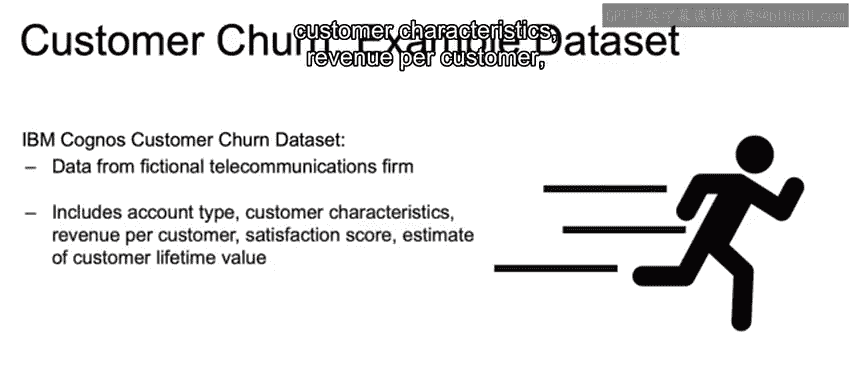

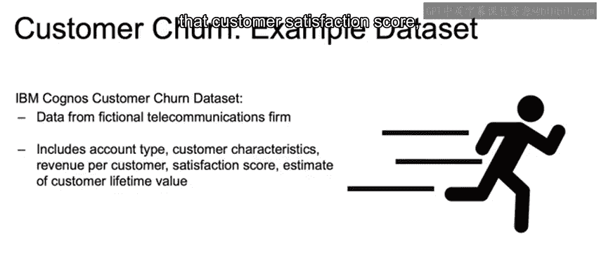

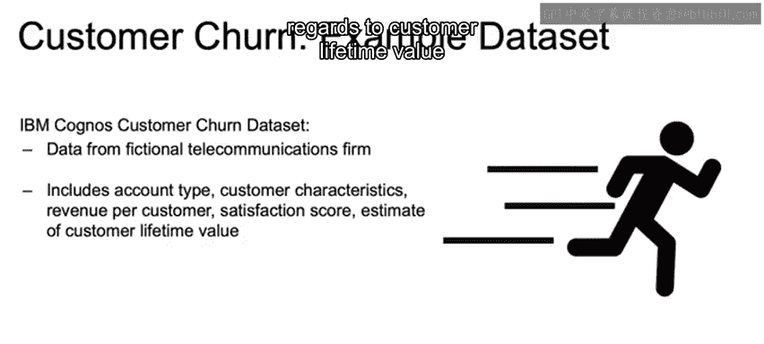

我们将使用来自IBM Cognos Analytics的Telco客户流失数据集。该数据集代表了一家虚构电信公司的客户特征与流失结果。

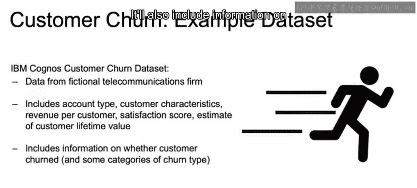

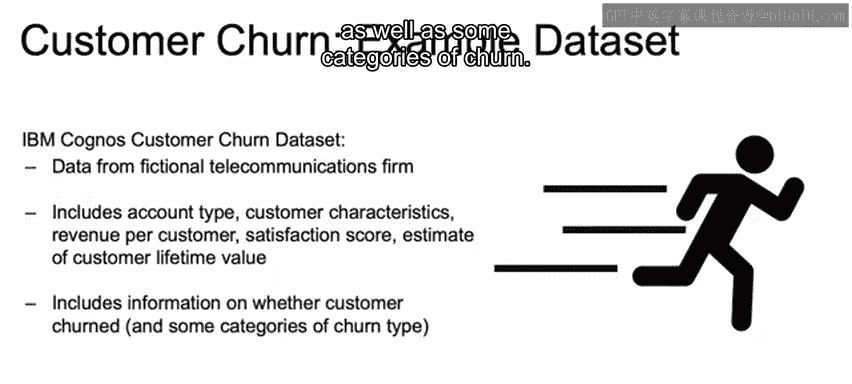

数据集包含以下信息：
*   账户类型
*   客户特征
*   每客户收入
*   客户满意度评分
*   客户生命周期价值估计。客户生命周期价值是指在我们拥有该客户的整个时间段内的购买总额。

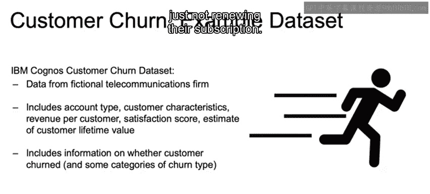

数据集还包括客户是否流失的信息，以及一些流失类别的划分，例如主动取消服务与未续订服务的区别。

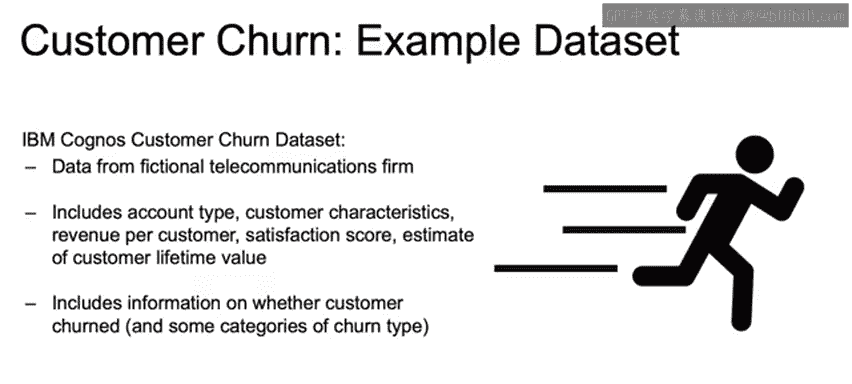

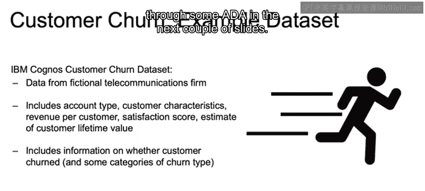

## 数据探索分析示例

我们的电话用户子样本数据存储在一个名为 `df_phone` 的pandas DataFrame变量中。在接下来的几个幻灯片中，我们将进行一些EDA分析。

### 按支付类型分析流失率

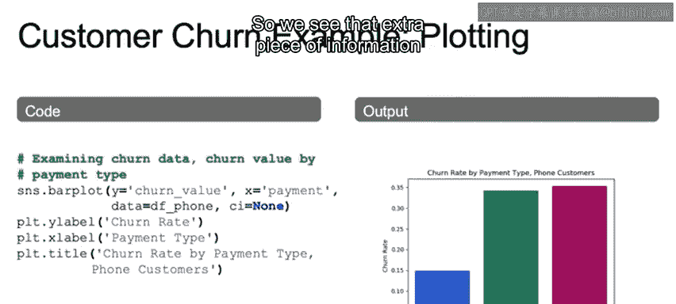

首先，我们创建一个条形图。我们将y变量设置为流失值，即客户的流失可能性，并根据他们不同的支付类型来查看这个可能性。x变量等于支付方式，数据来自pandas DataFrame `df_phone`。

我们没有在条形图中添加置信区间。从图中可以看到，使用信用卡支付的客户流失的可能性远低于使用银行转账或邮寄支票支付的客户。这个条形图为我们提供了额外的信息。

### 按在网时长分析流失率

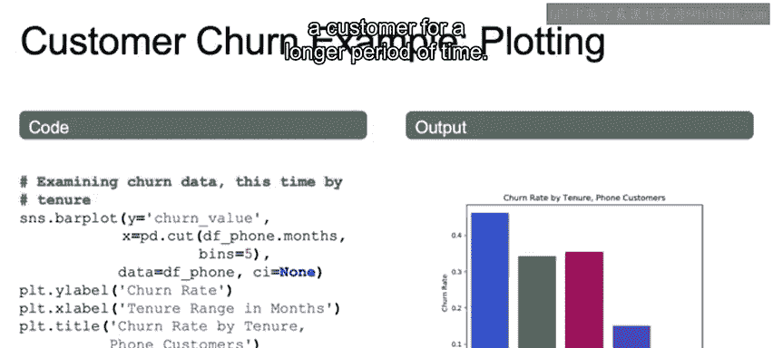

我们也可以查看流失值与在网月数的关系。这里我们使用了 `pd.cut` 方法。在创建条形图时，我们希望x轴是分类变量。因此，我们使用 `pd.cut` 创建一个分类变量，将其切割成五个等长的区间。

从右侧的图中可以看到，区间大约在0-15个月、15-30个月等。显然，在网时间较短的客户比在网时间较长的客户流失的可能性大得多。

### 变量关系配对图

我们还可以绘制之前介绍过的配对图。这里我们创建一个配对图，仅查看我们选择的几个特征，例如客户在网月数、每月千兆字节使用量、该客户带来的总收入、客户生命周期价值以及流失值。

运行配对图可以查看这些变量之间的相互关系。我们还将根据流失值进行区分，`hue=churn_value`。我们将数据按是否流失进行分割，1表示流失，0表示未流失。

我们可以看到这里不同的图表，蓝色表示未流失，绿色表示流失。我们能看到每个变量之间的关系以及每个变量的分布情况，其中许多分布情况是符合直觉的。

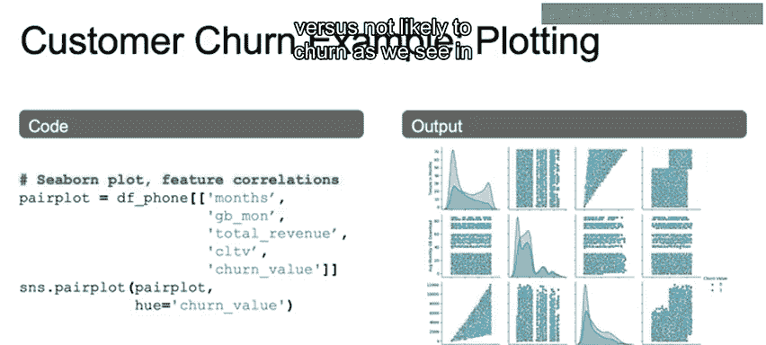

正如我们所说，当查看在网月数时，我们看到绿色值（流失客户）的在网时间更短，而蓝色值（未流失客户）的在网时间更长，如左上角图表所示。

### 六边形分箱图分析

我们还将查看之前介绍的六边形分箱图。我们使用联合分布图，希望查看的标签是“在网月数”与“月费用”。我们想看看，如果客户被收取更高的费用，他们是否更可能留下来，或者这些更昂贵的客户是更可能还是更不可能留下。

我们能够在图的上方看到在网月数的分布，在图右侧看到月费用的分布。我们的六边形分箱图将向我们展示密度。我们看到右上角密度较高，表明有更多客户具有较长的在网时间和较高的月费用。但在另一端，我们也看到在网时间较短的客户，其月费用也高于平均水平。在这两个值之间，我们看到密度要低得多。

## 课程总结

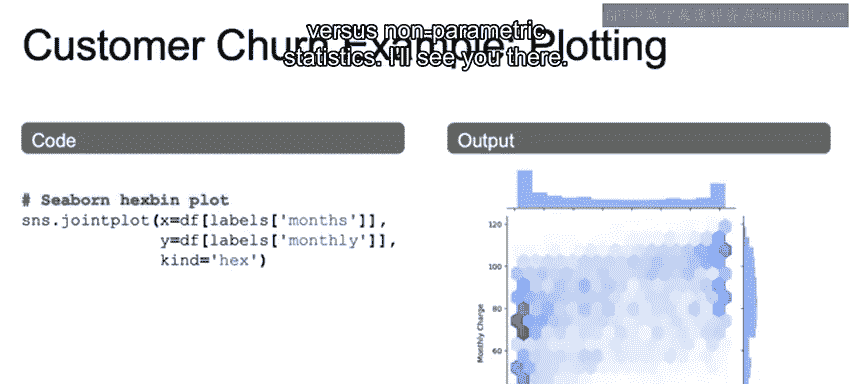

本节课我们一起完成了对客户流失示例的探索性数据分析部分。在下一讲中，我们将开始讨论参数统计与非参数统计。