# 035：参数与非参数估计与推断 📊

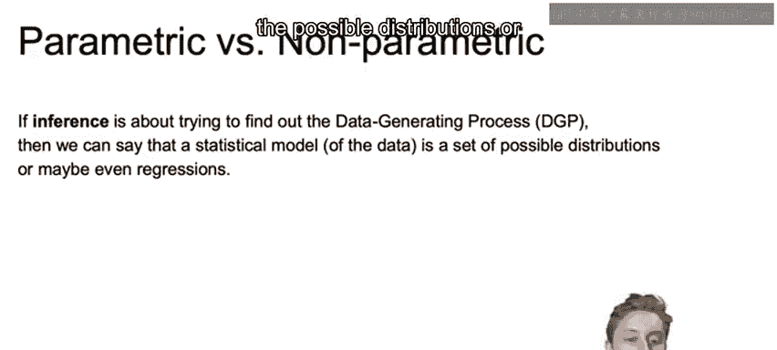

在本节课中，我们将要学习统计推断中的两种核心方法：参数模型与非参数模型。我们将探讨它们的定义、特点、区别以及在实际问题中的应用。

## 概述

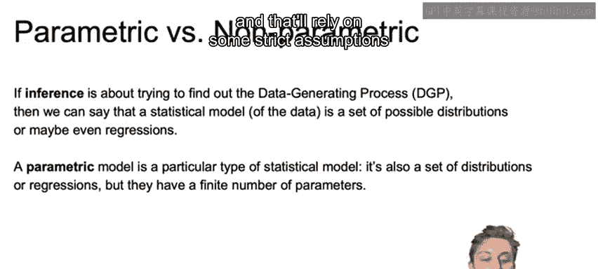

统计推断的目标是发现数据背后的数据生成过程。统计模型则是一组可能的数据分布或回归关系的集合。根据对数据分布假设的严格程度，模型主要分为参数模型和非参数模型两大类。

## 参数模型 🧮

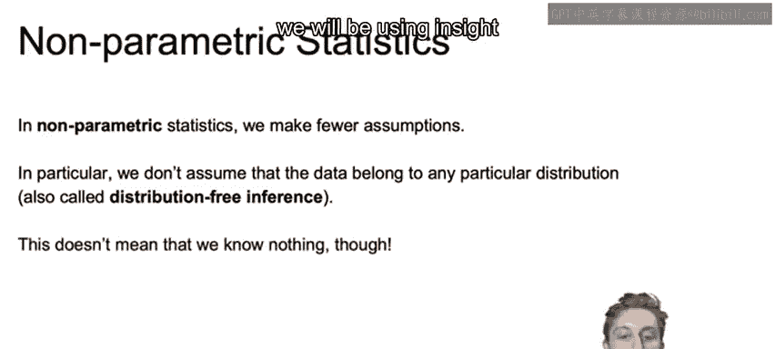

上一节我们介绍了统计模型的概念，本节中我们来看看参数模型的具体特点。

参数模型是一种特定类型的统计模型。它的主要特征在于，模型被约束在有限数量的参数上，并且严重依赖于对数据来源分布所做的严格假设。

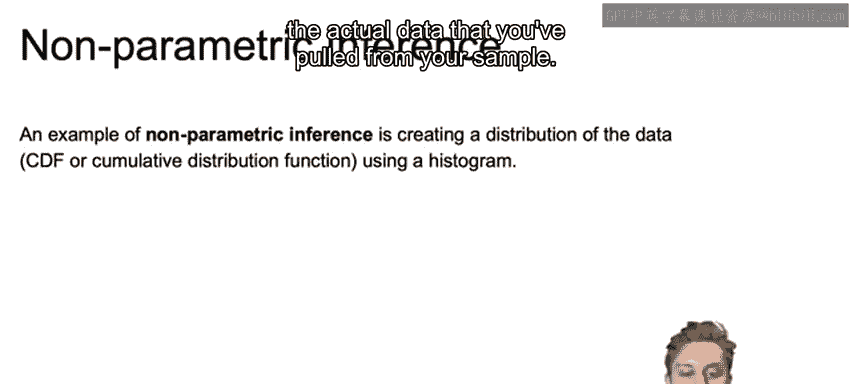

以下是参数模型的关键特点：
*   模型形式由有限个参数决定。
*   需要对数据的基础分布做出明确假设（例如，假设数据服从正态分布）。
*   通常更容易、更快速地求解。

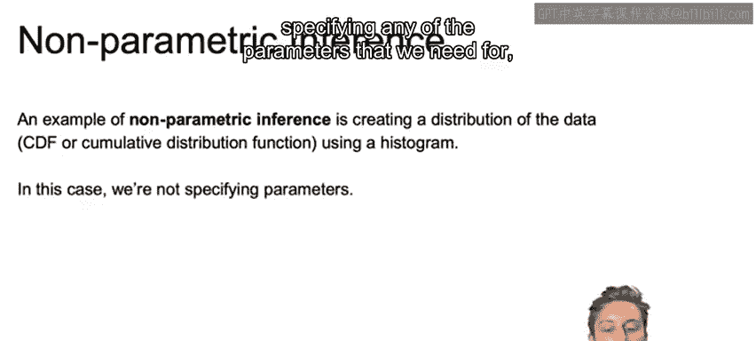

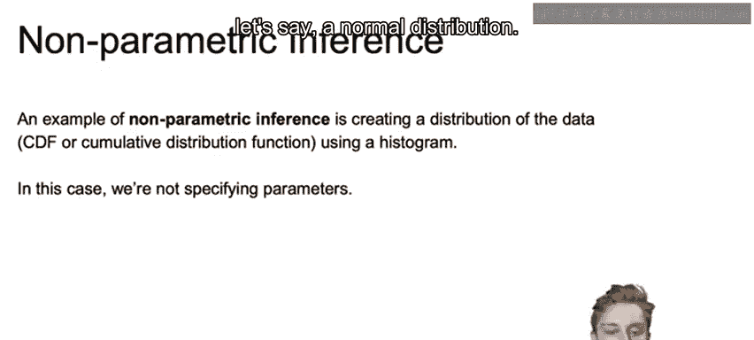

一个经典的参数模型例子是正态分布。其概率密度函数由均值（μ）和标准差（σ）这两个参数完全定义：
`f(x) = (1 / (σ * sqrt(2π))) * exp(-(x-μ)² / (2σ²))`

## 非参数模型 📈

与参数模型相对，非参数模型意味着我们的推断不会依赖于那么多严格的假设。

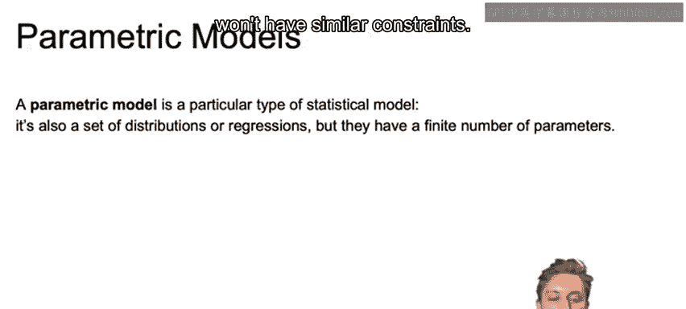

非参数模型不要求数据必须来自某个特定的分布，它是一种“无分布”的推断方法。但这并不意味着我们一无所知，我们仍然会利用手头数据本身的洞察来进行分析。

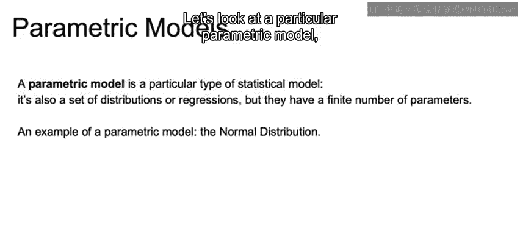

以下是关于非参数模型的说明：
*   推断不依赖于特定的总体分布假设。
*   更多地让数据本身来定义模型结构。
*   通常需要更多的数据才能得出可靠的结论。

一个非参数推断的例子是使用直方图来创建数据的经验分布。你可以根据实际样本数据，确定累积分布函数，从而判断某个值出现的概率。你并没有假设一个正态分布或指数分布，而是由你从样本中获取的实际数据来定义分布。

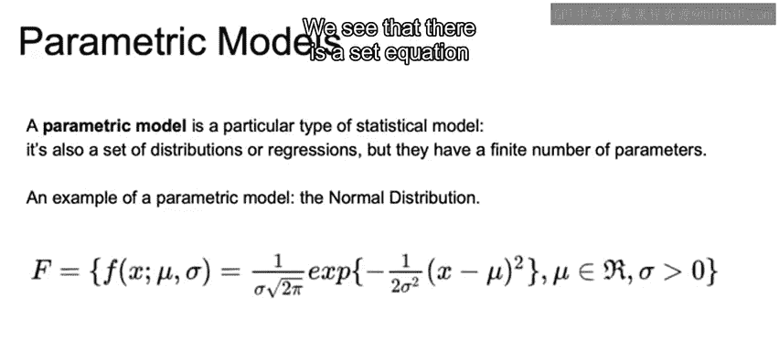

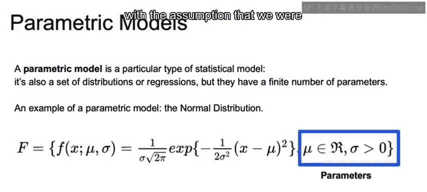

## 商业案例：客户终身价值 💰

现在，让我们联系一个商业案例来加深理解。客户终身价值是对客户在一段时间内对公司价值的估计。

与客户终身价值相关的数据可能包括客户预期的留存时间，以及在该时间段内的预期消费金额。

为了估计终身价值，我们需要对数据做出假设，即我们认为一个客户会留存多久，以及我们认为他们随着时间的推移会花费多少。

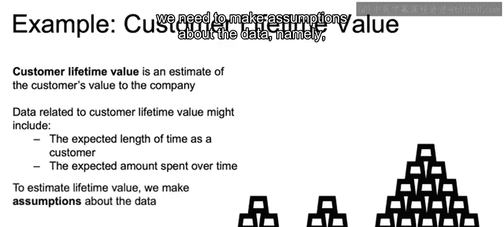

这些假设可以是参数化的（例如，假设消费随时间呈线性或某种递减趋势），也可以是非参数化的。如果我们进行非参数统计，我们将更依赖数据本身，并且需要更多的数据才能得出结论。

## 参数估计：最大似然估计法 🔍

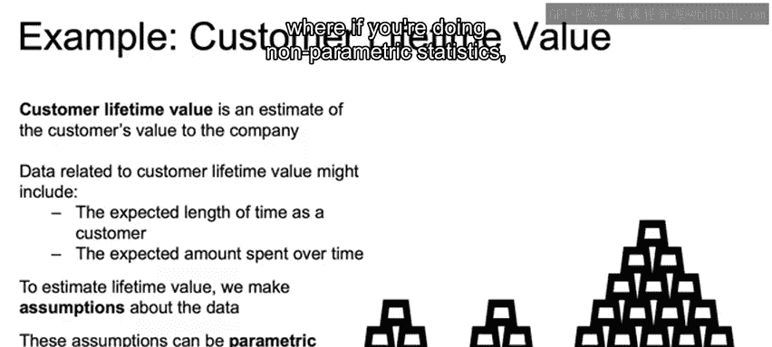

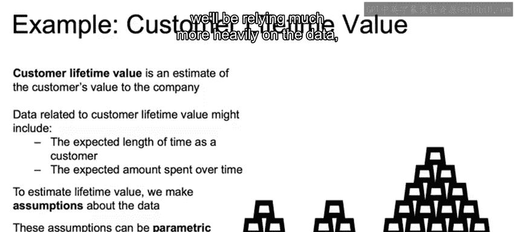

当我们进行参数建模时，估计参数最常用的方法是通过最大似然估计。

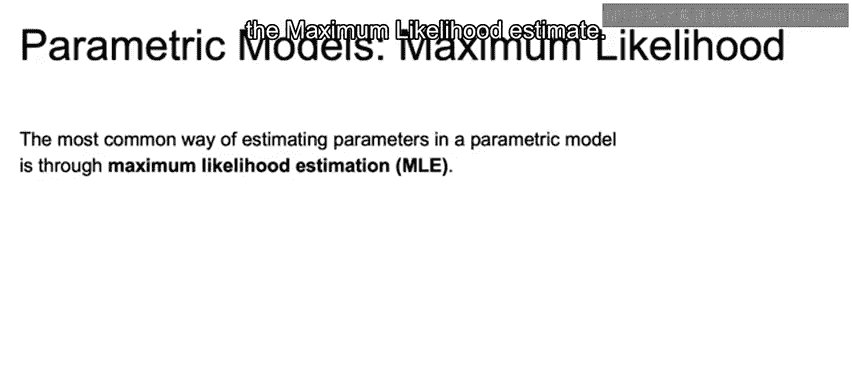

似然函数与概率相关，是模型参数的函数。对于正态分布，这些参数就是均值（μ）和标准差（σ）。其核心思想是，我们的似然函数是参数的函数。

更具体地说，可以这样理解似然函数：它接收你的所有数据，然后问“在给定我们看到的样本数据下，总体均值最可能的值是多少？总体标准差最可能的值是多少？”这就是你的最大似然估计。

然后，我们选择能够最大化该似然函数的各个参数值。这也就是最大化在我们已有数据条件下最可能发生的情况。

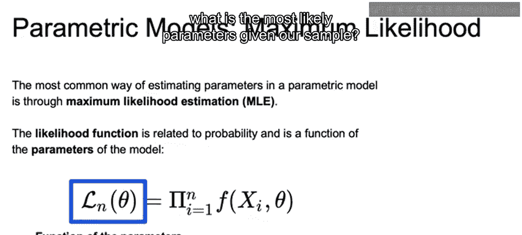

## 总结

本节课中我们一起学习了参数模型与非参数模型。参数模型依赖于有限的参数和对分布的严格假设，如正态分布；而非参数模型则更灵活，依赖数据本身定义结构，但通常需要更多数据。我们还通过客户终身价值的例子看到了两者的应用场景，并介绍了参数模型中常用的最大似然估计法。理解这两种方法的区别对于选择正确的统计推断工具至关重要。