# 038：假设检验简介 🧪

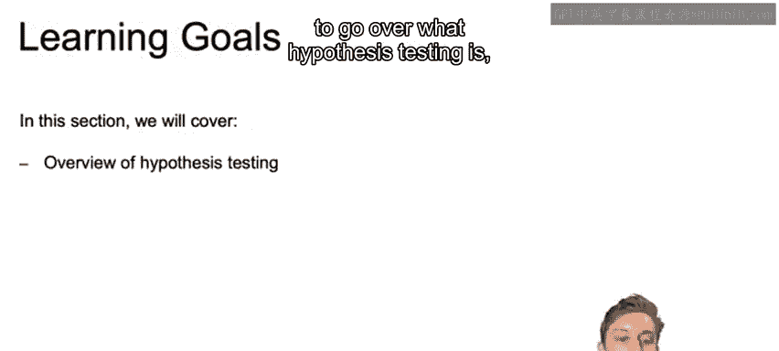

在本节课程中，我们将要学习**假设检验**的基本概念。假设检验是统计学中用于判断关于总体参数的某个陈述是否成立的重要方法。我们将了解什么是假设检验，探讨贝叶斯方法的视角，并通过一个抛硬币的例子来具体说明。

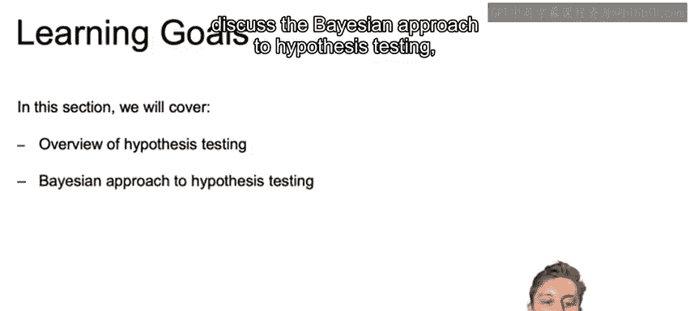

## 学习目标 🎯

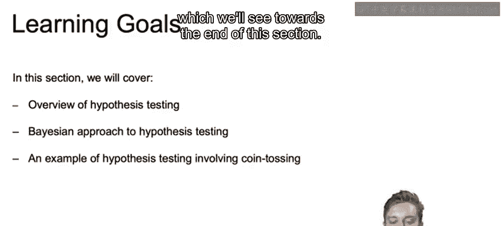

本节的学习目标有两个：
1.  理解假设检验是什么。
2.  讨论假设检验的贝叶斯方法。

## 什么是假设？ 📝

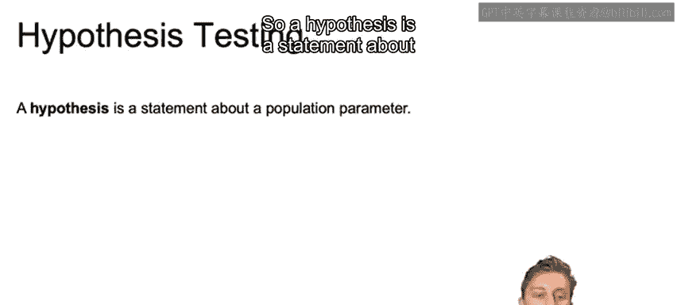

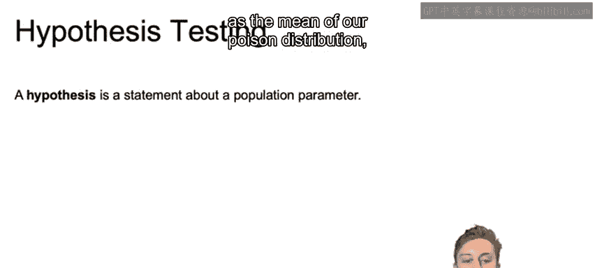

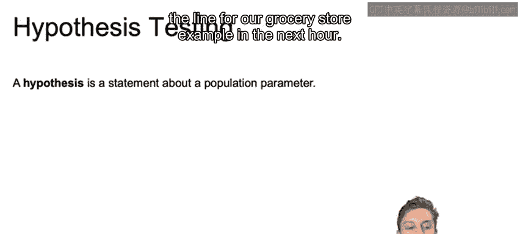

一个**假设**是关于总体参数的一个陈述。例如，在我们之前杂货店排队的例子中，关于“下一小时平均会有多少人进入队列”的预测，其均值就是一个总体参数。

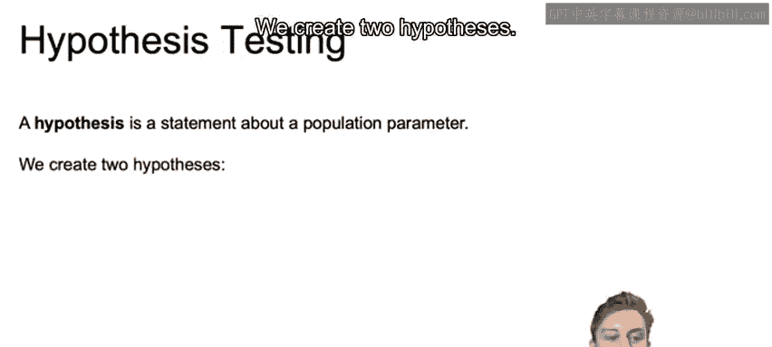

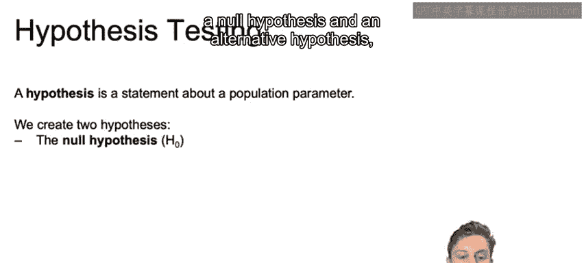

我们通常会建立两个假设：
*   **零假设**：通常记作 **H₀**。
*   **备择假设**：通常记作 **H₁** 或 **Hₐ**。

如何确定哪个是零假设，取决于问题的设定。

## 假设的设定示例 🔧

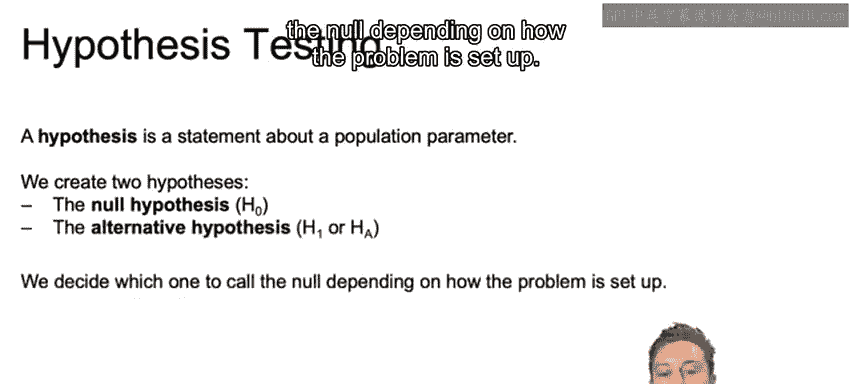

例如，我们可能设定零假设为“平均每小时有5个人进入”，而备择假设为“平均每小时进入的人数大于5”。这样，任何大于5的数字都属于备择假设，而恰好等于5则属于零假设。

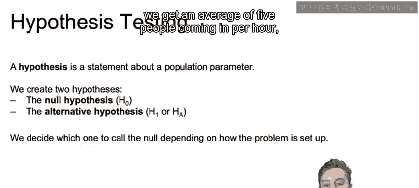

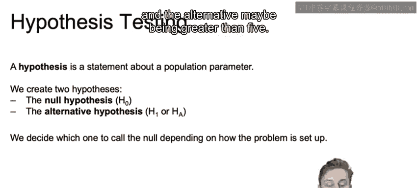

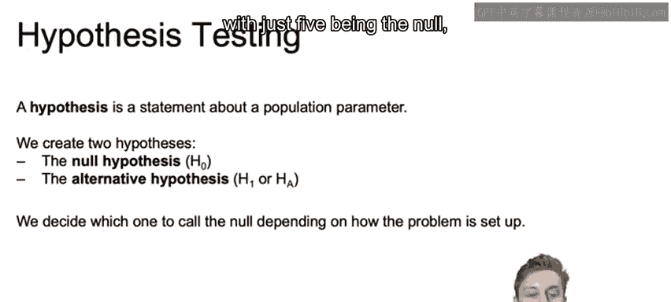

另一种情况是，假设可能涉及具体的数值，例如零假设是“平均每小时有5个人进入”，而备择假设是“平均每小时有8个人进入”。

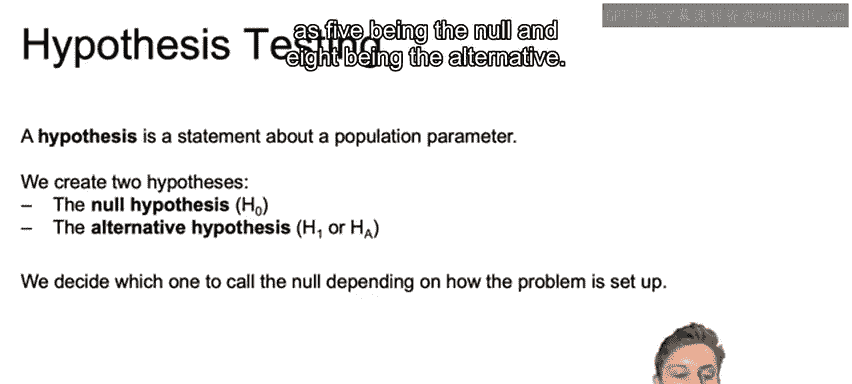

通常，如果其中一个假设的描述不那么具体（例如“大于5”或“不等于5”），它通常会被设定为**备择假设**；而那个具体的数值（例如“等于5”）则会被设定为**零假设**。

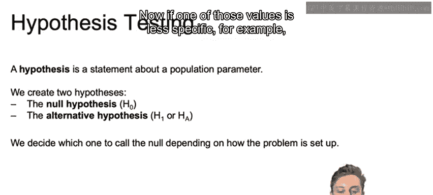

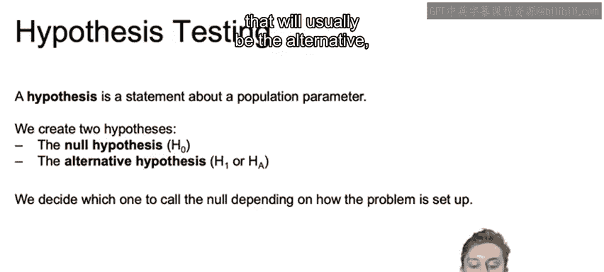

## 假设检验的过程 ⚖️

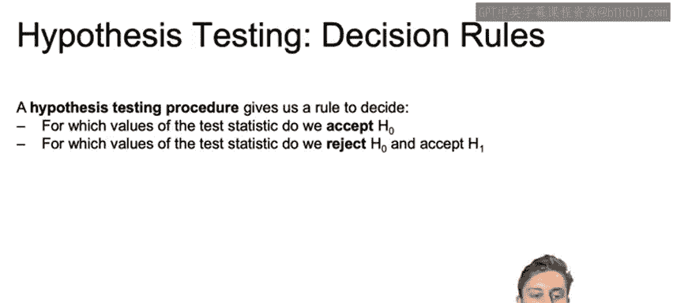

根据我们从样本中获得的数据，我们使用假设检验的程序来决定是**接受零假设**，还是**拒绝零假设并接受备择假设**。

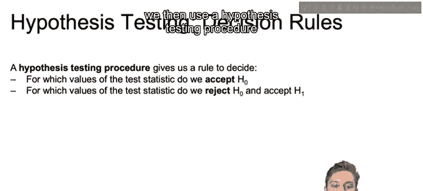

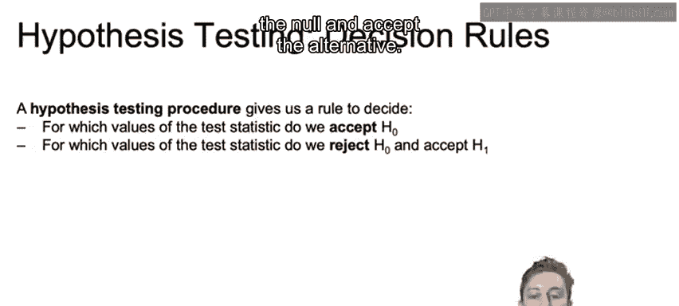

在统计学中，一个常见的说法是：你可以“拒绝零假设”，但永远不能“接受备择假设”。不过，出于实际项目推进的目的，当你根据检验统计量拒绝了零假设后，通常会按照备择假设为真的路径继续前进。

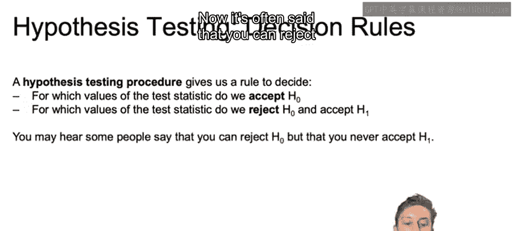

## 贝叶斯方法的视角 🔮

上一节我们介绍了经典的假设检验框架，本节中我们来看看贝叶斯方法有何不同。

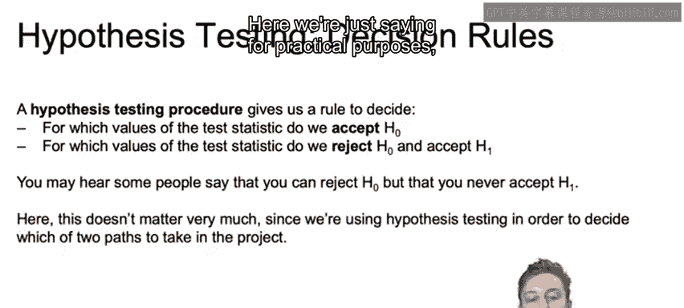

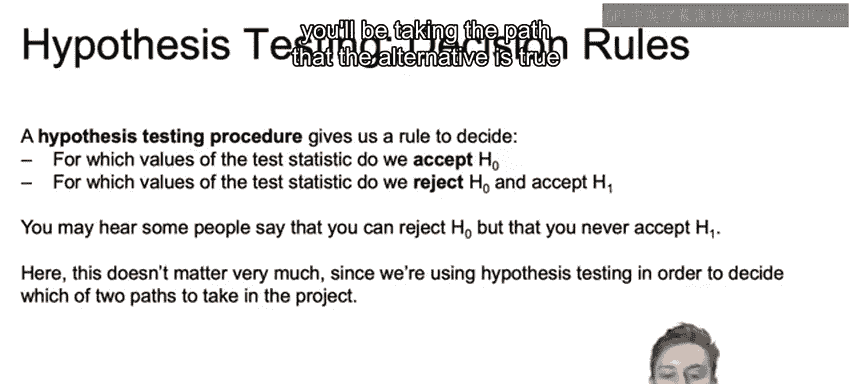

在**贝叶斯解释**中，我们不会得到一个非此即彼的决策边界。相反，我们会得到零假设和备择假设的**后验概率**，然后判断哪一个假设更有可能成立。

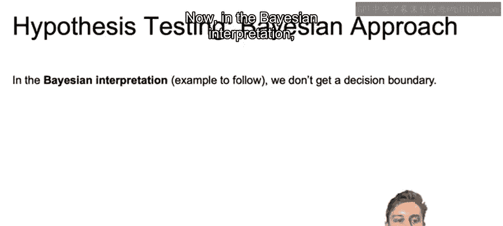

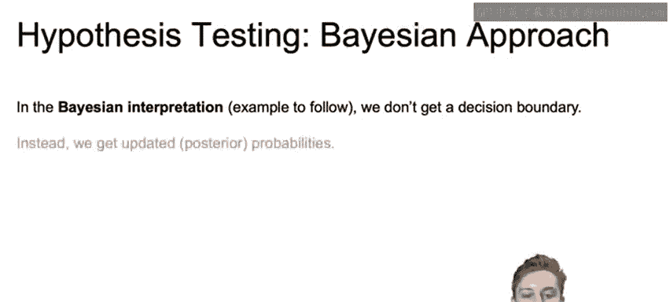

## 总结 📚

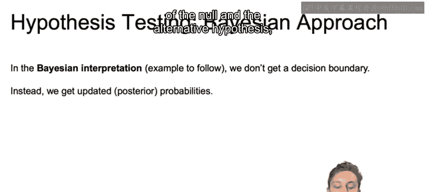

本节课中我们一起学习了假设检验的基本概念。我们了解到假设是关于总体参数的陈述，并学会了如何建立零假设和备择假设。我们探讨了经典的假设检验决策过程，即基于样本数据决定接受或拒绝零假设。最后，我们简要介绍了贝叶斯方法，它通过计算后验概率来评估不同假设的可能性，而非做出绝对的二元决策。在接下来的课程中，我们将通过抛硬币的具体例子来进一步理解这些概念。