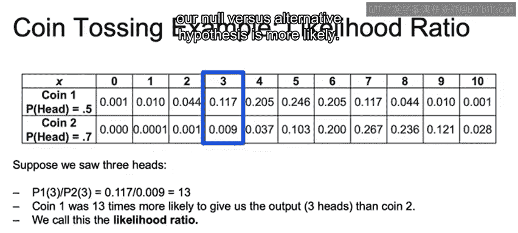

# 039：假设检验示例 🪙

在本节课中，我们将通过一个具体的例子来学习假设检验的核心思想。我们将使用一个抛硬币的场景，来理解如何根据观察到的数据，判断哪个假设更有可能成立。

## 概述

假设检验是统计学中用于判断某个假设是否成立的重要方法。其核心在于比较不同假设下观察到当前数据的可能性。本节我们将通过一个简单的抛硬币实验来演示这一过程。

## 硬币实验设定

首先，我们设定一个具体的场景。假设我们面前有两枚硬币，但我们不知道哪一枚是哪一枚。

*   **硬币1**：一枚均匀硬币，正面朝上的概率是 **0.5**。
*   **硬币2**：一枚有偏硬币，正面朝上的概率是 **0.7**。

我们的任务是：在不看的情况下随机选择一枚硬币，然后将其抛掷10次，记录正面朝上的次数。最后，根据观察到的正面次数，判断我们更可能拿到的是哪一枚硬币。

## 计算概率分布

为了进行判断，我们需要知道在两枚不同硬币下，出现各种正面次数的概率分别是多少。这可以通过二项分布公式来计算。

对于抛掷 `n` 次硬币，出现 `k` 次正面的概率公式为：

**`P(k) = C(n, k) * p^k * (1-p)^(n-k)`**

其中：
*   `C(n, k)` 是组合数，表示从 `n` 次抛掷中选出 `k` 次为正面的方式数量。
*   `p` 是单次抛掷正面朝上的概率。

根据这个公式，我们可以为两枚硬币分别计算出抛掷10次时，出现0到10次正面的概率，并制成表格或图表。从图表中可以直观看出：
*   当观察到的正面次数较低（例如0-4次）时，这更可能是来自**硬币1（p=0.5）**的结果。
*   当观察到的正面次数较高（例如6-10次）时，这更可能是来自**硬币2（p=0.7）**的结果。

## 计算似然比

现在，让我们进行具体的计算。假设我们抛掷未知硬币10次后，观察到了 **3次** 正面。

我们需要计算在两种假设下，出现这个结果的概率：
1.  **零假设 (H0)**：我们拿到的是硬币1（p=0.5）。
2.  **备择假设 (H1)**：我们拿到的是硬币2（p=0.7）。

计算过程如下：
*   **给定硬币1时，出现3次正面的概率**：`P(k=3 | p=0.5) ≈ 0.117`
*   **给定硬币2时，出现3次正面的概率**：`P(k=3 | p=0.7) ≈ 0.009`

接下来，我们计算**似然比**，即零假设下的概率与备择假设下概率的比值：

**`似然比 = P(数据 | H0) / P(数据 | H1) = 0.117 / 0.009 ≈ 13`**

这个比值13意味着，**观察到3次正面**这个结果，在硬币1的假设下发生的可能性，是在硬币2假设下可能性的13倍。

## 结论与决策

基于计算出的似然比，我们可以做出判断。因为似然比远大于1，我们更有理由相信，当前的数据（3次正面）更支持**零假设（H0）**，即我们最初拿到的是**硬币1（均匀硬币，p=0.5）**。

## 总结

本节课中，我们一起学习了假设检验的一个基础示例。我们通过抛硬币实验，演示了如何：
1.  设定明确的零假设和备择假设。
2.  基于概率模型（此处为二项分布）计算在各自假设下观察到当前数据的可能性。
3.  计算**似然比**来量化一个假设相对于另一个假设的支持程度。
4.  根据似然比做出统计决策。

理解这个简单的例子，是掌握更复杂假设检验方法（如p值检验）的重要基础。核心思想始终是：**在证据（数据）面前，哪个故事（假设）更说得通？**