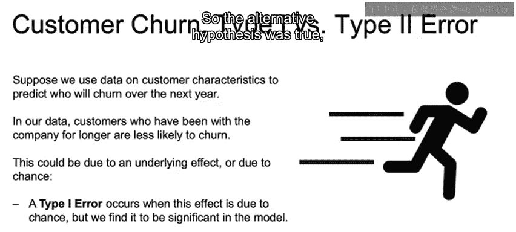

# 041：第一类错误与第二类错误 ⚖️

在本节课中，我们将学习假设检验中的核心概念：第一类错误与第二类错误。我们将通过工作场景中的实例，深入理解这两类错误的定义、区别及其在业务决策中的重要性。

上一节我们介绍了假设检验的基本框架，本节中我们来看看假设检验中可能犯的两种错误。

## 错误类型定义

假设检验基于奈曼-皮尔逊范式，这是一个非贝叶斯范式。我们需要理解的核心是：什么是第一类错误，以及什么是第二类错误。

在深入探讨之前，让我们思考一个例子。想象我们正在抛一枚硬币。

*   我们的**零假设**是：我们使用的是一枚公平的硬币。即正面朝上的概率是50%。
*   我们的**备择假设**是：这不是一枚公平的硬币。即正面朝上的概率不是50%。

**第一类错误**在这种情况下，是指错误地拒绝了零假设。这意味着我们实际上使用的是一枚公平的硬币，但根据样本数据，我们错误地决定拒绝“它是公平硬币”这个零假设。

**第二类错误**则相反，是指错误地接受了零假设。这意味着我们实际上使用的是一枚有偏的硬币，但根据数据，我们却接受了“它是公平硬币”的结论，或者说未能拒绝“它是公平硬币”的零假设。

## 检验功效

接着，我们引入**检验功效**的概念，其公式为：
`检验功效 = 1 - 第二类错误的概率`

理想情况下，我们希望错误接受零假设的概率尽可能小。因此，检验功效就是在零假设确实为假时，我们正确拒绝零假设的概率。即，当我们拒绝零假设时，我们正确地判断出我们拥有的不是一枚公平硬币。

检验功效很大程度上取决于我们根据样本数据决定拒绝零假设的临界点。

*   如果我们无论数据如何都拒绝零假设，我们将得到一个高功效的检验，但也很可能导致大量的第一类错误。
*   另一方面，如果我们让拒绝零假设变得非常困难，那么我们更可能无法拒绝零假设，从而导致检验功效较低。

## 业务实例分析

现在，让我们回顾之前讨论过的客户流失预测例子，并将其与两类错误联系起来。

客户流失是指客户离开公司，这显然是一件坏事。与流失相关的数据可能包含一个目标变量，即客户是否离开。我们可以用来预测这个目标变量的特征包括：客户成为我们客户的时间长度、客户随时间购买的类型和金额，以及其他客户特征，如年龄、所在地等。

流失预测通常通过为个体预测一个分数来实施，该分数用于估计客户离开或留下的概率。

假设我们使用客户特征数据来预测未来一年内谁会流失。

在我们的场景中，设**备择假设**为：成为客户超过两年的客户不会流失。**零假设**则是：任何观察到的效应只是由于随机机会，没有潜在的真实效应。

以下是两类错误在此业务场景中的含义：

*   **第一类错误**：意味着效应确实只是由于随机机会（即零假设为真），但我们却判定那些成为客户超过两年的人确实更不容易流失。我们错误地拒绝了零假设，声称备择假设（成为客户时间长影响流失率）为真。
*   **第二类错误**：意味着根据数据，我们判定流失只是随机发生的（即我们未能拒绝“无效应”的零假设），而实际上存在真实效应——成为公司客户两年或更长时间确实意味着你更不容易流失。备择假设为真，但我们未能拒绝零假设。

---

本节课中，我们一起学习了假设检验中的第一类错误与第二类错误。我们明确了它们的定义：第一类错误是“弃真”，第二类错误是“取伪”。我们还探讨了检验功效的概念，并通过抛硬币和客户流失预测的实例，具体分析了这两类错误在统计推断和实际业务决策中的不同影响与重要性。理解这些概念有助于我们在进行数据驱动的决策时，更好地权衡风险。