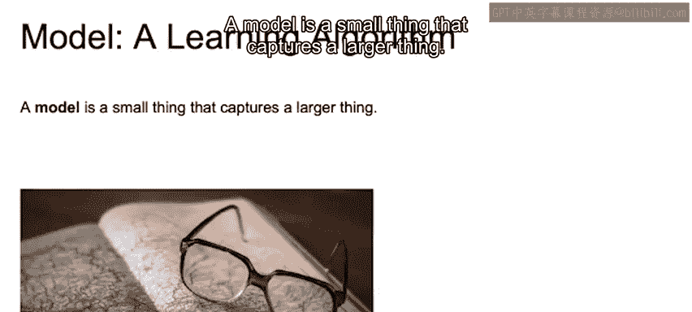
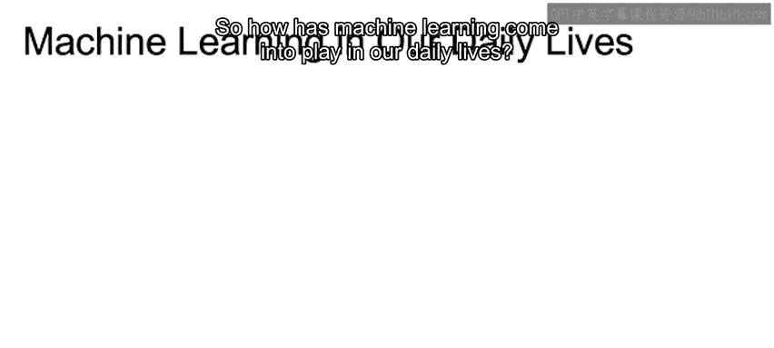
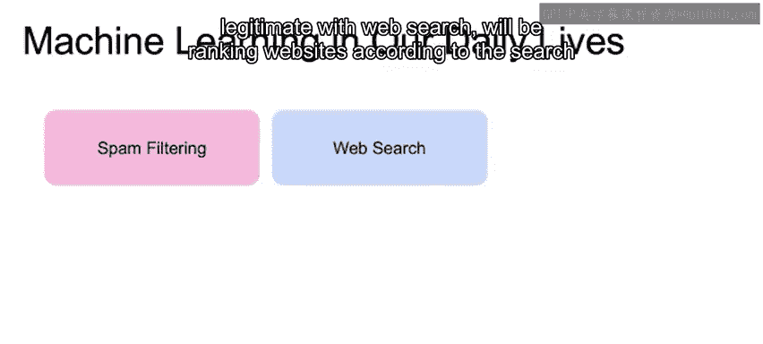
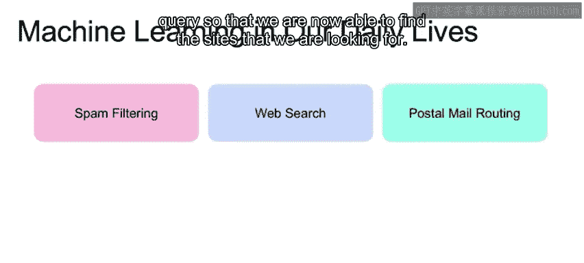
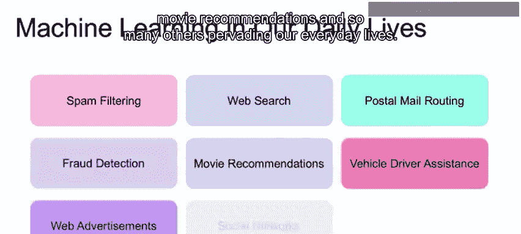
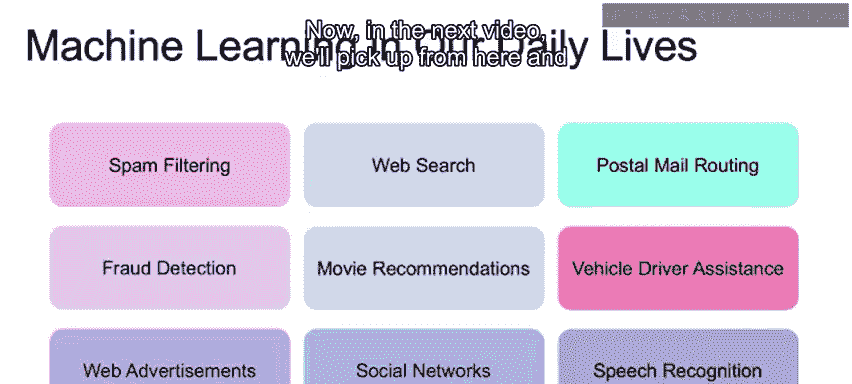
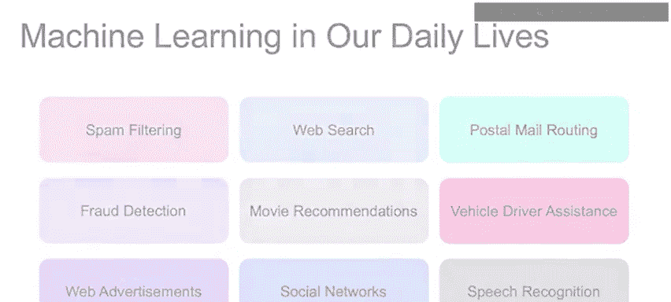

# 050：监督机器学习简介 🧠

在本节课中，我们将要学习监督机器学习的基本概念，包括其定义、核心思想以及它在人工智能领域中的位置。我们还将探讨什么是模型，以及机器学习如何通过模型来近似现实世界中的复杂过程。

---

## 概述

机器学习使计算机能够从数据中学习。与传统统计建模不同，机器学习通常在我们对底层过程了解较少或过程过于复杂时，通过数据来学习或近似方程。函数近似使得我们能够使用机器学习模型来预测未来值。

---

## 人工智能与机器学习

要定义机器学习，让我们先从更广泛的人工智能范畴开始。Russell和Norvig在他们的著作《人工智能：现代方法》中提出了一个表格，描述了我们对人工智能思考的四个象限。

行代表机器能够“思考”与能够“行动”之间的二分法。
列代表机器试图“模仿人类行为”与“模仿理性行为”之间的二分法。

在接下来的内容中，我们将看到，机器学习的重点更侧重于思考过程。我们究竟是试图以人类的方式还是理性的方式思考，取决于我们期望的结果。例如，在市场营销中，我们希望了解人类对特定活动的反应；而在供应链优化中，我们希望找到最理性的生产和交付产品的方式。

即使聚焦于“思考”这一行，我们面对的也是一些非常抽象的概念。这里出现了诸如思考、心智、决策、感知、推理等词语。让我们将其缩小到一个同样被强调的概念：**学习**。

学习将是我们能够做出决策、解决问题、感知、推理并相应行动的途径。因此，机器学习将明确属于人工智能的这个子集，即当我们的机器能够学习时。

---

## 什么是模型？

模型是一个捕捉更大事物本质的小事物。

**模型 = 对现实世界复杂现象的简化表示**

一个好的模型会忽略不重要的细节，同时保留重要的部分。例如，地图就是一个模型，它代表了一个更广阔的现实（即底层地域）。在选择正确的表示或模型时，我们总是会减少所涵盖的信息量，但我们需要以一种保留我们感兴趣的特征或关系的方式来进行。

一个好的模型能够做到这两点：捕捉重要的关系，同时将现实世界现象的复杂性降低到足以让我们理解并表达的程度。在我们的图表中，我们展示了国家边界与不同水域之间的关系，但省略了城市边界和大型地标，以确保清晰地定义我们认为重要的关系。

---

## 机器学习在生活中的应用

机器学习已深入我们的日常生活。以下是一些常见的应用场景：

*   **垃圾邮件过滤**：将电子邮件分类为垃圾邮件或合法邮件。
*   **网络搜索**：根据搜索查询对网站进行排名，帮助我们找到所需信息。
*   **路线优化**：优化邮件或包裹的配送路线。
*   **欺诈检测**：识别金融交易中的可疑模式。
*   **电影推荐**：根据用户历史偏好推荐电影。

还有许多其他应用渗透在我们日常生活的方方面面，并且这种趋势在未来只会持续增长。

---

## 总结

本节课我们一起学习了监督机器学习的入门知识。我们了解了机器学习如何通过从数据中学习来近似复杂过程，明确了它在人工智能领域中的位置——即专注于“学习”能力的子集。我们还探讨了模型的核心概念，即对现实世界进行简化但保留关键信息的表示。最后，我们看到了机器学习在垃圾邮件过滤、网络搜索等多个领域的实际应用。

在下一节视频中，我们将深入探讨机器学习在底层是如何工作的。