# 053：监督机器学习（第二部分）📊

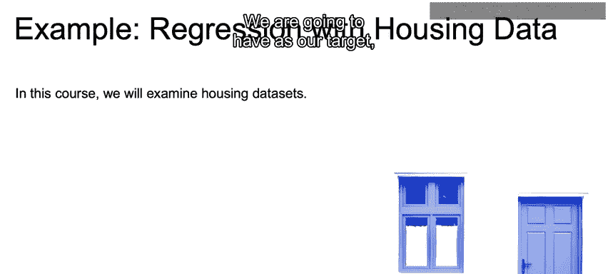

在本节课中，我们将学习监督机器学习中的两个核心目标：**解释性**与**预测性**。我们将通过房价预测和客户流失分析两个具体案例，深入理解如何在实际项目中平衡这两个目标，并掌握特征重要性分析等关键概念。

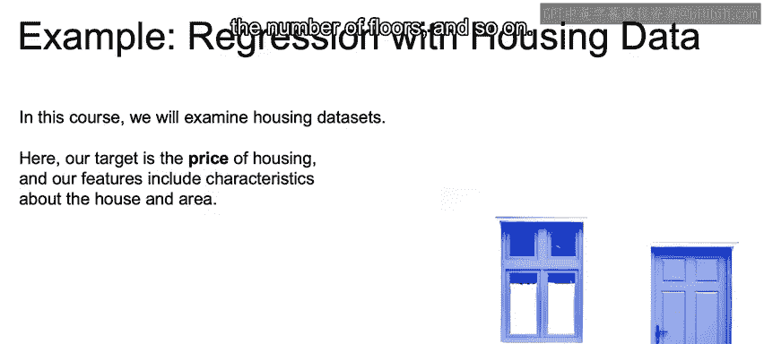

---

## 概述：解释性与预测性 🎯

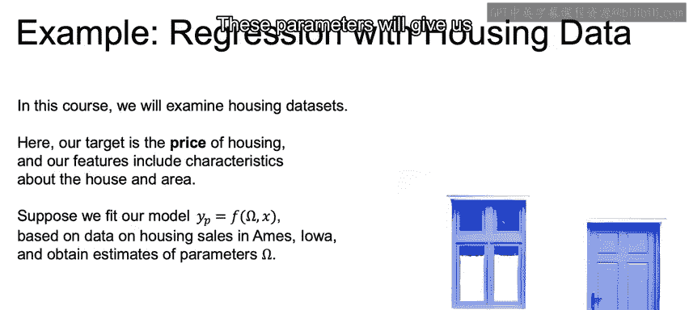

在监督机器学习中，我们通常有两个主要目标：**解释性**和**预测性**。解释性关注于理解模型参数和特征如何影响结果，而预测性则专注于模型对新数据的预测准确度。我们将通过两个案例来探讨这两个目标。

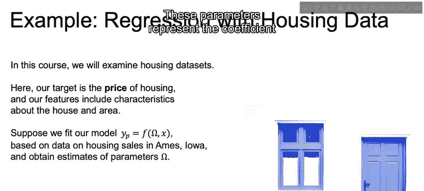

---

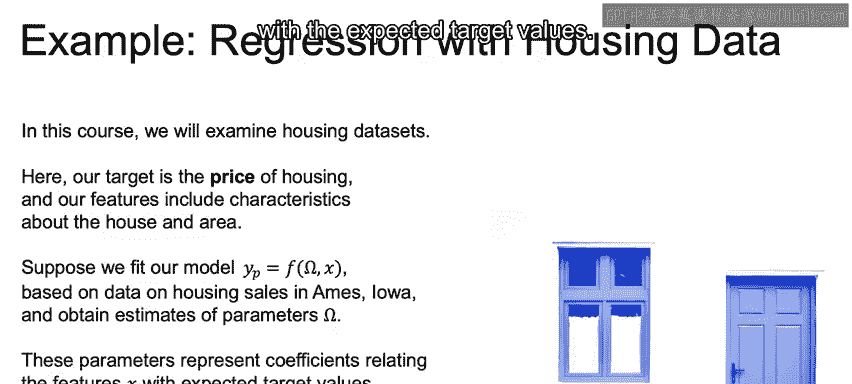

## 案例一：房价预测（回归问题）🏠

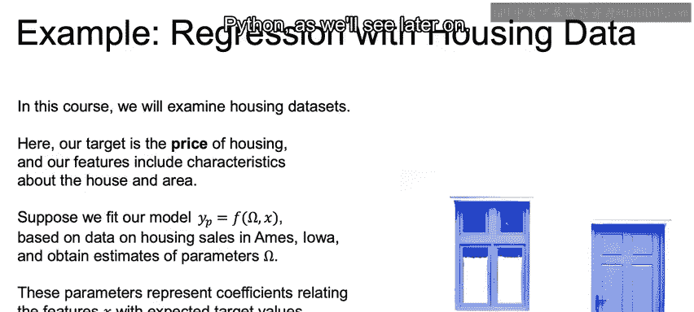

在本节中，我们将以爱荷华州埃姆斯市的房价数据集为例，探讨回归问题中的解释性与预测性。

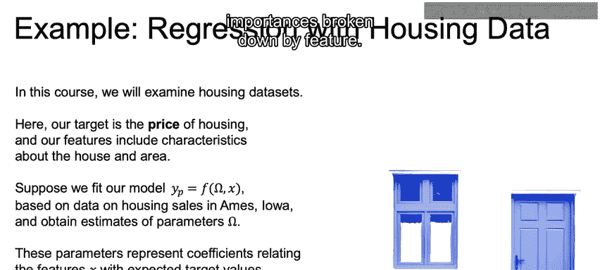

### 数据集与目标

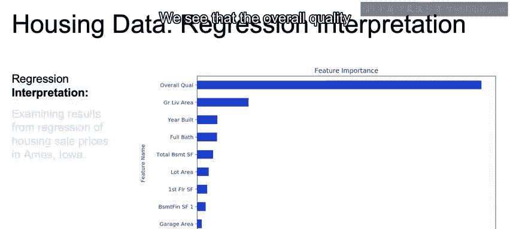

我们的目标是预测房价。特征包括房屋和区域的各种属性，例如房屋质量、地理位置、楼层数量等。

**目标变量**：房价  
**特征变量**：房屋质量、地理位置、楼层数量等

### 模型拟合与参数估计

我们使用机器学习框架拟合模型，其中预测值是参数和输入特征的函数。模型基于历史房屋销售数据进行参数估计。

**模型公式**：  
`Yp = f(θ, X)`  
其中，`Yp`是预测值，`θ`是模型参数，`X`是输入特征。

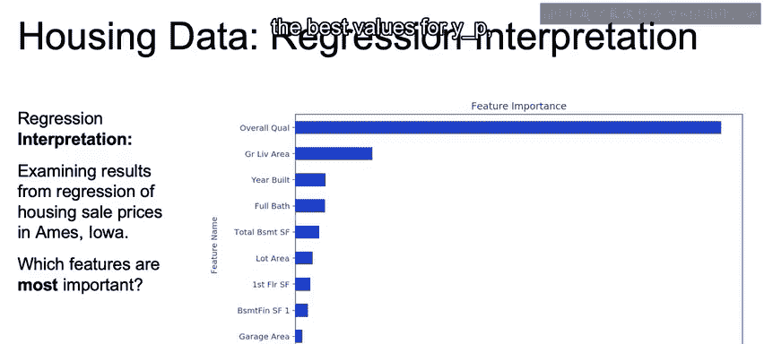

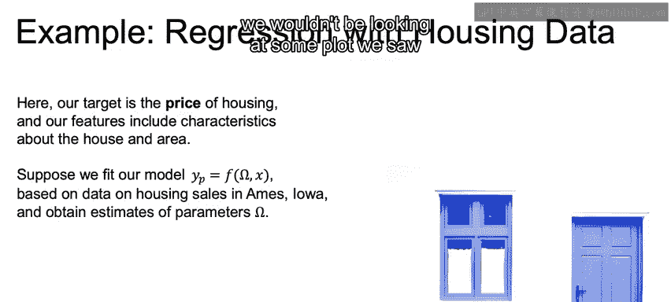

### 特征重要性分析

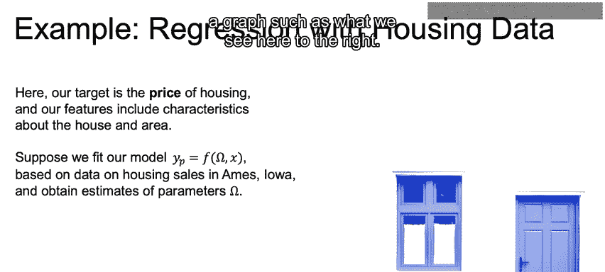

参数估计后，我们可以分析每个特征对房价的影响程度，这称为**特征重要性**。特征重要性帮助我们理解哪些因素对房价影响最大。

**特征重要性公式**：  
`Importance = |θ_i|`  
其中，`θ_i`是第`i`个特征的系数。

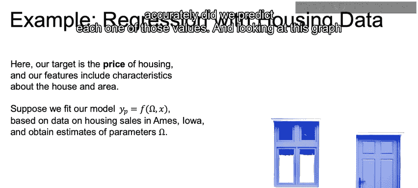

以下是特征重要性分析的步骤：

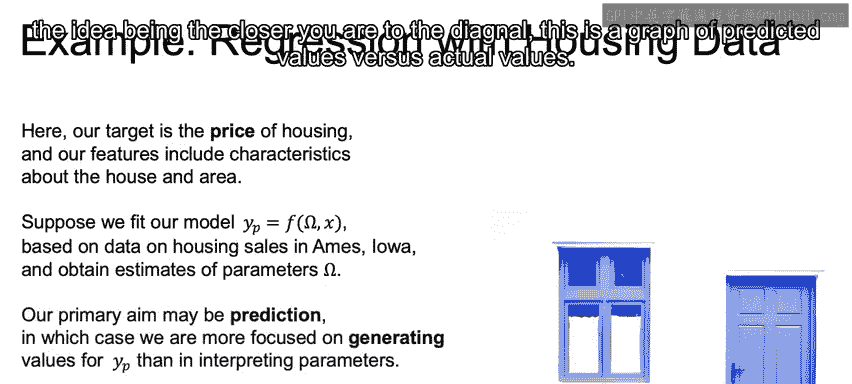

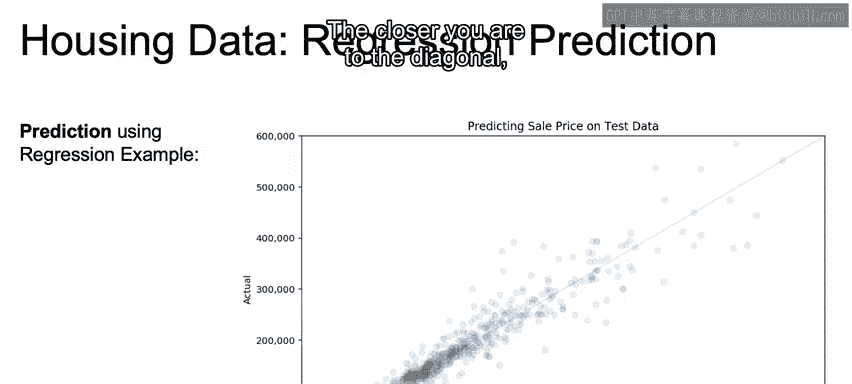

1.  计算每个特征的系数绝对值。
2.  按重要性排序，识别关键特征。
3.  分析特征的影响方向（正相关或负相关）。

例如，在房价预测中，房屋整体质量可能具有最高的正重要性，而犯罪率可能具有较高的负重要性。

### 预测性分析

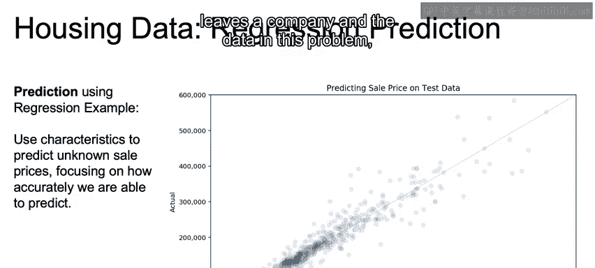

如果我们的主要目标是预测，那么重点将放在生成最准确的预测值`Yp`上。评估预测性能时，我们通常会绘制预测值与实际值的散点图。

**评估方法**：  
绘制预测值（Y轴）与实际值（X轴）的散点图。点越接近对角线，预测越准确。

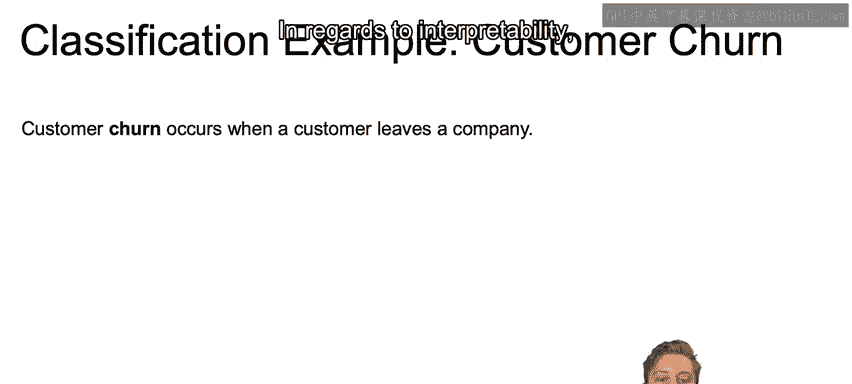

这种图形化方法直观展示了模型的预测能力，而不关注特征的具体解释。

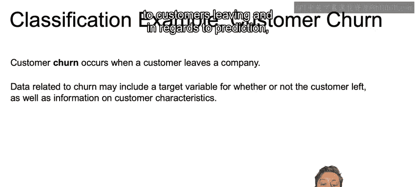

---

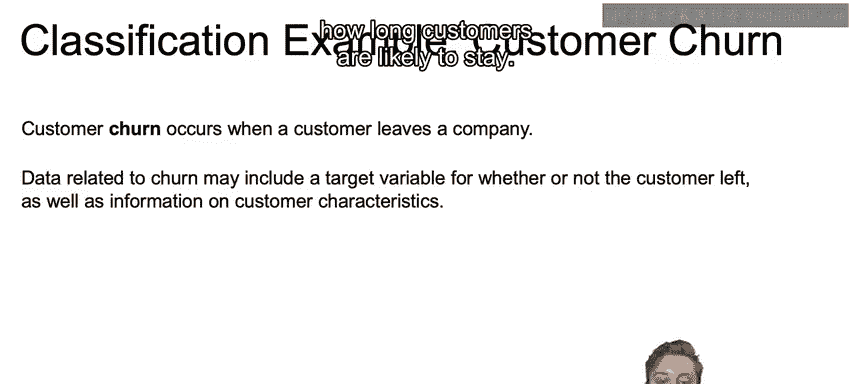

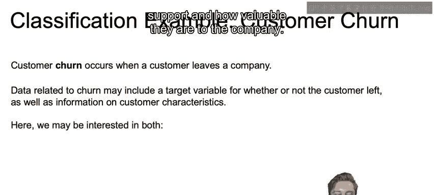

## 案例二：客户流失分析（分类问题）📉

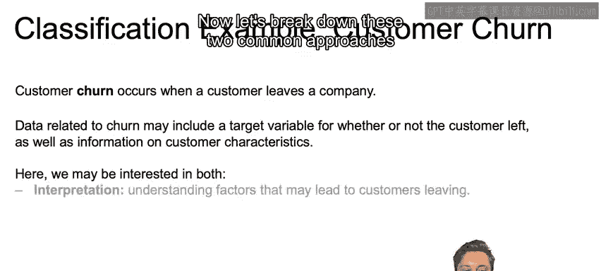

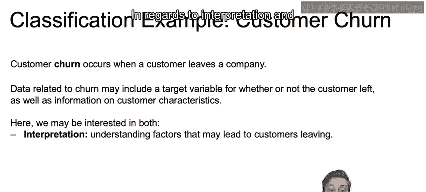

上一节我们介绍了回归问题，本节中我们来看看分类问题。我们将以客户流失分析为例，探讨分类问题中的解释性与预测性。

### 问题定义与数据

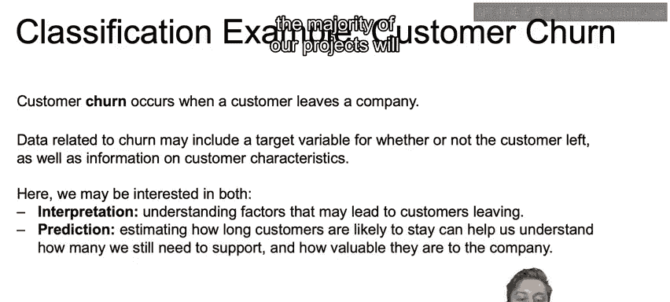

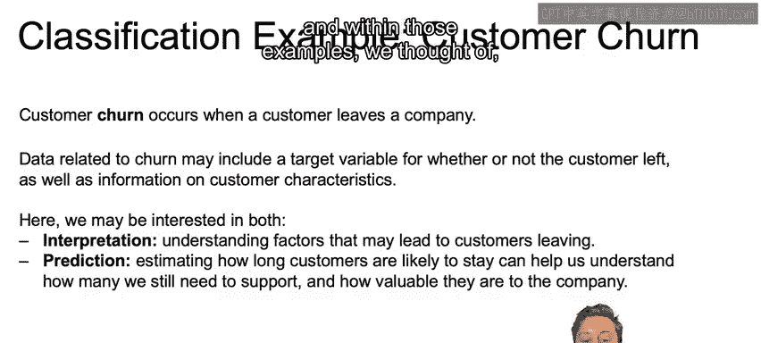

客户流失是指客户离开公司。数据集包括目标变量（客户是否流失）以及客户特征，如订阅费用、客户时长等。

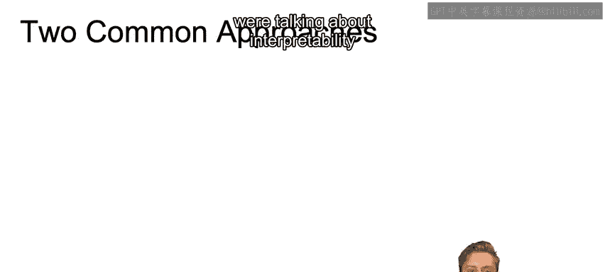

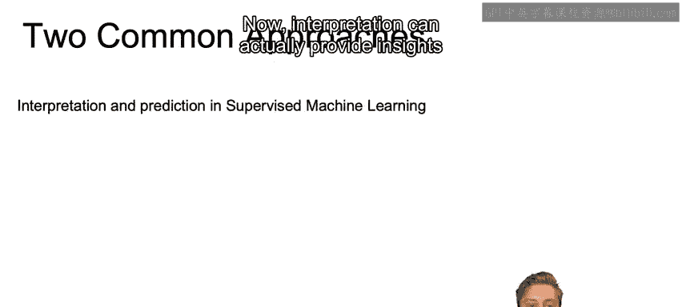

**目标变量**：客户是否流失（是/否）  
**特征变量**：订阅费用、客户时长等

### 解释性与预测性的平衡

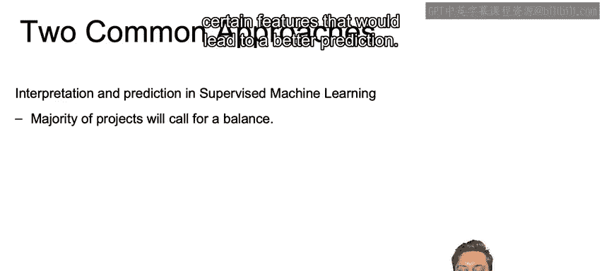

在客户流失分析中，我们可能同时关注解释性和预测性：

*   **解释性**：理解导致客户流失的关键因素，例如高订阅费用或短客户时长。
*   **预测性**：预测新客户流失的可能性，以制定客户 retention 策略。

### 实践中的平衡

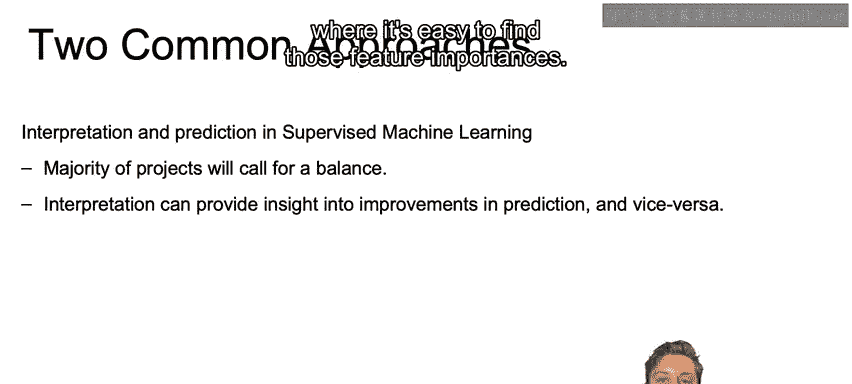

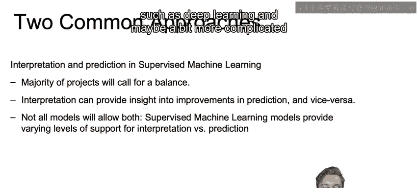

大多数机器学习项目需要在解释性和预测性之间取得平衡：

1.  **解释性辅助预测**：通过分析特征重要性，我们可以调整模型，例如突出关键特征或剔除无关特征，从而提升预测性能。
2.  **预测性验证解释**：准确的预测模型可以增强我们对特征重要性分析结果的信心。

需要注意的是，并非所有模型都同时支持良好的解释性和预测性。例如，线性回归模型解释性强，而深度学习模型预测性能可能更优，但解释性较差。

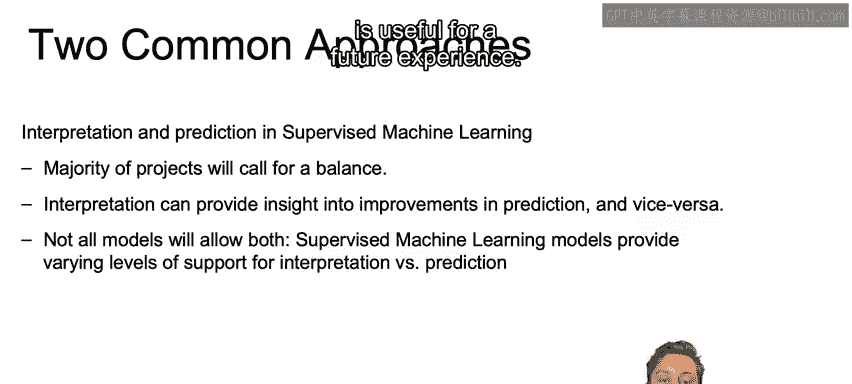

---

## 机器学习框架回顾 🤖

机器学习是人工智能的一个子集，专注于构建模型以支持解释性或预测性目标。机器学习算法利用历史经验构建模型，并将其应用于未来场景。

**核心公式**：  
`Yp = f(θ, X)`

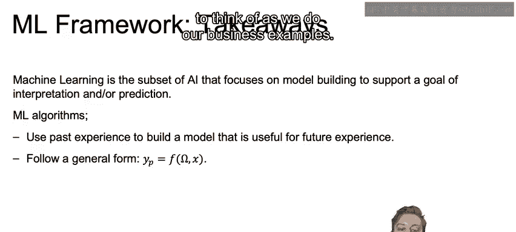

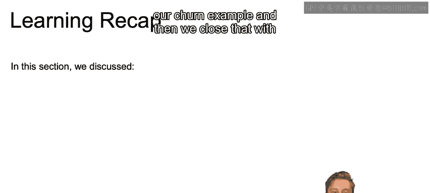

### 本节要点总结

在本节课中，我们一起学习了以下内容：

1.  **机器学习目标**：理解解释性与预测性的权衡及其在实际业务案例中的平衡。
2.  **回归案例**：通过房价预测案例，学习了特征重要性分析和预测性能评估。
3.  **分类案例**：通过客户流失分析案例，探讨了分类问题中解释性与预测性的应用。
4.  **模型选择**：认识到不同模型在解释性和预测性上的支持程度不同。

在下一节中，我们将继续深入监督机器学习，探讨分类、风险回归等内容。敬请期待！

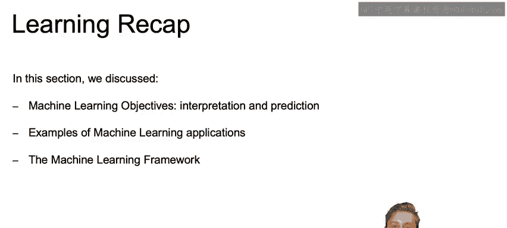

---