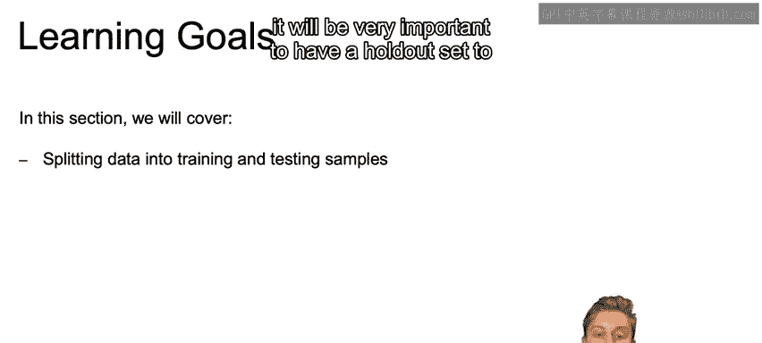
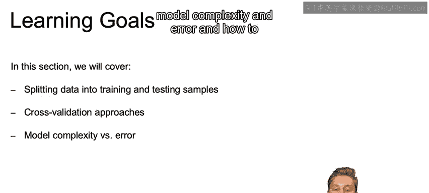
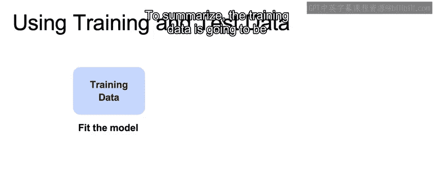
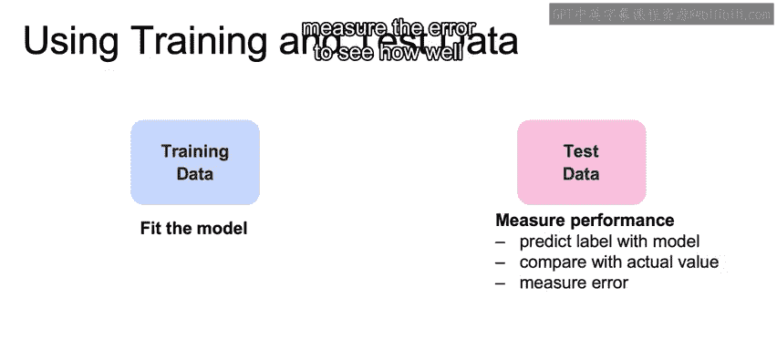
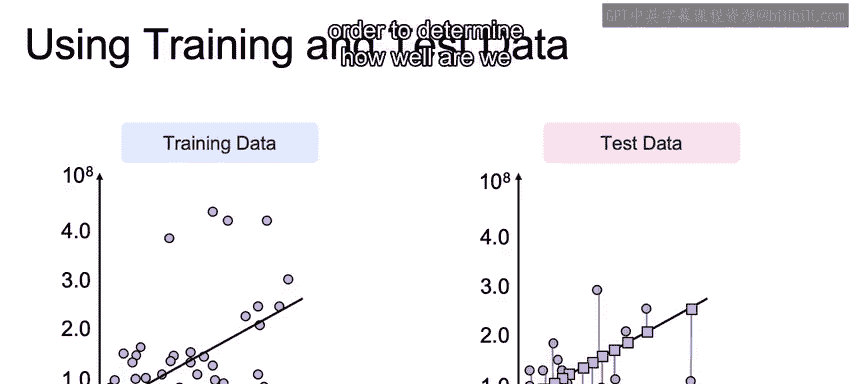

# 060：训练集与测试集分割（第一部分）📊

在本节课中，我们将学习如何将数据分割为训练集和测试集。这种方法能帮助我们交叉验证模型，并更好地评估模型在真实世界中的实际表现。

## 学习目标 🎯




本节的学习目标包括：
*   学习将数据分割为训练样本和测试样本。
*   了解交叉验证方法，以及如何扩展训练与测试的概念，以便在多个不同的数据集上进行训练和测试。
*   探讨模型复杂度与误差之间的关系，并学习如何找到合适的平衡点。

## 为什么需要分割数据？🤔

上一节我们简要提到了模型评估的重要性，本节中我们来看看具体如何操作。假设我们拥有一个历史训练集。正如之前提到的，我们可以让模型完美地拟合这些数据，达到100%的准确率。



例如，我们可以建立一个模型，规定任何片长恰好为146分钟的电影，其票房收入约为4.24亿美元（对应数据集的第一行）；任何片长恰好为129分钟的电影，其票房收入约为4.09亿美元。

当我们移除结果变量（即真实票房）来评估模型表现时，这个“一一对应”的模型可以精确地“预测”出历史数据中的票房收入。然而，对于未见过的数据，这个模型很可能会表现得很差，因为它无法很好地泛化。

问题的核心在于：如果我们在整个数据集上进行训练，我们将永远无法知道模型在未见数据上的表现如何。

## 解决方案：数据分割 🔪

那么，解决方案是什么？我们可以将数据集分割开来。

我们取一部分数据，称之为**训练数据**。我们利用这部分数据，结合其标签，来学习模型的最优参数。

然后，我们保留另一部分独立的数据集，将其视为**未见数据**。我们移除这部分数据的标签，使用从训练数据中学到的模型，来预测这些测试数据，从而评估模型在未见数据上的表现能力。

由于测试数据实际上也来自我们的历史数据集，我们可以根据从训练数据中学到的模型，来检验其预测的准确性。这能确保模型能够很好地泛化到新情况。

需要强调的是，必须确保训练集和测试集是彼此独立的。有时，测试数据的一部分可能会“泄漏”到训练数据中，导致测试数据不再是真正的“未见”数据，模型会间接学习到这些信息。这种现象被称为**数据泄漏**，需要特别注意并避免。

## 流程总结 📝

以下是训练与测试分割的核心流程：

1.  **训练阶段**：使用训练数据来拟合模型并学习参数。
    ```python
    # 伪代码示例
    model.fit(training_features, training_labels)
    ```



2.  **预测阶段**：使用训练好的模型对测试数据进行预测。
    ```python
    # 伪代码示例
    predictions = model.predict(test_features)
    ```

3.  **评估阶段**：将模型的预测结果与测试数据的实际标签进行比较。根据我们选择的误差度量标准（如均方误差、准确率等）来计算误差，从而评估模型在未见数据上的表现。
    ```python
    # 伪代码示例：计算均方误差
    from sklearn.metrics import mean_squared_error
    error = mean_squared_error(test_labels, predictions)
    ```

## 实际场景示例 🎬



让我们看一个实际场景。这里我们将数据分割成了训练集和测试集。

我们将执行线性回归，即在左侧的训练集上拟合一条最能解释数据的直线。我们将在训练数据上执行回归，确定哪些参数能对训练数据实现最佳拟合。

接下来，我们将使用从训练数据集确定好的参数，对测试数据集中的每个点进行预测。这些预测值就是我们在右侧看到的所有的紫色点。

那么这些预测效果如何呢？我们可以通过测量每个测试点的实际值到回归线上预测值之间的距离（即误差线）来衡量。这些误差的大小帮助我们确定模型在此未见数据上的表现好坏。

## 总结 📚



本节课中，我们一起学习了机器学习中一个至关重要的概念：将数据集分割为训练集和测试集。我们了解了这样做的原因——为了评估模型的泛化能力，避免过拟合。我们明确了训练集用于学习模型参数，测试集用于模拟未见数据以评估模型性能。最后，我们通过一个线性回归的例子，直观地展示了整个分割、训练、预测和评估的流程。理解并正确实施数据分割，是构建可靠机器学习模型的第一步。