# 065：训练集与测试集分割实验（第四部分）📊

在本节课中，我们将完成关于训练集和测试集分割实验的笔记本内容。我们将重点探讨数据缩放对线性回归模型性能的影响，并可视化模型的预测结果。

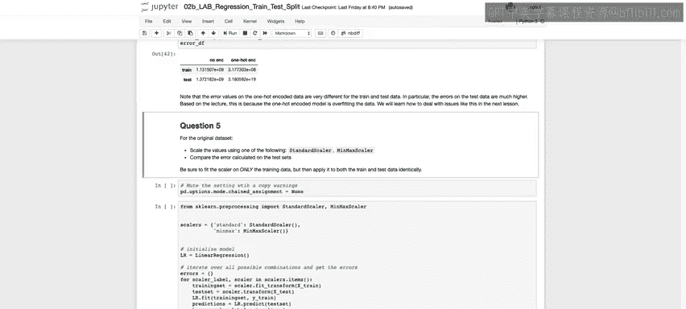

---

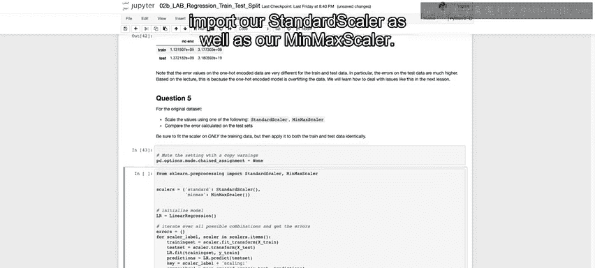

上一节我们讨论了数据分割的基本方法，本节中我们来看看如何对数据进行标准化或归一化处理，并评估这些处理对模型误差的影响。

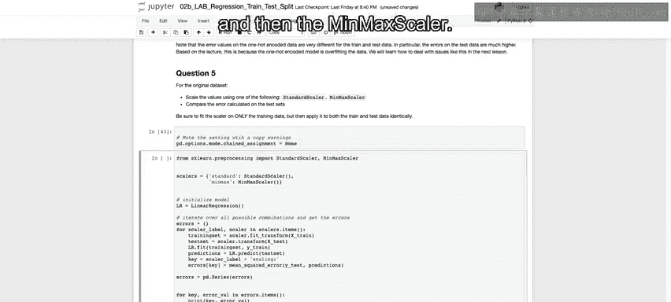

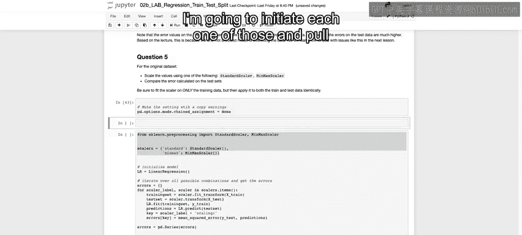

首先，我们需要导入必要的缩放工具。

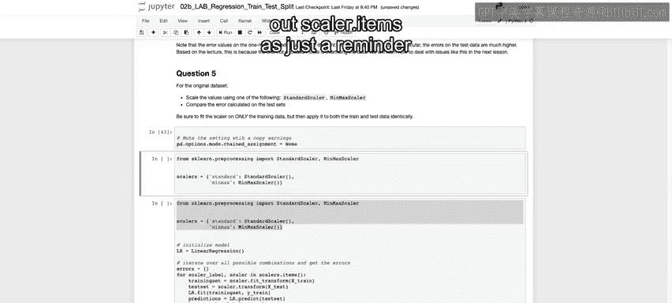

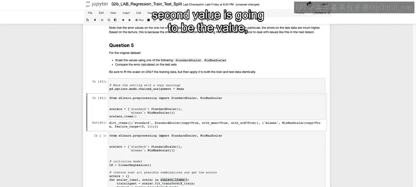

```python
from sklearn.preprocessing import StandardScaler, MinMaxScaler
```

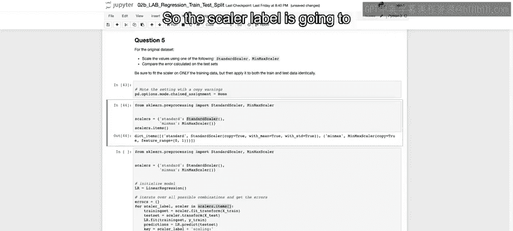

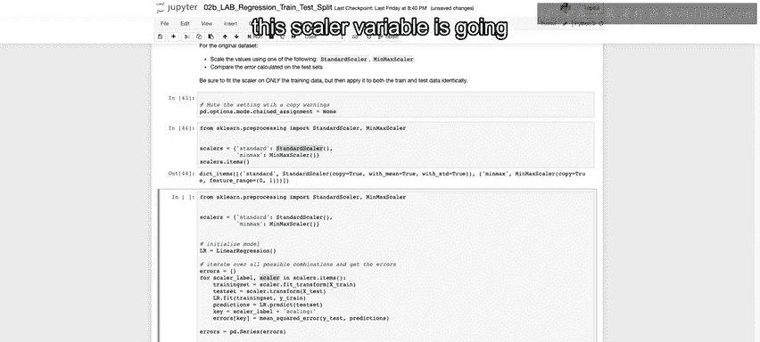

接着，我们创建一个字典来存储两种缩放器。

```python
scalers = {
    'standard': StandardScaler(),
    'minmax': MinMaxScaler()
}
```

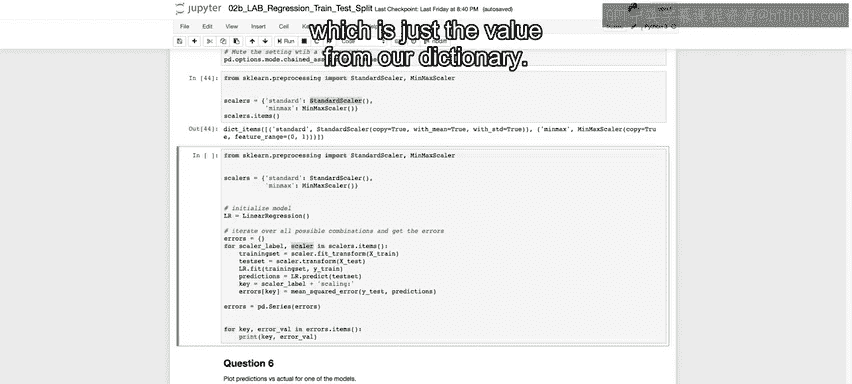

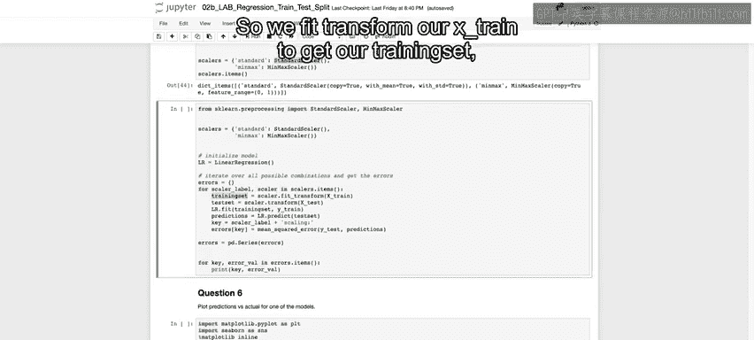

以下是进行缩放和模型训练的关键步骤：

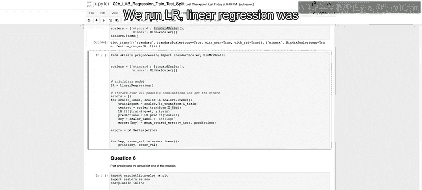

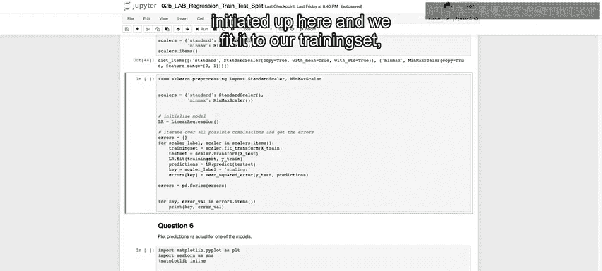

1.  **对训练集进行拟合和转换**：我们只对训练数据（`X_train`）使用 `fit_transform` 方法。这能计算出缩放所需的参数（如均值和标准差），并立即应用转换。
2.  **对测试集进行转换**：使用从训练集学到的参数，对测试数据（`X_test`）只调用 `transform` 方法。**绝对不要**对测试集再次调用 `fit_transform`，否则会引入数据泄露。
3.  **训练模型**：使用缩放后的训练数据（`X_train_scaled`）和对应的标签（`y_train`）来训练线性回归模型。
4.  **评估模型**：使用缩放后的测试数据（`X_test_scaled`）进行预测，并计算预测值（`y_pred`）与真实值（`y_test`）之间的均方误差（MSE）。

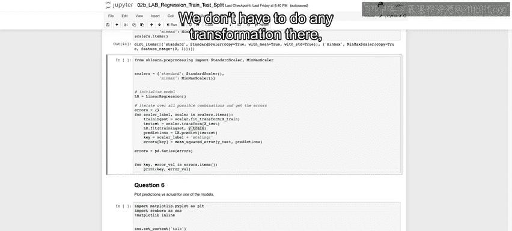

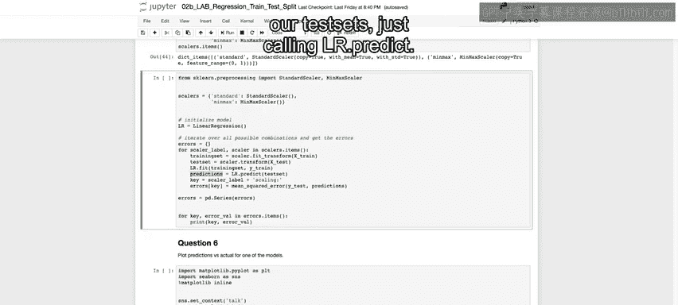

核心的缩放和训练过程代码如下：

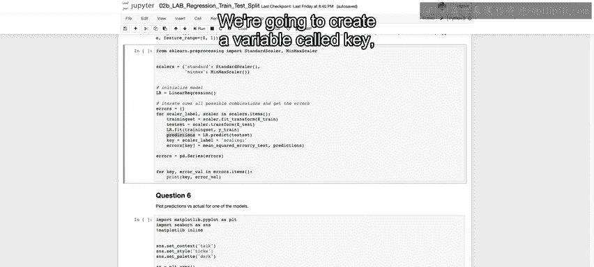

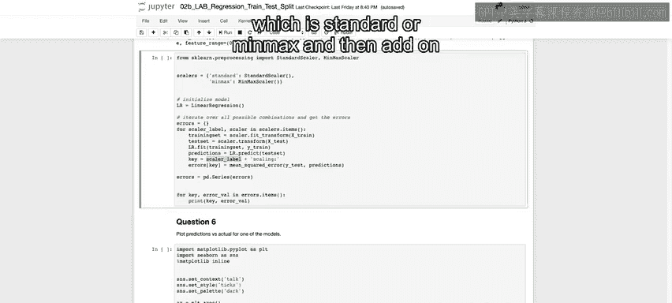

```python
errors = {}
for scaler_label, scaler in scalers.items():
    # 缩放训练集和测试集
    X_train_scaled = scaler.fit_transform(X_train)
    X_test_scaled = scaler.transform(X_test)

    # 训练模型
    lr = LinearRegression()
    lr.fit(X_train_scaled, y_train)

    # 预测并计算误差
    y_pred = lr.predict(X_test_scaled)
    key = f'{scaler_label} scaling'
    errors[key] = mean_squared_error(y_test, y_pred)
```

运行上述代码后，我们发现使用 `StandardScaler`（标准化）和 `MinMaxScaler`（归一化）得到的测试集误差是相同的，并且与之前未缩放数据得到的误差一致。

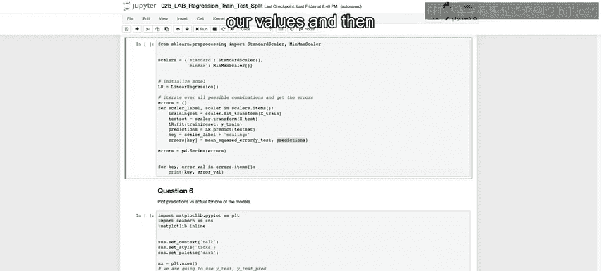

这个结果表明：**对于普通的线性回归模型，特征缩放不会影响最终的预测性能**。因为线性回归求解的系数会自适应地补偿特征的尺度差异。但请注意，这个结论对于后续将学到的岭回归（Ridge）和套索回归（Lasso）等正则化模型并不成立。

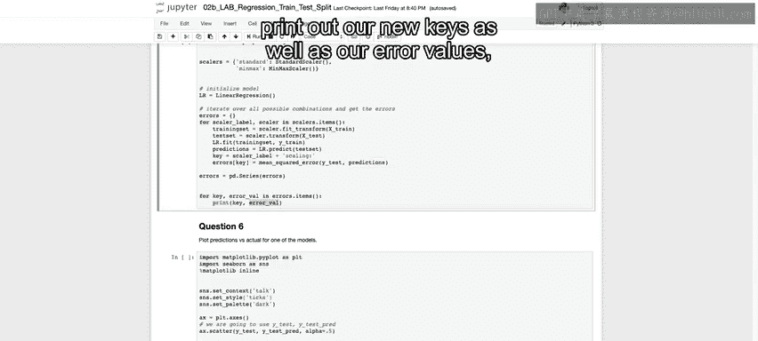

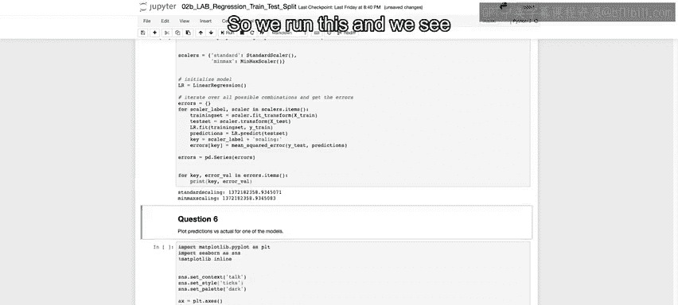

---

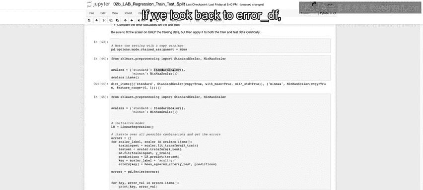

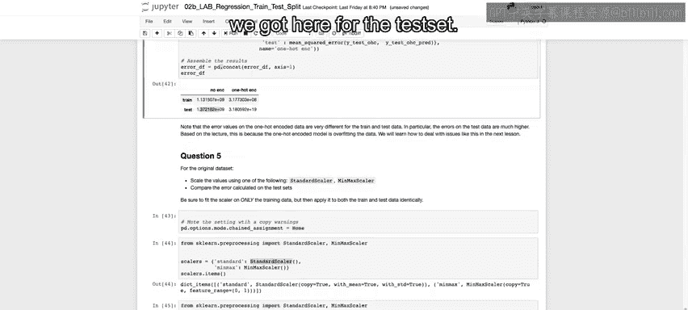

最后，我们来可视化模型的预测效果。我们将绘制测试集真实值（`y_test`）与模型预测值（`y_pred`）的散点图。

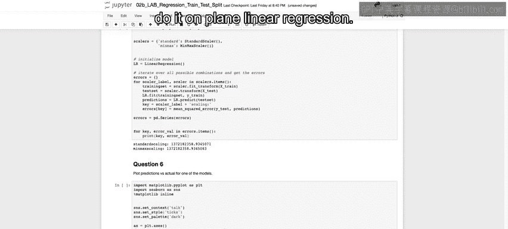

```python
import seaborn as sns
import matplotlib.pyplot as plt

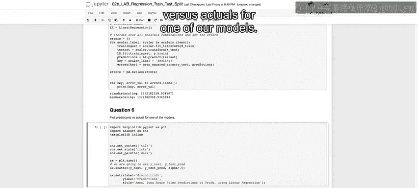

# 设置图形样式
sns.set_context('talk')
sns.set_style('whitegrid')
sns.set_palette('dark')

# 创建散点图
fig, ax = plt.subplots(figsize=(10, 6))
ax.scatter(y_test, y_pred, alpha=0.5)  # alpha设置透明度
ax.set_xlabel('Actual Values')
ax.set_ylabel('Predicted Values')
ax.set_title('Actual vs. Predicted Values (Test Set)')

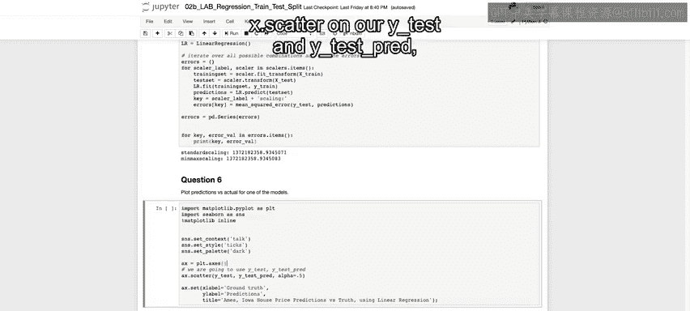

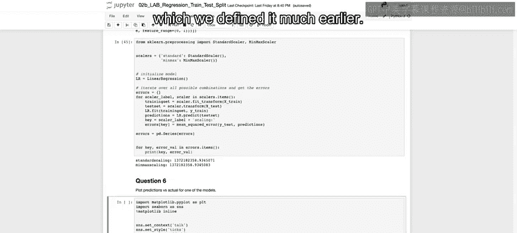

# 添加理想预测线（y=x）
lims = [min(ax.get_xlim()+ax.get_ylim()), max(ax.get_xlim()+ax.get_ylim())]
ax.plot(lims, lims, 'k--', alpha=0.75, zorder=0)
ax.set_aspect('equal')
ax.set_xlim(lims)
ax.set_ylim(lims)

plt.show()
```

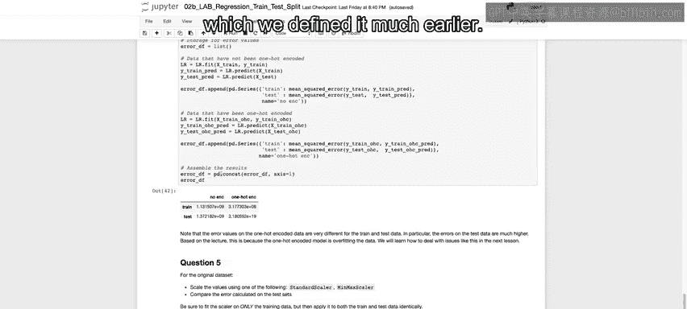

在生成的图中，如果所有点都落在对角线上，则意味着预测完全准确。我们的结果显示，大多数点都紧密分布在对角线附近，说明模型预测效果良好。少数偏离较远的点（例如左上角和右侧的一些点）则代表了预测误差较大的情况。

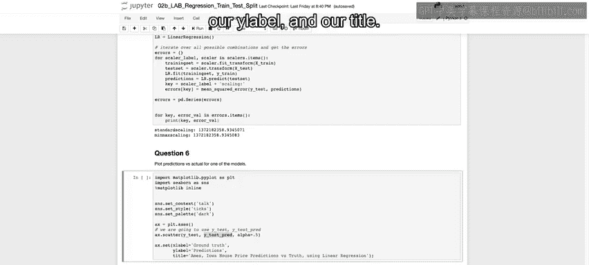

---

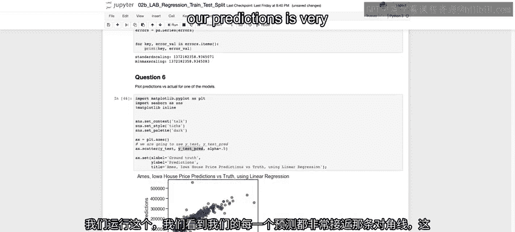

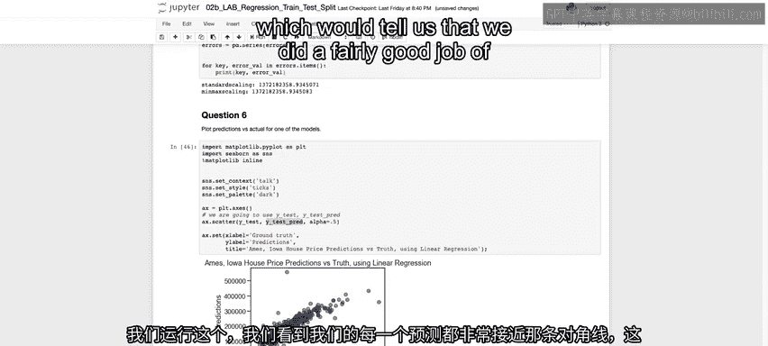

本节课中我们一起学习了：
1.  如何正确地对训练集和测试集进行数据缩放（使用 `fit_transform` 和 `transform`）。
2.  对于普通线性回归模型，特征缩放不会改变其在测试集上的预测误差。
3.  通过绘制实际值与预测值的散点图，可以直观评估模型的预测性能。

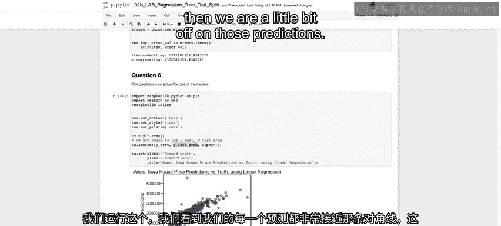

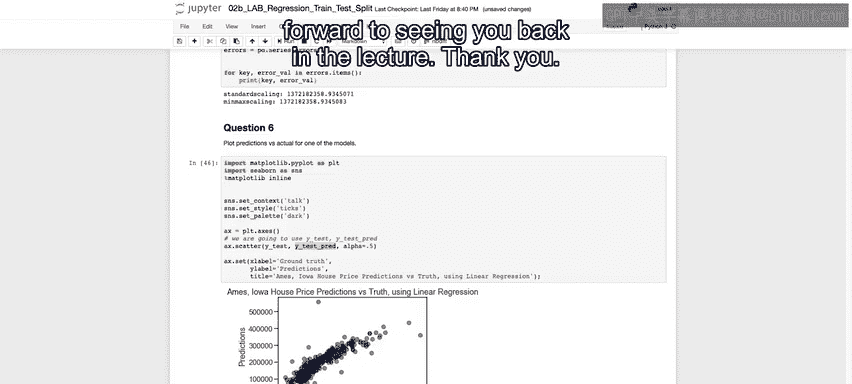


本实验到此结束，期待在下一讲中与您再见。