# 074：偏差-方差权衡（第二部分）📊

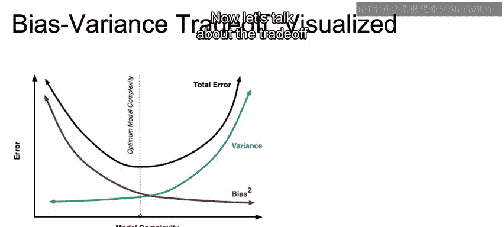

在本节课中，我们将深入探讨机器学习中一个核心概念——偏差与方差的权衡。我们将理解模型复杂性与预测误差之间的关系，并学习如何通过平衡偏差和方差来找到“恰到好处”的模型。

上一节我们介绍了模型复杂性与误差的关系，本节中我们来看看偏差与方差这两个具体概念如何影响模型表现。

## 偏差-方差权衡概述

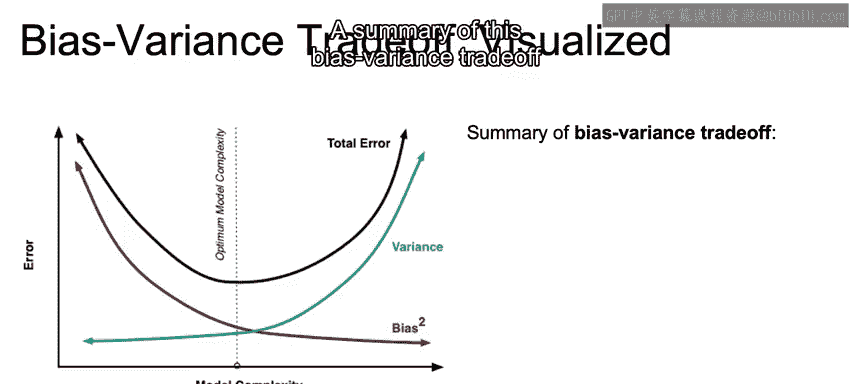

偏差-方差权衡的核心思想是：**降低偏差的模型调整通常会增加方差，反之亦然**。

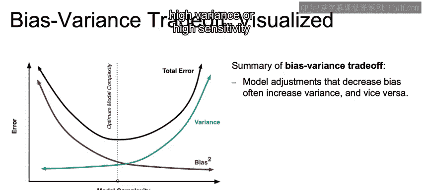

我们可以偏向于一个非常简单的模型（高偏差），或者由于模型过于复杂而导致高方差或高敏感性。

因此，偏差-方差权衡再次与模型复杂性的权衡类似。

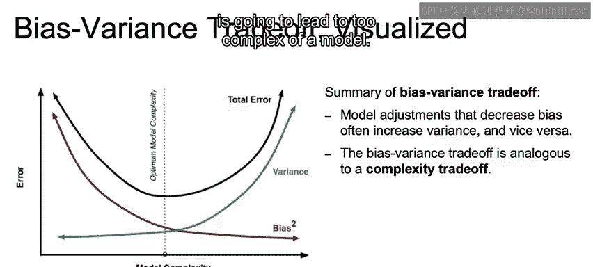

## 模型复杂性的影响

如下图所示，我们可以假设高偏差会导致模型过于简单，而高方差会导致模型过于复杂。

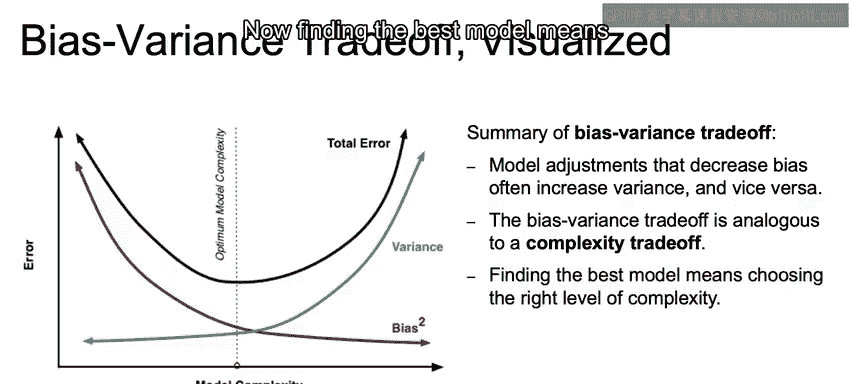

现在，找到最佳模型意味着选择正确的复杂度水平。正如我们在交叉验证中讨论的那样，我们需要查看一个保留集来判断：我们是欠拟合、过拟合，还是拟合得刚刚好？

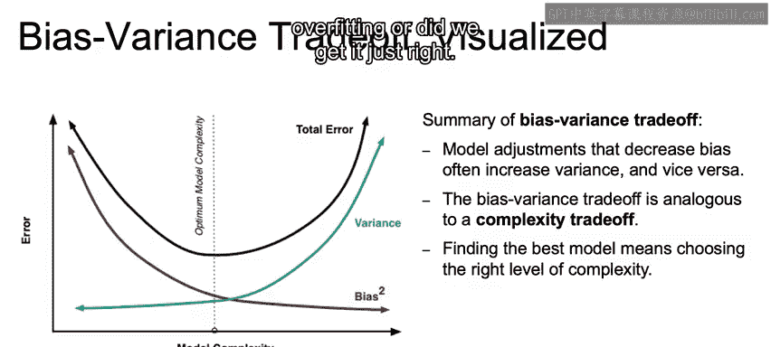

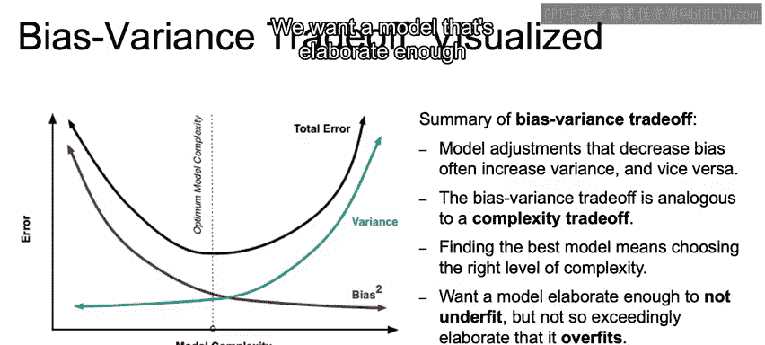

## 理想模型的特征

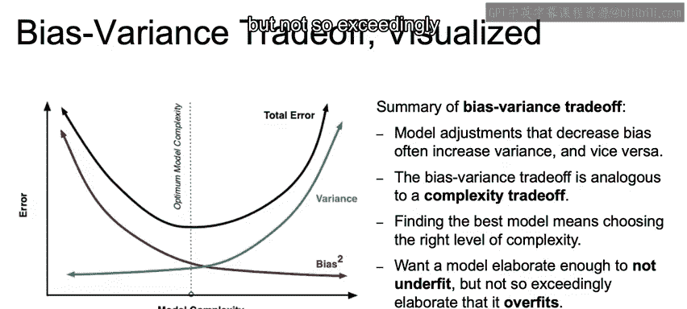

我们想要一个足够精细的模型，以便不忽略底层的数据关系。

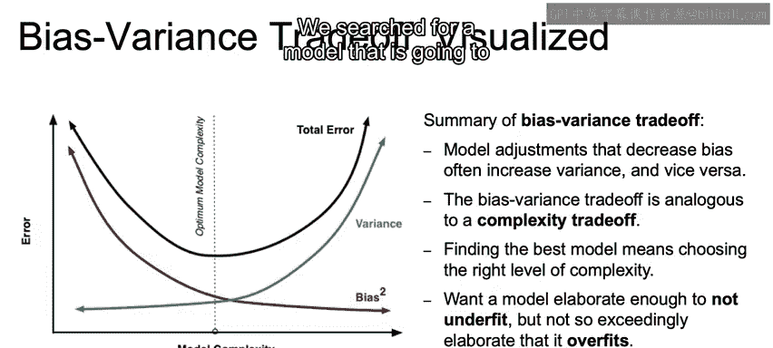

但又不至于过于精细，以至于最终导致过拟合。

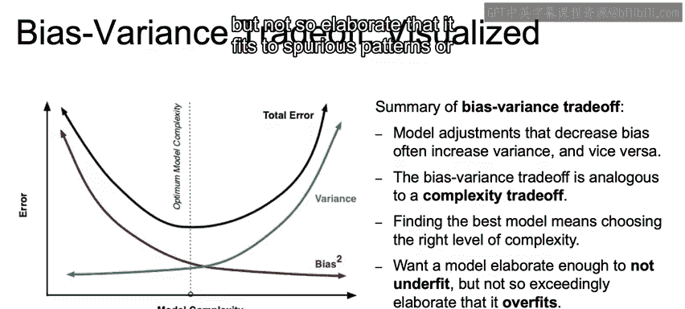

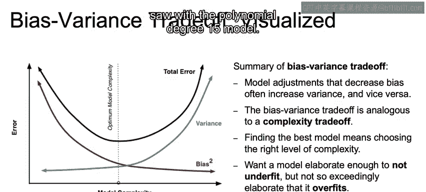

因此，我们寻找一个能够描述特征与目标之间关系的模型。

但又不至于精细到去拟合虚假的、不应被测量的模式，正如我们在15次多项式模型中看到的那样。

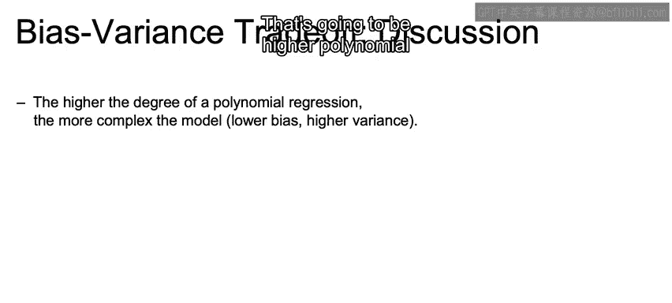

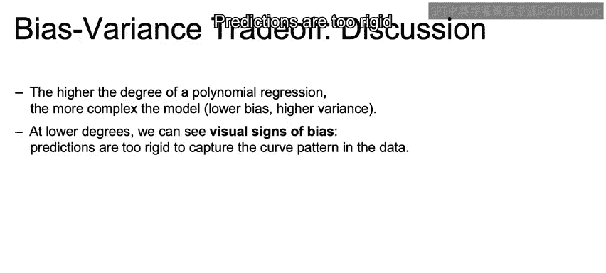

## 回到多项式回归的例子

现在，让我们回到多项式回归的例子。多项式回归的**次数越高，模型就越复杂**。这意味着：
*   **更高次数的多项式 = 更低的偏差，更高的方差。**

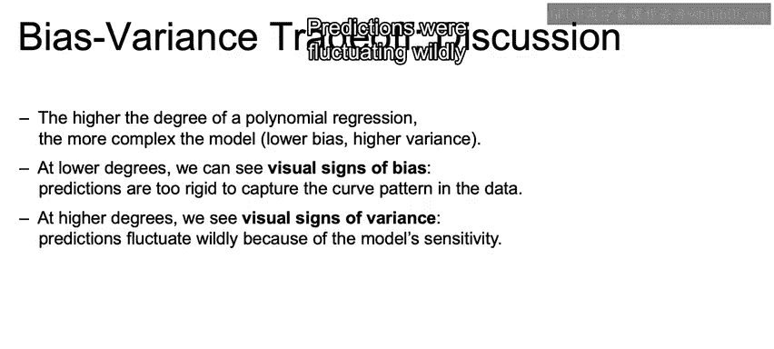

以下是不同复杂度下的表现：

在较低次数时，我们注意到存在明显的偏差迹象。预测过于僵化，无法捕捉数据中的曲线模式。

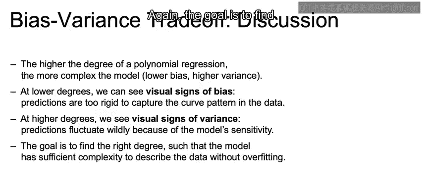

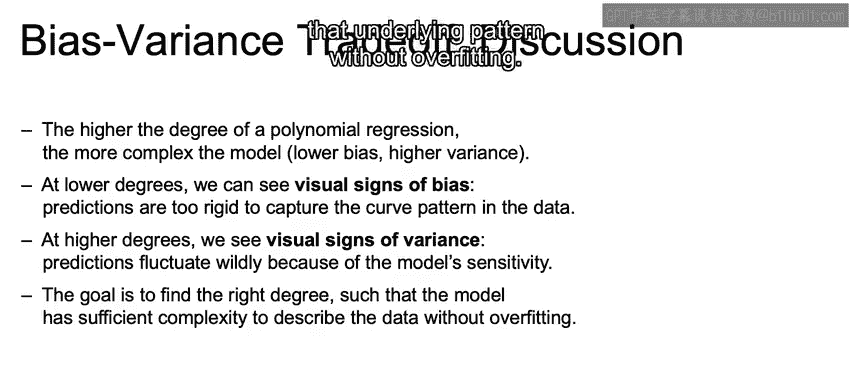

在较高次数时，我们能够看到方差的迹象。由于模型的高敏感性，预测波动非常剧烈。

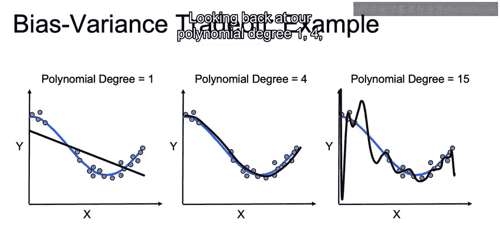

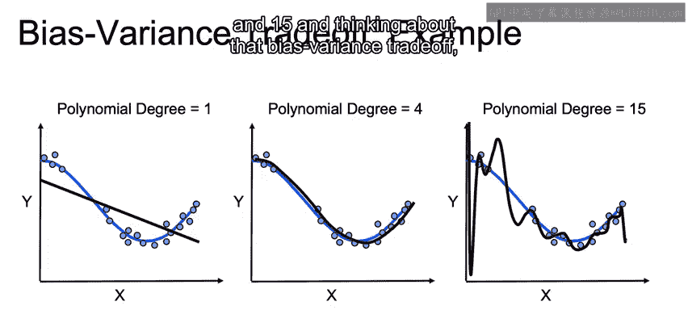

再次强调，目标是找到合适的次数，使得模型具有足够的复杂度来描述底层模式，但又不会过拟合。

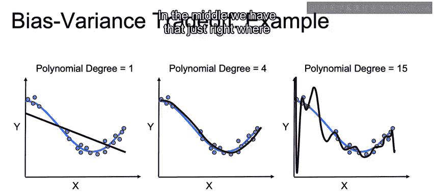

## 权衡的直观展示

回顾我们的一次、四次和十五次多项式模型，并思考偏差-方差权衡：

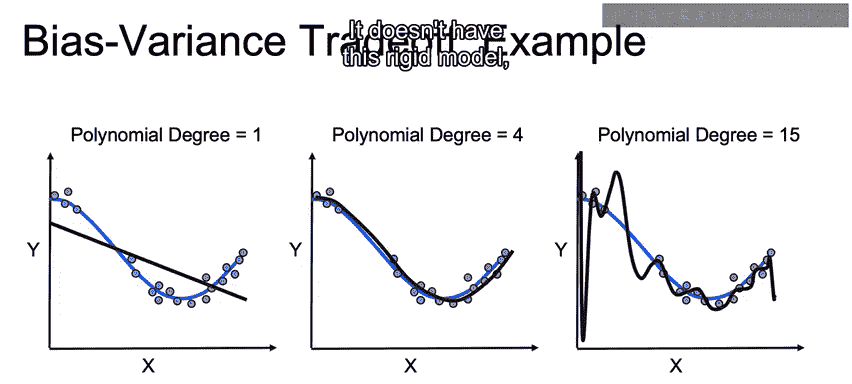

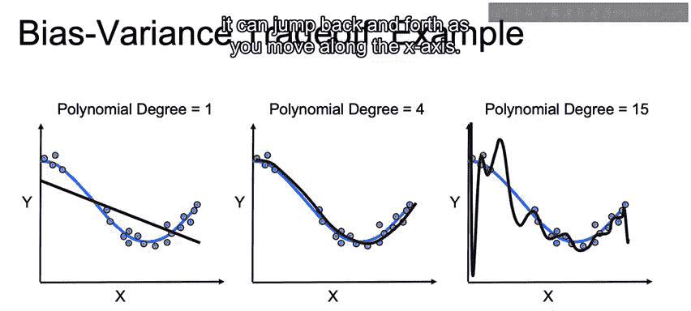

在最左侧，我们具有**高偏差**（偏向于非常简单的模型），但**方差很低**。

在中间，我们达到了“恰到好处”的状态，模型既不过于僵化，也不会过度拟合虚假的相关性。

在最右侧，我们具有**非常低的偏差**。它精确地拟合了模型，没有僵化的结构。

但它具有**非常高的方差**，以至于会过拟合。当你沿着X轴移动时，预测值会来回跳跃。

## 本节总结 📝

本节课中我们一起学习了偏差-方差权衡的核心内容。

我们首先回顾了复杂性与误差的关系，以此深入探讨偏差和方差。然后讨论了模型的偏差和方差：**偏差**代表模型僵化，无法正确建模X和Y的关系；而**方差**代表模型对输入变量的微小变化具有高敏感性。

我们探讨了模型误差的不同来源：一个简单的模型可能过于僵化，没有足够的复杂度来描述底层模式（高偏差）；而拟合得“太好”、拟合了数据随机噪声的模型则代表了另一个极端（高方差）。同时，我们也强调，对于所有模型，由于随机噪声的存在，我们都必须接受一定程度的误差。

最后，我们讨论了偏差-方差权衡，以及它如何与复杂性和误差之间的关系联系起来。

在下一节中，我们将开始提供一些技术，以确保如果我们有一个过于复杂的模型，如何使用一种称为**正则化**的方法来降低其复杂性。期待在那里与你相见！

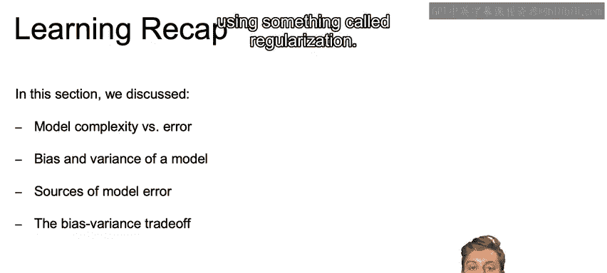

