# 079：弹性网络 🕸️

在本节课中，我们将要学习一种结合了岭回归和Lasso回归优势的模型——弹性网络。我们将探讨如何在不同模型间进行选择，并详细介绍弹性网络的原理、公式及其应用场景。

---

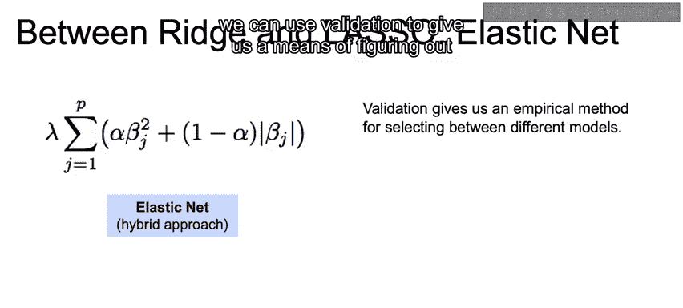

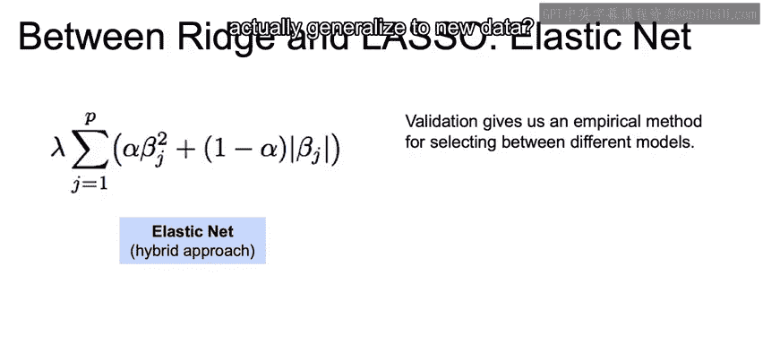

## 概述

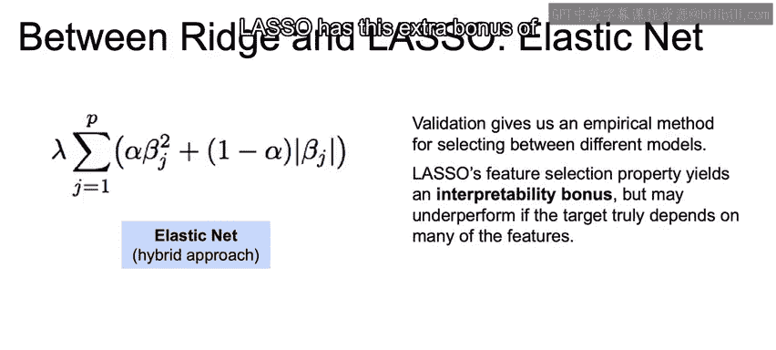

上一节我们介绍了岭回归和Lasso回归，它们都是通过添加正则化项来防止过拟合的线性模型。本节中，我们来看看如何在这两种模型之间进行选择，并引入一个结合两者优点的混合模型——弹性网络。

## 如何选择模型？

面对岭回归和Lasso回归，我们如何决定使用哪一个？这主要取决于我们的目标。

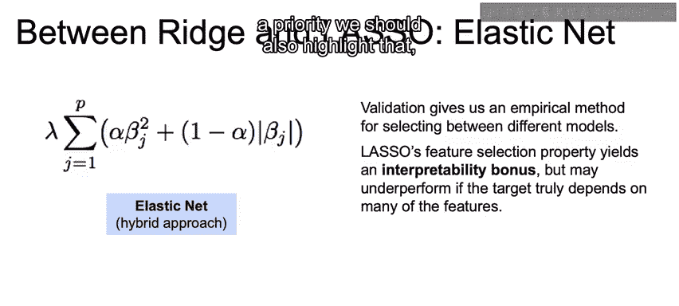

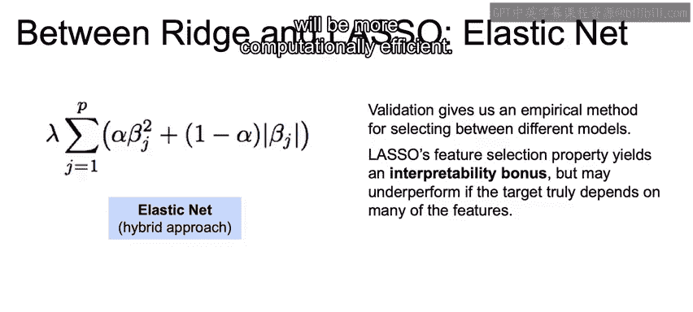

如果目标是**预测准确性**，我们可以使用验证集或交叉验证的方法。通过评估模型在预留数据上的表现，我们可以找出在未知数据上泛化能力最佳的模型及其最优超参数。

如果目标是**模型可解释性**，Lasso回归具有一个额外优势：它能够通过将某些特征的系数压缩至零来**消除不重要的特征**，从而实现特征选择。

当然，我们也必须谨慎。如果模型确实依赖于许多特征，过度使用Lasso进行特征剔除可能会损害模型性能。

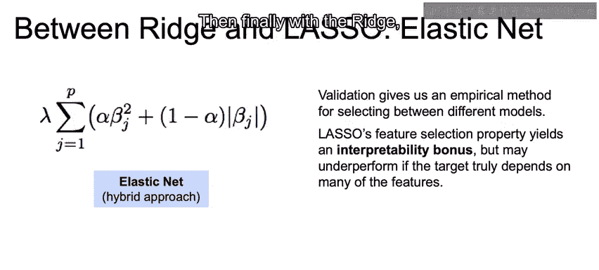

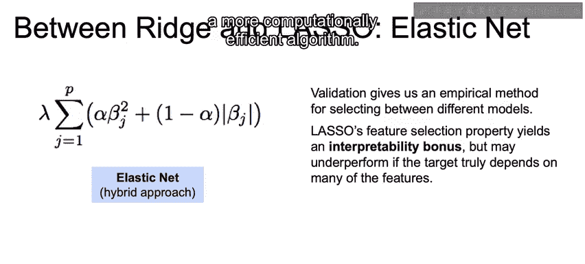

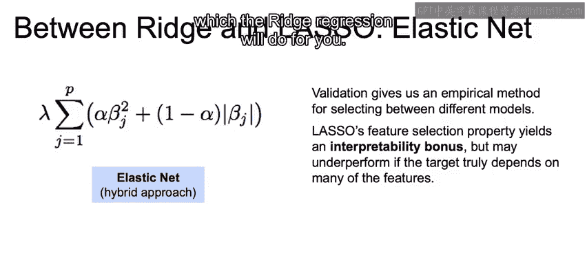

此外，如果**计算效率**是优先考虑的事项，需要指出的是，岭回归通常计算效率更高。

以下是选择模型时需要权衡的几个关键点：

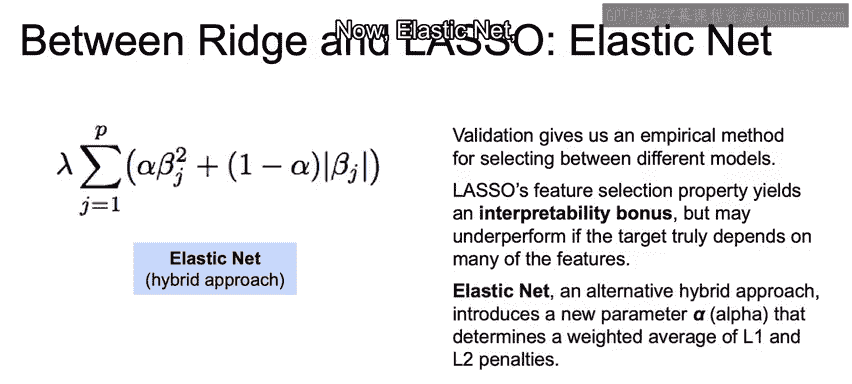

*   **在验证集上的表现**：哪个模型在预留数据上预测更准确？
*   **可解释性**：Lasso能否通过剔除系数提供更高的可解释性？
*   **计算效率**：岭回归通常能提供更高效的计算。
*   **特定权重的惩罚**：你可能希望对某些权重施加更高的惩罚，而岭回归可以做到这一点。

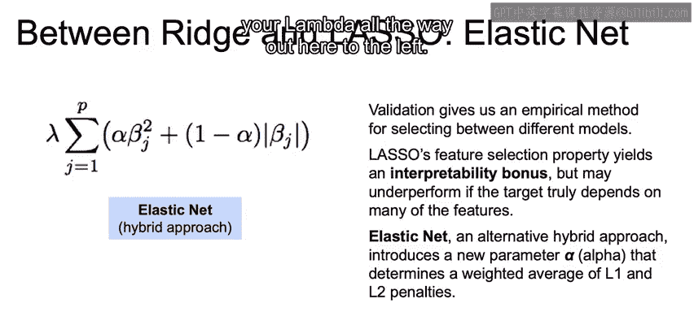

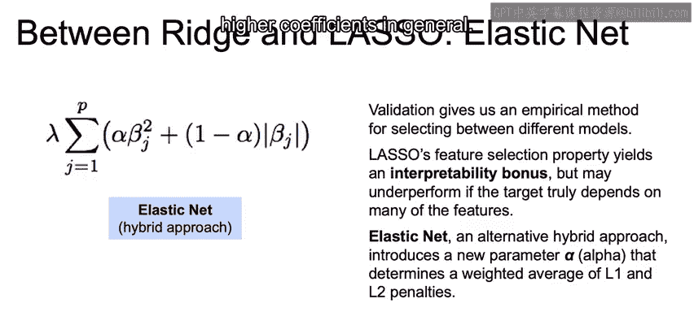

## 弹性网络：两全其美的方案

现在，我们进入弹性网络。弹性网络的核心思想是提出一种介于岭回归和Lasso回归之间的混合方法。

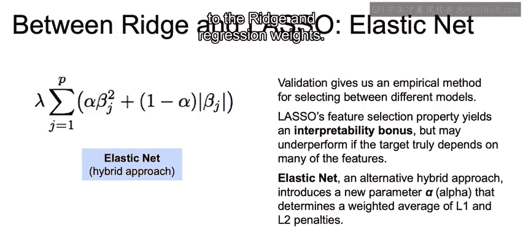

其**公式**如下：

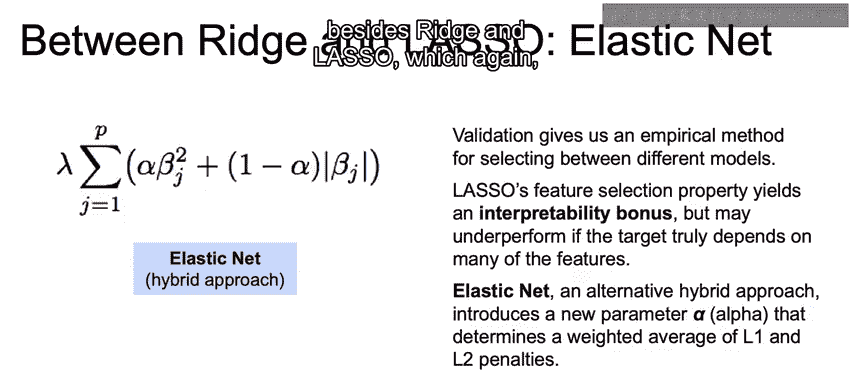

`损失函数 = 均方误差 + λ * [ α * L1正则项 + (1-α) * L2正则项 ]`

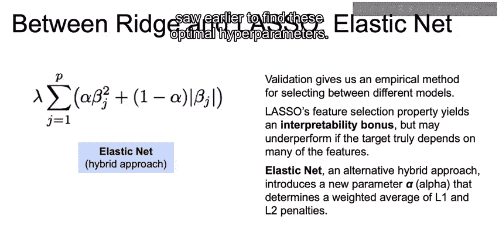

或者更具体地写为：

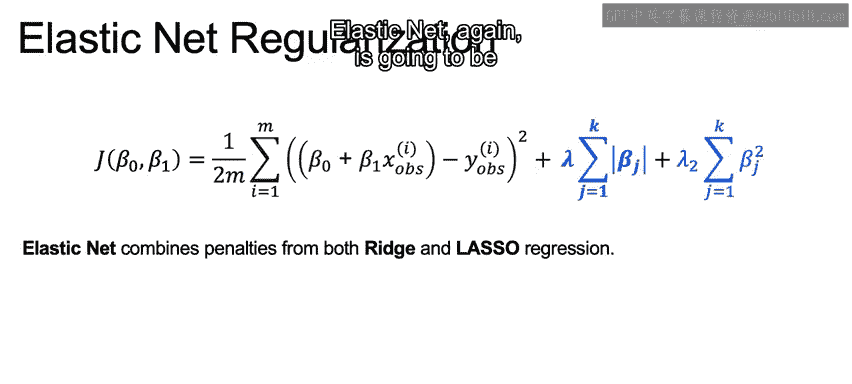

`Minimize: Σ(y_i - ŷ_i)² + λ1 * Σ|w_j| + λ2 * Σ(w_j)²`

在这个公式中：
*   **λ（或 λ1, λ2）** 是总体正则化强度参数，它决定了你对较大系数进行惩罚的力度。
*   **α** 是一个介于0和1之间的混合参数。它代表了L1正则项（对应Lasso）和L2正则项（对应岭回归）之间的权重分配比例。
    *   当 α = 1 时，模型退化为Lasso回归。
    *   当 α = 0 时，模型退化为岭回归。

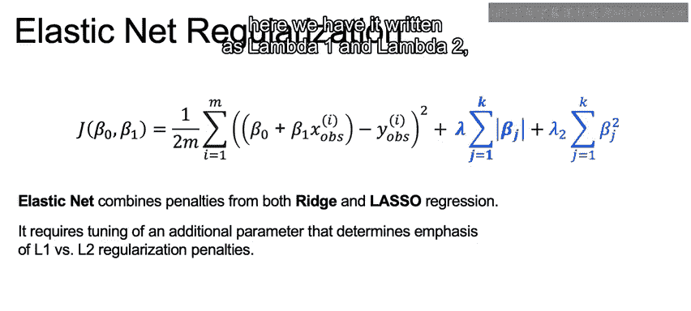

因此，除了单纯的岭回归和Lasso，我们引入了第三个混合选项——弹性网络。与之前一样，我们应该使用交叉验证方法来优化寻找这些最优的超参数（λ 和 α）。

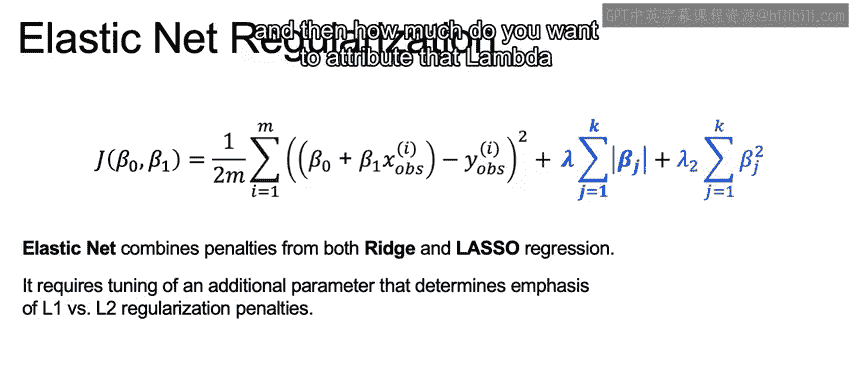

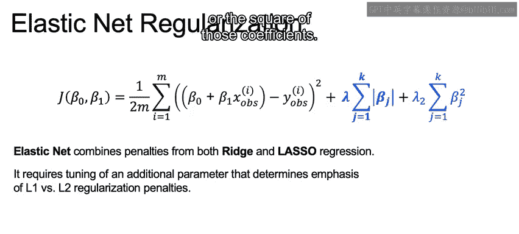

弹性网络的目标是**兼得两者之长**：我们能否同时获得Lasso的特征选择能力和岭回归的稳定性？

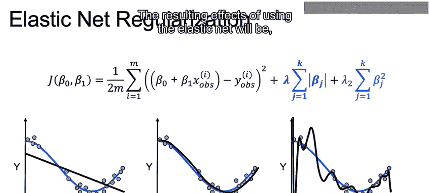

这种混合比例由λ和α共同决定。λ控制整体惩罚力度，而α决定这个惩罚力度有多少分配给系数的绝对值（L1），有多少分配给系数的平方（L2）。

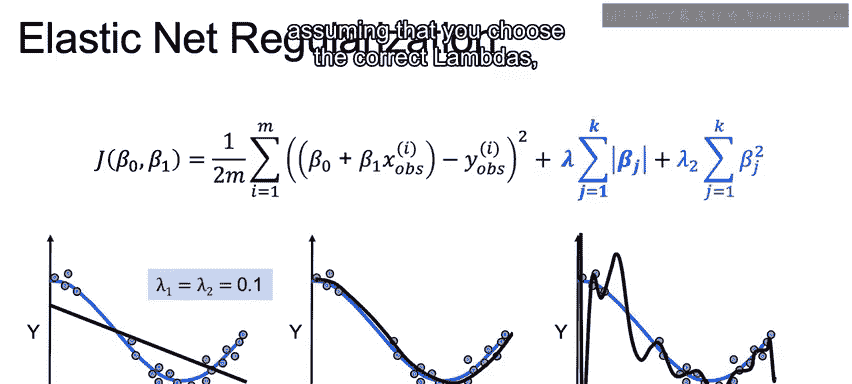

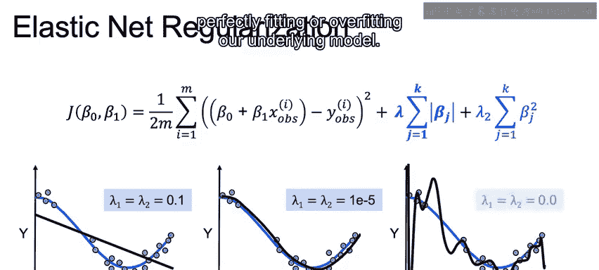

使用弹性网络的效果，假设你选择了正确的λ和α，将与岭回归和Lasso类似，其结果同样会呈现**欠拟合、完美拟合或过拟合**我们底层模型的情况。

这里我们看到的两项λ值（λ1和λ2）在示意图中是相等的，但实际上它们可以不同，这取决于你希望赋予哪类惩罚更多的权重。
*   如果你希望更多地惩罚系数的**平方**（即偏向岭回归），那么模型会更倾向于缩减所有系数，但不会将它们设为零。
*   如果你希望更多地惩罚系数的**绝对值**（即偏向Lasso），那么模型将更有可能将一些不重要的系数完全消除（设为零）。

---

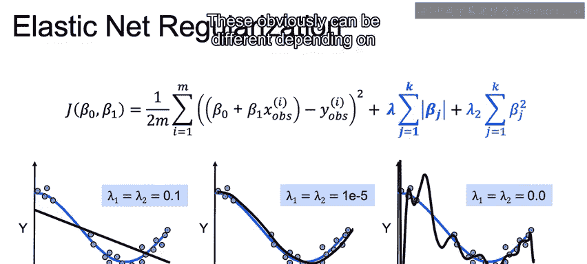

## 总结

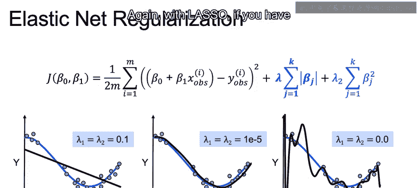

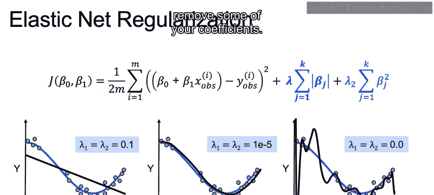

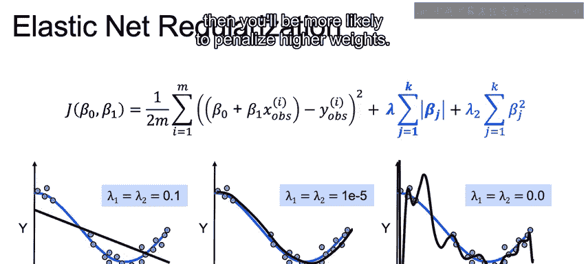

本节课中，我们一起学习了弹性网络模型。我们首先回顾了在岭回归和Lasso回归之间做选择时需要考虑的因素，包括预测准确性、可解释性和计算效率。接着，我们引入了弹性网络，它通过一个混合参数α，将L1和L2正则化结合起来，旨在同时利用Lasso的特征选择能力和岭回归处理共线性数据的稳定性。弹性网络的性能依赖于超参数λ和α的调优，通常通过交叉验证来完成。