# 090：1_什么是分类简介 📊

在本节课中，我们将要学习分类问题的基本概念，并开始探讨如何利用机器学习来解决这类问题。

上一节我们介绍了机器学习的基本框架，本节中我们来看看监督学习中的一个重要分支——分类。

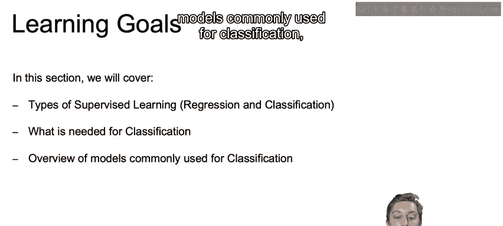

## 监督学习的两种类型

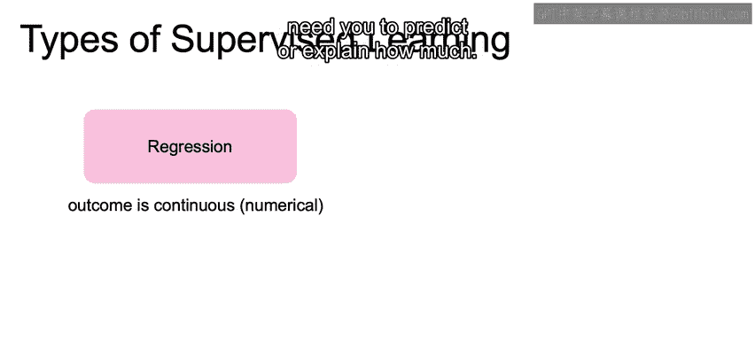

监督学习通常根据我们想要建模的数据类型分为两种。

在回归问题中，输出是一个连续的数字。回归用于需要预测或解释“多少”的商业问题。

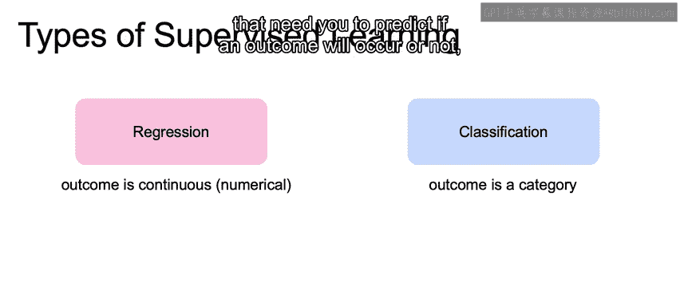

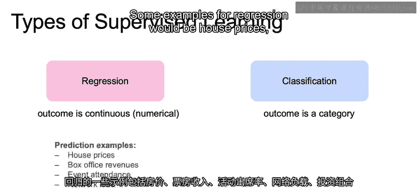

如果我们试图预测的是类别，即我们想要预测的是具体的类，那么这就是一个分类问题。分类用于需要预测某个结果是否会发生，或解释为什么某个结果会发生的商业问题。

## 回归与分类的示例

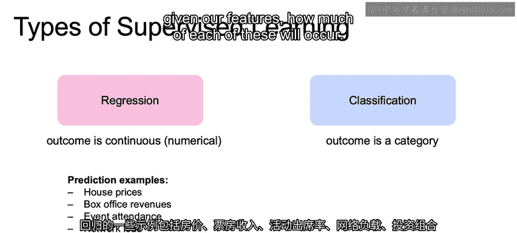

以下是回归问题的一些例子：
*   房价
*   票房收入
*   活动出席人数
*   网络负载
*   投资组合损失

我们可以回想之前课程中关于使用线性回归预测房价或票房的例子，我们试图根据特征来预测这些数值的大小。

另一方面，分类问题的例子包括：
*   检测欺诈交易（欺诈/非欺诈）
*   客户流失预测（流失/不流失）
*   预测活动出席人数或网络负载是否超过某个阈值（是/否）
*   贷款违约预测（违约/不违约）

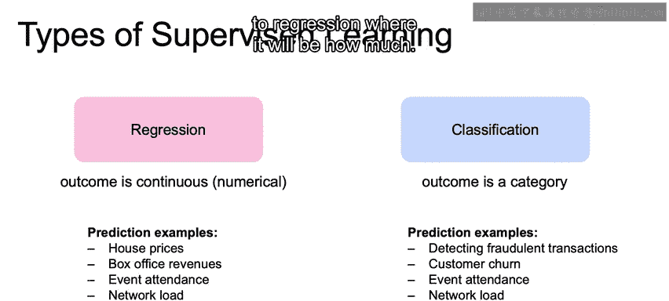

需要指出的是，这里的分类示例是“是/否”或二元的。分类也可以有三个或更多个可能的结果，只要我们在预测一个具体的类别。这与回归预测“多少”不同。

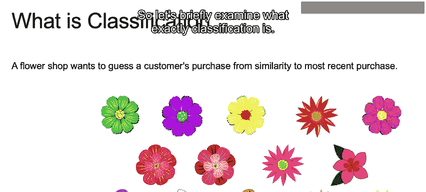

## 分类问题详解

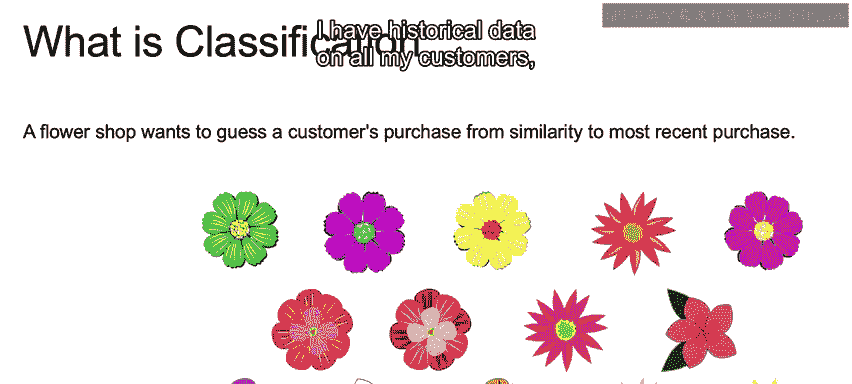

让我们简要分析一下分类究竟是什么。

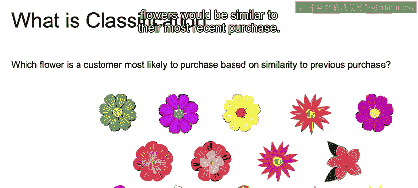

假设我们经营一家花店，销售多种类型的花卉。我们拥有所有客户的历史数据，特别是他们之前购买过哪些花。

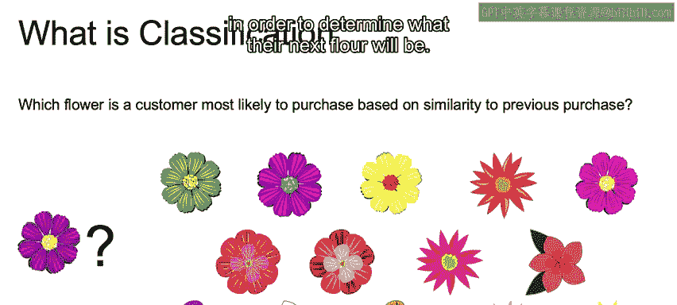

我们假设客户的下一次购买会与他们最近一次购买相似，如下图所示。

我们将利用与最近这次购买的相似性，来确定他们下一次会购买什么花。

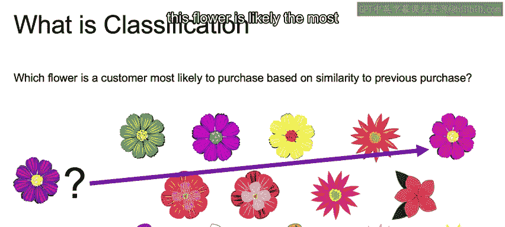

我们店里还有其他可用的花，比如右边这朵。这朵花颜色相似，但花瓣可能不同。

还有这朵花，花瓣形状相似，但花瓣上的颜色图案不完全相同。

最后，我们会说这朵花很可能最相似，因为它颜色和花瓣都接近。

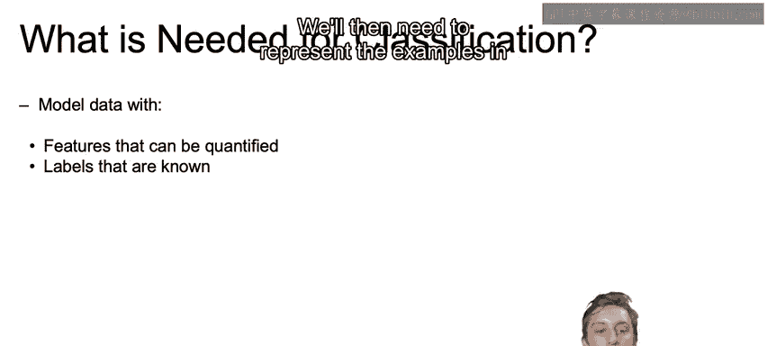

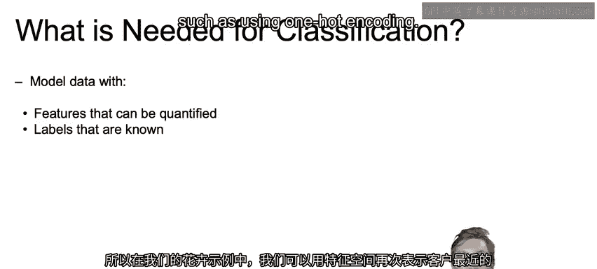

## 进行分类所需的条件

为了对标签未知的新样本进行分类，我们需要利用已知样本来学习。

我们需要在特征空间中表示样本，并且这种表示是可以量化的。在我们的花卉例子中，我们可以用花瓣类型、花瓣颜色等特征来表示客户最近一次的花卉购买。回想一下，我们如何通过独热编码等方法，将这些标签和颜色最终量化。

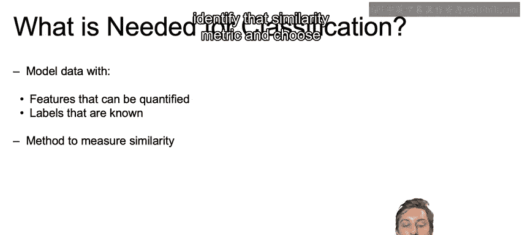

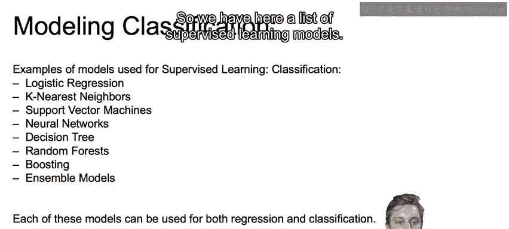

我们需要知道每个已知样本对应的实际标签。在花卉例子中，这就是每位老客户根据花瓣类型、颜色等特征实际购买了哪种花的数据。

我们需要一种方法来衡量历史购买记录与我们试图预测的新购买之间的相似性。机器学习算法将帮助我们识别这种相似性度量，并选择与历史购买最相似的那一个。

## 常用的分类模型概述

以下是一些监督学习模型。请注意，这些模型本身并非专属于回归或分类，它们可以且将会用于两者。这里我们首先重点介绍它们在实践中如何用于分类任务。

*   **逻辑回归**：将我们学过的线性回归扩展到分类问题。
*   **K近邻**：一种非线性的、简单的方法，根据与待预测标签在特征空间中最相似的过去样本来进行分类。
*   **支持向量机**：一种强大的线性分类器，将利用所谓的“核技巧”来允许复杂的决策边界。
*   **神经网络**：当我们学习深度学习课程时会详细评估，该模型结合了非线性和线性的中间步骤，以得出复杂的决策边界。
*   **决策树**：使用非线性的中间决策边界，以得出更复杂的最终决策边界。
*   **随机森林、提升法和集成方法**：建立在决策树和其他分类器之上，展示了我们如何利用多个分类器来帮助减少最终模型的方差和偏差。

## 总结

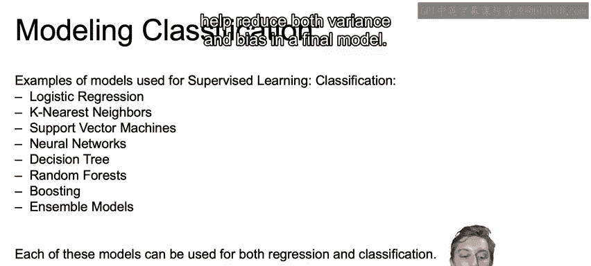

本节课中我们一起学习了监督学习的两种类型：预测“多少”的回归和预测“哪个类别”的分类。

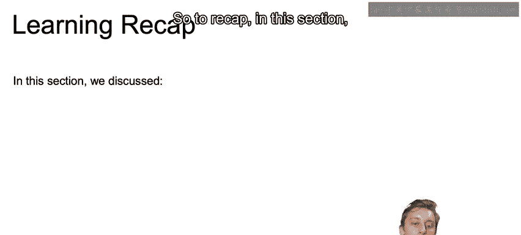

我们讨论了进行分类所需的条件，即量化过去数据以及衡量我们的特征与未标记数据特征之间相似性的方法。

最后，我们简要概述了分类中常用的模型。

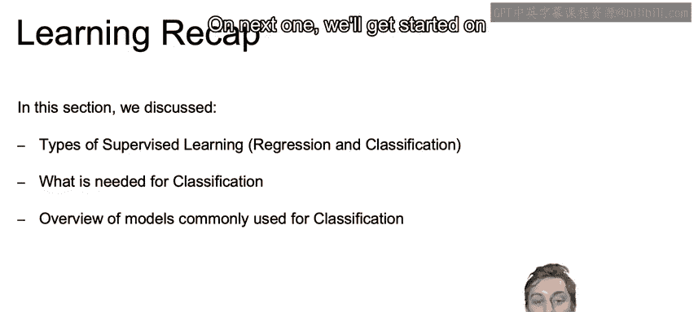

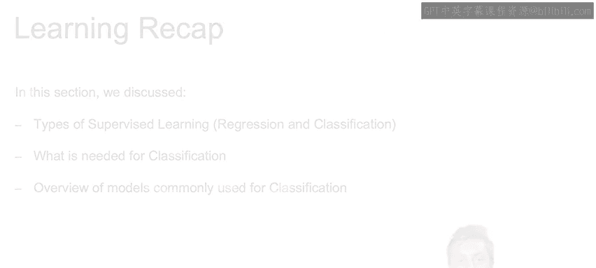

至此，本视频内容结束。下一节我们将开始学习第一个分类模型——逻辑回归。