# 091：逻辑回归简介 📊


在本节课中，我们将要学习第一个分类算法——逻辑回归。我们将介绍逻辑回归作为分类算法的基本概念，讨论线性回归在分类问题中的应用及其局限性，并探索逻辑回归如何改进这些不足。最后，我们将通过一个具体示例展示如何使用逻辑回归进行实际分类。

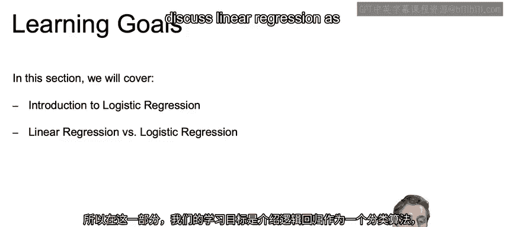

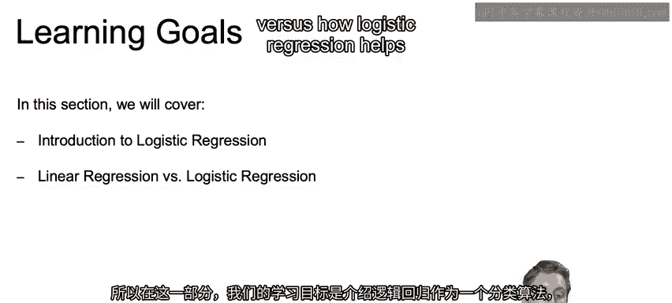

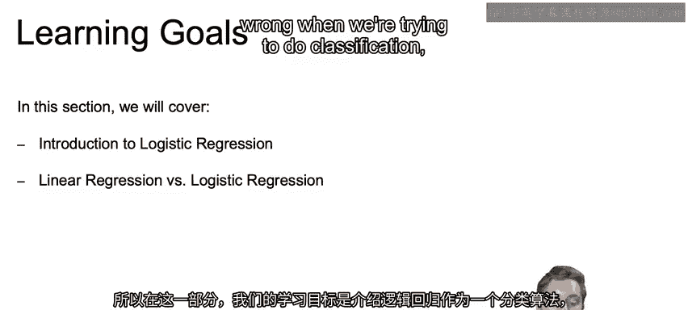

## 从线性回归到分类问题 🔄

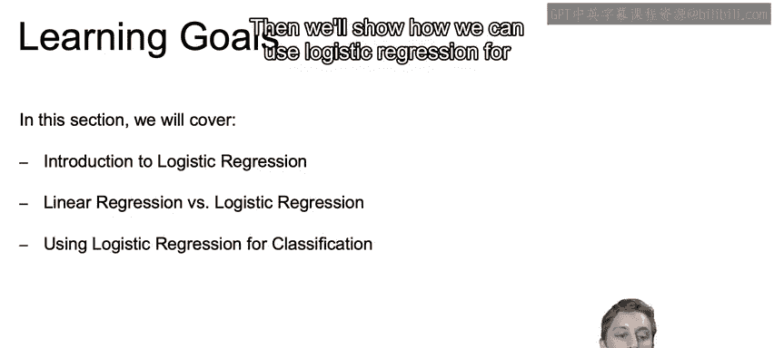

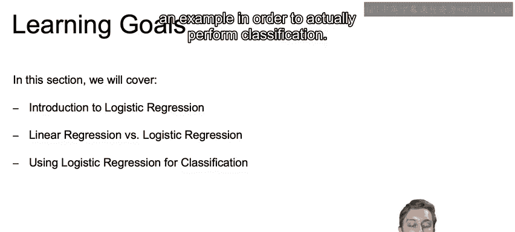

上一节我们介绍了分类算法的概念，本节中我们来看看如何将回归思想应用于分类。


我们可以将二元分类问题视为一个回归问题来处理，具体步骤如下：

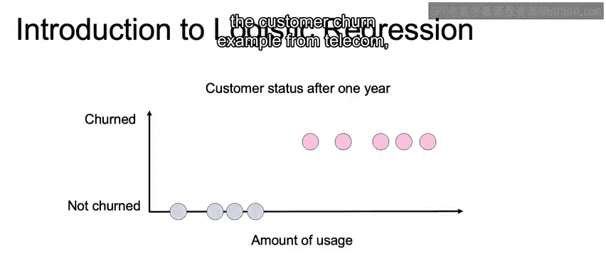


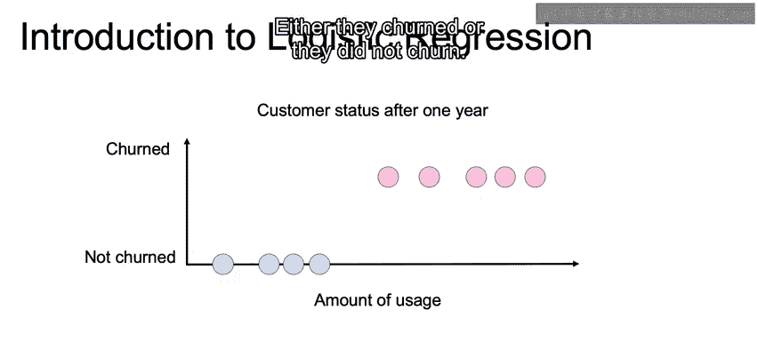

以下是处理步骤：
1.  首先，将类别编码为1和0。例如，将“流失”编码为1，将“未流失”编码为0。
2.  然后，拟合一条最佳直线（即使用回归算法）。
3.  当一个新的未标记记录出现时，我们将其特征值代入训练好的回归方程。
4.  如果计算出的值大于0.5，则预测为类别1（例如“流失”）；如果小于0.5，则预测为类别0（例如“未流失”）。

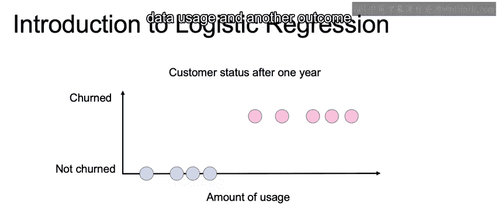

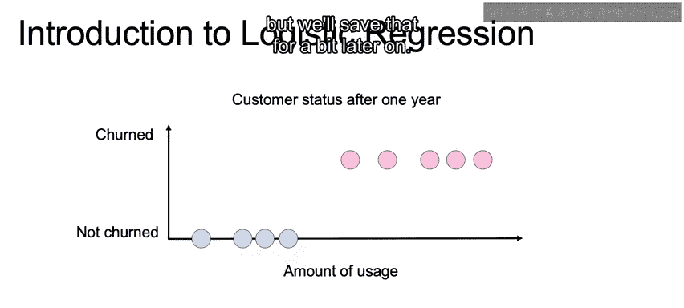

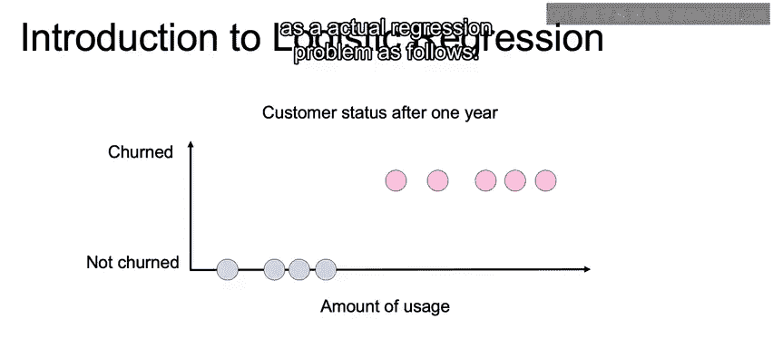

这个过程可以用一个简单的决策规则表示：
```
如果 y_hat > 0.5，则预测为 1
否则，预测为 0
```
其中 `y_hat` 是线性回归模型的预测值。

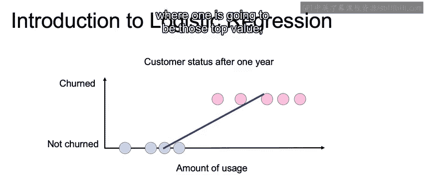

## 线性回归用于分类的局限性 ⚠️

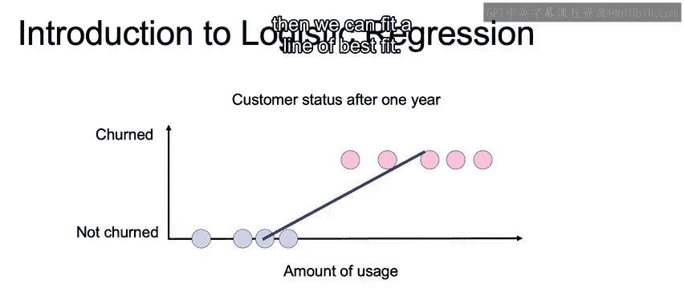

然而，当数据分布不同时，线性回归用于分类会出现问题。

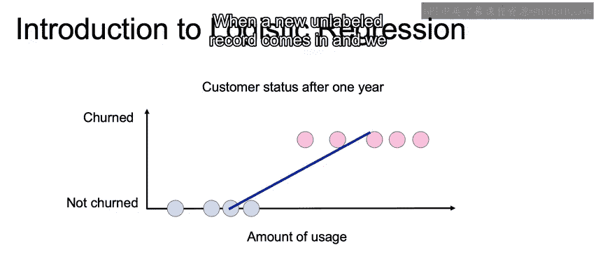

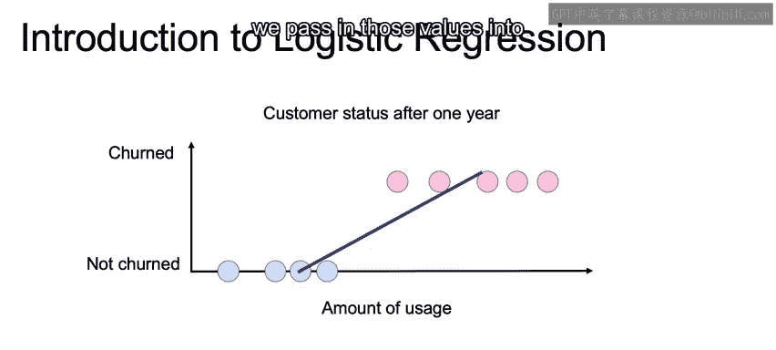

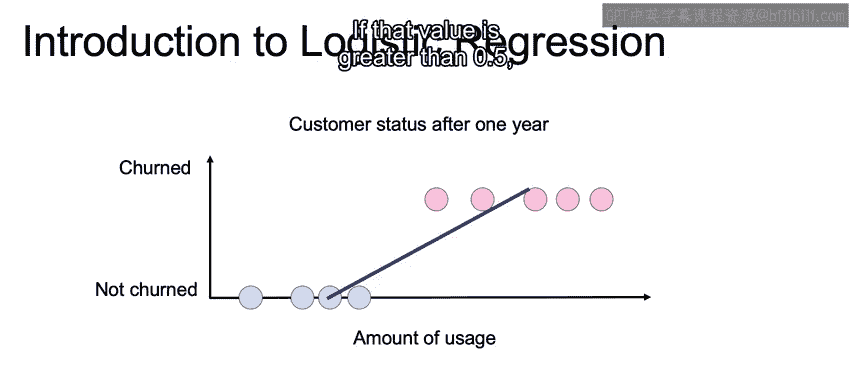

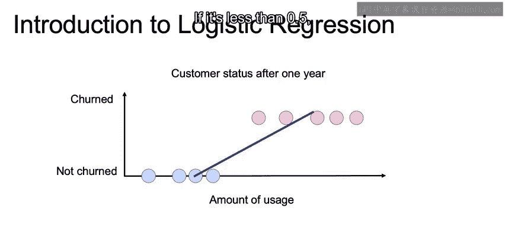

假设我们的数据分布使得拟合的OLS（普通最小二乘）回归线倾斜度很大。此时，0.5的阈值在x轴上的对应点会向右偏移。由于我们的决策规则是固定的（以0.5为界），这会导致一些本应预测为1（流失）的客户，因为其对应的预测值小于0.5而被错误地预测为0（未流失）。

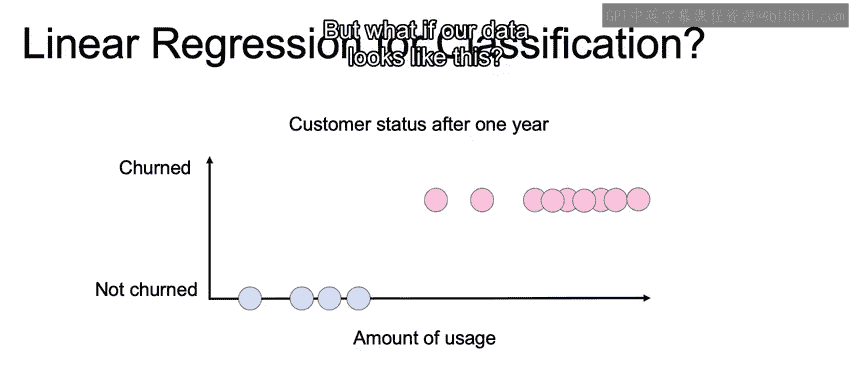

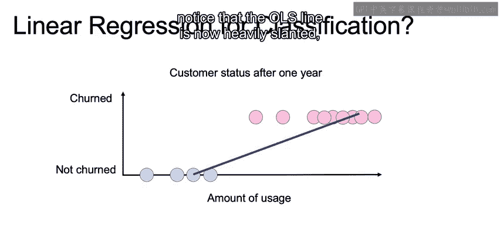

问题的核心在于，线性回归的目标函数（如最小化平方误差）平等地对待所有样本点。对于分类问题，我们更关心在决策边界（如0.5附近）的样本能否被正确分类，而远离边界的样本点即使预测值误差较大，对分类结果的影响也较小。

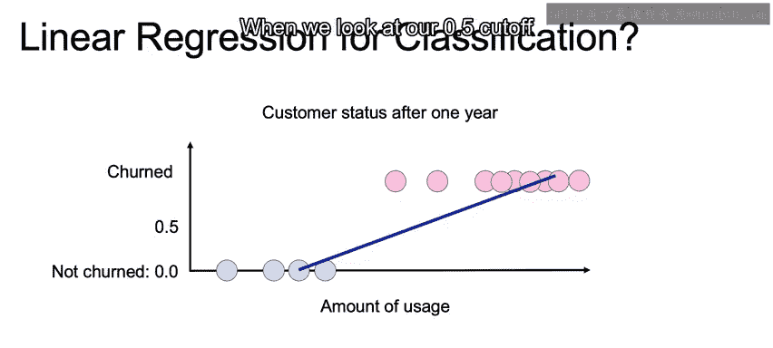

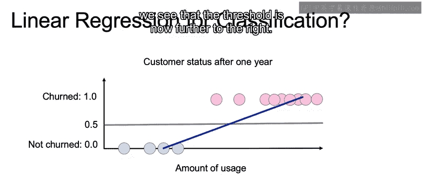

## 逻辑回归的引入 🎯

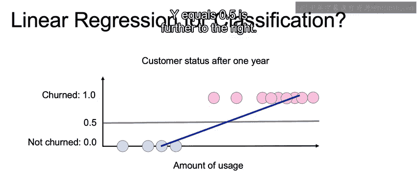

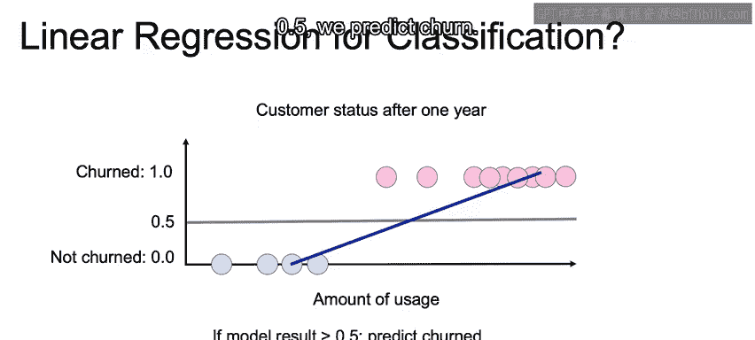

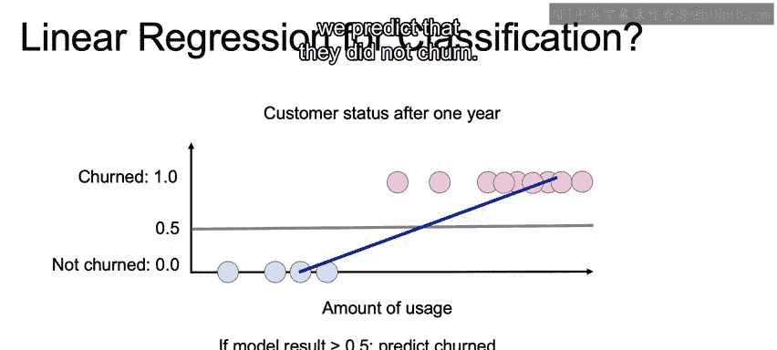

因此，我们需要一种方法，在目标函数中给予远离决策边界的样本较低的权重，而更关注边界附近的样本。这正是著名的**逻辑函数**（Logistic Function）发挥作用的地方。

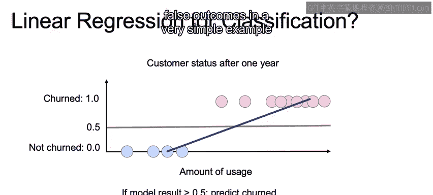

逻辑函数，也称为Sigmoid函数，能将任何实数映射到(0, 1)区间内，其公式如下：
```
P(Y=1|X) = 1 / (1 + e^(-z))
```
其中，`z` 可以是线性组合，例如 `z = β0 + β1*x1 + ... + βn*xn`。

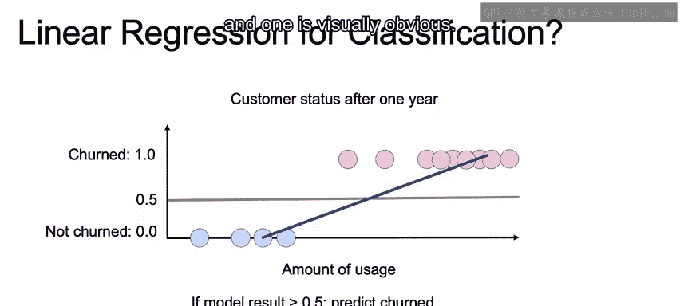

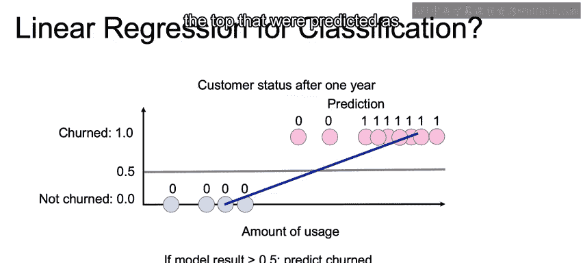

这个函数的输出可以被解释为样本属于类别1的概率。通过使用此函数，逻辑回归模型不再直接预测0或1，而是预测一个介于0和1之间的概率值，从而更自然地处理分类问题，并克服线性回归在分类中的一些缺陷。

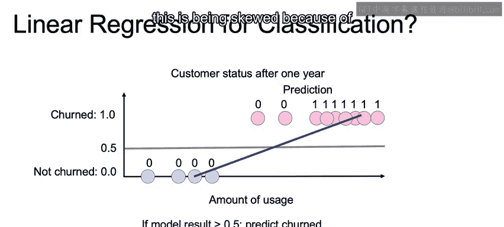

## 课程总结 📝

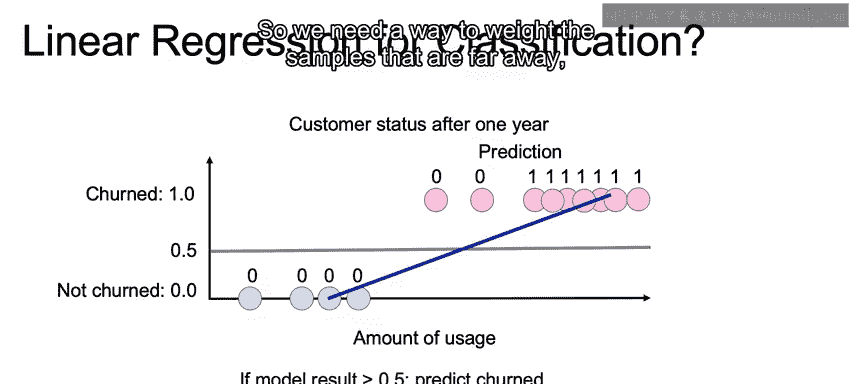

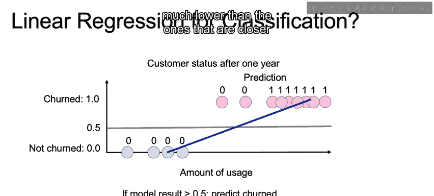

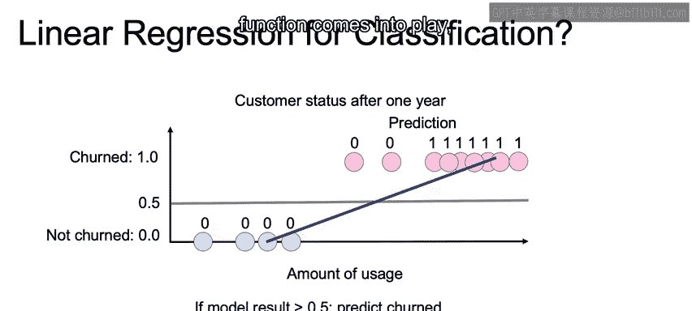


本节课中我们一起学习了逻辑回归的引入。我们首先探讨了如何将线性回归应用于二元分类问题，并指出了其在数据分布不理想时可能导致的错误分类。接着，我们引出了逻辑回归的核心思想，即使用逻辑函数将线性输出转换为概率，从而更合理地进行分类决策。在下一节中，我们将深入探讨逻辑函数的具体形式和逻辑回归模型的训练过程。