# 093：4_多类逻辑回归 📊

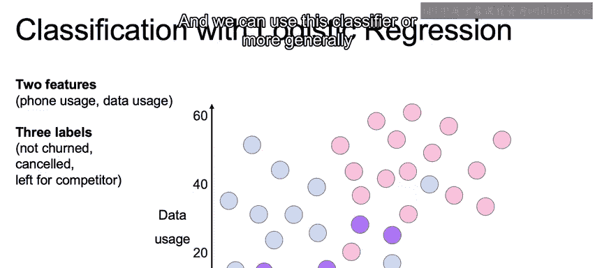

在本节课中，我们将要学习如何将二分类逻辑回归模型扩展到多类分类场景。我们将重点介绍一种称为“一对多”的技术，它允许我们使用多个二分类器来解决多类别预测问题。

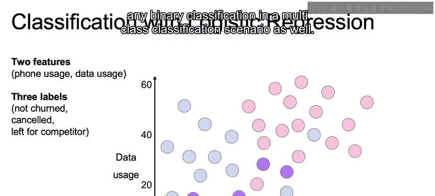

## 多类分类问题概述

上一节我们介绍了二分类逻辑回归。本节中我们来看看当目标变量包含两个以上类别时的情况。

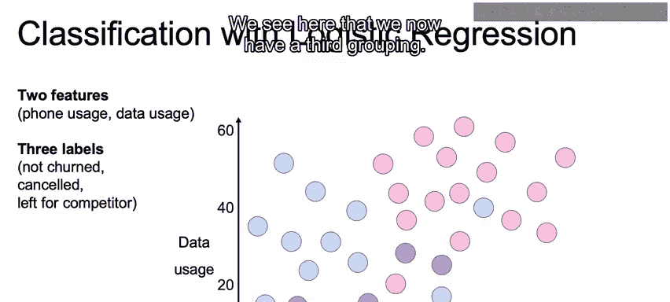

我们面临的问题不再是预测“流失”与“未流失”，而是需要预测三个标签：“未流失”、“已取消”和“转向竞争对手”。

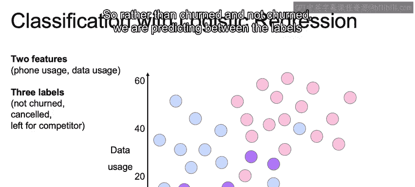

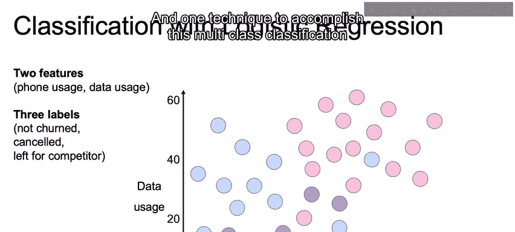

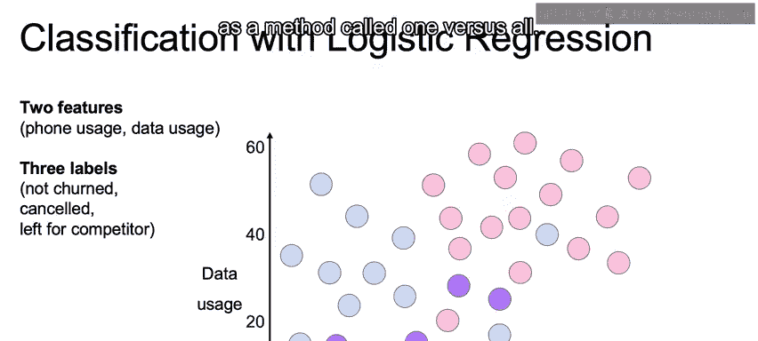

## 一对多方法原理

以下是“一对多”方法的核心思想。

该方法通过将多类问题分解为多个二分类问题来实现。

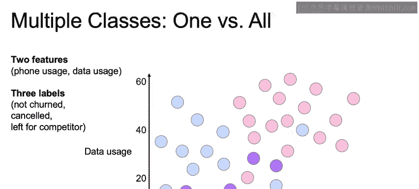

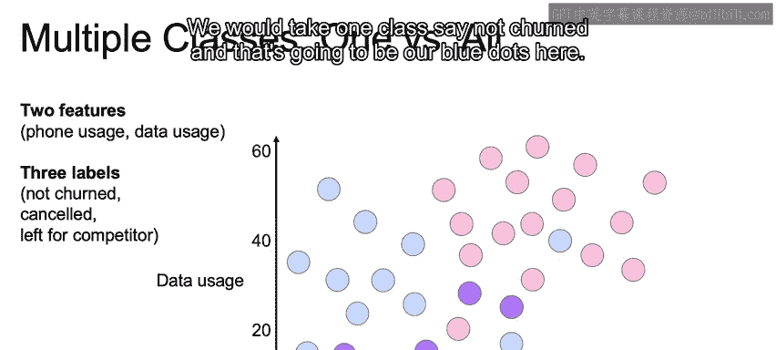

## 第一步：构建第一个二分类器

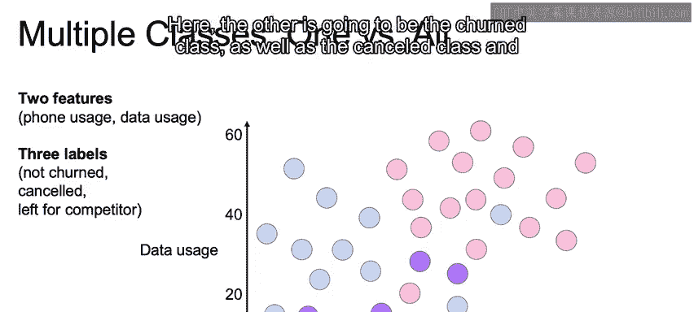

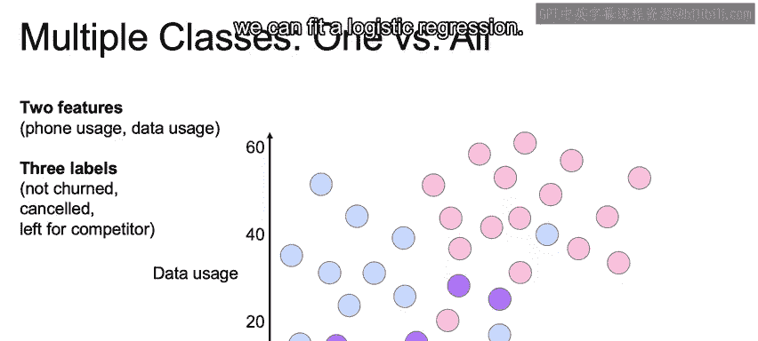

首先，我们选取一个类别，例如“未流失”，将其标记为正类（蓝色点）。

然后，将所有其他类别（“已取消”和“转向竞争对手”）合并标记为负类。

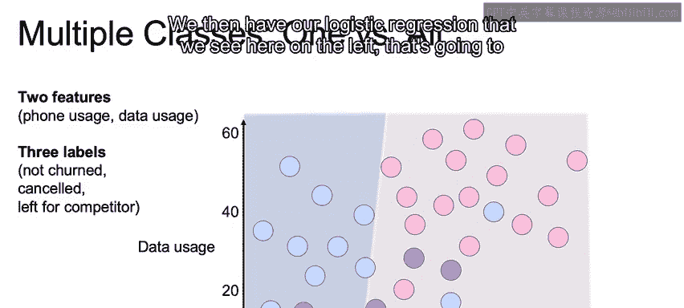

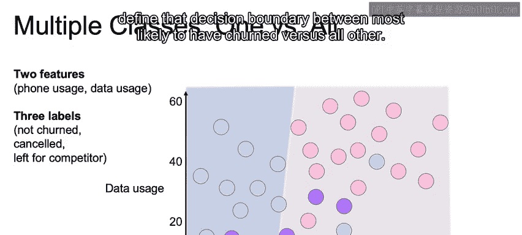

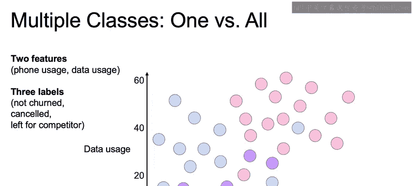

接着，我们可以拟合一个逻辑回归模型。

我们得到一个逻辑回归模型，它定义了“最可能属于未流失类”与“属于其他所有类”之间的决策边界。

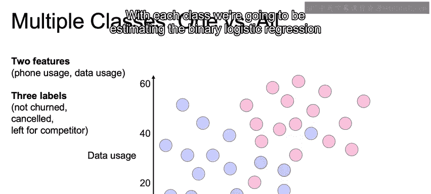

## 第二步：为其余类别重复此过程

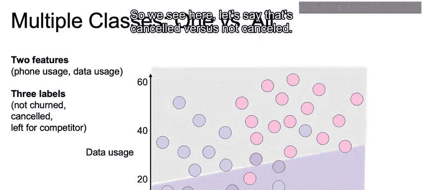

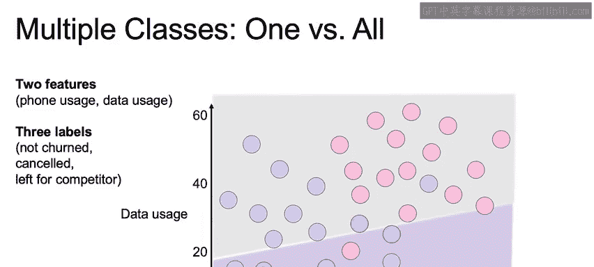

接下来，我们为其他每个类别重复上述步骤。

对于每个类别，我们都将训练一个“该类 vs 所有其他类”的二分类逻辑回归模型。

例如，我们训练“已取消 vs 非已取消”的分类器。

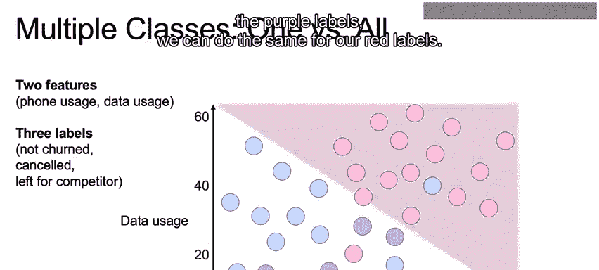

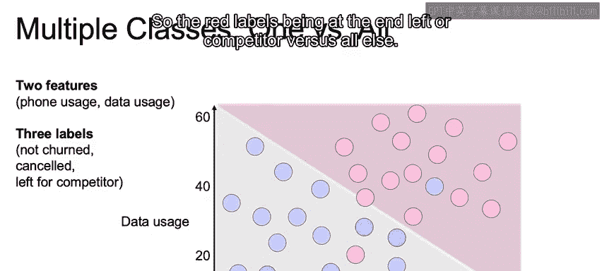

然后，我们对“转向竞争对手”这个类别（红色标签）进行同样的操作，即训练“转向竞争对手 vs 所有其他类”的分类器。

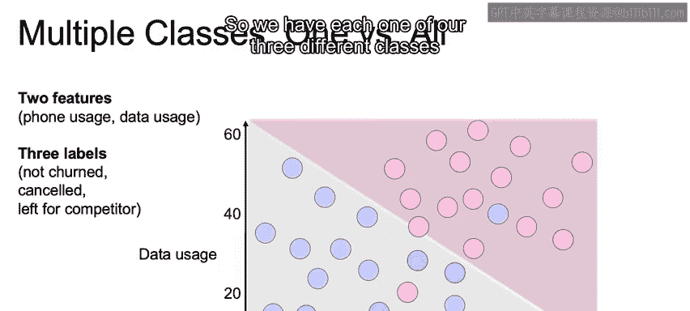

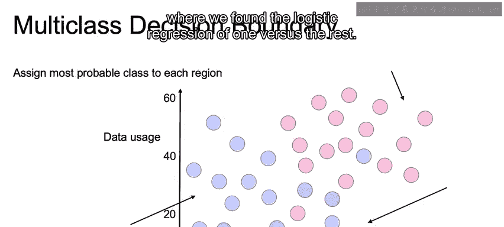

最终，我们为三个不同的类别分别训练了“一对多”的逻辑回归模型。

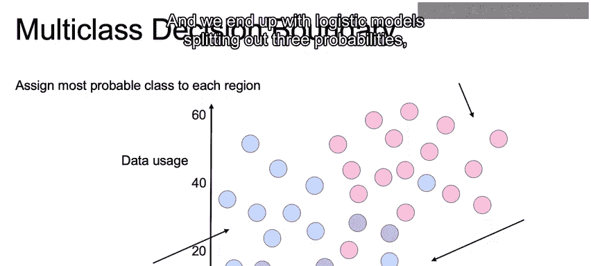

## 模型结果与预测

我们最终得到三个逻辑回归模型，每个模型输出一个概率值，分别对应一个类别。

对于每个样本，其预测类别将是这三个“一对多”模型中估计概率最高的那个类别。

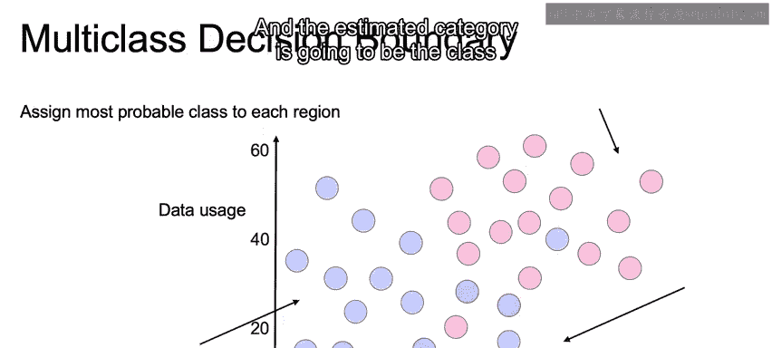

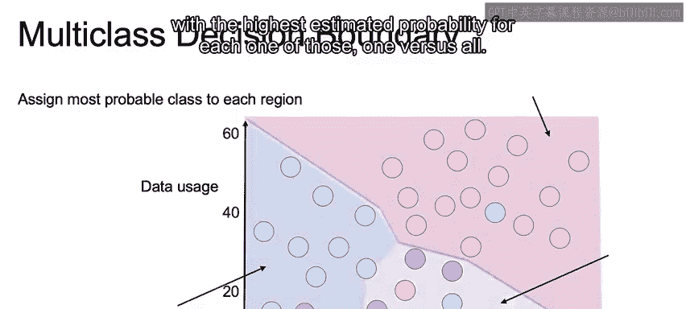

我们最终得到三条独立的决策边界，每条边界都对应一个二分类问题中概率最高的区域。

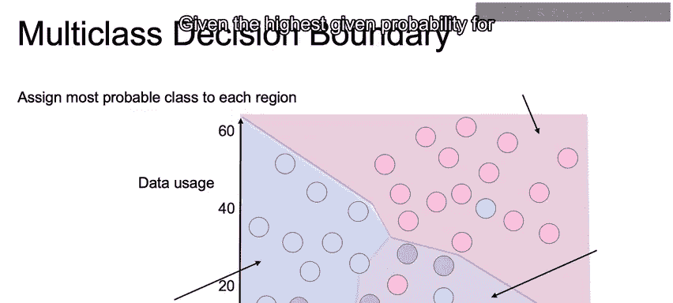

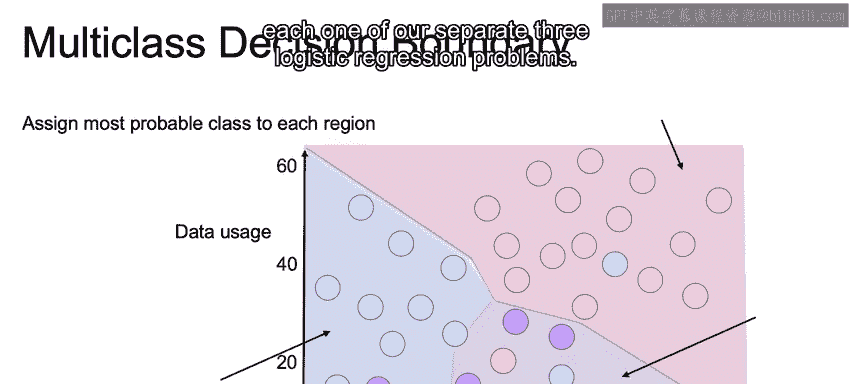

如图所示，蓝色区域代表“转向竞争对手”，粉色区域代表“未流失”，右侧的紫色区域则代表“已取消”。

## 总结

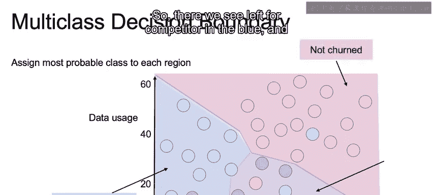

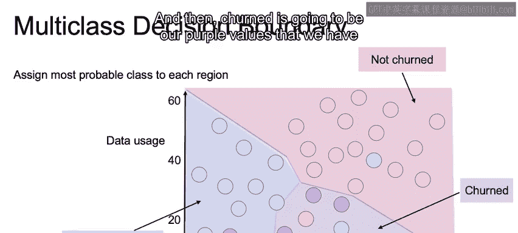

本节课中我们一起学习了“一对多”方法在多类逻辑回归中的应用。我们了解到，该方法通过为每个类别训练一个独立的二分类器，并将预测结果中概率最高的类别作为最终输出，从而有效地将二分类逻辑回归扩展到了多类分类场景。