# 104：K最近邻算法优缺点分析 📊

在本节课中，我们将要学习K最近邻（K-Nearest Neighbors, KNN）算法的优点与缺点。我们将详细探讨该算法在实现、解释性、适应性等方面的优势，同时也会分析其在计算效率、内存消耗和高维数据上的局限性。

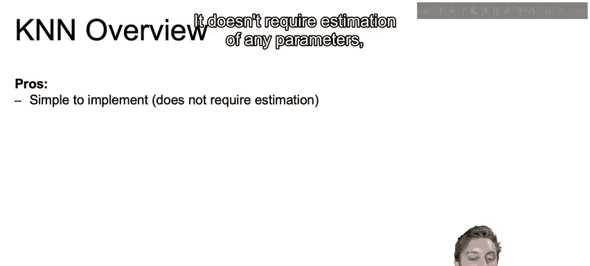

---

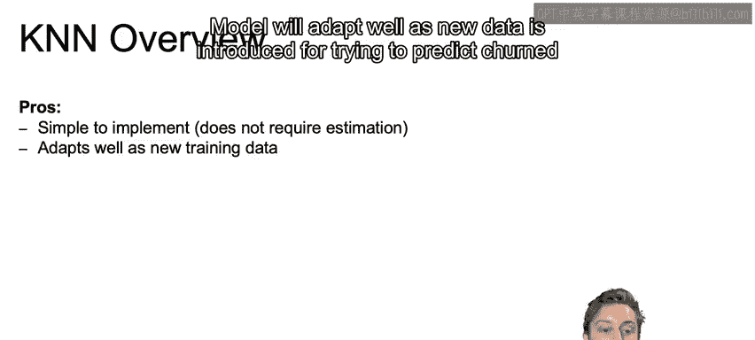

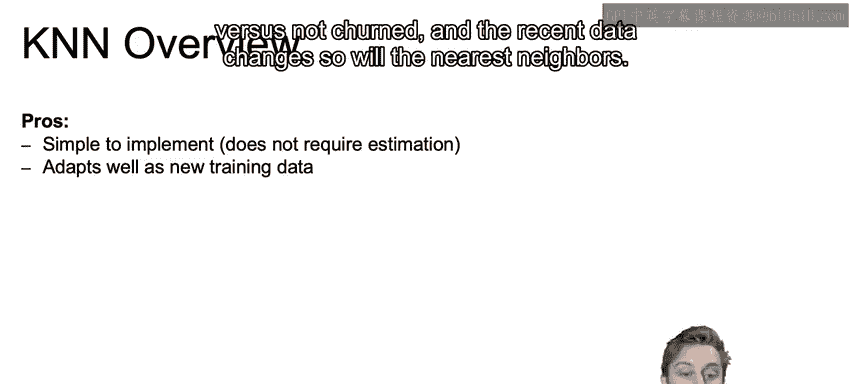

## 概述

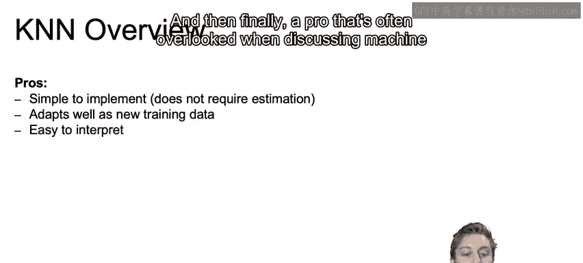

K最近邻算法是一种简单直观的机器学习方法，常用于分类和回归任务。它通过计算新数据点与训练数据集中最近邻点的距离来进行预测。本节我们将系统性地梳理该算法的优缺点。

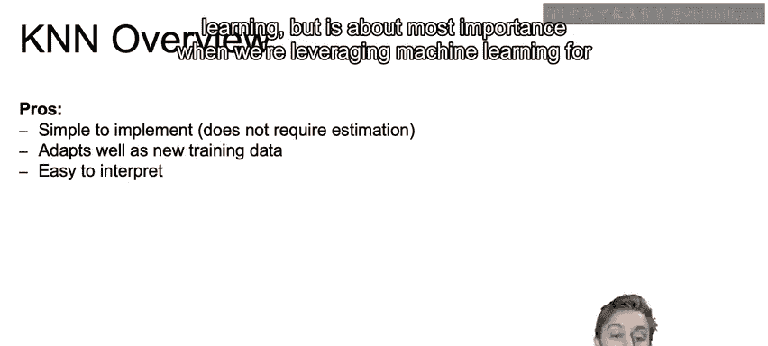

---

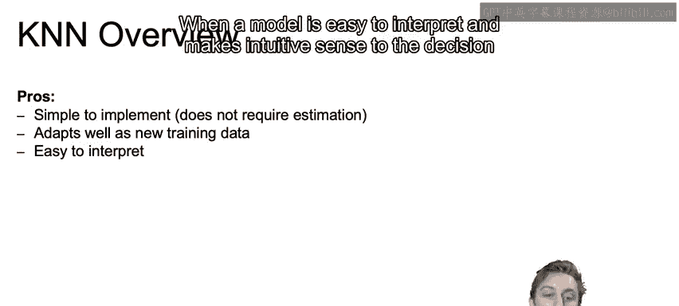

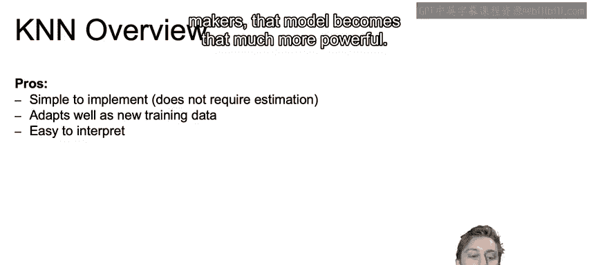

## K最近邻算法的优点 👍

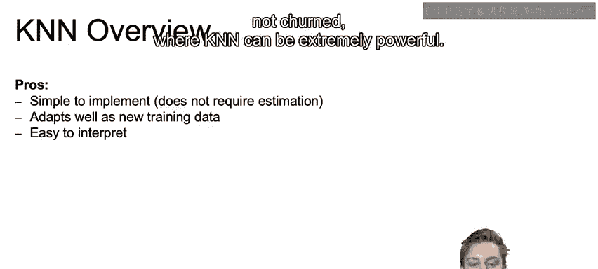

上一节我们介绍了KNN的基本概念，本节中我们来看看它的主要优点。KNN算法因其简单性和直观性而受到青睐。

以下是KNN算法的三个主要优点：

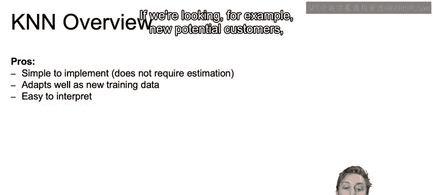

1.  **实现简单**：该算法不需要估计任何参数，核心逻辑是找出最近的邻居。
2.  **适应性强**：当引入新数据用于预测（例如预测客户是否流失）时，模型能很好地适应。最近邻会随着数据的变化而更新。
3.  **易于解释**：在商业应用中，模型的可解释性至关重要。当模型易于理解且对决策者具有直观意义时，其价值会大大提升。

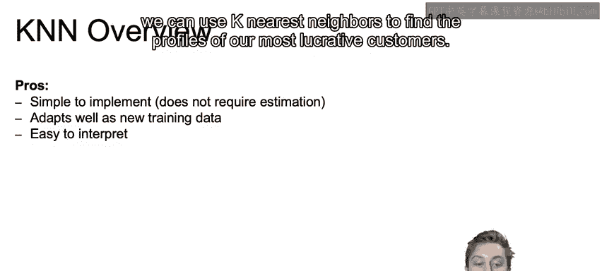

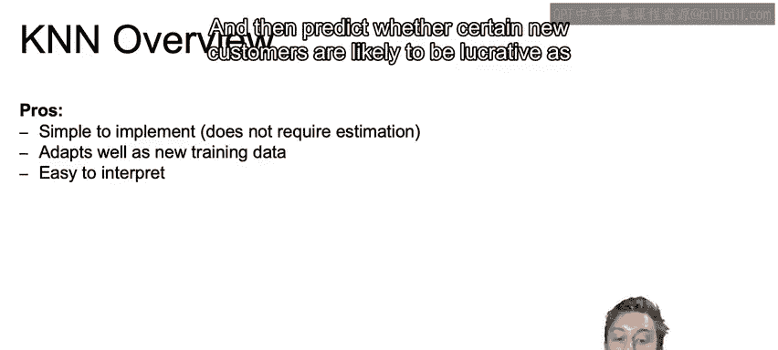

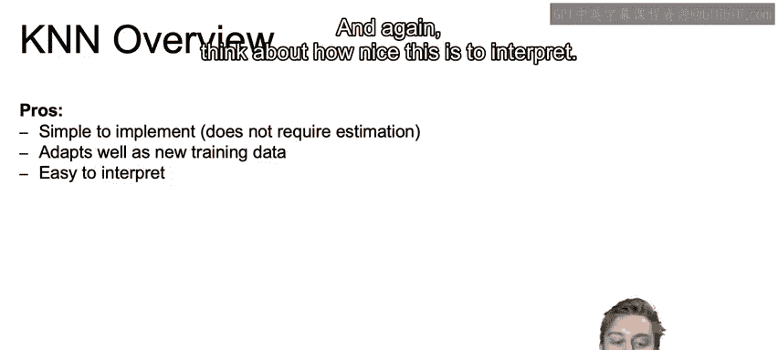

---

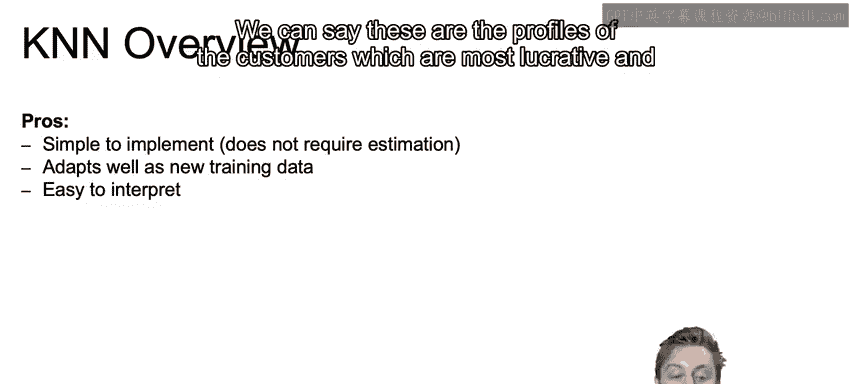

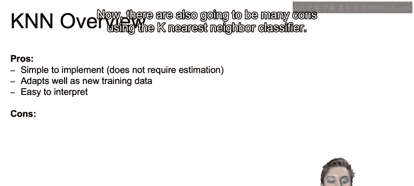

## 商业应用实例 💼

为了更具体地理解KNN的优点，让我们思考一个除客户流失预测之外的商业案例。

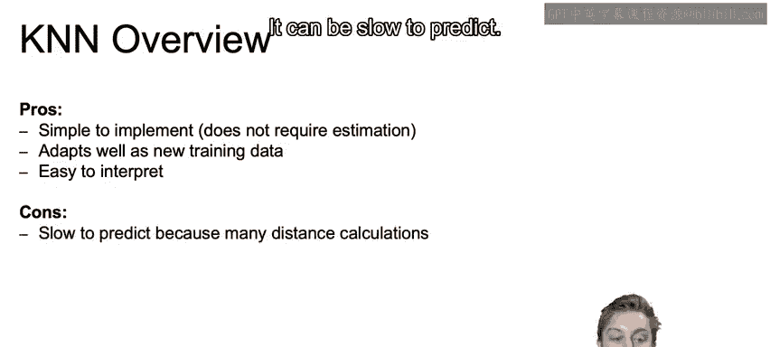

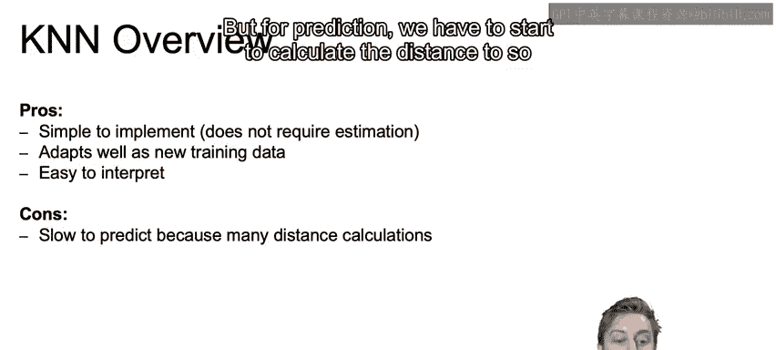

例如，在寻找潜在新客户时，我们可以使用K最近邻算法来匹配我们最盈利客户的画像，并预测某些新客户是否也可能成为高价值客户。这样我们就知道应该重点跟进哪些客户。这种方法的可解释性很强，我们可以明确指出：“这些是最盈利客户的画像，我们可以从这里入手。”

---

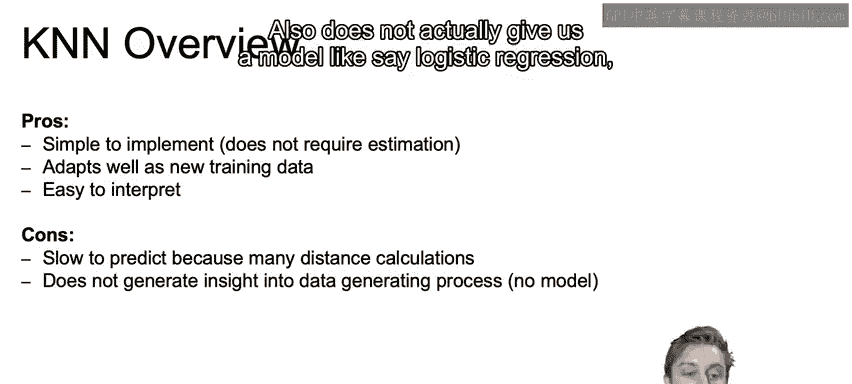

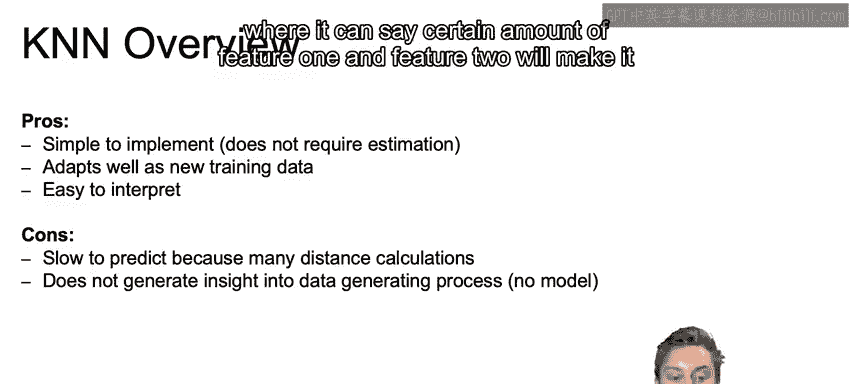

## K最近邻算法的缺点 👎

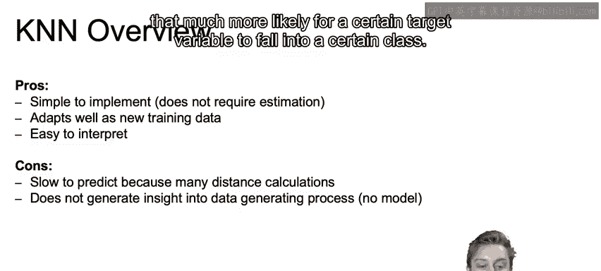

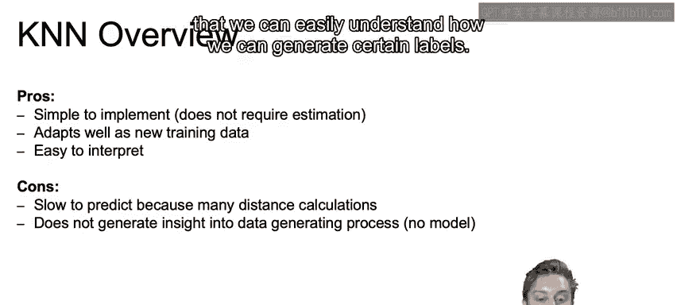

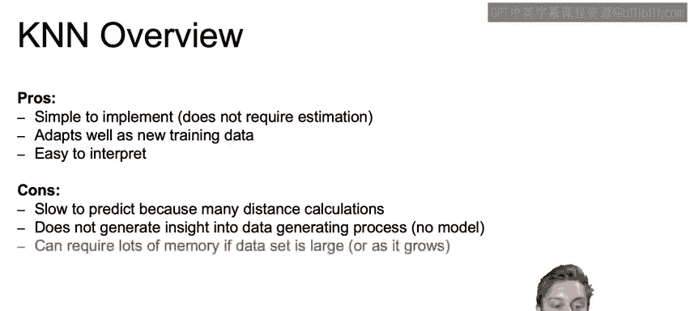

然而，使用K最近邻分类器也存在许多缺点。

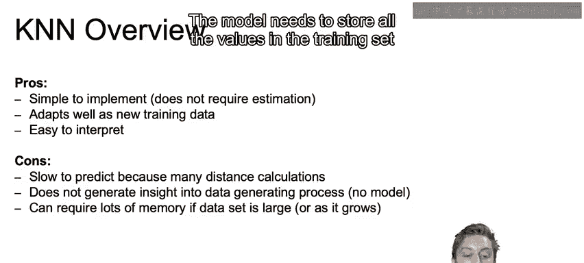

以下是KNN算法的主要缺点：

1.  **预测速度可能较慢**：模型的拟合过程只需要存储数据，但在预测时，如果数据集较大，则需要计算新数据点到许多不同数据点的距离，这可能导致速度变慢。
2.  **不提供生成式模型**：与逻辑回归等模型不同，KNN无法明确告诉我们“特征1和特征2达到某种程度会使目标变量更可能属于某个类别”。它没有这种生成过程，因此我们无法轻易理解如何生成特定标签。
3.  **内存消耗大**：模型在每次拟合时都需要存储训练集中的所有值，这可能占用大量内存。
4.  **高维数据下性能下降**：当我们拥有大量特征（即维度很高）时，K最近邻算法开始失效。因为随着维度增加，点与点之间的距离通常会变得越来越远，这影响了“最近邻”判断的准确性。

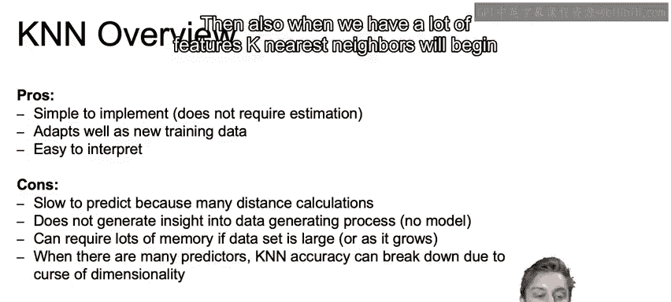

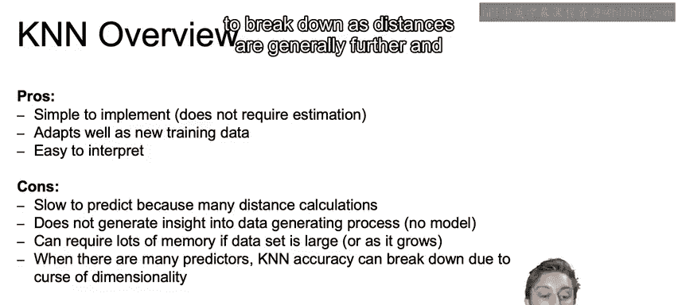

---

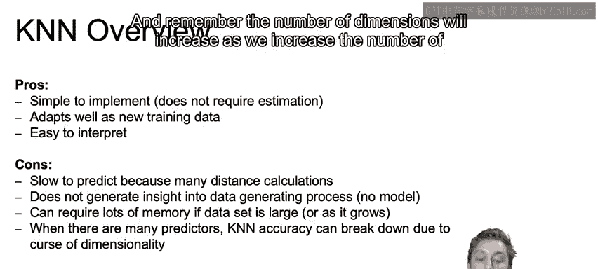

## 总结与预告

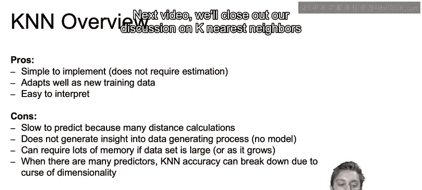

本节课中我们一起学习了K最近邻算法的优点与缺点。我们了解到它简单、适应性强且易于解释，但也存在预测慢、内存消耗大及不擅长处理高维数据等局限性。

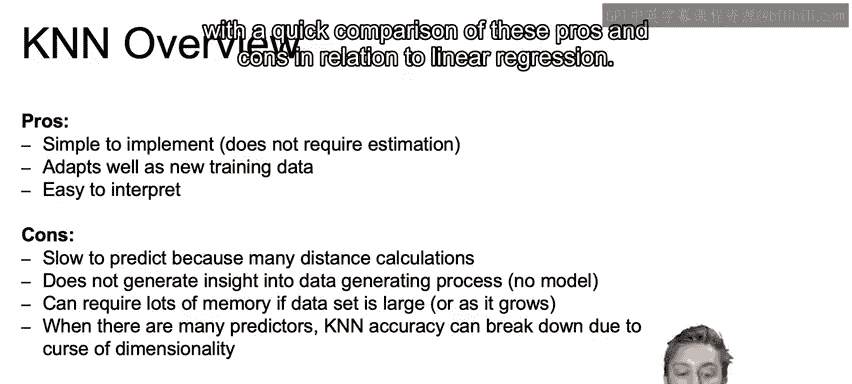

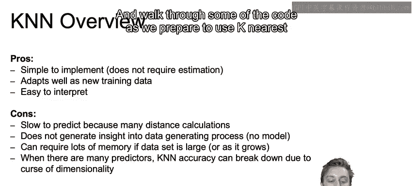

在下一个视频中，我们将结束关于K最近邻算法的讨论，快速比较其与线性回归的优缺点，并准备在下一个Notebook中使用KNN时浏览一些相关代码。