# 113：高斯核支持向量机简介 🧠

在本节课中，我们将学习如何通过核技巧扩展支持向量机，使其能够处理非线性分类问题。我们将了解核函数的概念、如何利用它们为支持向量机构建非线性决策边界，并介绍在Python中实现SVM核模型的几种技术。

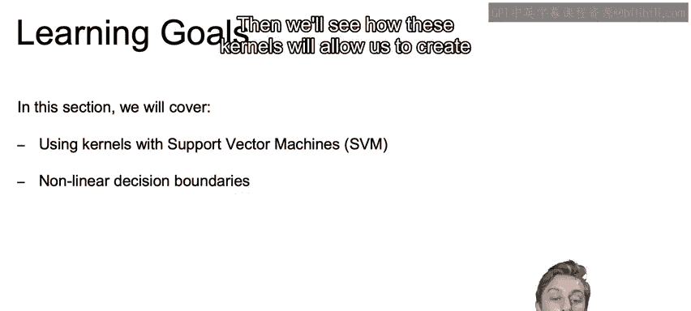

上一节我们介绍了线性支持向量机，这是支持向量机最基本的形式。本节中，我们将探索其更强大的非线性版本。

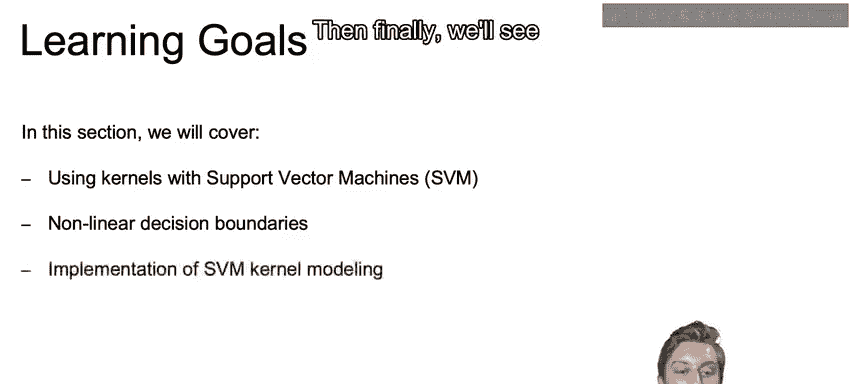

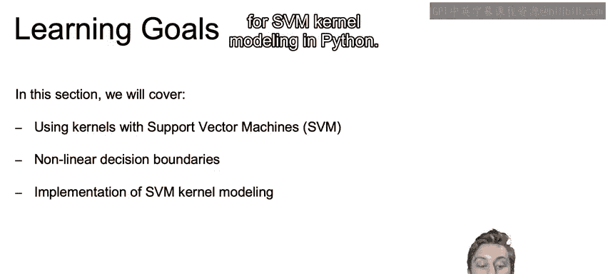

## 核技巧与非线性决策边界

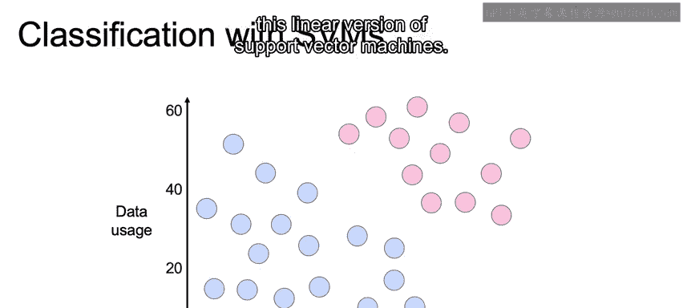

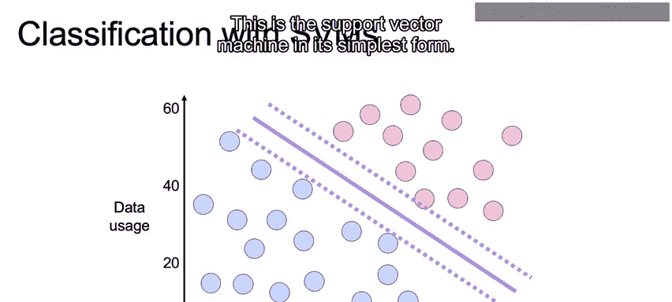

线性支持向量机虽然有效，但只能处理线性可分的数据。为了处理非线性数据，我们需要引入核技巧。

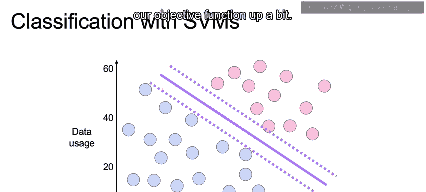

核技巧的核心思想是：在当前二维空间中看似非线性的曲线，实际上可能对应于另一个维度（更高维空间）中的线性曲线或超平面。

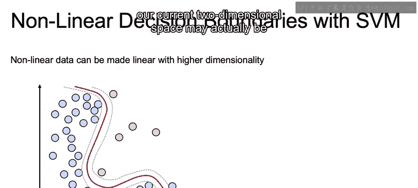

通过适当的空间变换，我们可以找到一个线性分离超平面，该超平面映射回我们原始空间时，就形成了非线性的决策边界。

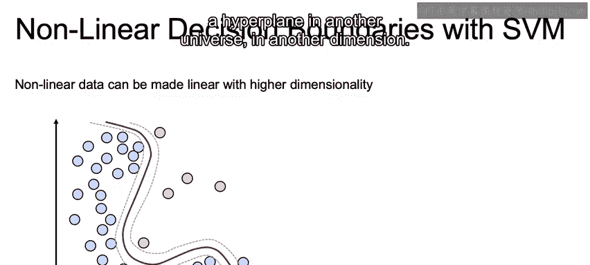

需要澄清的是，这种映射通常是从低维度空间映射到高维度空间，例如从二维映射到三维或四维。

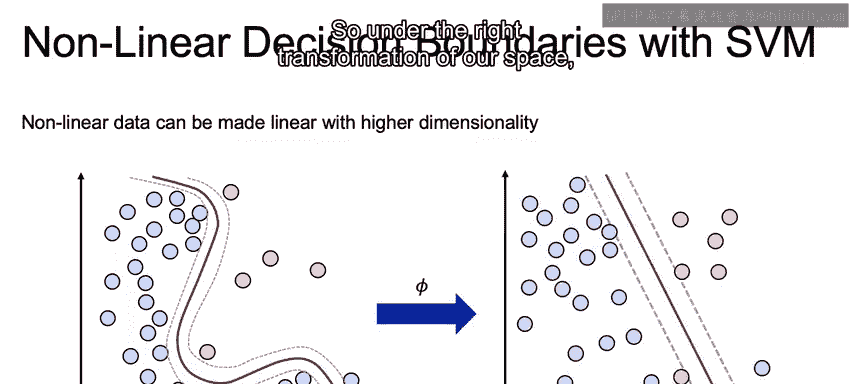

以下是一个更清晰的说明：这个看起来复杂的曲线，实际上可以映射到三维空间中的一个超平面。

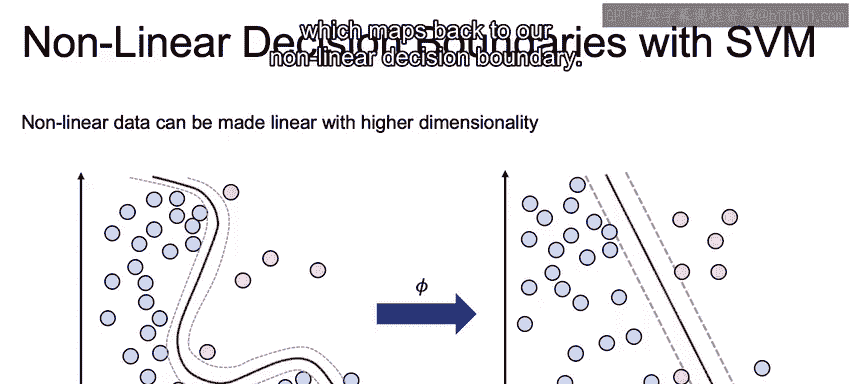

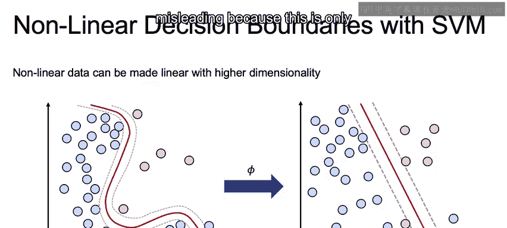

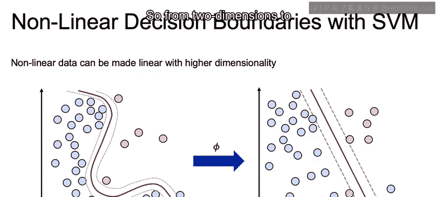

正是这种映射提供了实现非线性分类的“魔法”。这是基于线性分类器（如支持向量机）实现非线性分类的主要思想。

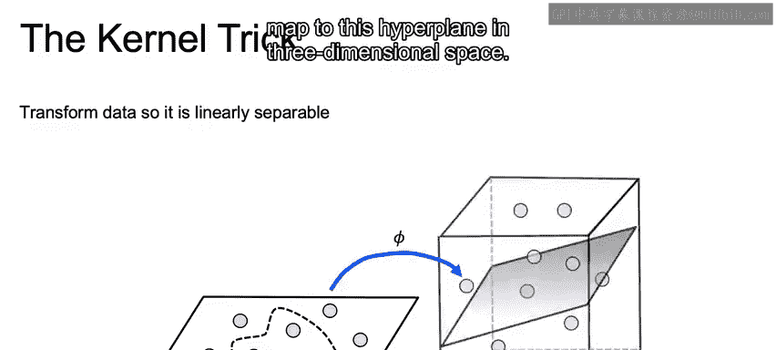

支持向量机本身仍然是线性的，我们只是在更高维的空间中寻找那个线性的决策边界。

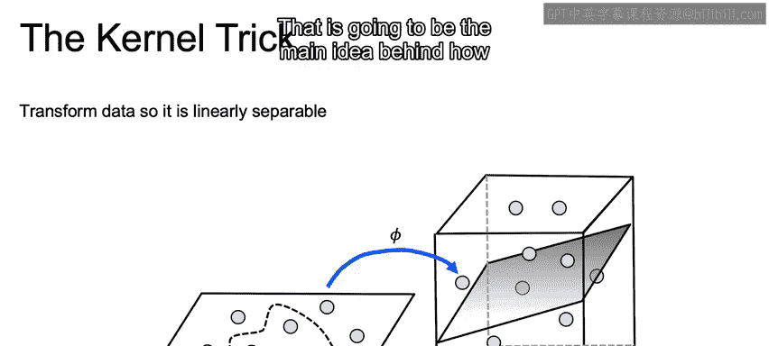

本质上，我们将原始数据映射到更高维度，因为我们知道随着维度的增加，最终应该能够找到某个线性的决策边界。

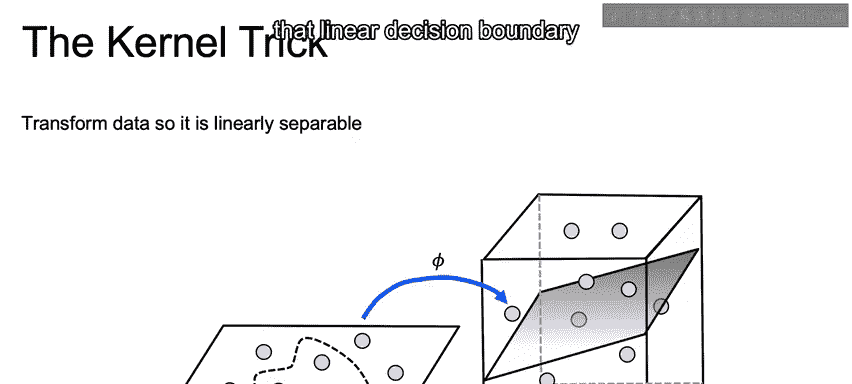

我们将在下一个视频中进一步深入探讨其实现细节。

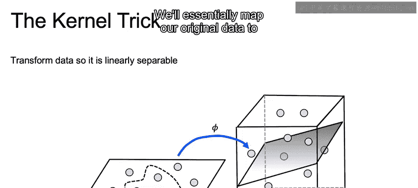

## 本节总结

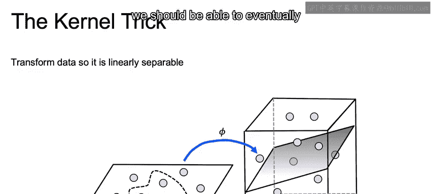

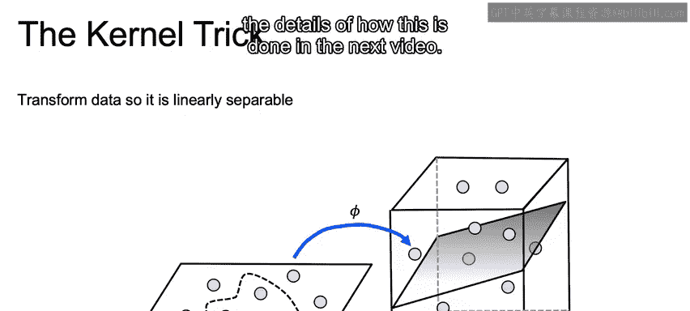

本节课中，我们一起学习了支持向量机核技巧的基本概念。我们了解到，通过将数据映射到高维空间，可以在该空间中找到线性决策边界，从而在原始空间中实现非线性分类。这是支持向量机处理复杂数据模式的关键能力。