# 121：32_分类器概览 🌳

在本节课中，我们将开始讨论下一个机器学习模型：决策树。我们将回顾之前讨论过的分类问题，并概述决策树分类算法的工作原理。接着，我们会深入探讨决策树如何进行分裂，包括使用熵和信息增益的方法。最后，我们将讨论如何通过剪枝来正则化决策树，以解决过拟合问题。

---

## 分类算法回顾 📊

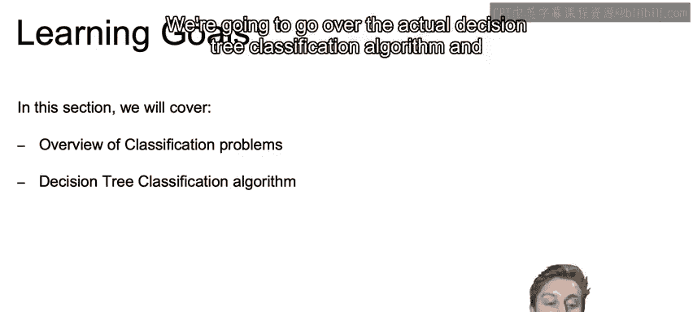

上一节我们介绍了K近邻和逻辑回归等分类算法。本节中，我们来看看这些算法的优缺点，以便更好地理解决策树的定位。

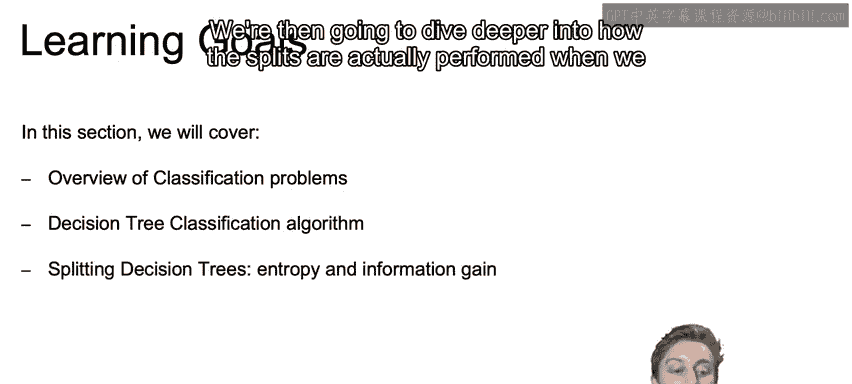

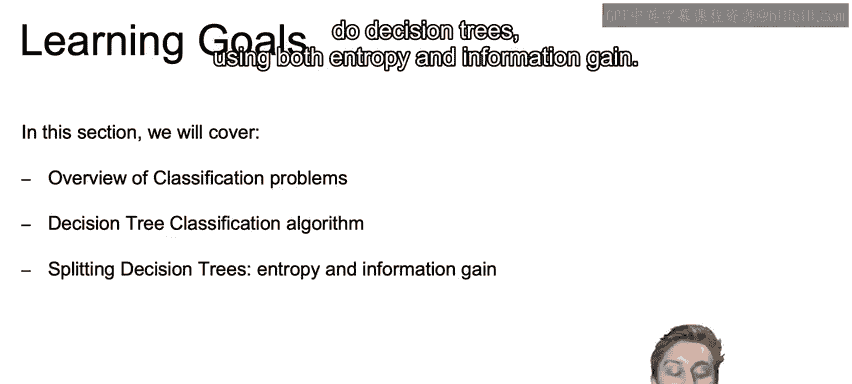

以下是几种常见分类算法的简要对比：

*   **K近邻 (K-Nearest Neighbors)**
    *   **拟合速度快**：训练数据本身就是模型，调用 `fit` 时无需额外计算。
    *   **预测速度慢**：预测新记录类别时，需要计算其与所有训练样本的距离以找出K个最近邻，计算量大。
    *   **决策边界灵活**：边界通常不是简单的直线，而是更复杂的曲线形状。

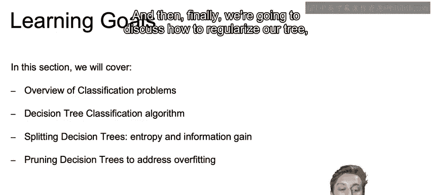

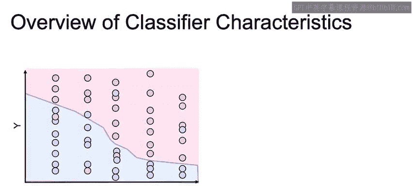

*   **逻辑回归 (Logistic Regression)**
    *   **拟合速度慢**：需要学习参数（如 β0, β1），涉及求解方程和迭代计算。
    *   **预测速度快**：预测新记录仅需进行一系列乘法、加法和指数运算，计算简单。
    *   **决策边界线性**：产生线性的决策边界。

*   **支持向量机 (Support Vector Machines)**
    *   **线性分类器**：可以是简单的线性边界，计算速度快。
    *   **核技巧 (Kernel Trick)**：使用核技巧可实现非线性分类，但模型拟合时间会显著增加。

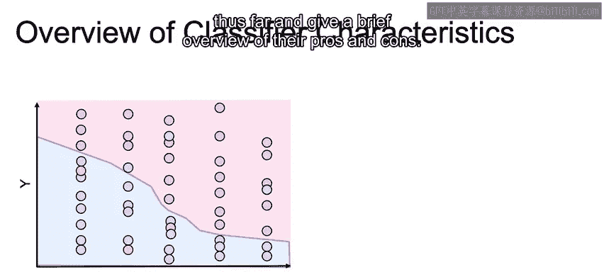

---

## 决策树分类算法 🌲

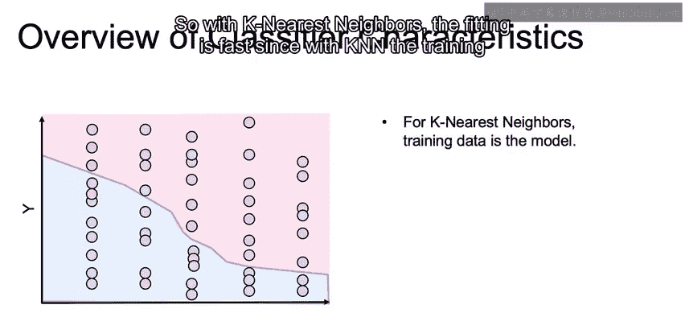

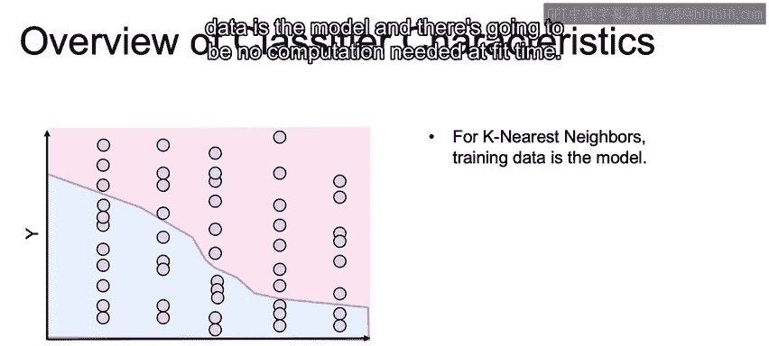

在回顾了其他分类器之后，本节我们将重点转向决策树算法本身，看看它是如何工作的。

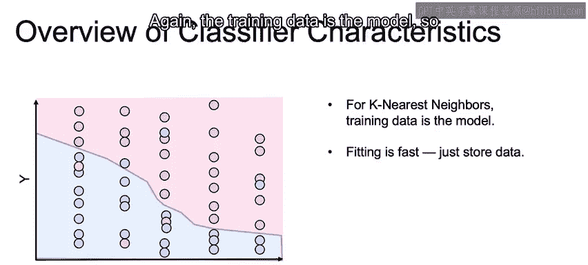

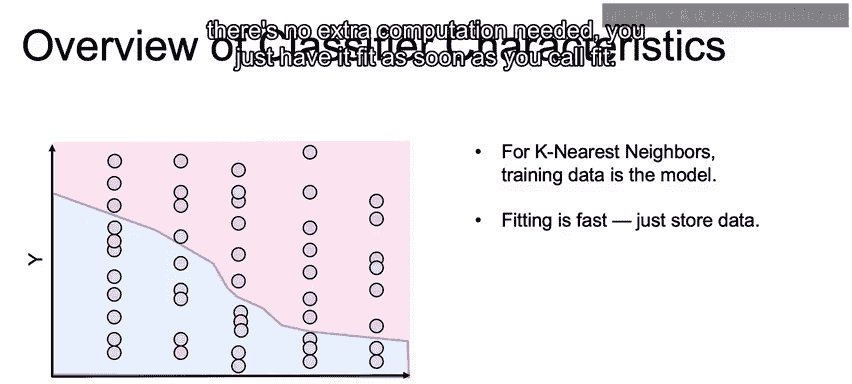

决策树通过一系列基于特征值的判断（即“问题”）来对数据进行分类。每个内部节点代表一个特征测试，每个分支代表测试结果，每个叶节点代表一个类别标签。构建树的核心在于如何选择最佳的特征进行分裂。

以下是决策树构建的关键步骤：

1.  **选择最佳分裂特征**：从所有特征中，选择一个能最好地将数据集划分成更纯子集的特征。纯度通常用**熵**或**基尼不纯度**来衡量。
2.  **创建分支节点**：根据选定的特征及其分裂阈值，将数据集分割成子集。
3.  **递归构建**：对每个子集重复步骤1和2，直到满足停止条件（如节点纯度达到阈值、达到最大深度或样本数过少）。
4.  **生成叶节点**：将最终无法再分裂或满足停止条件的节点标记为叶节点，并赋予其数据中最常见的类别。

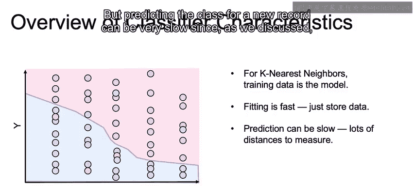

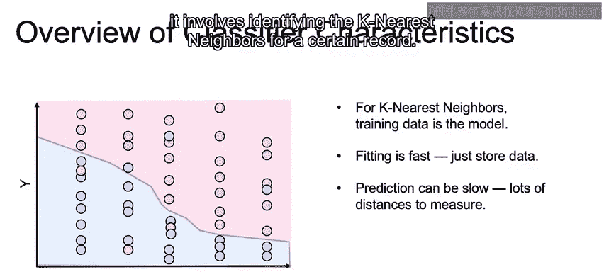

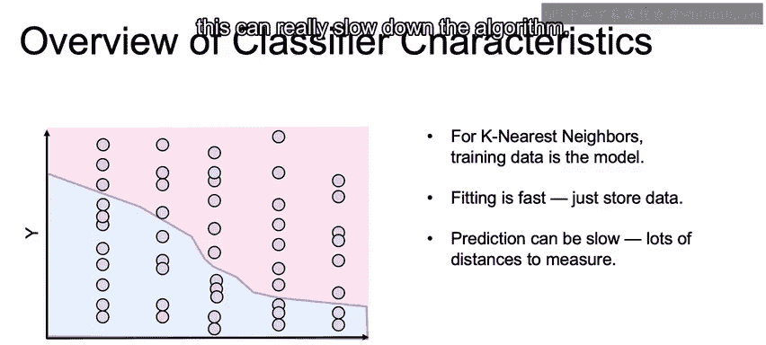

---

## 分裂准则：熵与信息增益 📉

理解了决策树的基本流程后，我们需要深入其核心：如何量化一个分裂的“好坏”。这通常通过**熵**和**信息增益**来实现。

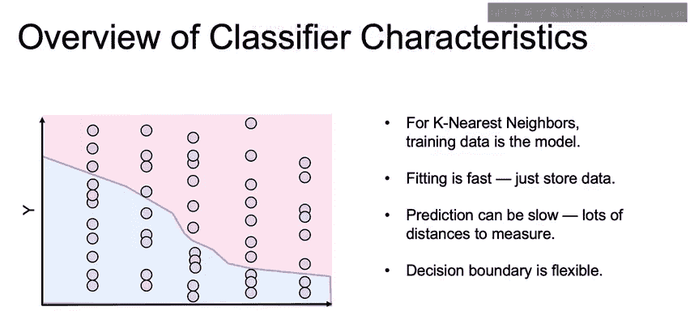

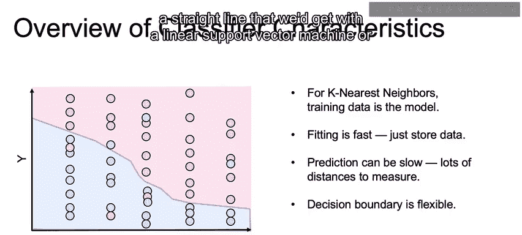

*   **熵**：衡量数据集的不确定性或混乱程度。对于一个二分类问题，熵的公式为：
    `Entropy(S) = -p_+ * log₂(p_+) - p_- * log₂(p_-)`
    其中 `p_+` 和 `p_-` 分别是正类和负类样本的比例。熵值范围为0到1，0表示完全纯净（所有样本属于同一类），1表示最大混乱（两类样本各占一半）。

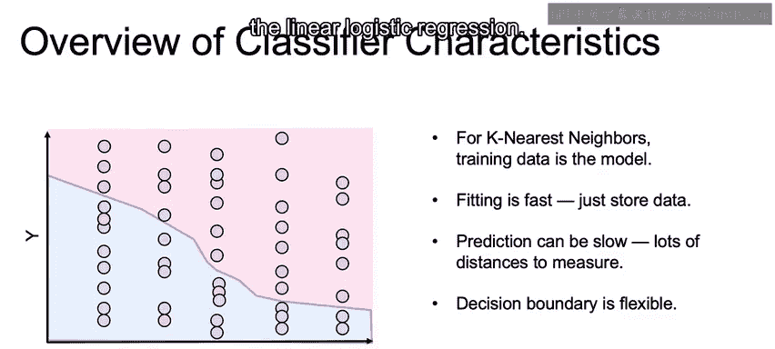

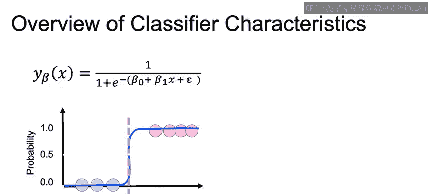

*   **信息增益**：衡量通过某个特征进行分裂后，数据集熵的减少量。信息增益越大，说明该特征对分类的贡献越大。计算方式为：
    `Information Gain = Entropy(父节点) - Σ [(|子节点_v| / |父节点|) * Entropy(子节点_v)]`
    其中求和遍历该特征分裂产生的所有子节点。

决策树算法（如ID3）会选择能带来**最大信息增益**的特征作为当前节点的分裂特征。

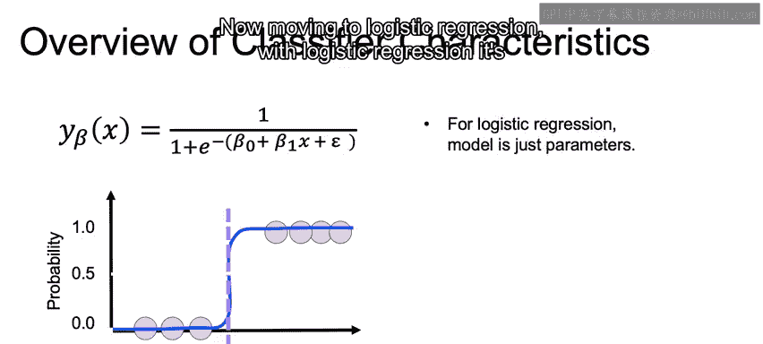

---

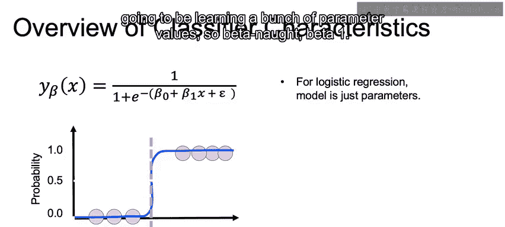

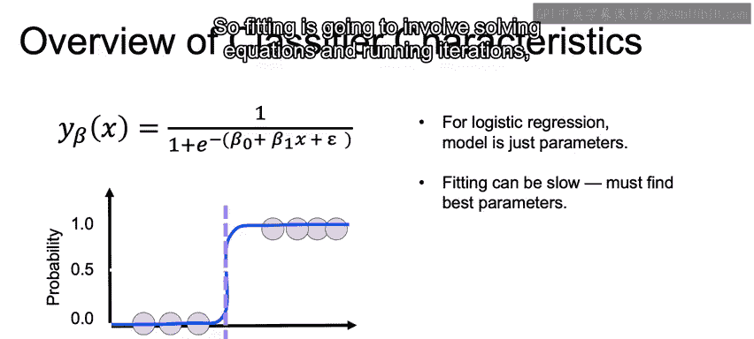

## 正则化与剪枝 ✂️

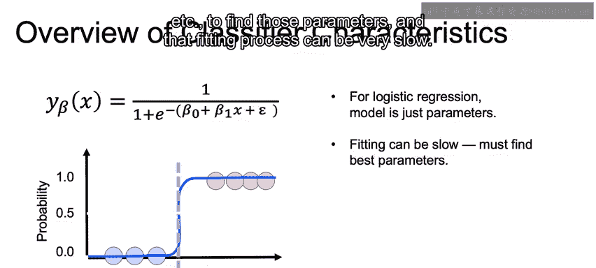

决策树很容易生长得非常复杂，完美拟合训练数据，从而导致过拟合。上一节我们了解了过拟合的风险，本节中我们来看看如何通过**剪枝**来控制模型复杂度，提高泛化能力。

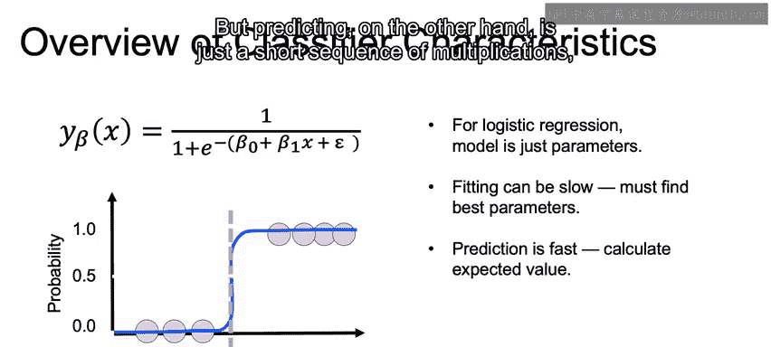

剪枝的主要目的是简化决策树，移除对整体预测贡献不大、可能基于噪声数据的子树或节点。主要方法有两种：

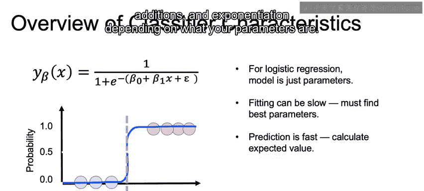

*   **预剪枝**：在树完全生长之前提前停止。可以设置停止条件，例如：
    *   树达到最大深度。
    *   节点包含的样本数低于最小值。
    *   信息增益低于某个阈值。
*   **后剪枝**：先让树充分生长，然后自底向上地检查子树。如果将其替换为叶节点能带来验证集性能的提升（或损失很小），则进行剪枝。这种方法通常比预剪枝效果更好。

通过剪枝，我们可以在模型复杂度和泛化能力之间取得平衡，得到一个更简洁、更不易过拟合的决策树模型。

---

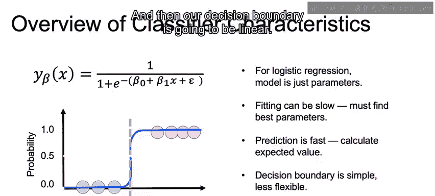

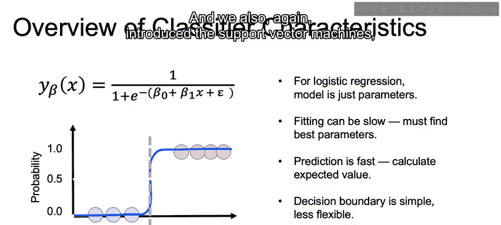

## 总结 🎯

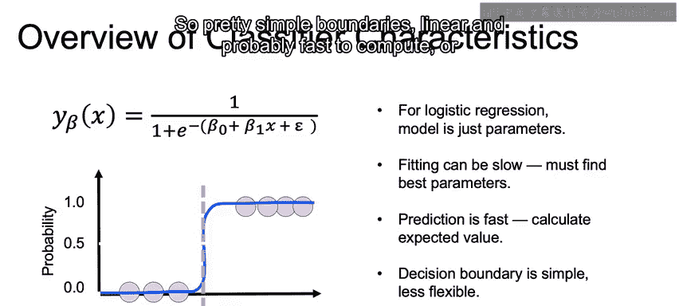

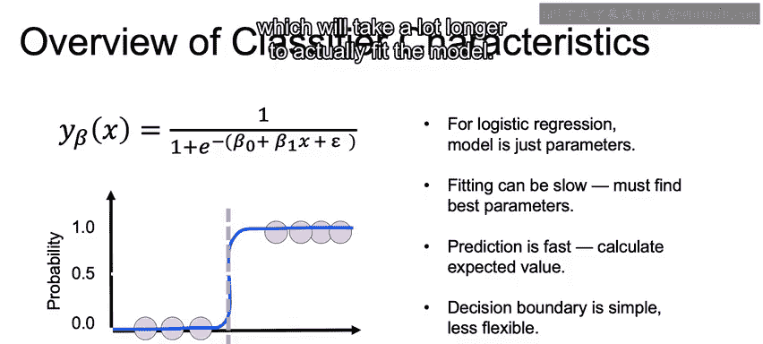

本节课我们一起学习了决策树分类器。我们首先回顾了K近邻、逻辑回归等分类算法的优缺点。接着，我们深入探讨了决策树算法的工作原理，包括其基于树状结构的分类过程。然后，我们重点讲解了决策树如何通过**熵**和**信息增益**来选择最佳分裂特征，以构建有效的模型。最后，我们介绍了**剪枝**技术，这是防止决策树过拟合、实现模型正则化的关键手段。决策树模型直观易懂，是机器学习中一个非常重要且实用的工具。