# 124：基于熵的分割 📊

在本节课中，我们将学习决策树中一个重要的概念——**熵**，并了解如何利用熵作为度量标准来寻找数据集的最佳分割点。我们将通过具体的公式和计算示例，理解熵如何帮助决策树进行更有效的分裂，避免早期停止的问题。

---

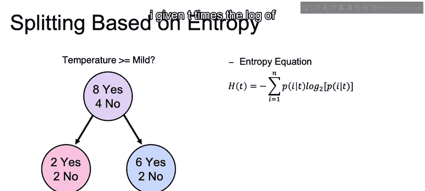

## 熵的定义与公式 📈

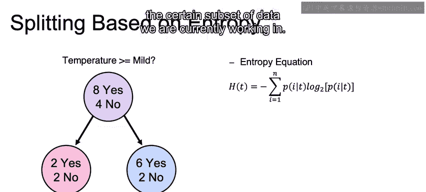

上一节我们介绍了分类错误率作为分割标准，本节中我们来看看一个更强大的度量标准——**熵**。

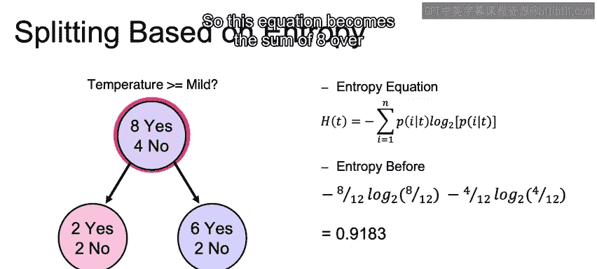

熵是信息论中的一个概念，用于度量系统的不确定性或混乱程度。在决策树中，我们用它来衡量一个数据子集中类别的混杂程度。熵的公式定义如下：

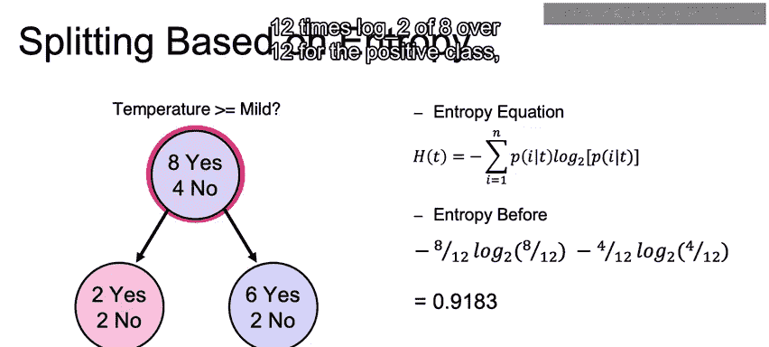

**H(T) = - Σ [ P(i|T) * log₂(P(i|T)) ]**

其中：
*   **H(T)** 表示数据集 **T** 的熵。
*   **P(i|T)** 表示在数据集 **T** 中，类别 **i** 出现的概率。
*   **Σ** 表示对所有类别求和。

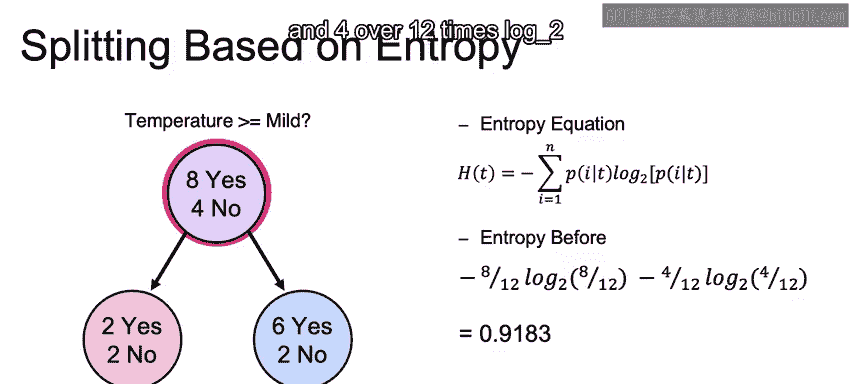

这个公式的核心是计算每个类别比例与其对数概率的乘积之和，然后取负值。当一个节点中所有样本都属于同一类别时（完全纯净），熵为0；当不同类别均匀混合时（最混乱），熵达到最大值。

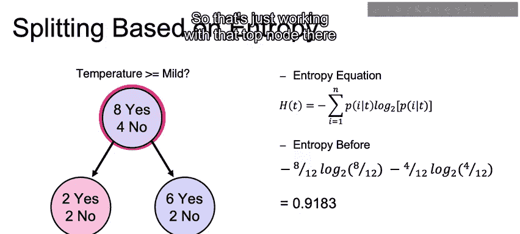

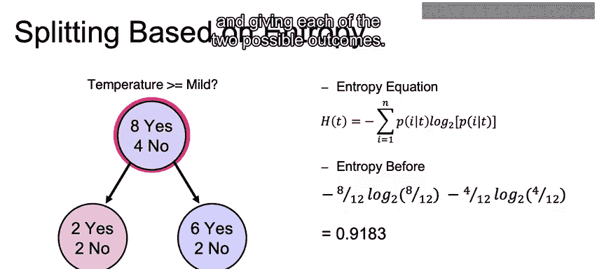

---

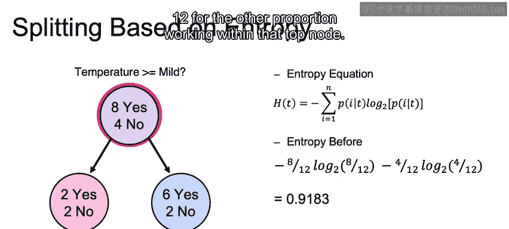

## 计算根节点的熵 🧮

让我们通过一个具体例子来计算熵。假设我们的根节点有12个样本，其中8个属于正类，4个属于负类。

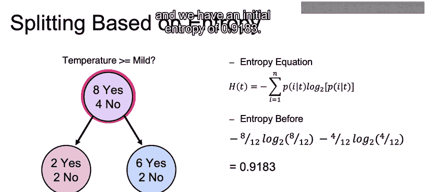

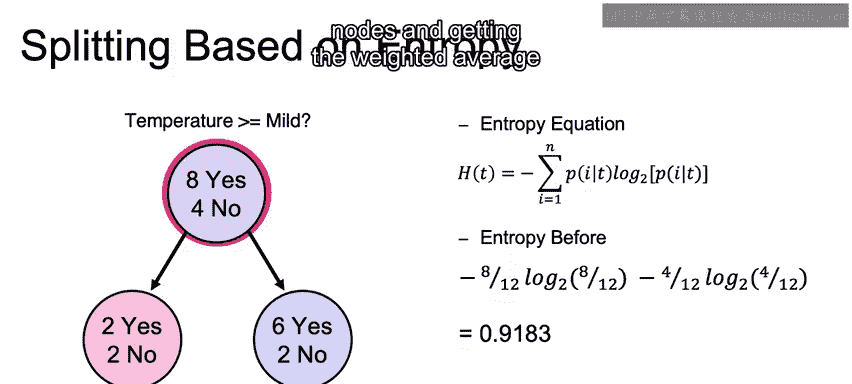

以下是计算该节点熵的步骤：

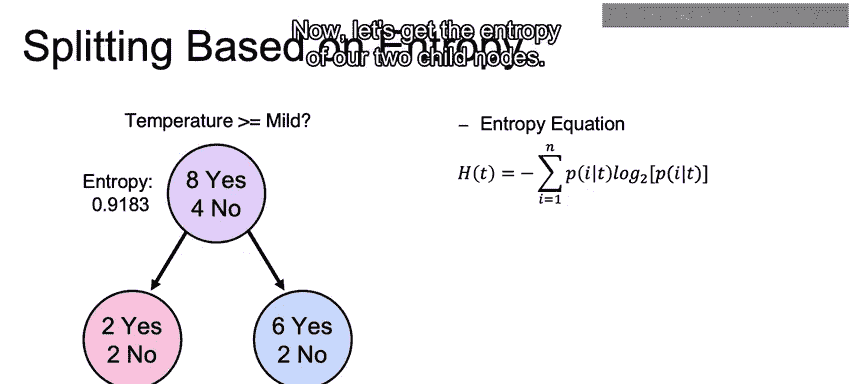

1.  计算正类的概率：`P(正类) = 8 / 12`
2.  计算负类的概率：`P(负类) = 4 / 12`
3.  将这些值代入熵公式：

    **H(T) = - [ (8/12) * log₂(8/12) + (4/12) * log₂(4/12) ]**

    计算后，我们得到该根节点的初始熵值约为 **0.9183**。这个值反映了当前节点内类别的混合程度。

---

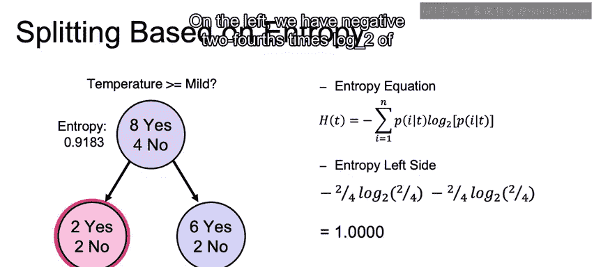

## 计算子节点的熵与信息增益 🔍

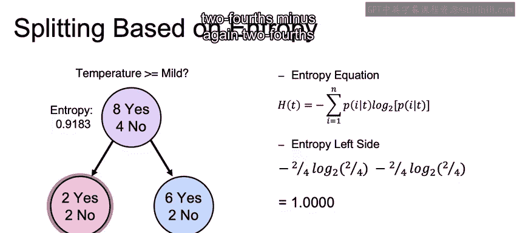

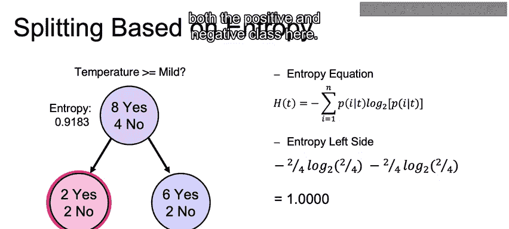

现在，假设我们根据某个特征将这个根节点分割成两个子节点。

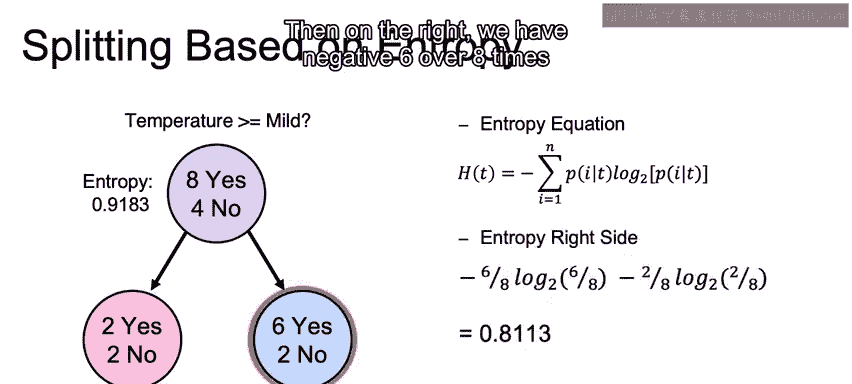

*   **左子节点**：包含4个样本，其中2个正类，2个负类。
*   **右子节点**：包含8个样本，其中6个正类，2个负类。

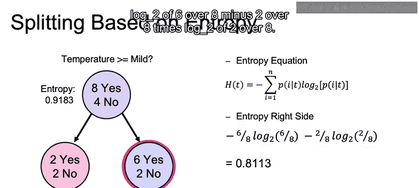

以下是分别计算两个子节点熵的过程：

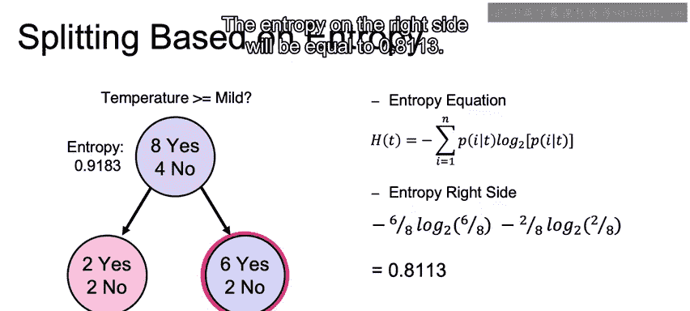

对于左子节点，正负类比例均为 2/4：
**H(左) = - [ (2/4) * log₂(2/4) + (2/4) * log₂(2/4) ] = 1.0**

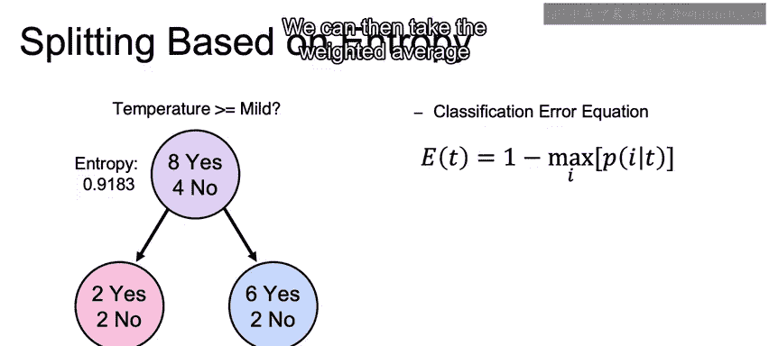

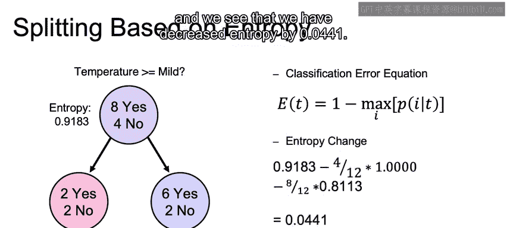

对于右子节点：
**H(右) = - [ (6/8) * log₂(6/8) + (2/8) * log₂(2/8) ] ≈ 0.8113**

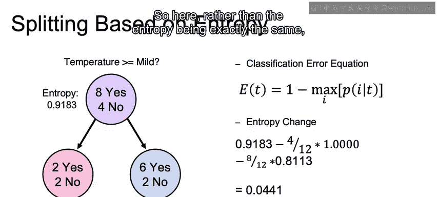

为了评估这次分割的效果，我们需要计算分割后整体的加权平均熵：

**加权平均熵 = (4/12) * H(左) + (8/12) * H(右) ≈ (4/12)*1.0 + (8/12)*0.8113 ≈ 0.8742**

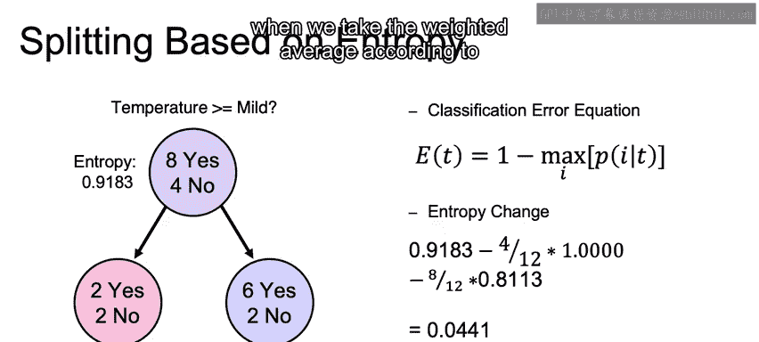

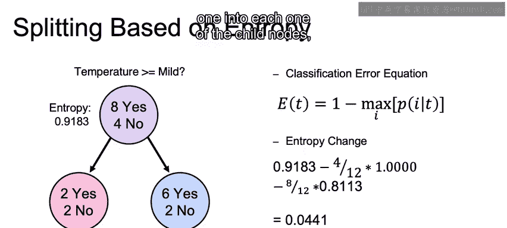

**信息增益** 定义为父节点熵与子节点加权平均熵的差值：
**信息增益 = H(父) - 加权平均熵 = 0.9183 - 0.8742 = 0.0441**

这个正的信息增益（0.0441）表明，通过这次分割，我们降低了系统的不确定性，因此这次分割是有效的。

---

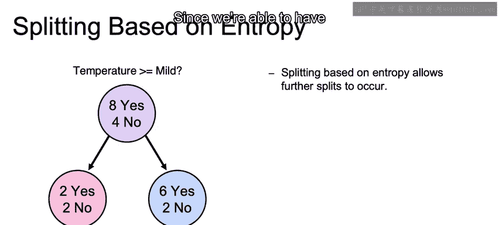

## 熵的优势与总结 🎯

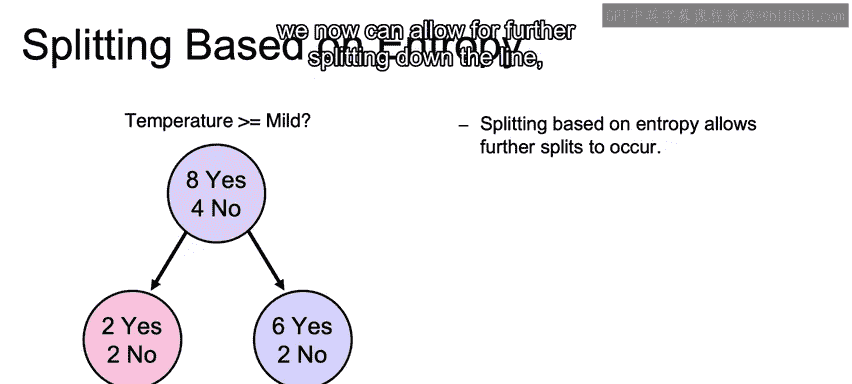

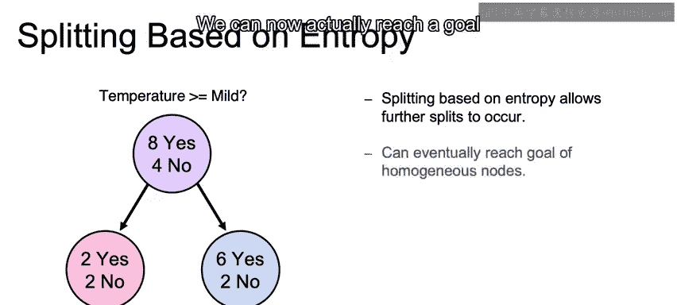

与之前提到的分类错误率相比，使用熵作为分割标准有一个关键优势：**敏感性**。

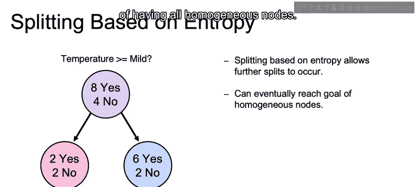

分类错误率在某些情况下（例如节点中主要类别比例不变时）可能无法检测到分割带来的纯度提升，从而导致决策树过早停止生长。而熵对概率分布的变化更为敏感，即使主要类别比例未变，只要子节点的类别分布更“纯净”，熵就能捕捉到这种改进，从而允许决策树继续进行更深层次的分割，最终目标是得到所有样本都属于同一类别的“同质”叶节点。

在本节课中，我们一起学习了：
1.  **熵**的定义和计算公式，它是度量数据不纯度的指标。
2.  如何逐步计算一个节点及其子节点的熵。
3.  如何通过计算**信息增益**（父节点熵与子节点加权平均熵的差值）来评估分割的质量。
4.  熵相较于分类错误率的优势在于其更高的敏感性，能够促进决策树更充分地生长，避免早停。

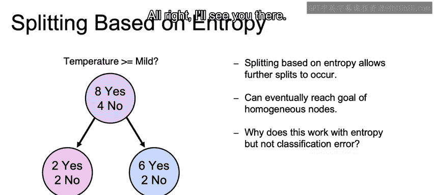

在接下来的课程中，我们将更深入地探讨熵有效而分类错误率可能失效的原因。