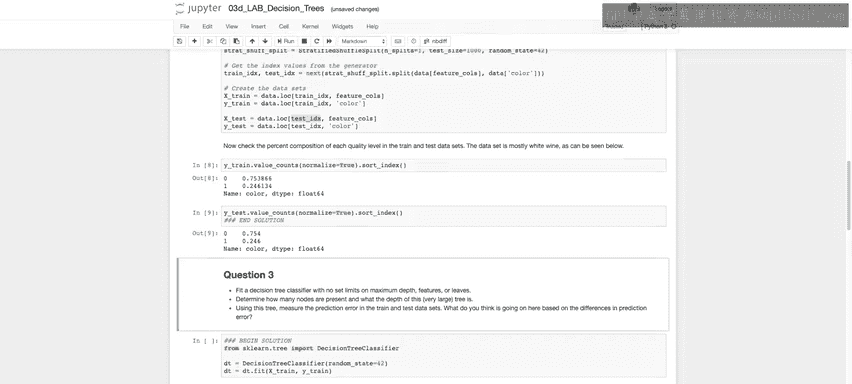

# 127：决策树实战（第一部分）📊

在本节课中，我们将学习如何使用决策树算法。我们将使用葡萄酒质量数据集，首先应用决策树分类器来预测葡萄酒的颜色（红或白），之后还会展示如何将决策树用于回归任务，预测残糖含量。

## 数据准备与导入

首先，我们导入必要的库，并将工作目录切换到`data`文件夹，以便导入配色方案并快速访问该文件夹中的文件。

```python
import pandas as pd
import numpy as np
from sklearn.model_selection import StratifiedShuffleSplit
```

我们读取名为`winequalitydata.csv`的数据文件，并查看前五行数据。

```python
data = pd.read_csv('winequalitydata.csv')
print(data.head())
```

数据显示，我们拥有诸如固定酸度、挥发性酸度、柠檬酸等特征列，以及最后一列的`color`（颜色）变量，其值为“red”或“white”。我们需要将其转换为0和1的数值形式。

查看数据类型，我们发现除了`color`变量外，其他列几乎都是数值型（浮点数或整数）。

## 数据预处理

在上一节我们导入了数据，本节中我们来看看如何为建模准备数据。决策树算法（通过Scikit-learn实现）需要对特征进行二元分割。算法会搜索每个浮点数列，找到能最大程度增加信息增益的分割阈值，从而将其转换为一个二元判断（真或假）。这个过程基于我们之前讨论过的基尼指数或熵来衡量信息增益。

因此，我们需要将`color`列转换为0和1。这里，我们使用`.replace`方法将“white”设为0，“red”设为1。

```python
data['color'] = data['color'].replace({'white': 0, 'red': 1}).astype(int)
```

运行此代码后，`color`列应只包含整数0和1。

## 划分训练集与测试集

接下来，我们需要将数据划分为训练集和测试集。我们将根据葡萄酒颜色（`color`）进行分层抽样，以确保结果变量在训练集和测试集中具有相同的比例。这可以通过Scikit-learn的`StratifiedShuffleSplit`函数实现。

以下是实现步骤：
1.  首先定义特征列（除`color`外的所有列）和结果变量（`color`列）。
2.  导入并初始化`StratifiedShuffleSplit`对象，设置分割次数、测试集大小和随机种子。
3.  使用该对象的`.split`方法生成训练和测试数据的索引。
4.  利用这些索引创建出最终的训练集和测试集。

```python
# 定义特征X和标签y
feature_cols = [x for x in data.columns if x != 'color']
X = data[feature_cols]
y = data['color']

# 初始化分层抽样对象
sss = StratifiedShuffleSplit(n_splits=1, test_size=1000, random_state=42)

# 生成索引
for train_index, test_index in sss.split(X, y):
    X_train, X_test = X.iloc[train_index], X.iloc[test_index]
    y_train, y_test = y.iloc[train_index], y.iloc[test_index]
```

划分完成后，我们可以验证分层抽样的效果，检查训练集和测试集中`color`的比例是否一致。

```python
print(y_train.value_counts(normalize=True))
print(y_test.value_counts(normalize=True))
```

输出应显示两者比例大致相同（例如，白葡萄酒约占75%，红葡萄酒约占25%），这表明我们的分层划分是成功的。

## 总结

本节课中我们一起学习了决策树实战的第一部分。我们完成了以下工作：导入并查看了葡萄酒质量数据集，将目标变量从文本转换为数值，并使用分层抽样方法将数据划分为训练集和测试集，为下一步构建决策树分类器做好了准备。




在接下来的部分，我们将利用这些准备好的数据，开始创建并训练我们的第一个决策树模型。