# 128：决策树实战（第二部分）🌳

在本节课中，我们将学习如何构建一个未剪枝的决策树分类器，评估其性能，并观察过拟合现象。接着，我们将使用网格搜索与交叉验证来寻找一个在测试集上表现更优的、经过剪枝的决策树模型。


---

## 构建未剪枝的决策树

上一节我们介绍了决策树的基本概念，本节中我们来看看如何用代码实现一个未设置任何限制的决策树分类器。

首先，我们需要导入必要的库并初始化决策树分类器。这里我们不设置最大深度、特征数或叶子节点数的限制。


```python
from sklearn.tree import DecisionTreeClassifier


# 初始化决策树分类器，设置随机种子以确保结果可复现
dt = DecisionTreeClassifier(random_state=42)
# 在训练集上拟合模型
dt.fit(X_train, y_train)
```

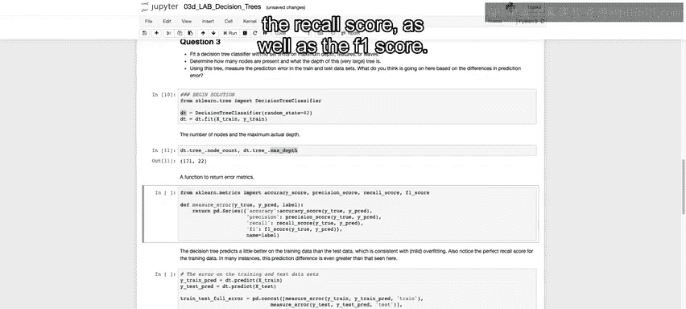

模型拟合完成后，我们可以查看这棵完全生长的树有多大。

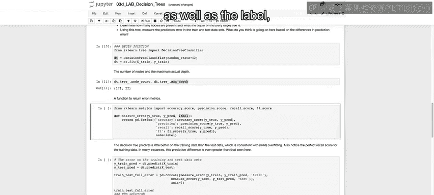


```python
# 获取树的节点总数和最大深度
node_count = dt.tree_.node_count
max_depth = dt.tree_.max_depth
print(f"节点数: {node_count}, 最大深度: {max_depth}")
```
运行代码后，我们得到一棵拥有 **171个节点**、深度达 **22层** 的大树。这印证了在不进行剪枝的情况下，决策树会不断生长，直到完美拟合训练数据。


---

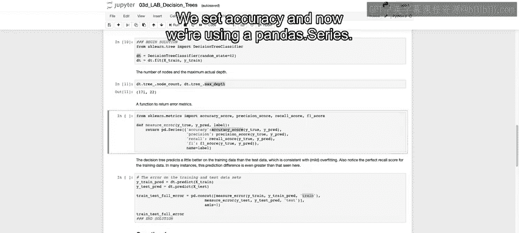

## 评估模型性能

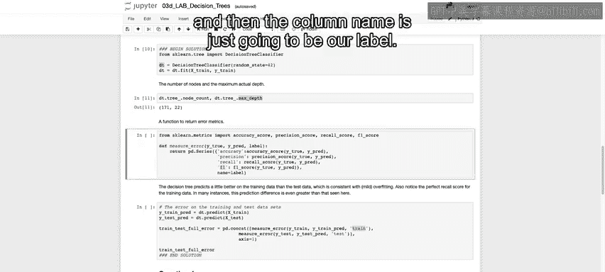

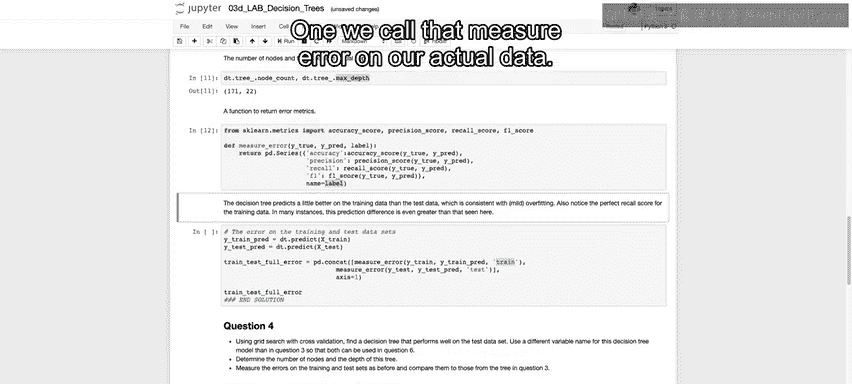

为了全面评估模型，我们需要计算多个误差指标。以下是定义一个计算准确率、精确率、召回率和F1分数的函数。

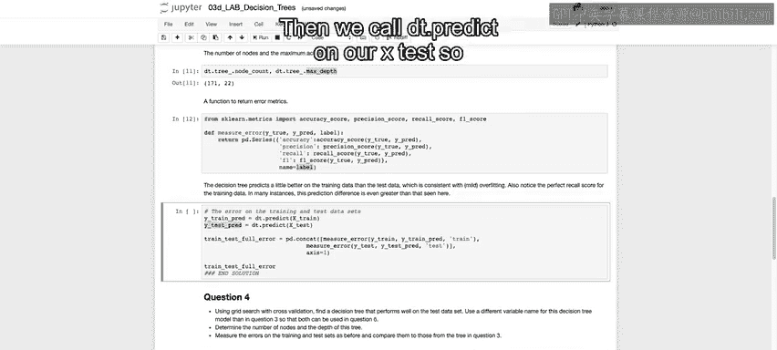

```python
from sklearn.metrics import accuracy_score, precision_score, recall_score, f1_score
import pandas as pd

def measure_error(y_true, y_pred, label):
    '''
    计算并返回分类评估指标。
    参数:
        y_true: 真实标签
        y_pred: 预测标签
        label: 数据集标识（如‘训练集’）
    返回:
        包含各项指标的Pandas Series
    '''
    accuracy = accuracy_score(y_true, y_pred)
    precision = precision_score(y_true, y_pred)
    recall = recall_score(y_true, y_pred)
    f1 = f1_score(y_true, y_pred)

    metrics = pd.Series([accuracy, precision, recall, f1],
                        index=['准确率', '精确率', '召回率', 'F1分数'],
                        name=label)
    return metrics
```


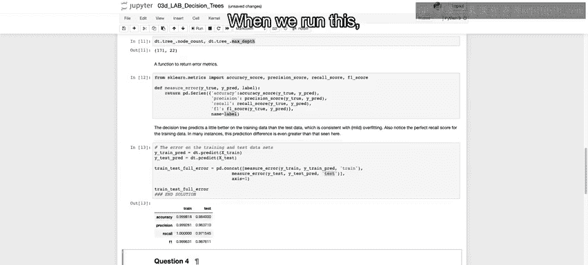

现在，我们使用这个函数来评估未剪枝决策树在训练集和测试集上的表现。

```python
# 对训练集和测试集进行预测
y_train_pred = dt.predict(X_train)
y_test_pred = dt.predict(X_test)

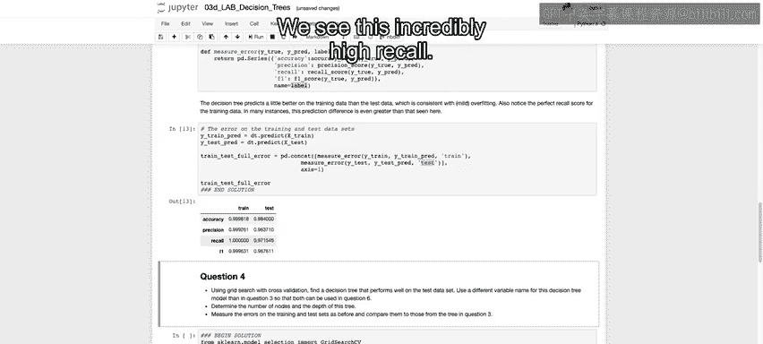


# 计算误差指标
train_metrics = measure_error(y_train, y_train_pred, '训练集')
test_metrics = measure_error(y_test, y_test_pred, '测试集')

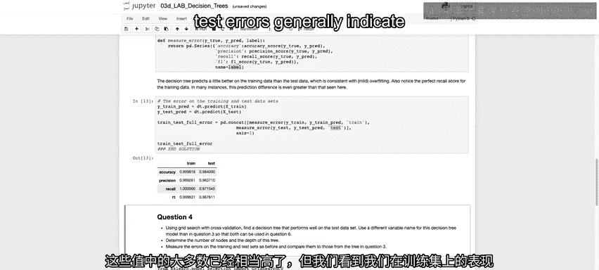


# 将结果并排比较
all_metrics = pd.concat([train_metrics, test_metrics], axis=1)
print(all_metrics)
```


观察输出结果，你会发现模型在**训练集**上的各项指标（尤其是召回率）接近完美。然而，在**测试集**上的表现则有所下降。**训练误差与测试误差之间的这种差距通常是模型过拟合的明确信号**。模型过于复杂，记住了训练数据的噪声，导致泛化能力变差。


---


## 使用网格搜索优化决策树

为了解决过拟合问题，我们需要对决策树进行剪枝。接下来，我们将使用网格搜索配合交叉验证，来寻找最优的超参数组合，以得到一个在测试集上表现更好的模型。


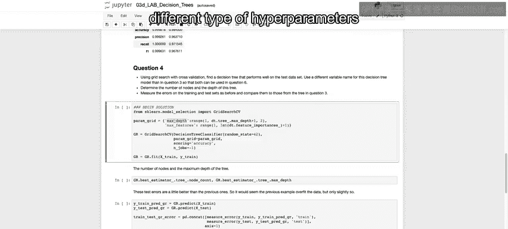

以下是实现网格搜索的步骤：


```python
from sklearn.model_selection import GridSearchCV

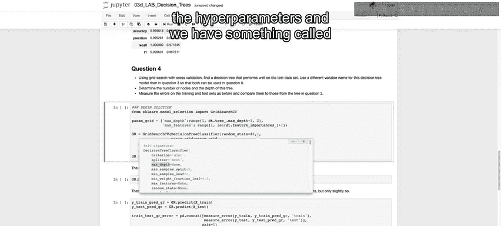

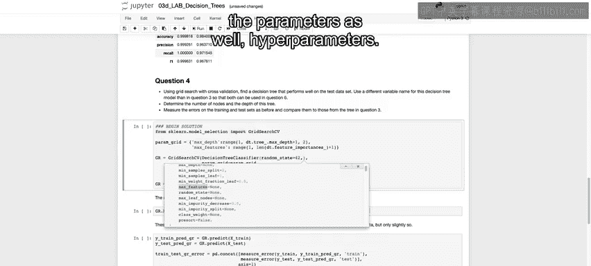

# 1. 定义要搜索的超参数网格
param_grid = {
    'max_depth': range(1, max_depth+1, 2),  # 尝试不同的最大深度
    'max_features': range(1, len(X_train.columns)+1)  # 尝试不同的最大特征数
}

# 2. 初始化网格搜索对象
# 我们以‘准确率’作为优化目标，并使用所有可用的CPU核心并行计算
gr = GridSearchCV(estimator=DecisionTreeClassifier(random_state=42),
                  param_grid=param_grid,
                  scoring='accuracy',
                  n_jobs=-1)


# 3. 在训练集上执行网格搜索
gr.fit(X_train, y_train)

# 4. 获取最优模型
best_dt = gr.best_estimator_
```


搜索完成后，我们可以查看最优模型的复杂程度。

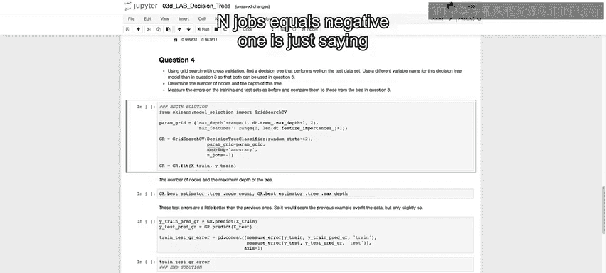


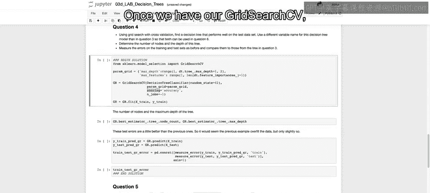

```python
# 获取最优树的节点数和深度
opt_node_count = best_dt.tree_.node_count
opt_max_depth = best_dt.tree_.max_depth
print(f"最优树节点数: {opt_node_count}, 最优树深度: {opt_max_depth}")
```
与未剪枝的树（171节点，22层深）相比，优化后的树只有 **99个节点** 和 **7层深度**，模型变得简洁得多。

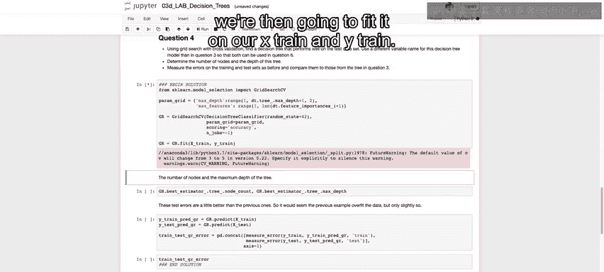

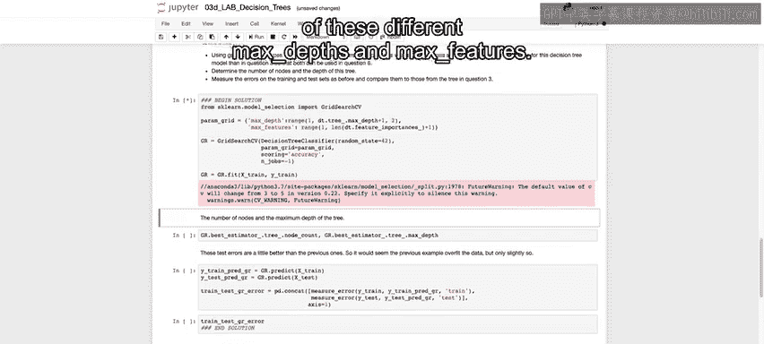

最后，我们评估这个优化后模型的性能。

```python
# 使用最优模型进行预测
y_train_pred_opt = gr.predict(X_train)
y_test_pred_opt = gr.predict(X_test)

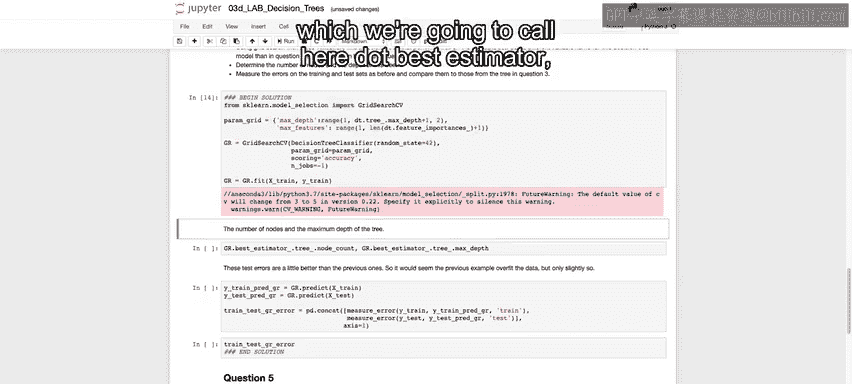

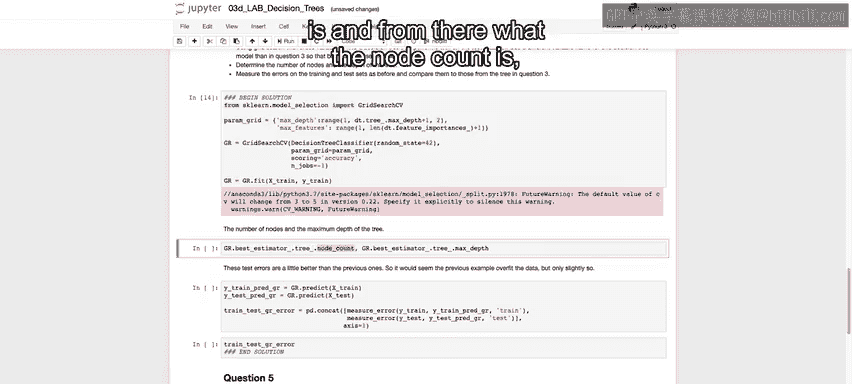

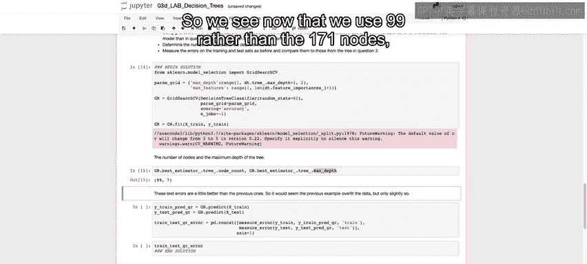

# 计算误差指标
train_metrics_opt = measure_error(y_train, y_train_pred_opt, '训练集（优化后）')
test_metrics_opt = measure_error(y_test, y_test_pred_opt, '测试集（优化后）')

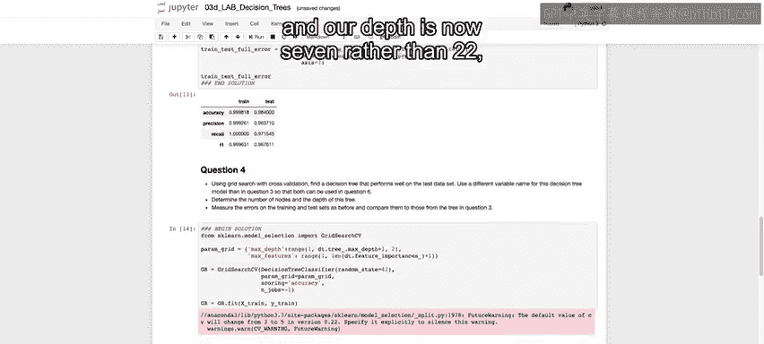

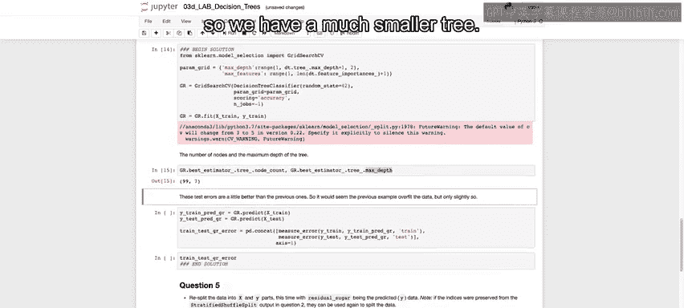

# 比较结果
all_metrics_opt = pd.concat([train_metrics_opt, test_metrics_opt], axis=1)
print(all_metrics_opt)
```

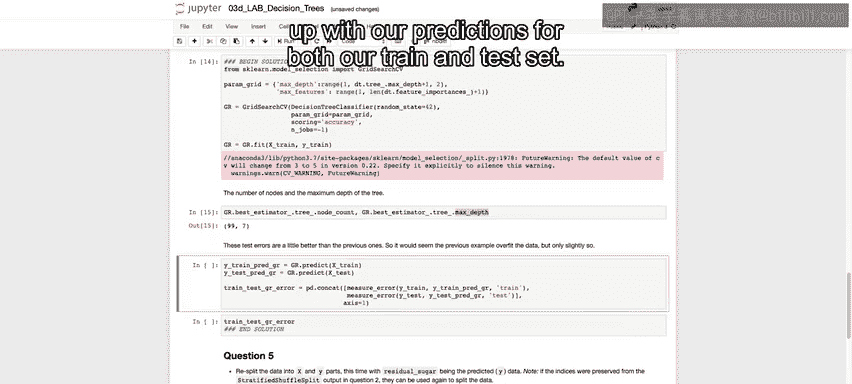

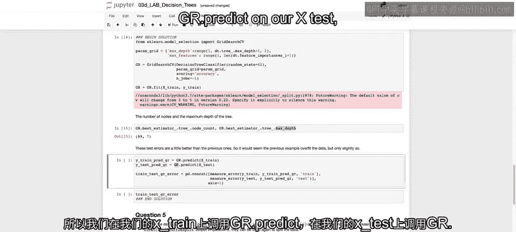

对比优化前后的结果，你会发现：
*   优化后的模型在**训练集**上的性能略有下降，这是剪枝带来的预期结果。
*   但更重要的是，它在**测试集**上的精确率、召回率和F1分数通常都有所**提升**。
*   **训练集与测试集性能之间的差距缩小了**，这表明模型的泛化能力得到增强，过拟合得到了有效控制。

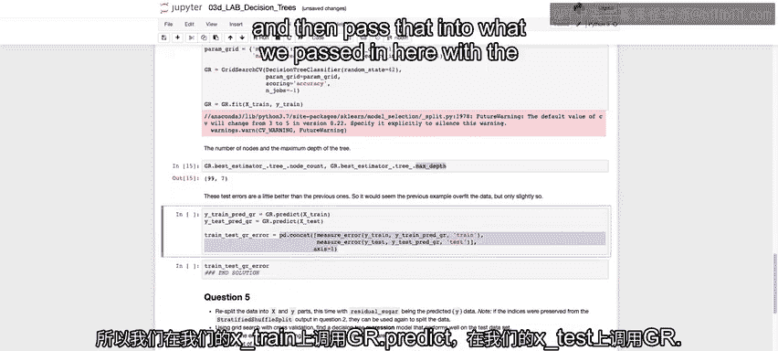

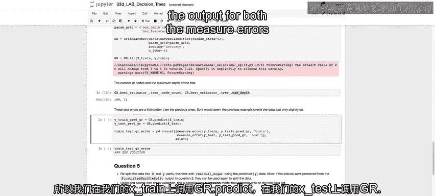

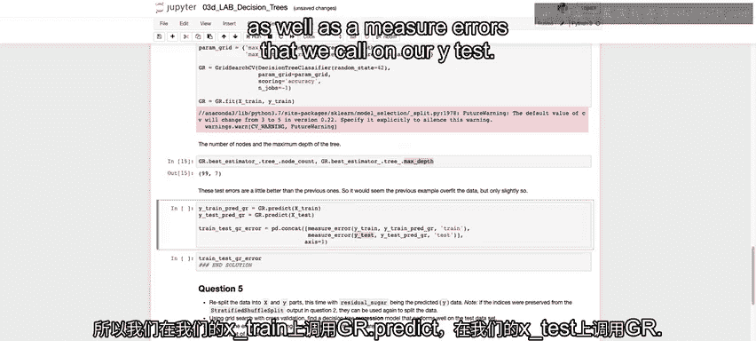

---

## 总结 📝

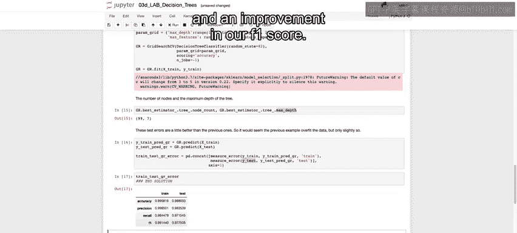

本节课中我们一起学习了决策树实战的两个关键阶段：
1.  **构建与评估未剪枝决策树**：我们首先构建了一个深度、无限制的决策树，观察到它在训练集上近乎完美，但在测试集上表现较差，这清晰地展示了过拟合现象。
2.  **使用网格搜索进行模型优化**：我们通过`GridSearchCV`搜索最佳的超参数（如`max_depth`和`max_features`），得到了一个经过剪枝的、更简洁的决策树。这个新模型虽然对训练数据的拟合程度稍低，但在未知数据（测试集）上的泛化性能更好，有效地缓解了过拟合。

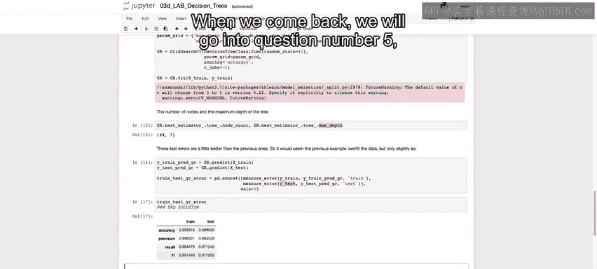

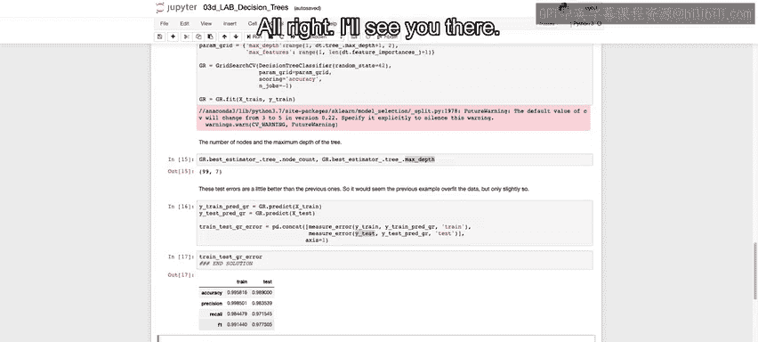


通过本课，你掌握了如何用Scikit-learn构建决策树，如何评估其分类性能，以及如何使用网格搜索这一强大工具来优化模型超参数，从而在偏差与方差之间找到最佳平衡点。