# 130：基于集成的算法与Bagging（第一部分）🎯

在本节课中，我们将学习基于集成的方法和Bagging，以了解如何利用多个模型来获得更好的性能。

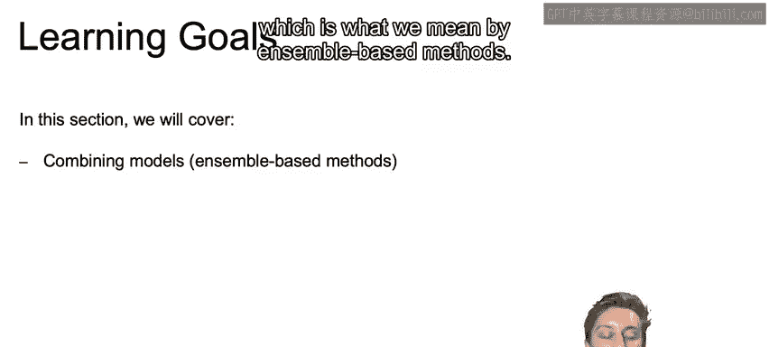

## 概述 📋

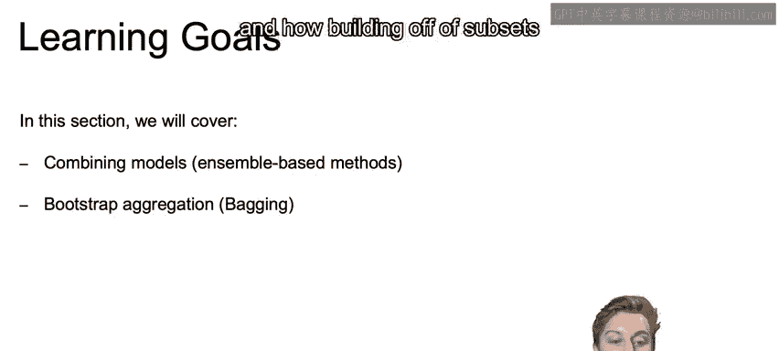

上一节我们介绍了决策树及其潜在的过拟合问题。本节中，我们将探讨一种强大的改进思路：集成学习。集成学习的核心思想是结合多个模型的预测，以获得比单一模型更稳健、更准确的结果。我们将首先了解集成方法的威力，然后深入讲解其第一种具体实现——Bootstrap Aggregation，即Bagging。

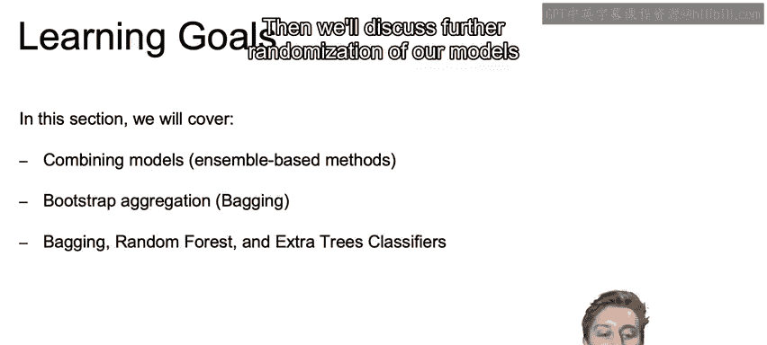

## 学习目标 🎯

在本节中，我们将涵盖以下内容：
*   结合模型的力量（即基于集成的方法）。
*   自助聚合（Bagging）及其如何通过数据子集构建模型来提升性能。
*   在Bagging基础上进一步随机化模型，引入随机森林和极端随机树分类器。

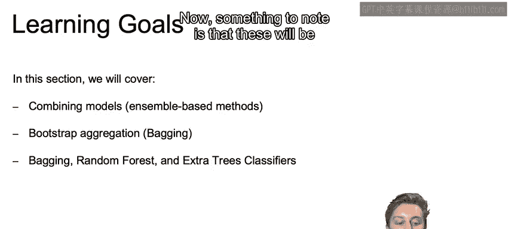

需要注意的是，这些模型在处理**分层数据**时非常强大，能显著提高预测精度。在这些数据中，预测变量与目标变量之间很少存在线性、对数线性或多项式关系。

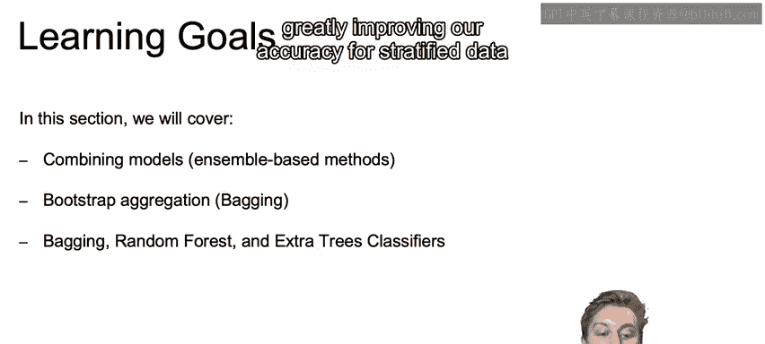

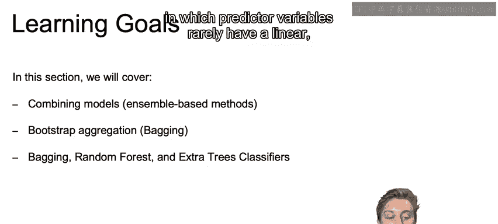

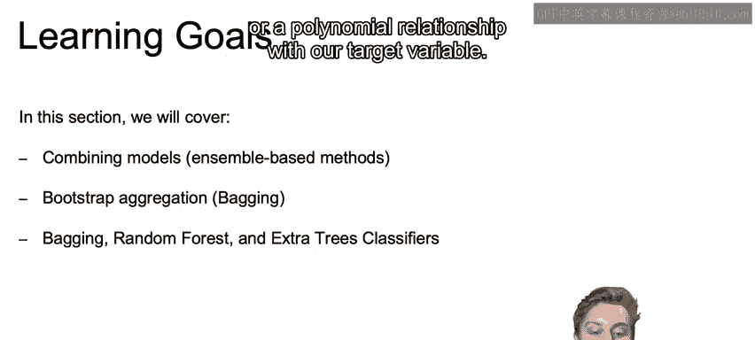

与决策树类似，这些集成方法能够处理复杂的决策边界，同时有效管理决策树带来的过拟合风险，控制模型方差。

## 从决策树到集成方法 🌳➡️🤝

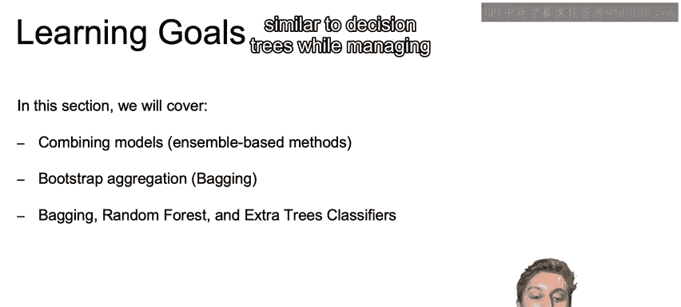

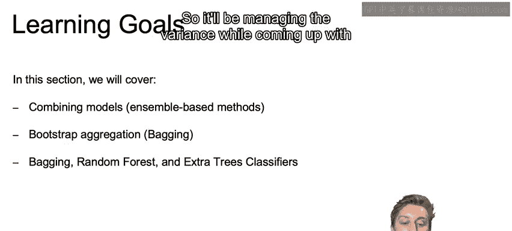

我们已经在实验中发现，决策树经常会过拟合训练数据。

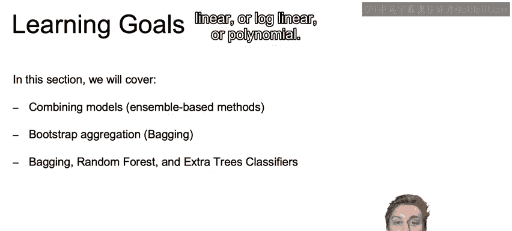

我们讨论过可以通过剪枝来帮助减轻这种影响，但通常单纯的剪枝并不能完全解决决策树从特定训练集中“死记硬背”学习类别的问题。

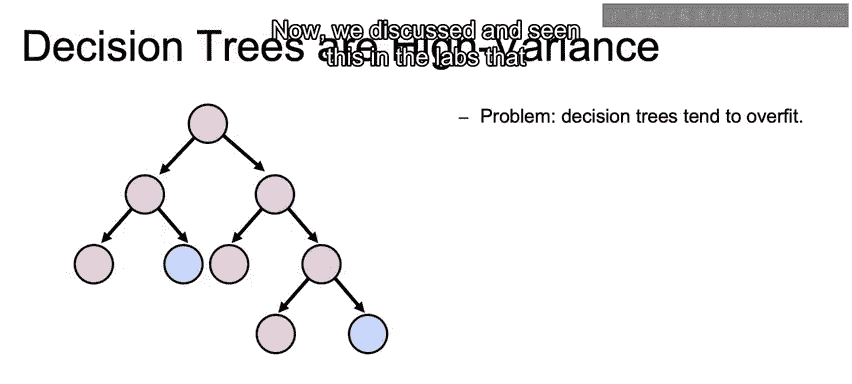

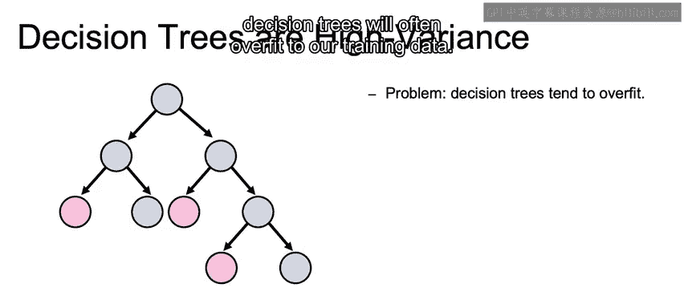

因此，我们有其他可能更好的方法。

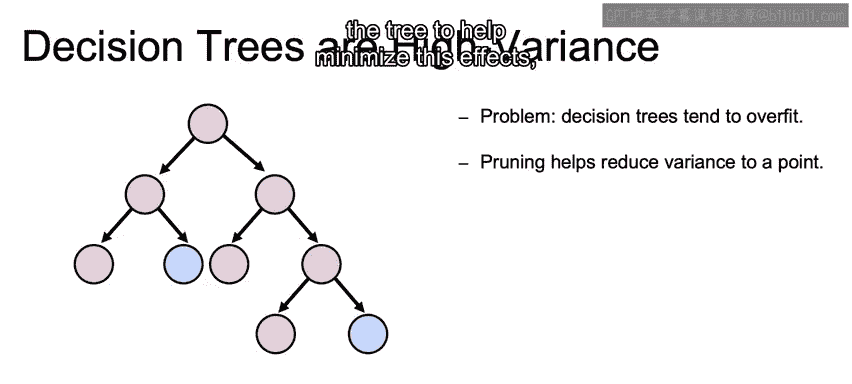

## 集成与Bagging的核心概念 💡

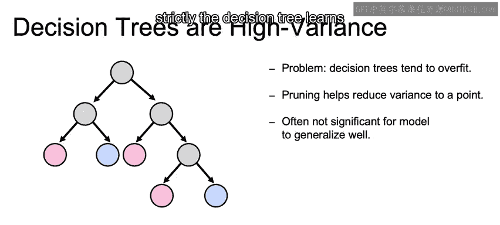

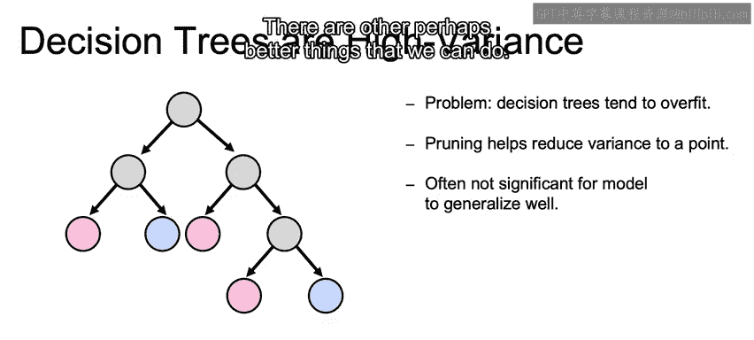

一种比单纯剪枝更好的改进方法是：创建许多不同的决策树。

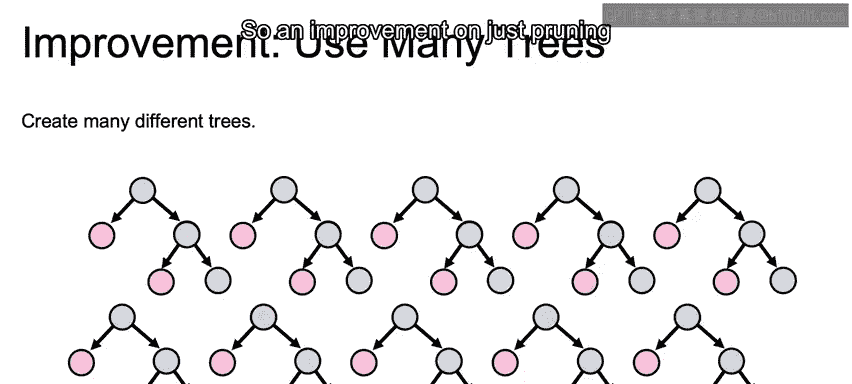

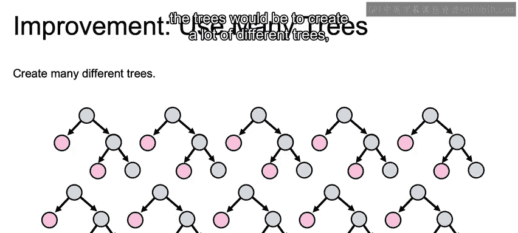

然后，通过结合这些众多不同树的预测，我们可以减少模型的方差。

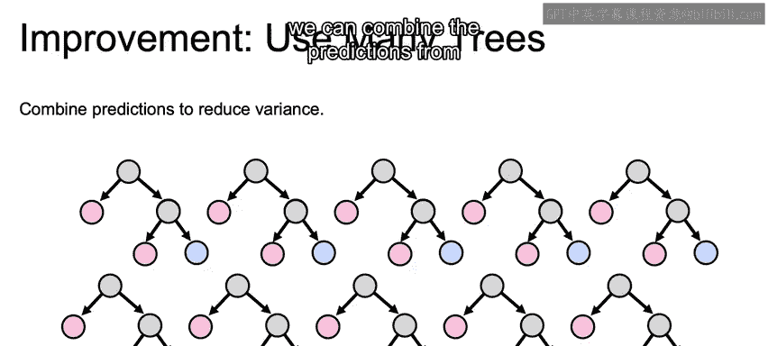

以上就是对集成学习和Bagging概念的初步介绍。在下一个视频中，我们将深入了解这些方法在实践中是如何实现的。

## 总结 ✨

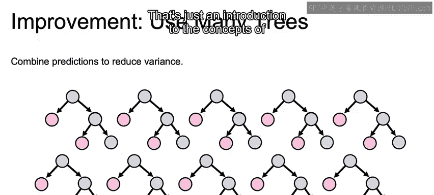

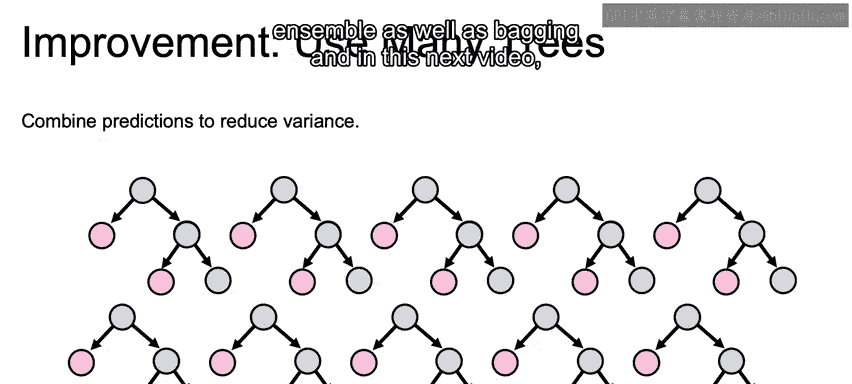

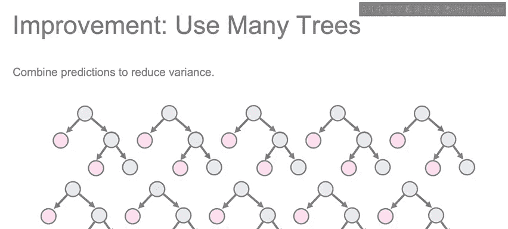

本节课我们一起学习了集成学习的基本理念及其优势。我们了解到，通过组合多个模型（特别是决策树）的预测，可以有效降低单一模型可能存在的方差和过拟合风险。这为我们引入Bagging这一具体技术做好了铺垫，下一部分我们将深入探讨Bagging的工作原理。