# 131：集成算法与Bagging（第二部分）🎯

在本节课中，我们将学习如何利用基于自助采样法（Bootstrap）构建的多个决策树，并通过投票机制将它们组合成一个更强大的分类器。我们将深入探讨Bagging（自助聚合）的核心思想及其工作流程。

上一节我们介绍了如何通过自助采样法创建多个训练子集并构建不同的决策树。本节中我们来看看如何整合这些树的预测结果。

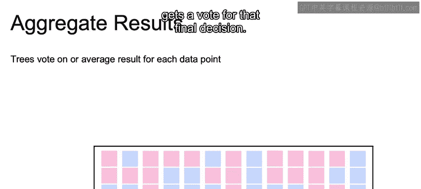

## 如何利用基于自助采样的不同决策树？🤔

关键在于，每棵树都对最终的分类决策拥有一票投票权。

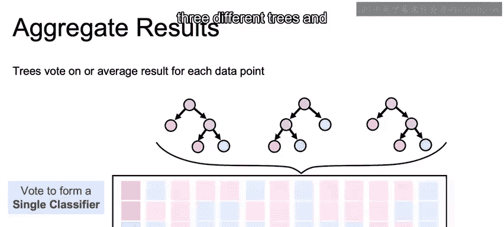

如图所示，我们从三棵不同的决策树开始。

然后，我们将使用这三棵树对一个样本的分类结果进行投票。

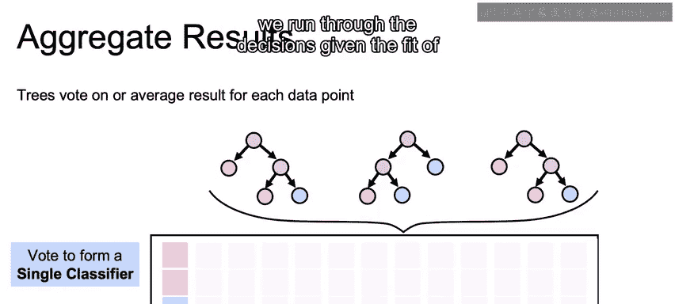

对于数据集中的某一行数据，我们让每棵已训练好的树分别进行预测。

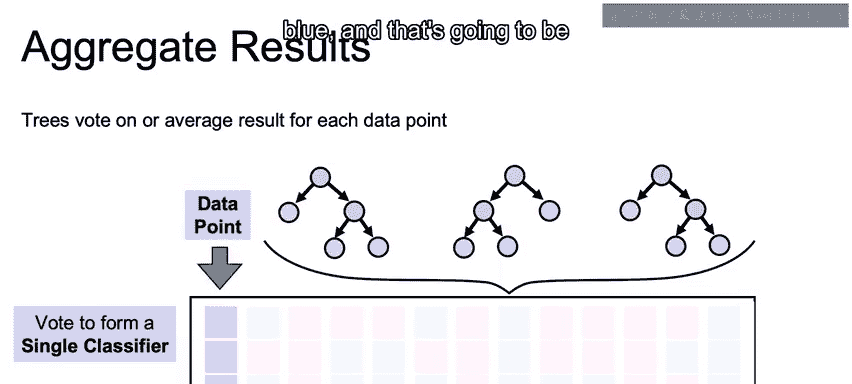

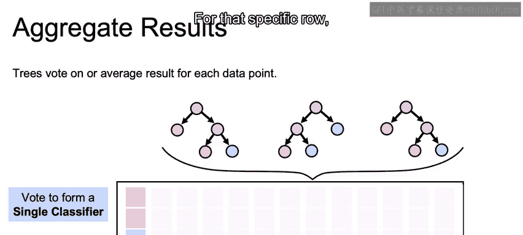

针对这一行数据，我们可以根据所有树的预测结果得出多数类。

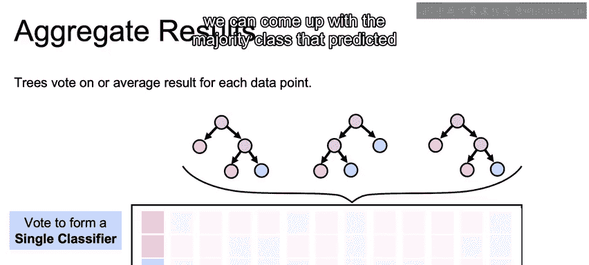

我们可以对数据集中的所有行重复这一过程。

以下是具体步骤：
1.  取数据集中的每一行数据。
2.  查看每棵树对该行数据的预测类别。
3.  统计出现次数最多的类别，即多数类。

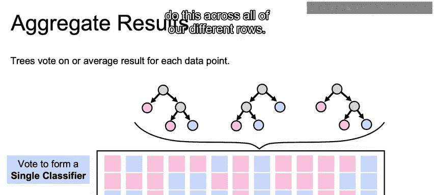

这个通过整合多个分类器输出、以投票方式决定最终类别的过程，被称为**元分类（Meta Classification）**。

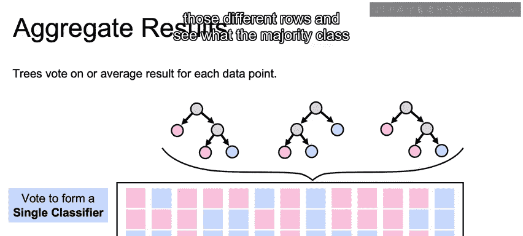

## 投票机制示例 🗳️

举个例子，回顾我们第一行数据的情况。

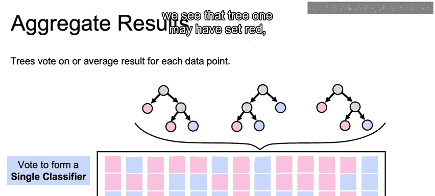

假设第一棵树预测为“红色”，第二棵树也预测为“红色”，而第三棵树预测为“蓝色”。

我们采用民主投票机制：两票“红色”对一票“蓝色”，因此最终决策为“红色”。

## 理解Bagging（自助聚合） 📦

在引言中我们提到了“Bagging”这个术语。**Bagging** 是 **Bootstrap Aggregating** 的缩写，这正是我们上面所阐述的完整流程。

其过程可以概括为两个核心步骤：

1.  **Bootstrap（自助采样）**：通过有放回抽样获取多个较小的训练样本子集。
    

2.  **Aggregating（聚合）**：在每个样本子集上构建决策树，然后通过投票等方式将所有树的预测结果整合起来。
    
    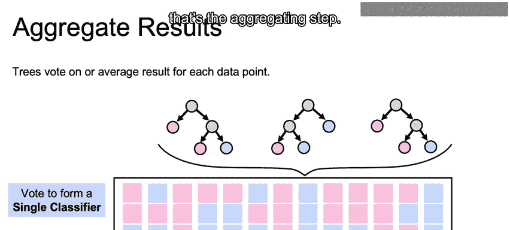
    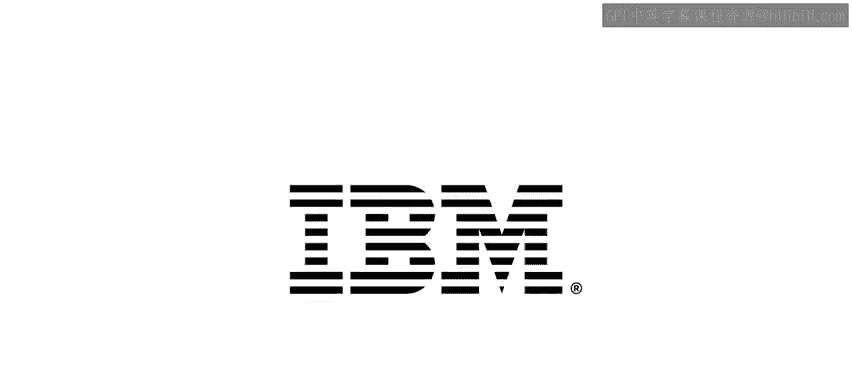

因此，**Bagging = Bootstrap + Aggregating**。

---

本节课中我们一起学习了Bagging算法的工作原理。我们了解到，Bagging通过结合多个基于自助采样训练的基学习器（如决策树）的预测，并采用**多数投票**的机制来形成最终决策，从而降低模型方差，提升整体泛化能力和稳定性。