# 132：基于集成的算法与Bagging（第三部分）🌳

在本节课中，我们将学习Bagging算法的核心概念、它与基础决策树的异同，以及如何在实践中使用代码实现Bagging分类器。我们还将探讨如何通过调整超参数来优化模型性能。

---

## Bagging中的树数量决策 🌲

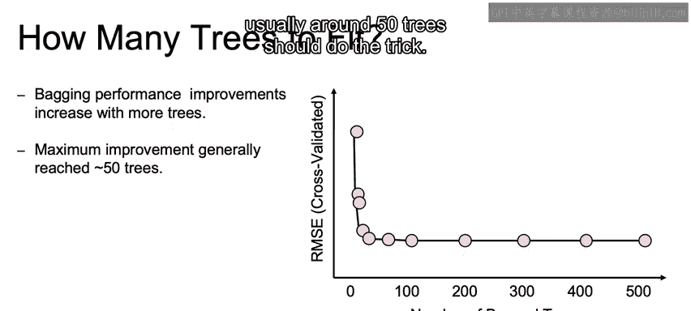

上一节我们介绍了Bagging的基本原理，本节中我们来看看如何决定Bagging模型中树的数量。

树的数量是Bagging算法中一个可调节的超参数。树的数量越多，决策树（或Bagging技术本身）过拟合的可能性就越低。在实践中，增加树的数量会带来收益递减效应，通常**约50棵树**就能达到良好的效果。

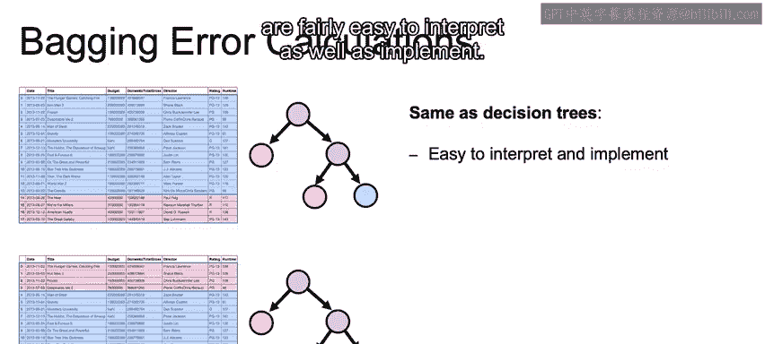

## Bagging树与基础决策树的异同 🔄

以下是Bagging算法（基于决策树构建）与基础决策树的主要相似点和区别。

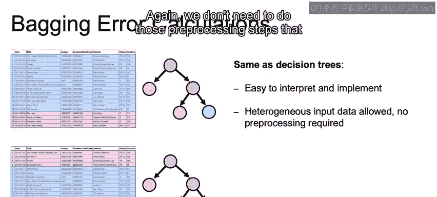

### 相似点

与决策树类似，Bagging树也相对容易解释和实现。

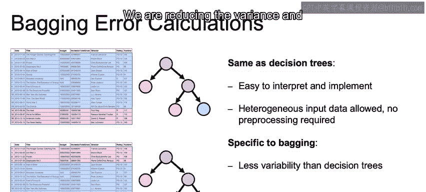


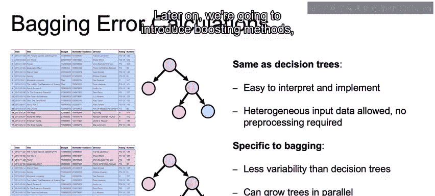

它可以轻松处理不同的数据类型，无需进行预处理。因此，我们不需要像处理某些线性分类器那样执行预处理步骤。


### 区别（Bagging特有）

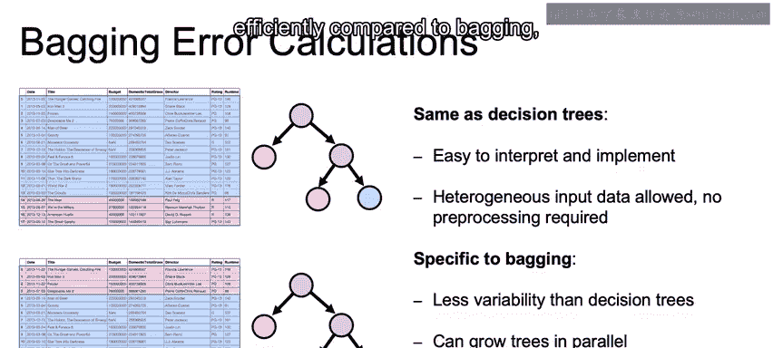

与单一决策树相比，Bagging算法具有以下特点：

*   **方差降低**：Bagging减少了模型的方差，从而降低了过拟合的风险。
    
*   **与后续方法的比较**：我们后续将介绍Boosting方法。
    
    Boosting也可以基于决策树构建，但其计算效率不如Bagging。因为Bagging可以**并行生长多棵树**，每棵树仅依赖于自己的数据集，彼此独立。而Boosting无法并行建树，因此计算效率较低。
    
    
    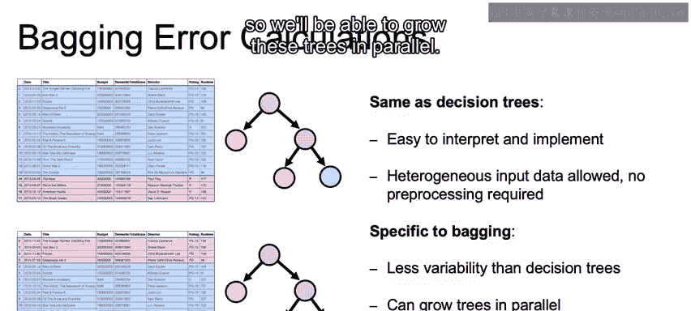

## Bagging算法代码实现 💻


了解了理论之后，现在让我们看看如何用代码实现Bagging。

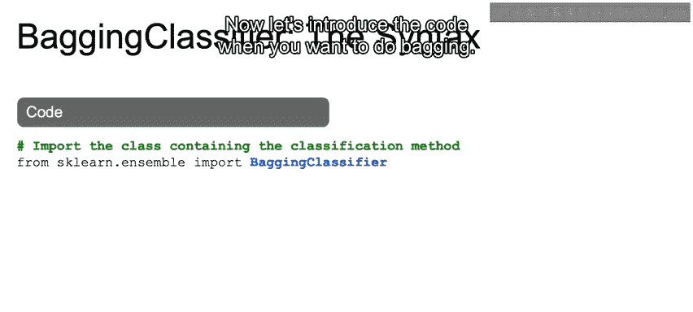

以下是使用`scikit-learn`实现Bagging分类器的基本步骤：

1.  **导入必要的模块**：从`sklearn.ensemble`中导入`BaggingClassifier`。
2.  **设置超参数并初始化**：关键超参数`n_estimators`代表树的数量，例如我们将其设置为50，然后初始化分类器对象。
3.  **训练模型**：在训练集上调用`fit`方法拟合模型。
4.  **进行预测**：在测试集上调用`predict`方法进行预测。
5.  **超参数调优**：可以使用交叉验证等方法来调整`n_estimators`等参数，这是机器学习优化中的常见步骤。

**代码示例核心结构**：
```python
from sklearn.ensemble import BaggingClassifier

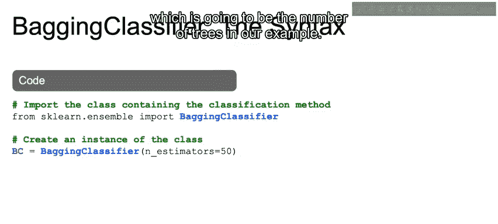

# 初始化Bagging分类器，设置树的数量为50
bc = BaggingClassifier(n_estimators=50)
# 在训练数据上拟合模型
bc.fit(X_train, y_train)
# 在测试数据上进行预测
predictions = bc.predict(X_test)
```

如果需要解决回归问题，只需使用`BaggingRegressor`而不是`BaggingClassifier`。

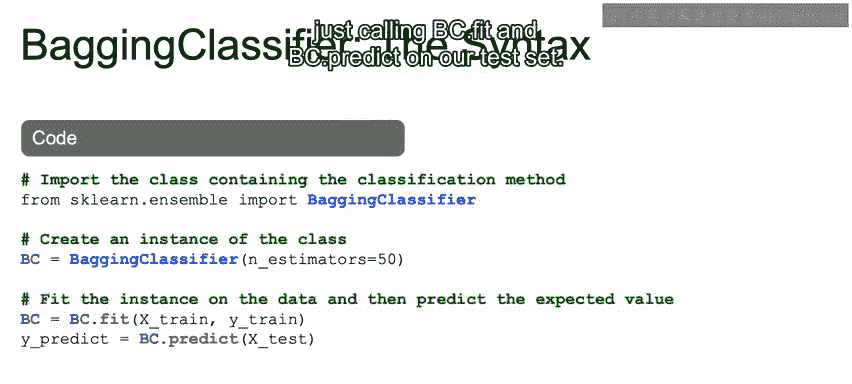


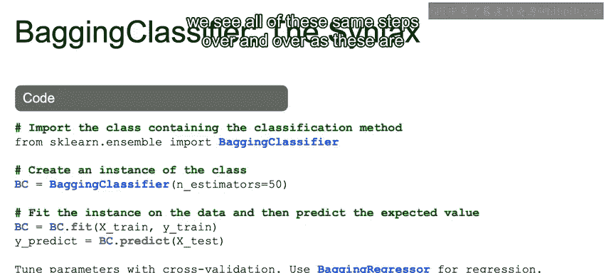

---

## 总结与预告 📚


本节课中我们一起学习了Bagging算法的关键内容。我们明确了树的数量（`n_estimators`）是一个重要的超参数，通常设置为50左右即可。我们比较了Bagging树与基础决策树在可解释性、无需预处理方面的相似性，以及Bagging在降低方差、减少过拟合和能够并行计算方面的独特优势。最后，我们演示了使用`scikit-learn`实现Bagging分类器的标准代码流程。

在下一个视频中，我们将探讨如何将Bagging的随机性更进一步，从而引出您可能更熟悉的算法——随机森林。

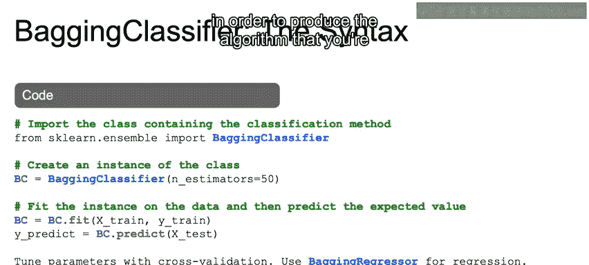

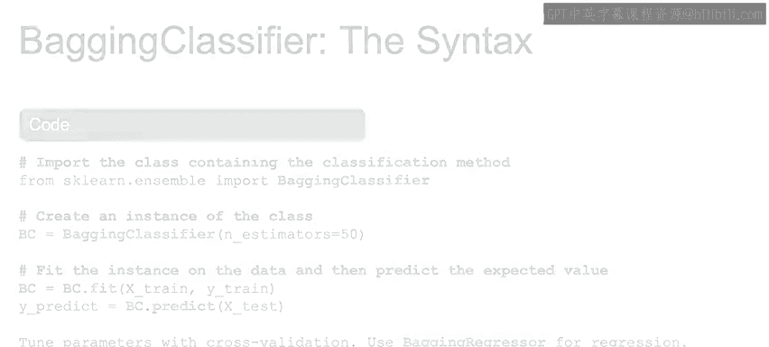


