# 134：Bagging 笔记本（选修部分）第1部分 📊

在本节课中，我们将学习如何使用Bagging方法处理客户流失数据。我们将从导入和处理数据开始，检查特征相关性，并准备训练集和测试集。

---

## 导入必要库与数据

首先，我们需要导入所有必要的Python库。

```python
import pandas as pd
import numpy as np
import matplotlib.pyplot as plt
import seaborn as sns
```

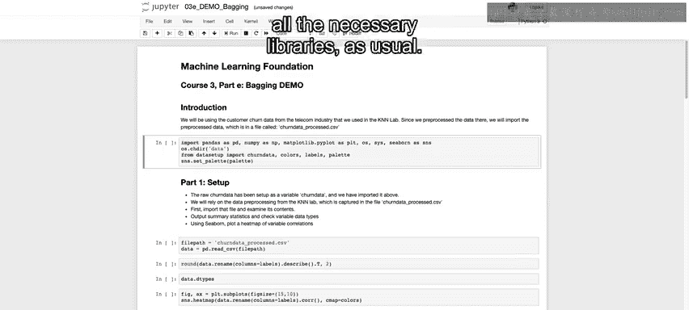

接着，导入我们预先处理好的数据。该数据来自电信行业的客户流失数据集，我们之前在K近邻实验中介绍过。

```python
data = pd.read_csv('churn_data_processed.csv')
```

我们使用`.describe()`方法来查看数据集中各列的统计摘要。

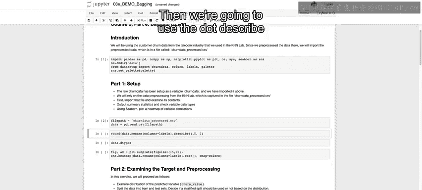

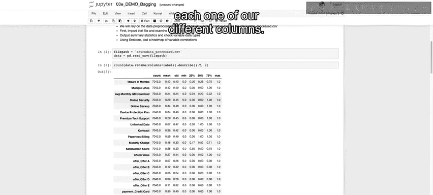

```python
data.describe()
```

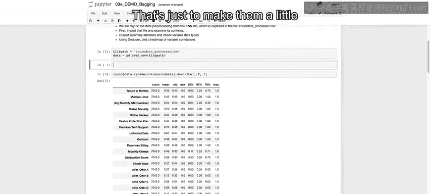

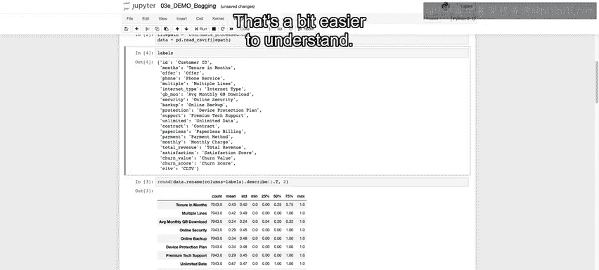

为了更容易理解，我们根据预定义的标签重命名列名。

```python
labels = ['Tenure in Months', 'Monthly Charge', 'Total Charges', ...]  # 示例标签
data.columns = labels
```

所有数值都已被缩放到0到1之间，并且都是数值类型（浮点数或整数）。

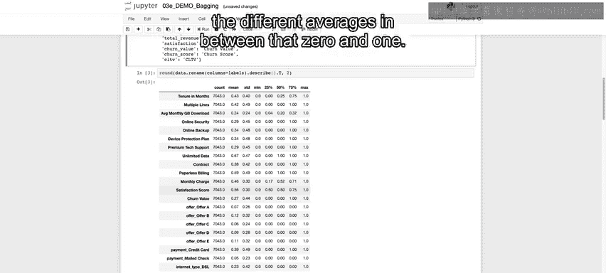

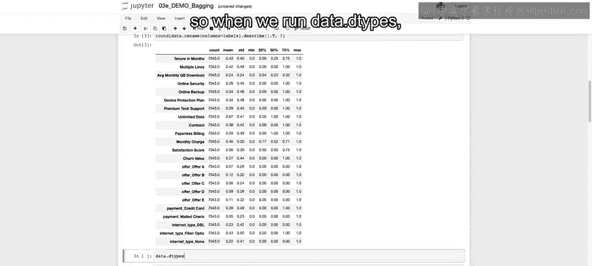

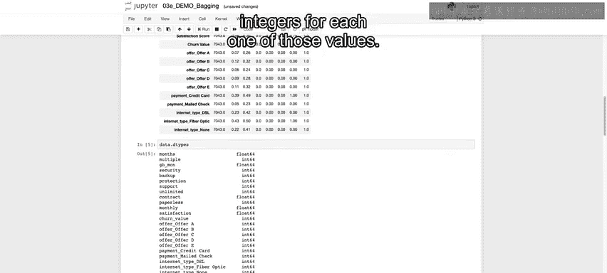

```python
data.dtypes
```

---

## 检查特征相关性

上一节我们导入了数据，本节中我们来看看特征之间的相关性。这有助于我们理解哪些特征对预测目标变量（客户流失）可能更重要。

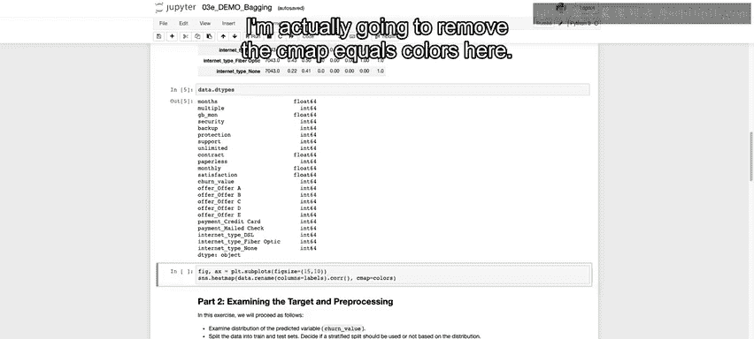

以下是生成相关性矩阵的步骤。

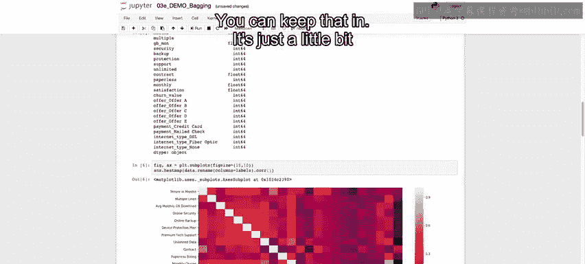

首先，设置图形尺寸。

```python
plt.figure(figsize=(15, 10))
```

然后，计算并绘制相关性热图。

```python
sns.heatmap(data.corr(), annot=True, fmt='.2f', cmap='coolwarm')
plt.show()
```

从热图中，我们可以看到“客户流失值”与“满意度评分”呈负相关，这符合逻辑：满意度越高，流失可能性越低。同时，“合同类型”与“在网月数”高度相关，合同期限越长，在网时间通常也越长。

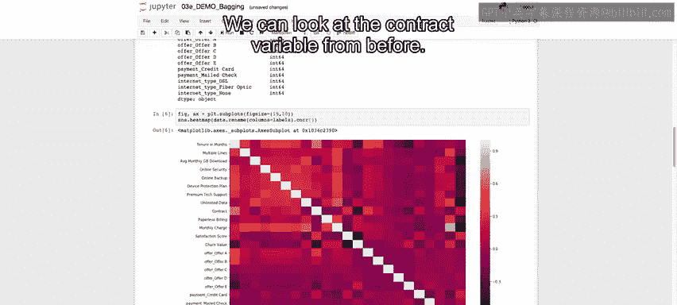

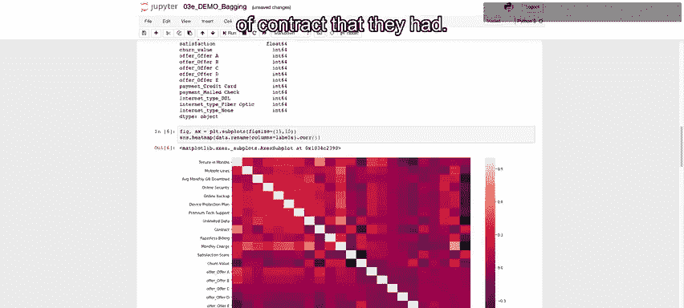

---

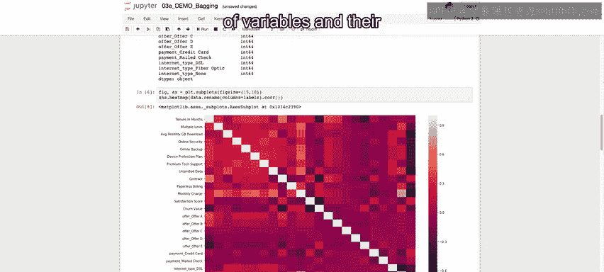

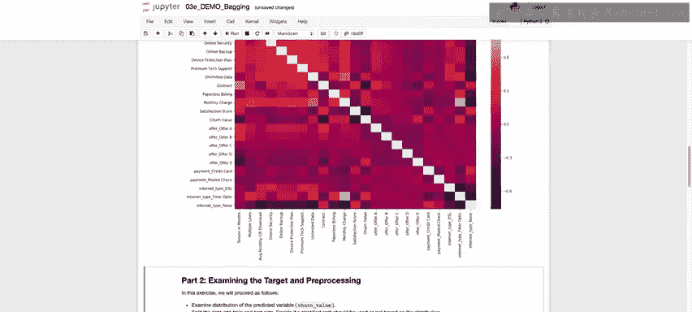

## 检查目标变量与数据分割

在分析了特征相关性之后，我们需要检查目标变量的分布，并将数据分割为训练集和测试集。

首先，将目标变量设置为“客户流失值”。

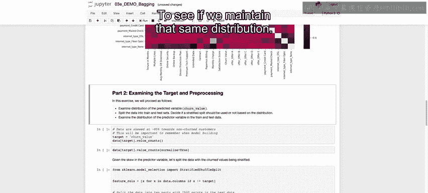

```python
target = data['Churn Value']
```

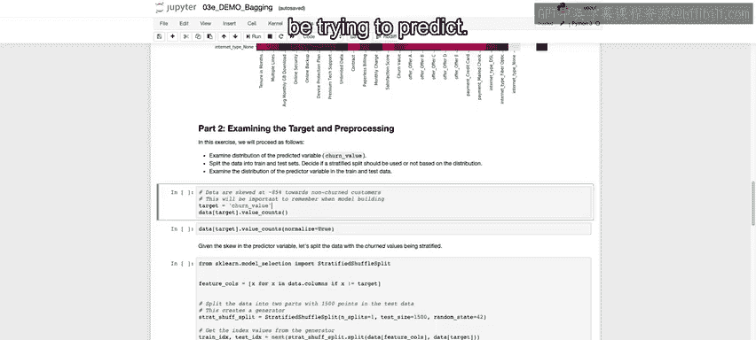

查看目标变量的分布情况。

```python
target.value_counts()
target.value_counts(normalize=True)
```

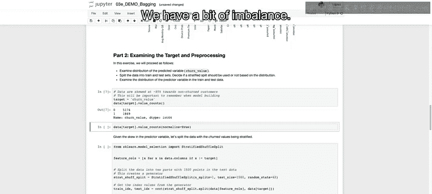

结果显示，大约73.5%的客户没有流失，26.5%的客户流失了。考虑到这种不平衡分布，我们决定使用分层抽样来分割数据，以确保训练集和测试集中流失客户的比例保持一致。

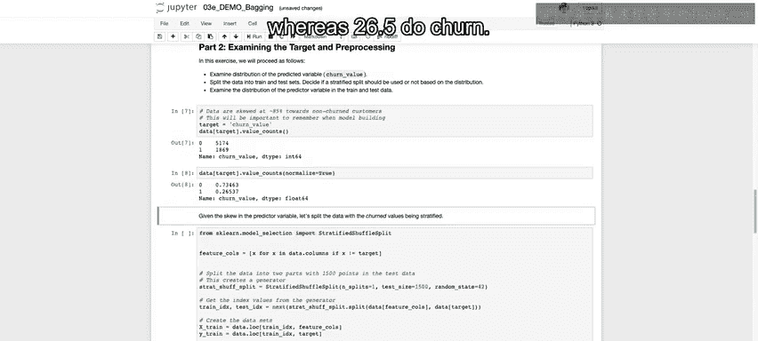

以下是实施分层抽样的步骤。

导入必要的模块。

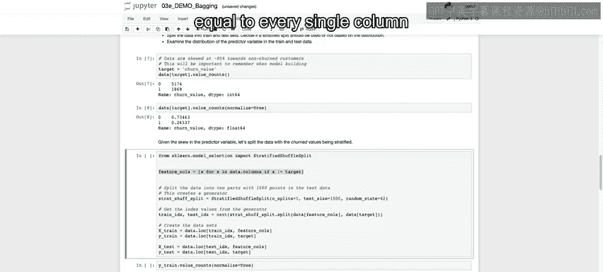

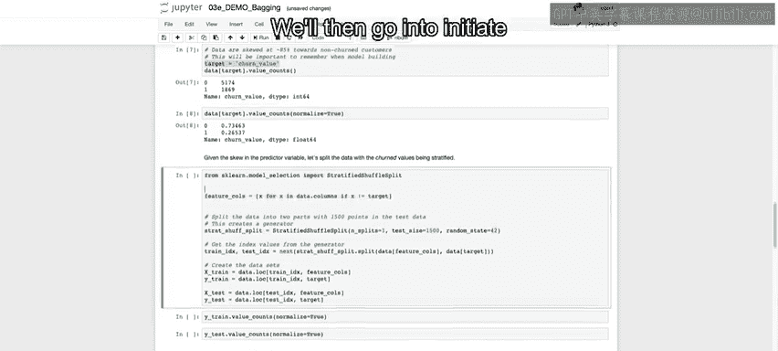

```python
from sklearn.model_selection import StratifiedShuffleSplit
```

定义特征列（排除目标变量）。

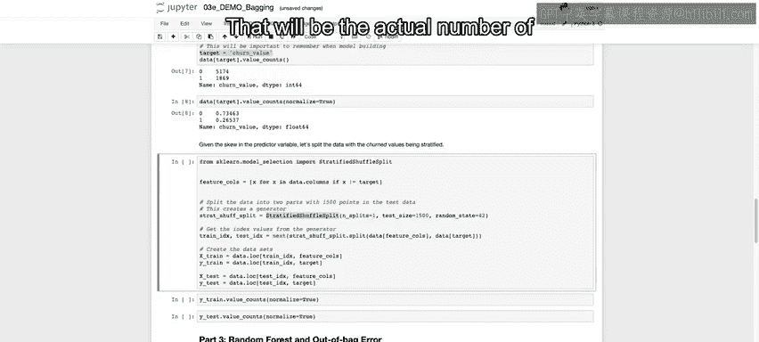

```python
feature_columns = data.columns.drop('Churn Value')
```

初始化分层抽样分割对象。这里我们指定只进行一次分割，并设置测试集的具体样本数量。

```python
sss = StratifiedShuffleSplit(n_splits=1, test_size=1000, random_state=42)
```

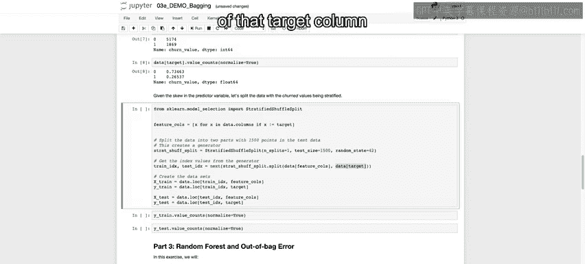

生成训练集和测试集的索引。

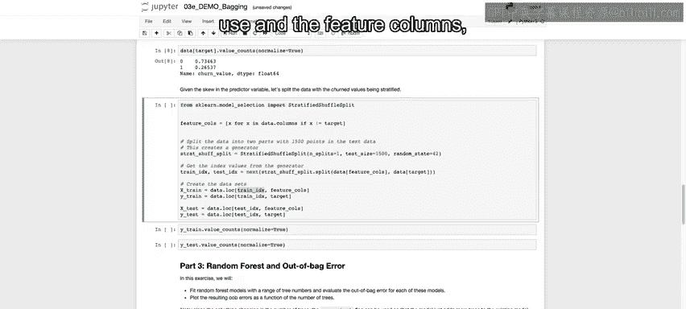

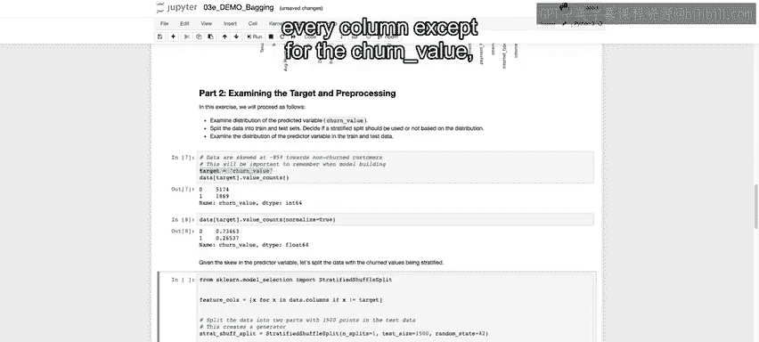

```python
for train_index, test_index in sss.split(data[feature_columns], target):
    X_train = data.loc[train_index, feature_columns]
    y_train = target.loc[train_index]
    X_test = data.loc[test_index, feature_columns]
    y_test = target.loc[test_index]
```

最后，检查分割后训练集和测试集中目标变量的分布是否保持一致。

```python
print(y_train.value_counts(normalize=True))
print(y_test.value_counts(normalize=True))
```

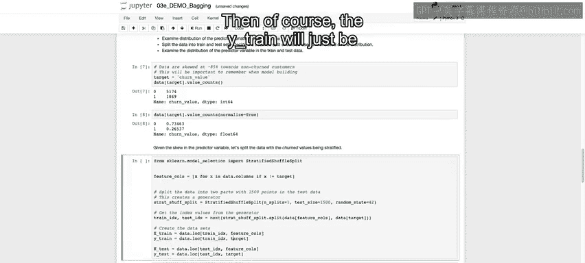

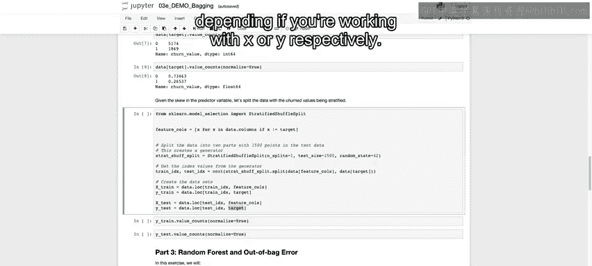

---

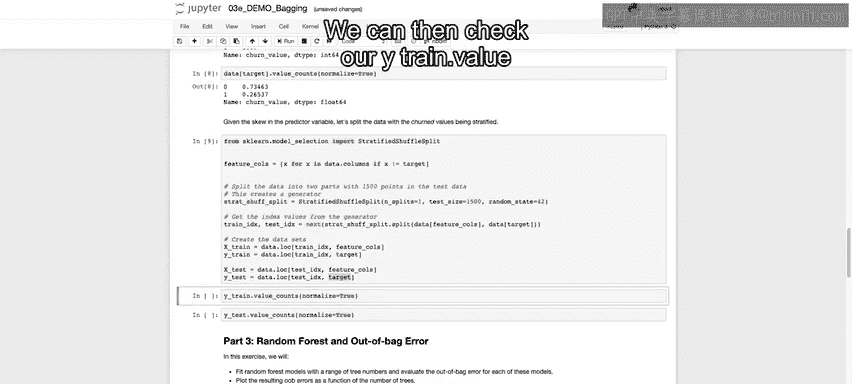

## 总结

本节课中我们一起学习了Bagging方法实践的第一步：数据准备。我们导入了预处理过的客户流失数据，检查了特征间的相关性，并针对不平衡的目标变量使用了分层抽样方法将数据分割为训练集和测试集。在下一部分，我们将开始介绍如何实现随机森林并检查袋外误差。

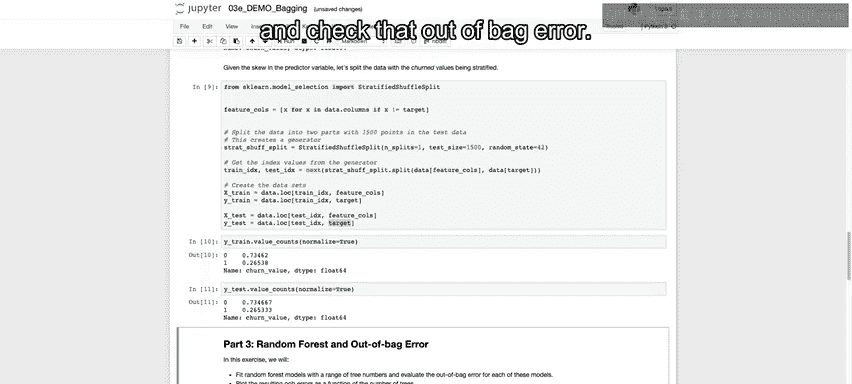


---