# 136：Bagging笔记本（选修部分）第3部分 📊

在本节课中，我们将学习如何评估一个表现较好的Bagging模型（随机森林），并计算和可视化一系列分类评估指标。我们将涵盖从获取预测概率到绘制ROC曲线、精确率-召回率曲线以及特征重要性图的完整流程。

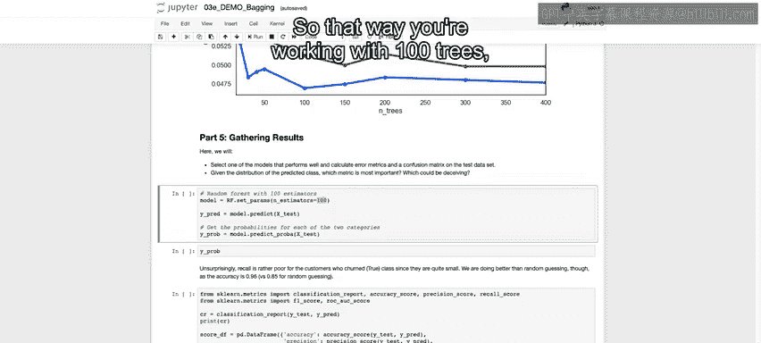

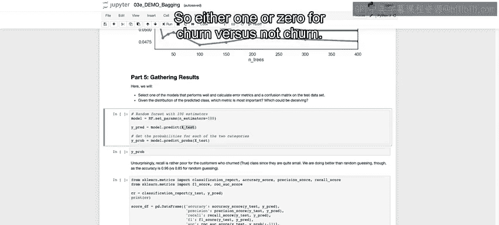

---

## 模型评估与指标计算 🔍

上一节我们介绍了Bagging和随机森林的基本原理。本节中，我们来看看如何对一个训练好的随机森林模型进行全面的评估。

首先，我们选择一个表现较好的模型配置，即包含100棵决策树的随机森林模型。

```python
model = RandomForestClassifier(n_estimators=100)
model.fit(X_train, y_train)
```

接着，我们使用该模型对测试集 `X_test` 进行预测，得到类别标签（流失/未流失）。

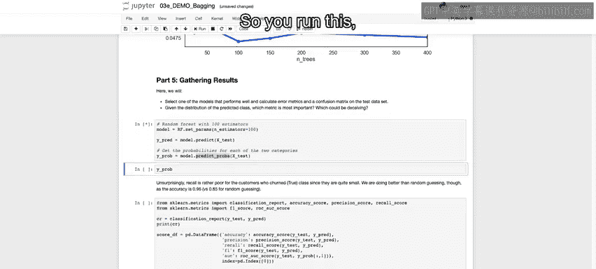

```python
y_pred = model.predict(X_test)
```

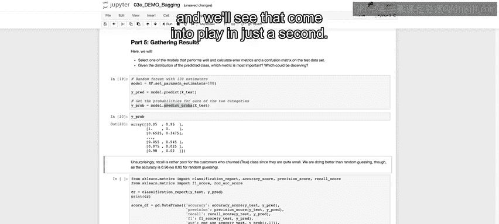

同时，我们还需要计算预测概率，这对于计算ROC AUC分数至关重要。

```python
y_prob = model.predict_proba(X_test)
```

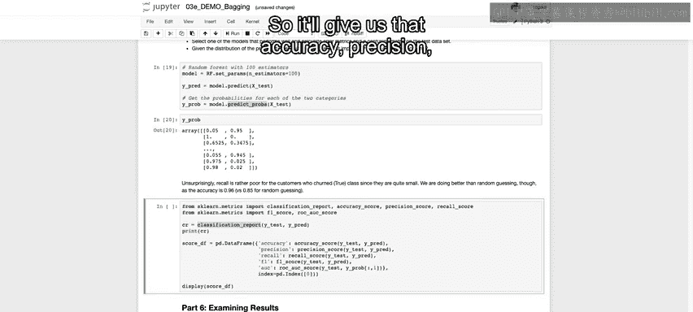

**预测概率的计算原理**：对于单棵决策树，如果某个叶子节点包含10个样本，其中9个是“流失”，1个是“未流失”，那么模型预测为“流失”的概率就是90%。对于随机森林，最终的概率是所有决策树对该样本预测概率的平均值。

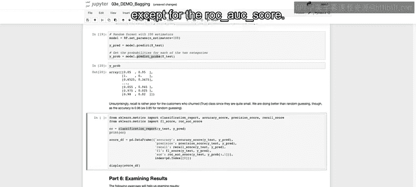

以下是计算并输出各项分类指标的具体步骤。

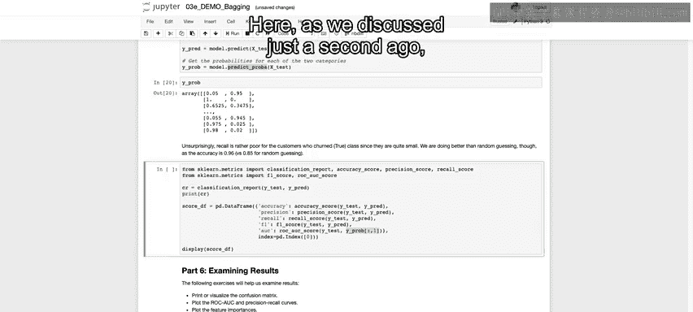

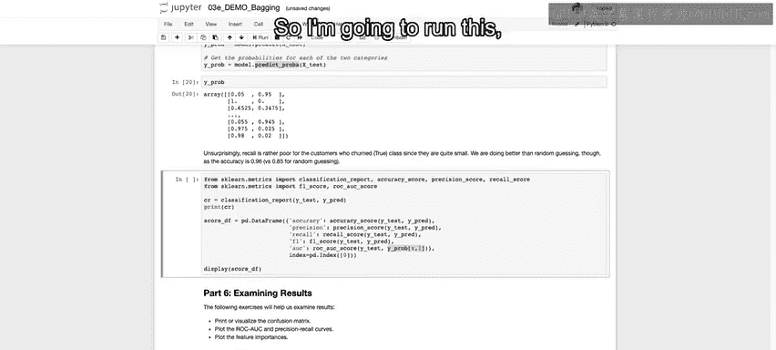

首先，导入必要的评估指标模块。

```python
from sklearn.metrics import classification_report, accuracy_score, precision_score, recall_score, f1_score, roc_auc_score
```

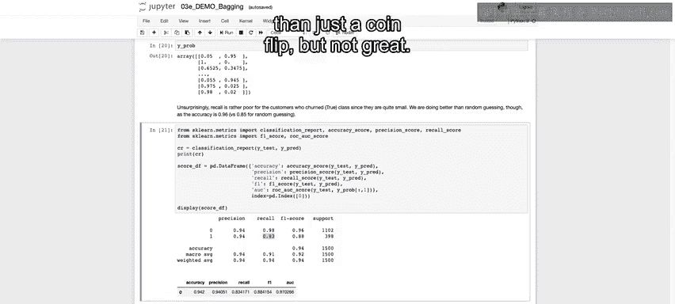

使用 `classification_report` 可以一次性获得正负类别的多项指标。

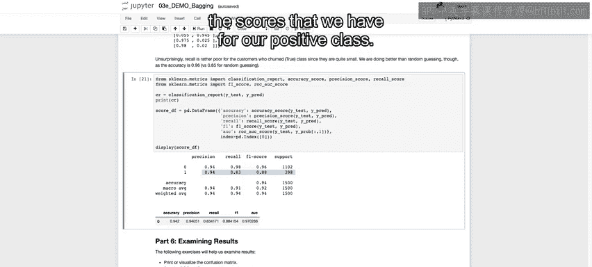

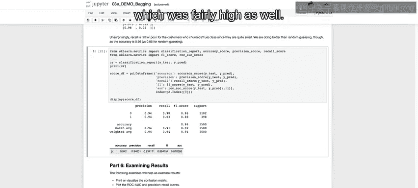

```python
print(classification_report(y_test, y_pred))
```

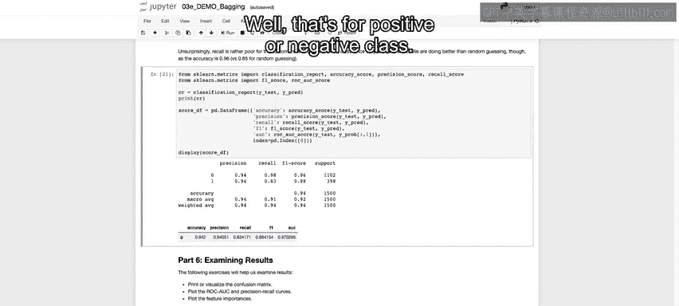

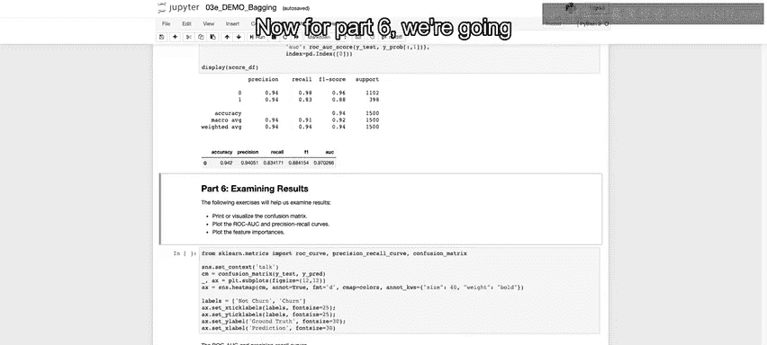

为了确保计算准确，我们也可以单独计算针对正类别（“流失”）的各项指标以及ROC AUC分数。注意，计算ROC AUC时需要传入正类别的预测概率（即 `y_prob` 的第二列）。

```python
accuracy = accuracy_score(y_test, y_pred)
precision = precision_score(y_test, y_pred)
recall = recall_score(y_test, y_pred)
f1 = f1_score(y_test, y_pred)
roc_auc = roc_auc_score(y_test, y_prob[:, 1]) # 使用正类别的概率
```

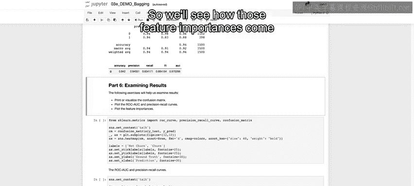

运行代码后，我们可以看到模型在负类别（样本多）上表现较好，而在正类别（“流失”，样本少）上的召回率等指标虽然优于随机猜测，但仍有提升空间。单独计算的指标值与分类报告中的结果一致。

---

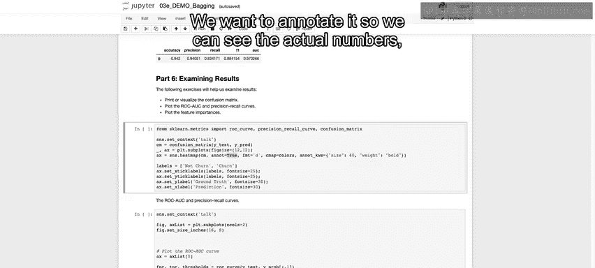

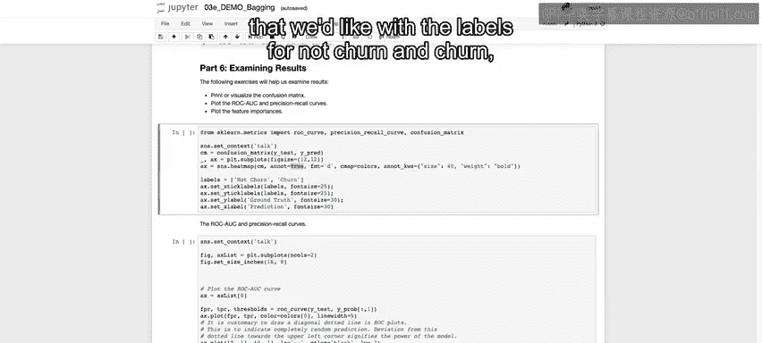

## 结果可视化 📈

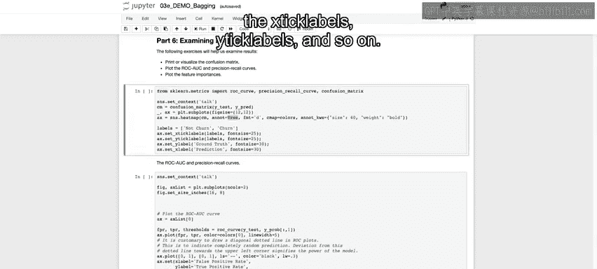

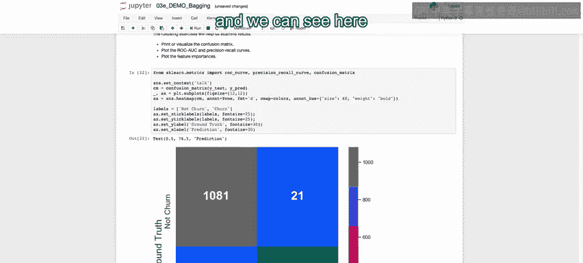

在计算了各项数值指标后，直观的可视化能帮助我们更好地理解模型的表现。本节我们将绘制混淆矩阵、ROC曲线、精确率-召回率曲线以及特征重要性图。

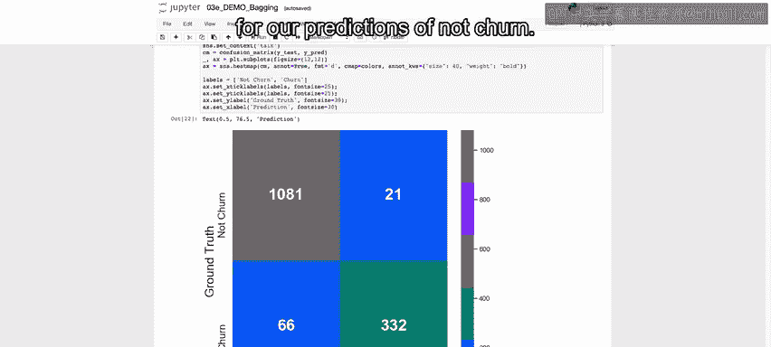

首先，我们创建并可视化混淆矩阵。

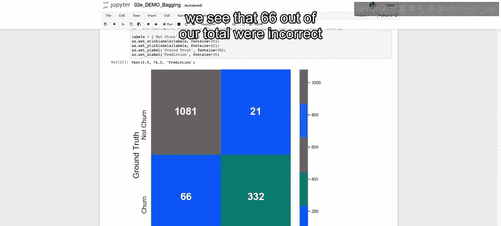

```python
from sklearn.metrics import confusion_matrix
import seaborn as sns

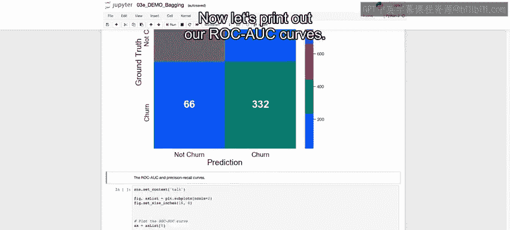

cm = confusion_matrix(y_test, y_pred)
sns.heatmap(cm, annot=True, fmt='d', cmap='Blues',
            xticklabels=['Not Churn', 'Churn'],
            yticklabels=['Not Churn', 'Churn'])
plt.xlabel('Predicted')
plt.ylabel('Actual')
plt.show()
```

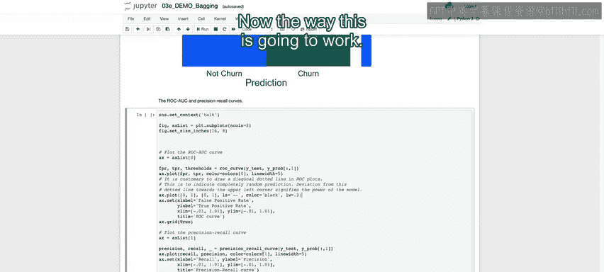

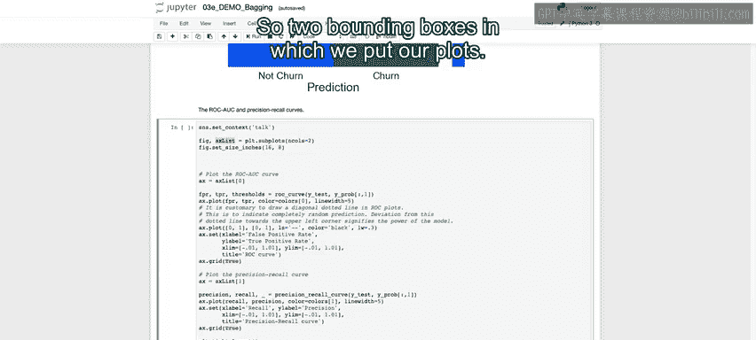

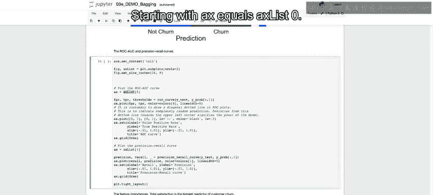

从混淆矩阵中可以看到，模型能较好地预测“未流失”的客户，但在预测“流失”客户时，存在较多的误判（假阴性），这也解释了之前较低的召回率。

接下来，我们在一张图中并排绘制ROC曲线和精确率-召回率曲线。

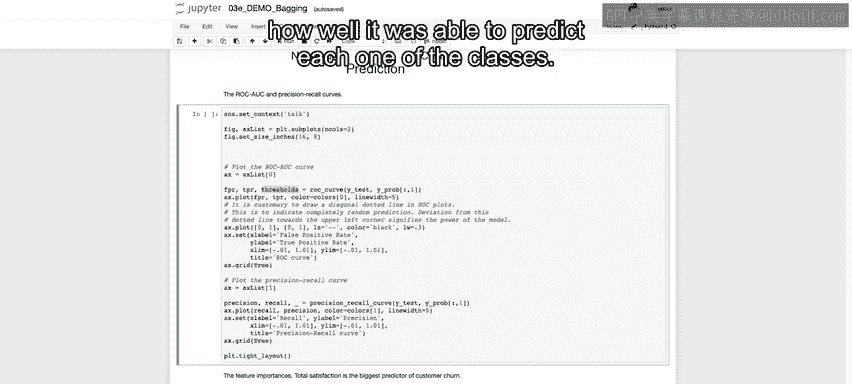

```python
from sklearn.metrics import roc_curve, precision_recall_curve

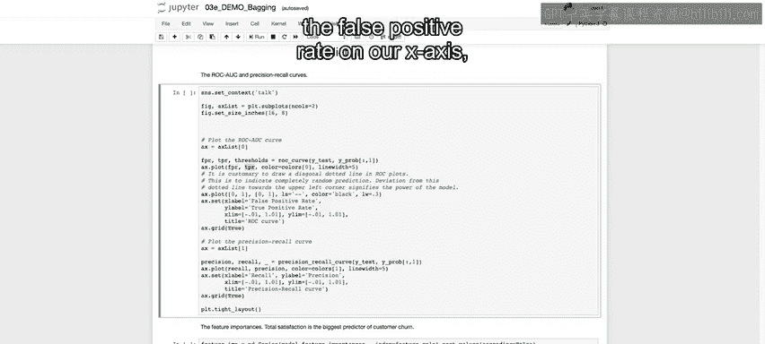

fig, axes = plt.subplots(1, 2, figsize=(12, 5))

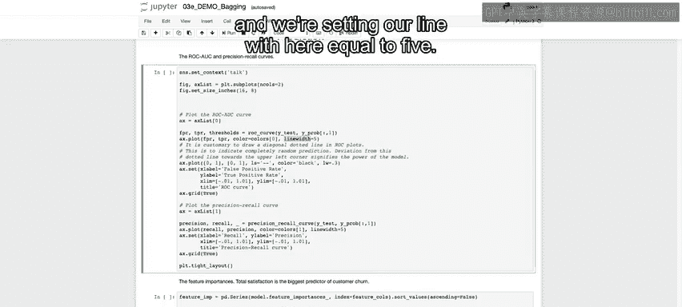

# 绘制ROC曲线
fpr, tpr, _ = roc_curve(y_test, y_prob[:, 1])
axes[0].plot(fpr, tpr, color='darkorange', lw=2)
axes[0].plot([0, 1], [0, 1], color='navy', lw=1, linestyle='--')
axes[0].set_xlabel('False Positive Rate')
axes[0].set_ylabel('True Positive Rate')
axes[0].set_title('ROC Curve')

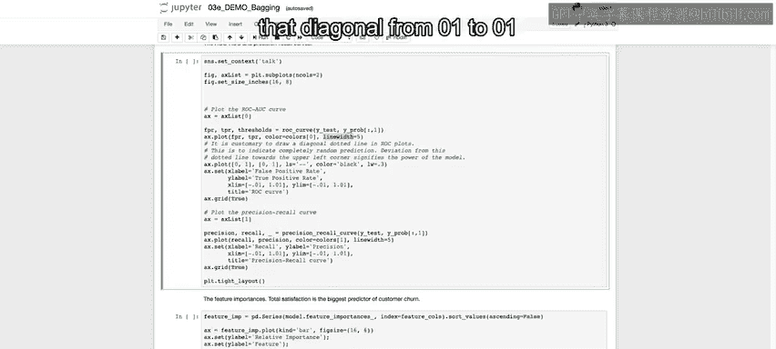

# 绘制精确率-召回率曲线
precision_vals, recall_vals, _ = precision_recall_curve(y_test, y_prob[:, 1])
axes[1].plot(recall_vals, precision_vals, color='green', lw=2)
axes[1].set_xlabel('Recall')
axes[1].set_ylabel('Precision')
axes[1].set_title('Precision-Recall Curve')

plt.tight_layout()
plt.show()
```

ROC曲线明显高于对角线，AUC值较高，表明模型整体区分能力不错。精确率-召回率曲线也呈现较好的形态，但在高召回率区域精确率有所下降，这与数据不平衡有关。

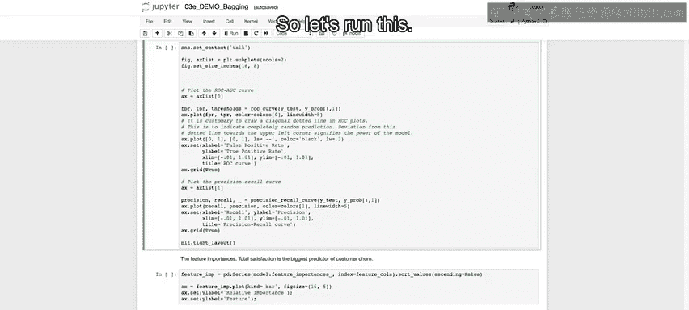

最后，我们分析哪些特征对模型的预测最重要。

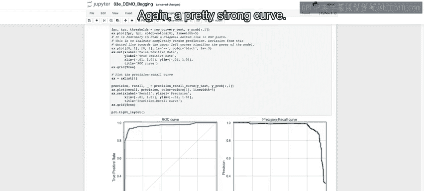

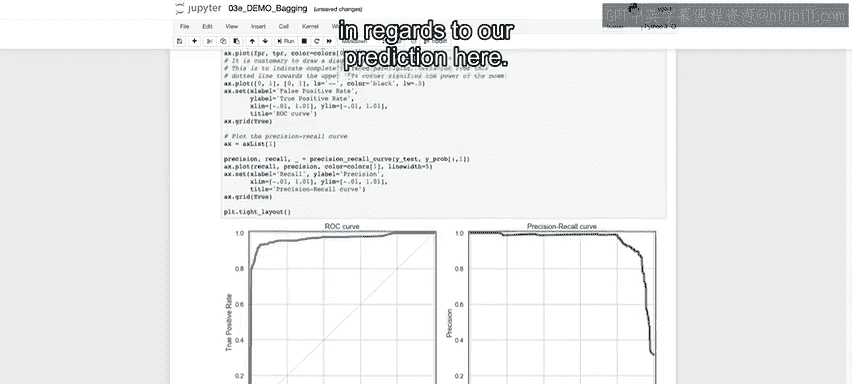

```python
importances = model.feature_importances_
feature_names = X_train.columns
importance_series = pd.Series(importances, index=feature_names).sort_values(ascending=False)

importance_series.plot(kind='bar')
plt.ylabel('Feature Importance')
plt.title('Random Forest Feature Importances')
plt.show()
```

特征重要性图显示，“客户满意度”是预测客户流失的最重要特征，这与我们之前进行相关性分析时的发现一致，满意度越低的客户越可能流失。

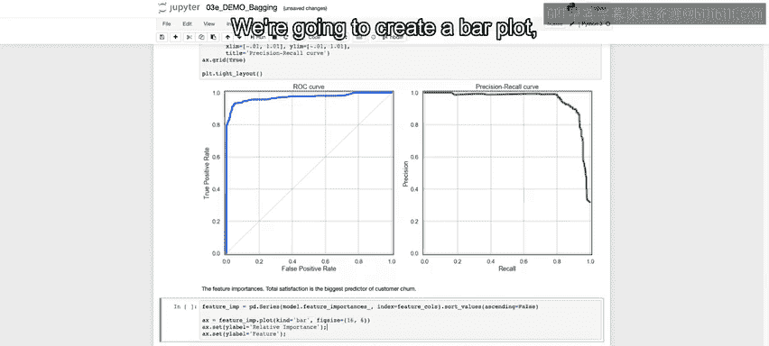

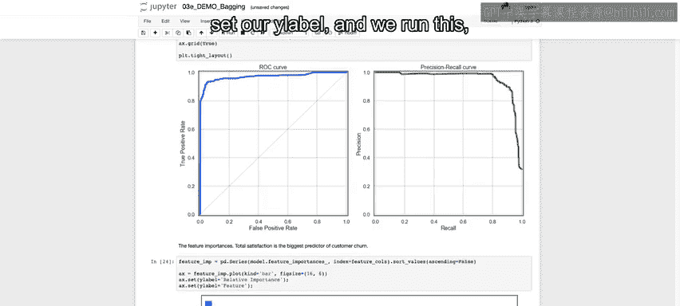

---

## 总结 ✨

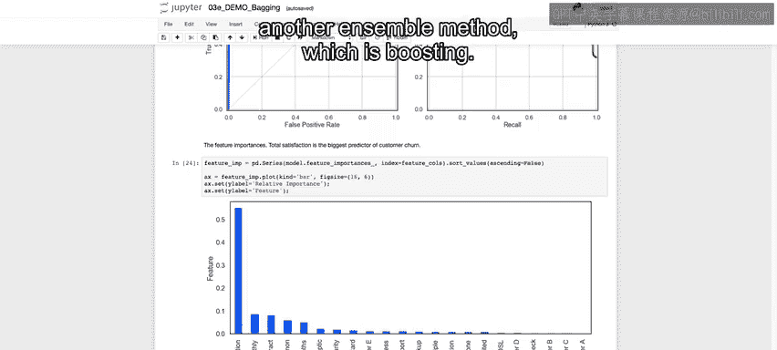


本节课中我们一起学习了如何对Bagging模型（以随机森林为例）进行系统评估。
我们首先计算了包括准确率、精确率、召回率、F1分数和ROC AUC在内的多项分类指标。
然后，我们通过可视化技术，绘制了混淆矩阵、ROC曲线和精确率-召回率曲线，直观地理解了模型的性能表现和优缺点。
最后，我们分析了模型的特征重要性，发现“客户满意度”是预测流失的关键因素。
这些评估步骤是机器学习工作流中不可或缺的部分，能帮助我们理解、比较并最终改进模型。接下来，我们将进入课程的下一个主题：Boosting集成方法。