# 137：Bagging回顾与Boosting引入 🎯

在本节课中，我们将学习集成学习中的Bagging方法回顾，并初步了解Boosting方法的基本概念。我们将对比这两种集成方法的核心差异，为后续深入学习Boosting和Stacking打下基础。

---

## Bagging方法回顾 📦

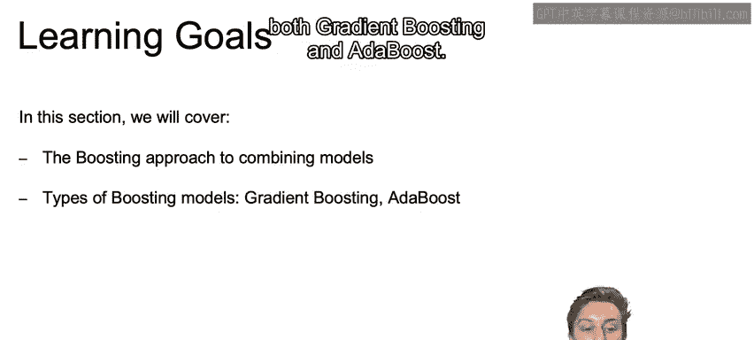

上一节我们介绍了Bagging（Bootstrap Aggregating）的基本思想。本节中，我们来详细回顾其工作流程。

Bagging通过以下步骤构建集成模型：

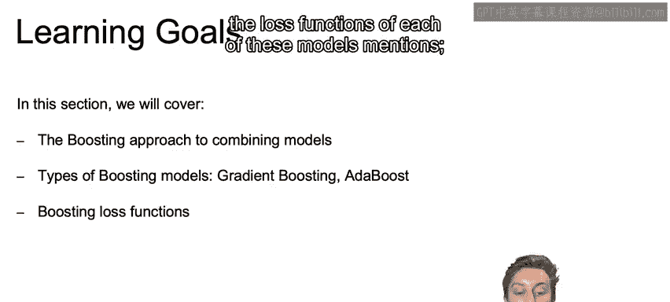

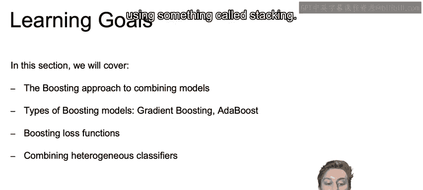

1.  从原始数据集中创建多个Bootstrap样本（有放回抽样）。
2.  在每个Bootstrap样本上独立地构建决策树。
3.  对于新的预测记录，让所有决策树进行投票，以多数票结果作为最终分类。

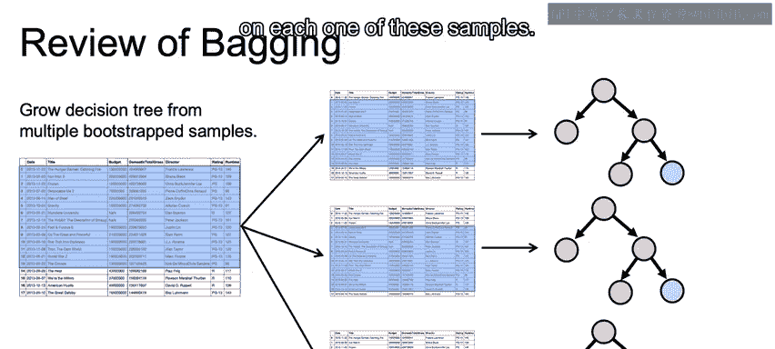

以下是其核心过程的公式化表示：
`最终预测 = Mode(树1预测, 树2预测, ..., 树n预测)`

在Bagging中，每个决策树通常是较深的，且所有树的投票权重相等。其主要目标是**降低模型的方差**，提高泛化能力。

---

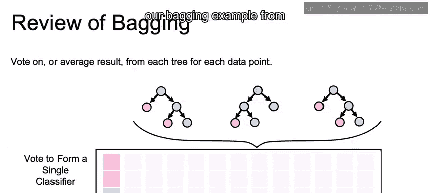

## 从Bagging过渡到Boosting 🔄

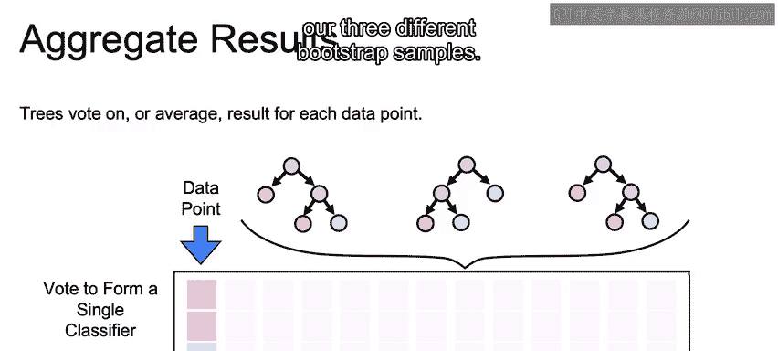

理解了Bagging后，现在让我们转向另一种强大的集成方法——Boosting。与Bagging构建独立模型不同，Boosting的核心思想是顺序地构建模型，每个新模型都试图修正前一个模型的错误。

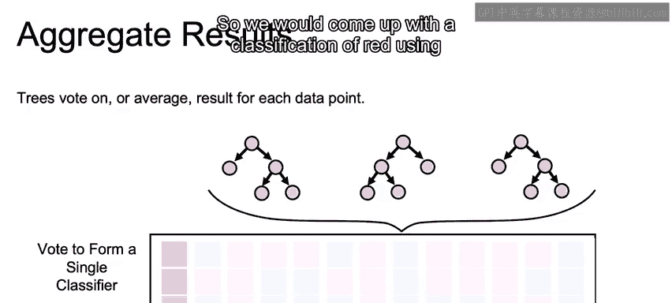

Boosting与Bagging的主要区别如下：

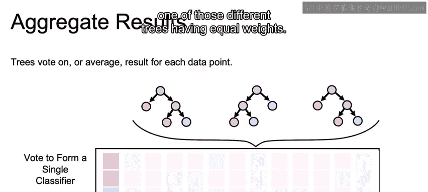

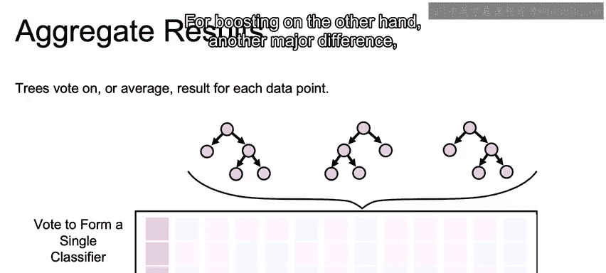

*   **模型依赖性**：Bagging中的模型是独立构建的；Boosting中的模型是顺序构建的，后续模型依赖于前序模型的错误。
*   **模型复杂度**：Bagging通常使用较深的决策树；Boosting则主要使用非常简单的模型，如“决策树桩”。
*   **权重分配**：Bagging中所有模型的投票权重相等；Boosting中会根据每个模型的准确度为其分配不同的权重。

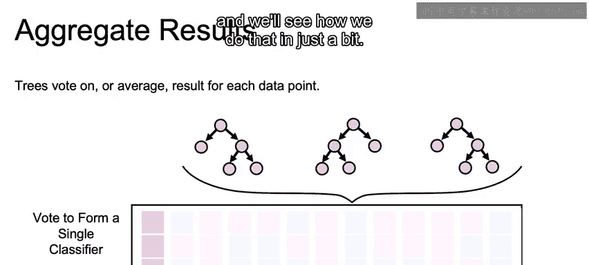

---

## Boosting的初步概念 🌱

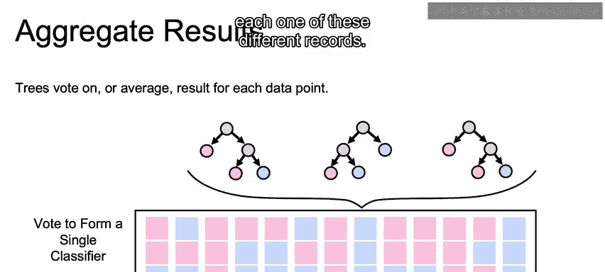

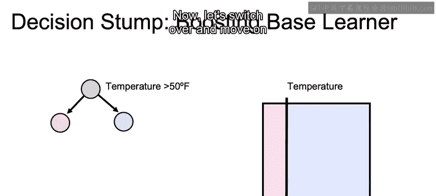

Boosting方法从构建一个非常简单的基学习器开始，这个基学习器被称为“弱学习器”。

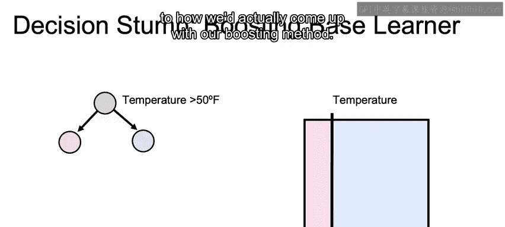

一个典型的弱学习器是**决策树桩**，它仅包含一次分裂。例如，根据“温度”是否高于某个阈值将数据分为两类。

代码表示一个决策树桩的伪代码如下：
```python
if feature > threshold:
    return class_A
else:
    return class_B
```

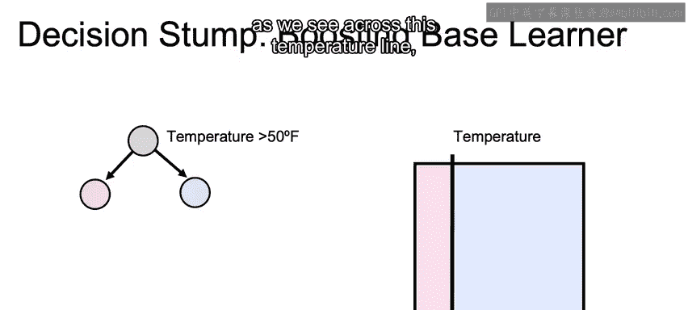

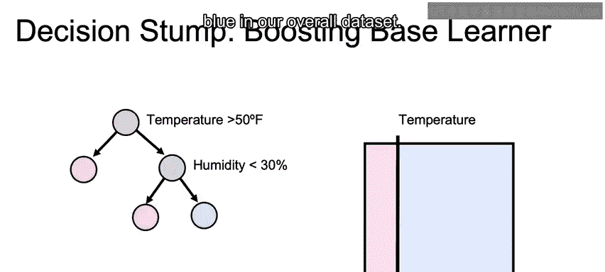

Boosting的直觉是：我们从这样一个简单的决策边界开始，然后通过顺序添加更多的弱学习器（如另一个根据“湿度”分裂的树桩）来逐步改进这个边界。每个新的弱学习器都专注于修正当前集成模型预测错误的那些样本。

通过智能地堆叠多个弱学习器，Boosting能够组合成一个强大的“强学习器”分类算法。

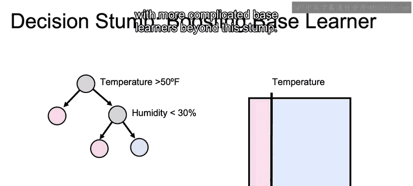

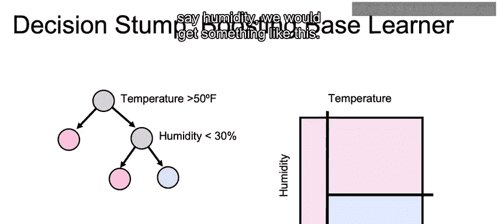

---

## 本节总结 📝

本节课中我们一起学习了：
1.  **Bagging的回顾**：其通过构建多个独立的深决策树并平等投票，主要致力于减少模型方差。
2.  **Boosting的引入**：其通过顺序构建依赖的弱学习器（如决策树桩），并为不同模型分配不同权重，旨在持续修正错误，尤其关注难以预测的样本。

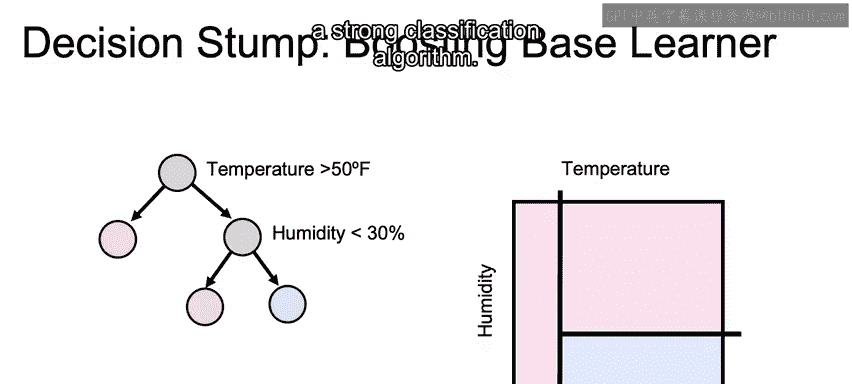

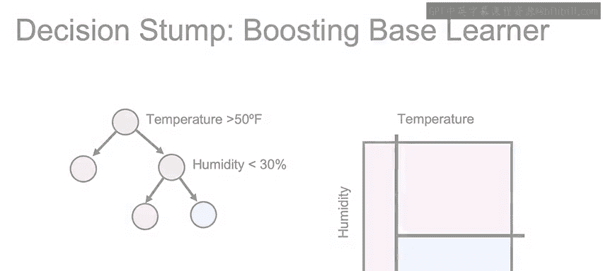

下一节，我们将深入探讨Boosting的具体算法（如AdaBoost和梯度提升）是如何实现这一过程的。