# 140：📚 梯度提升与AdaBoost语法教程

在本节课中，我们将学习如何在Python中使用两种重要的提升（Boosting）算法：梯度提升（Gradient Boosting）和AdaBoost。我们将专注于它们的语法实现，包括如何导入类、设置超参数、拟合模型以及进行预测。

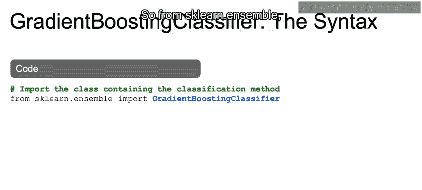

---

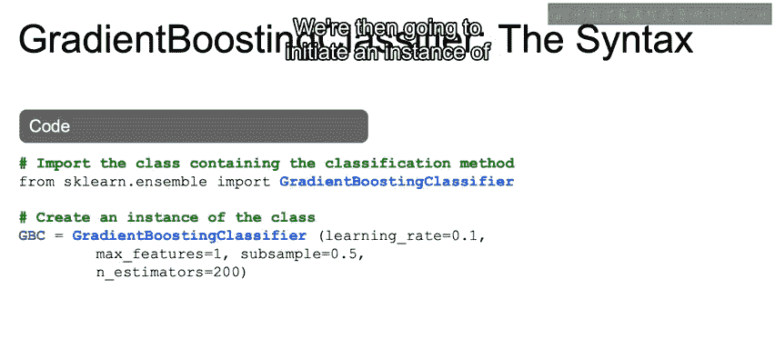

## 🚀 梯度提升分类器语法

上一节我们介绍了提升算法的概念，本节中我们来看看如何在Python中实现梯度提升分类器。

首先，我们需要从`sklearn.ensemble`模块中导入`GradientBoostingClassifier`类。

```python
from sklearn.ensemble import GradientBoostingClassifier
```

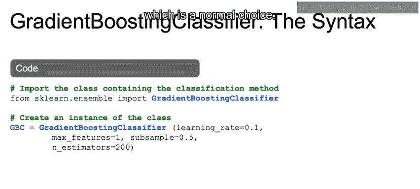

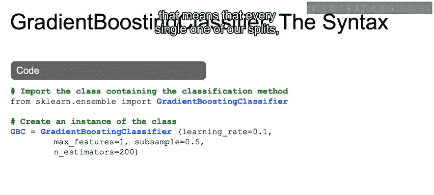

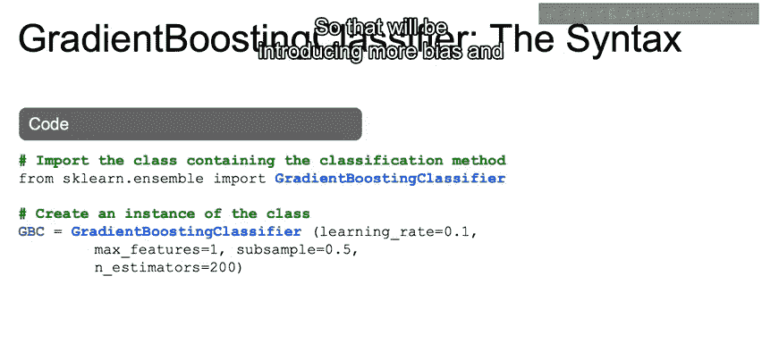

接着，我们创建一个该类的实例。在初始化时，我们需要传入一些超参数，其中许多参数在上一个视频中讨论过。

以下是创建实例并设置参数的步骤：

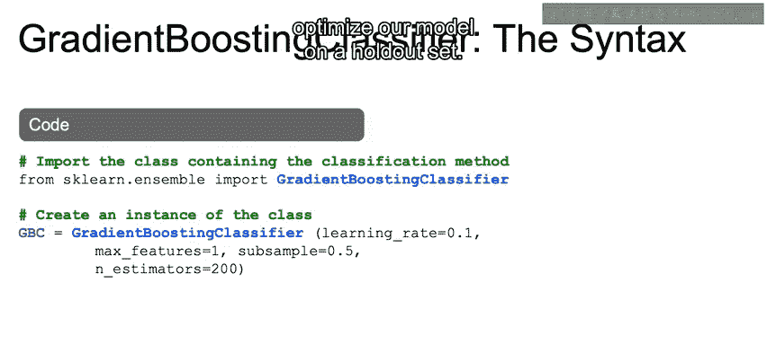

*   `learning_rate=0.1`：这是一个常规选择。
*   `max_features=1`：这是一个非常低的值，意味着每次分割时只考虑一个特征，这会引入更多偏差并降低方差。
*   `subsample=0.5`：这通常在正常取值范围之内，用于拟合每棵不同的树。
*   `n_estimators=200`：这是树的数量。与所有其他参数一样，你需要通过迭代来找到最佳的树的数量，以在验证集上优化模型。

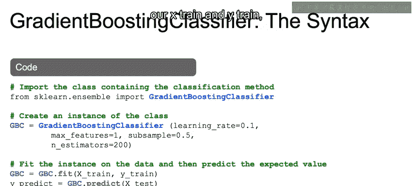

```python
gbc = GradientBoostingClassifier(learning_rate=0.1, max_features=1, subsample=0.5, n_estimators=200)
```

然后，我们使用训练数据拟合模型实例。

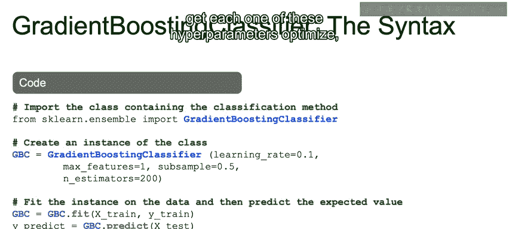

```python
gbc.fit(X_train, y_train)
```

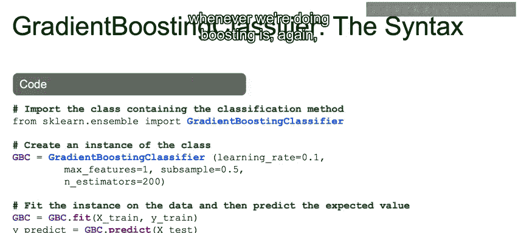

拟合完成后，我们可以像处理其他模型一样，在测试集上进行预测。

```python
predictions = gbc.predict(X_test)
```

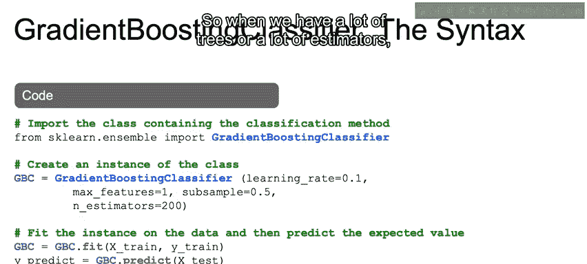

与往常一样，如果你想确保每个超参数都得到优化，应该使用交叉验证。如果你需要进行回归任务，可以使用`GradientBoostingRegressor`。

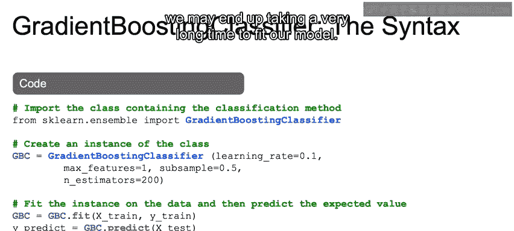

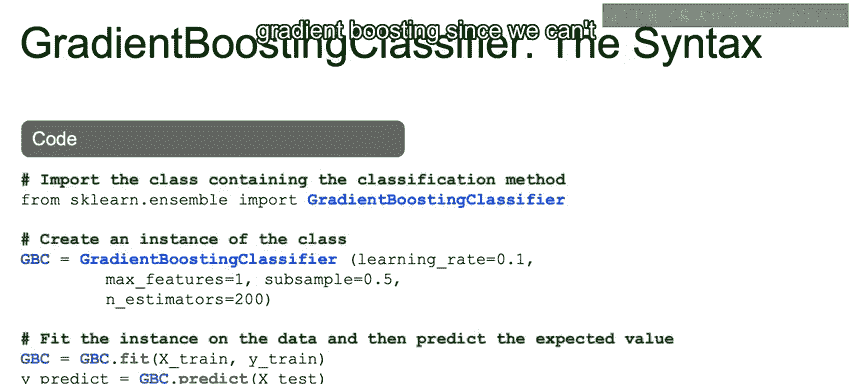

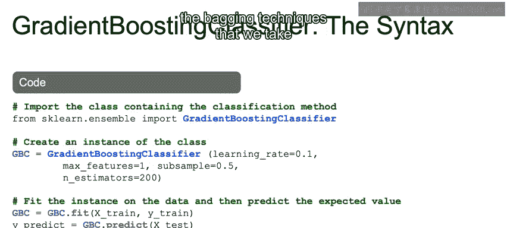

使用提升算法时需要注意，我们需要顺序地构建这些树。每棵树都必须在上一棵树拟合完成后才能进行拟合。因此，当树的数量（即`n_estimators`参数）很多时，拟合模型可能会花费很长时间。由于我们无法像装袋（Bagging）技术那样进行并行化，所以在使用梯度提升时必须考虑到时间成本。

---

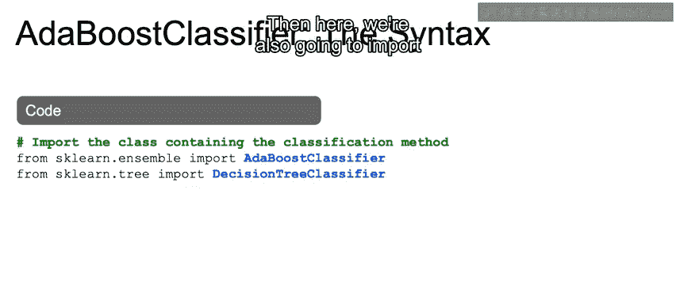

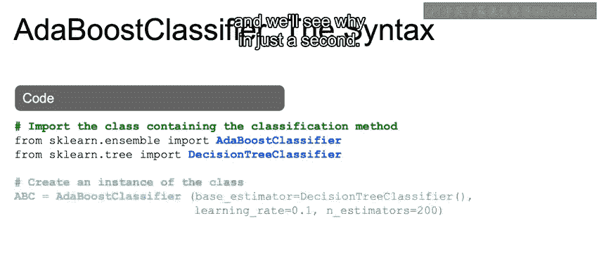

## ⚡ AdaBoost分类器语法

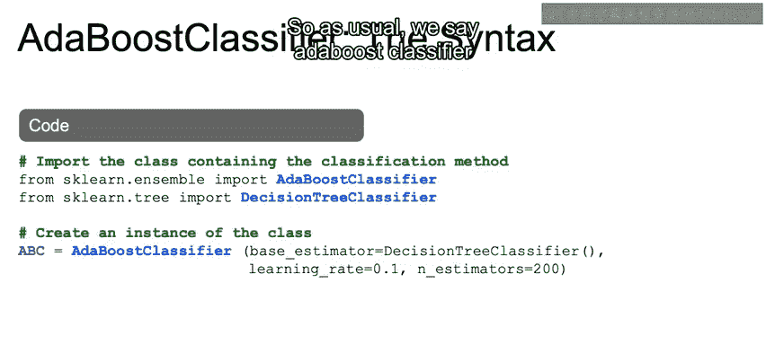

了解了梯度提升后，现在让我们看看AdaBoost分类器的语法。

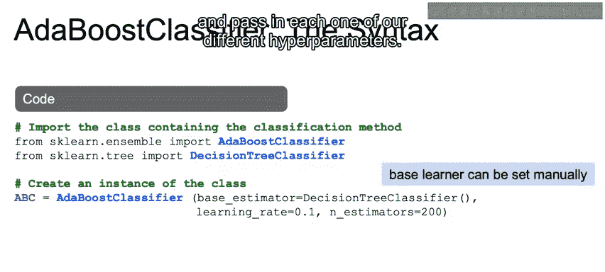

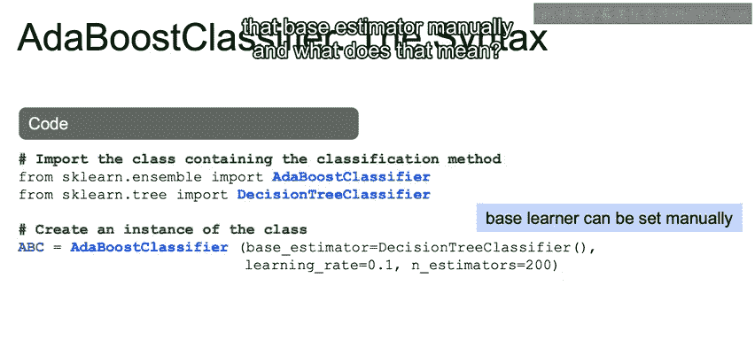

首先，我们同样从`sklearn.ensemble`导入`AdaBoostClassifier`。同时，我们导入`DecisionTreeClassifier`，稍后会解释原因。

```python
from sklearn.ensemble import AdaBoostClassifier
from sklearn.tree import DecisionTreeClassifier
```

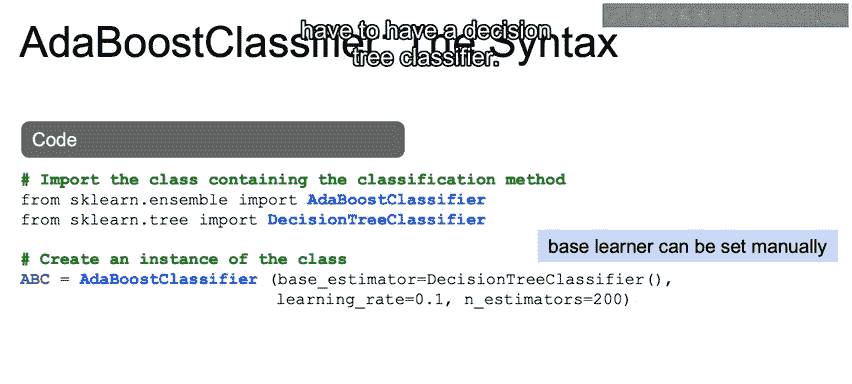

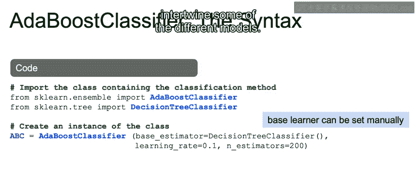

接着，我们创建`AdaBoostClassifier`类的实例，并传入不同的超参数。

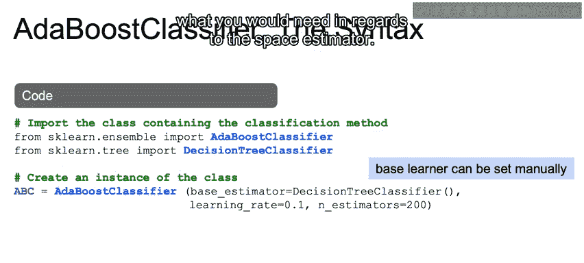

以下是创建实例的步骤：

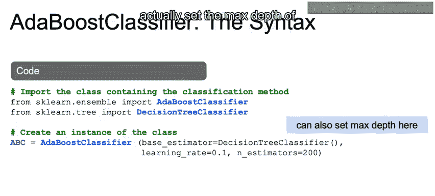

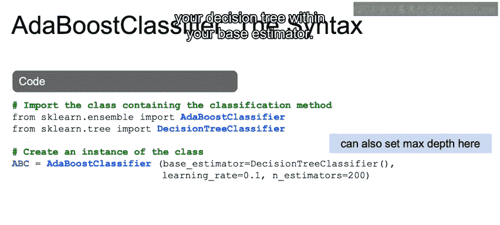

*   我们可以手动设置`base_estimator`（基础估计器）。这不一定必须是决策树分类器，但将不同模型结合起来可能比较困难。你可以查阅文档了解对基础估计器的要求。
*   一个特别的功能是，你可以在基础估计器中设置决策树的最大深度。通过传入一个`DecisionTreeClassifier`并设置其`max_depth`参数，你可以改变默认的“决策树桩”（深度为1的树）。需要注意的是，如果像示例中那样使用默认值，决策树可能会比树桩大得多，因为默认的`max_depth`是`None`（即不限制深度）。
*   我们设置`learning_rate=0.1`和`n_estimators=200`。

```python
abc = AdaBoostClassifier(base_estimator=DecisionTreeClassifier(max_depth=1), learning_rate=0.1, n_estimators=200)
```

然后，我们在训练集上拟合模型，并在测试集上进行预测。

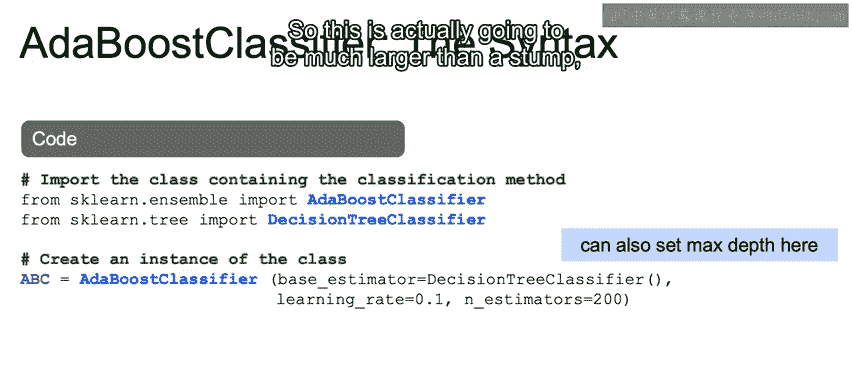

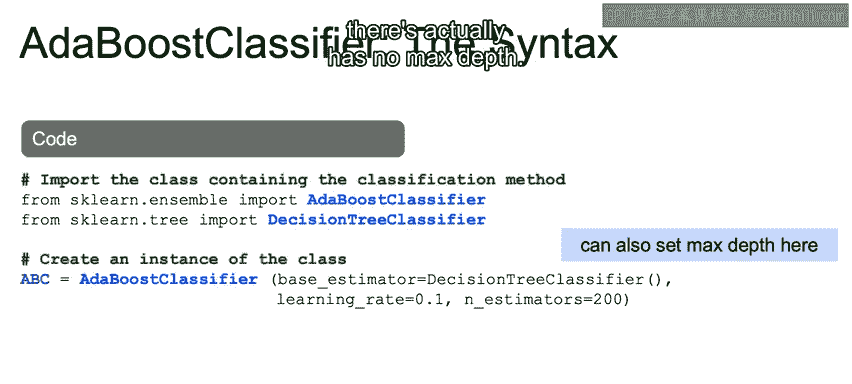

```python
abc.fit(X_train, y_train)
predictions = abc.predict(X_test)
```

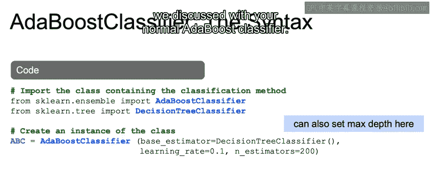

同样，我们可以使用交叉验证来调整这个模型。如果需要进行回归任务，可以使用`AdaBoostRegressor`。

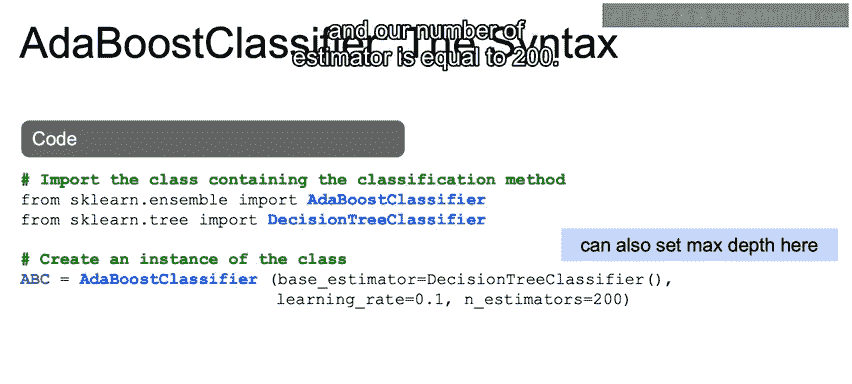

---

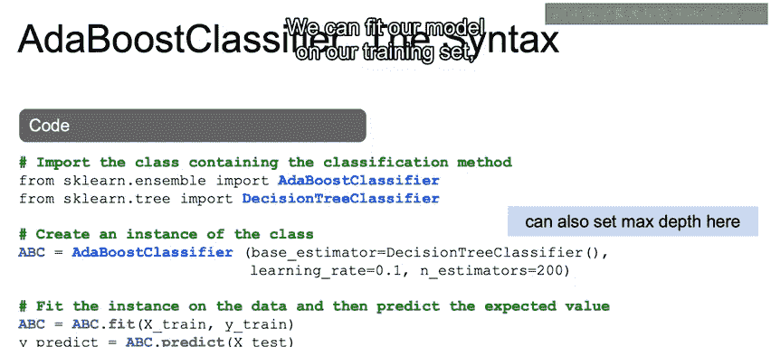

## 📝 课程总结

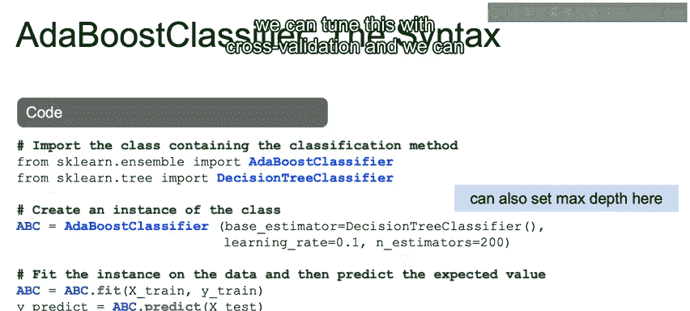

本节课中我们一起学习了梯度提升（Gradient Boosting）和AdaBoost算法在Python中的具体语法实现。我们掌握了如何导入相应的类、初始化模型实例、设置关键超参数（如学习率、基础估计器、子采样比例和树的数量），以及如何使用训练数据拟合模型并进行预测。我们还讨论了使用提升算法时需要注意的顺序构建和计算时间问题。

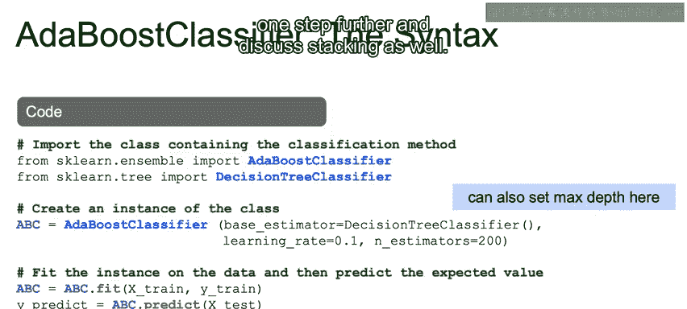


至此，我们关于提升算法的讨论就结束了。在下一节中，我们将把集成方法再推进一步，讨论堆叠（Stacking）技术。