# 145：56_模型可解释性 🧠

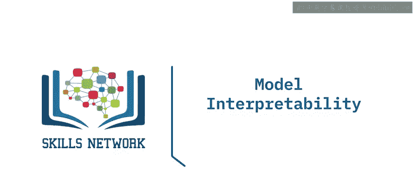

在本节课中，我们将要学习机器学习模型可解释性的重要性，并区分自解释型与非自解释型模型。理解模型如何做出决策，对于建立信任、调试模型以及在敏感领域应用至关重要。

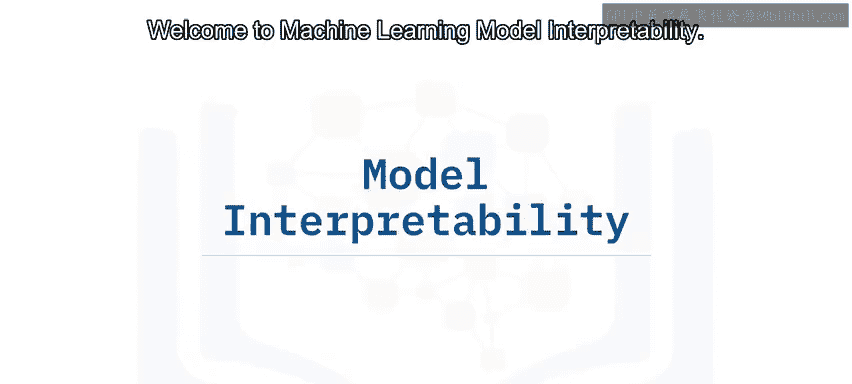

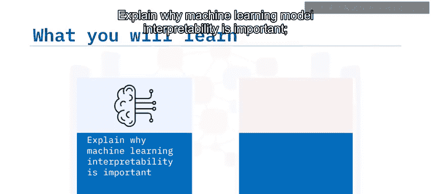

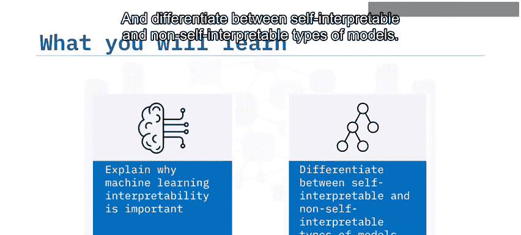

---

## 为什么模型可解释性重要？🤔

上一节我们介绍了课程目标，本节中我们来看看为什么模型可解释性如此关键。

理想情况下，所有系统，即便是像空间站那样复杂的系统，都应该能被人类理解。然而，人工智能或机器学习系统由于其隐式的自我学习和进化特性，正变得越来越复杂。

例如，随机森林是一种分类算法，可能包含数百棵不同的决策树。这类复杂的机器学习系统通常在预测任务上表现良好，但理解复杂模型的结果可能非常困难。

总的来说，我们需要一些解释方法，使机器学习模型的行为和预测对人类而言是可理解的。我们需要使用这些方法来理解模型结构、模型中应包含哪些重要特征，以及这些模型如何将特征映射到预测结果。

此外，有时确切了解模型如何工作，可能比仅仅预测结果给我们带来更多洞见。例如，理解人工智能系统如何诊断癌症，可能有助于人类健康专家识别基于证据的风险因素。

对于决策者而言，可解释性非常重要，尤其是在金融或健康等非常敏感或高风险的领域。

我们需要有信心，并且能够信任模型正在正确工作。除非经过监控和解释，否则黑盒机器学习系统无法被信任。因此，构建可信的模型有时甚至比构建高性能的模型更重要。

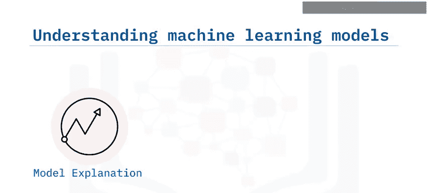

部署在生产环境中的模型可能会出现意外问题，例如预测准确率低或存在不可接受的偏差。为了调试和修复这些问题，开发人员需要理解模型如何以及为何做出此类有问题的预测，这再次要求模型对开发人员而言是可解释的。

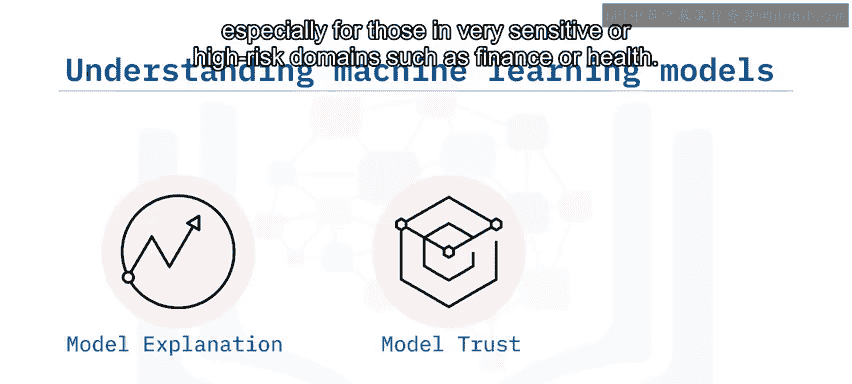

---

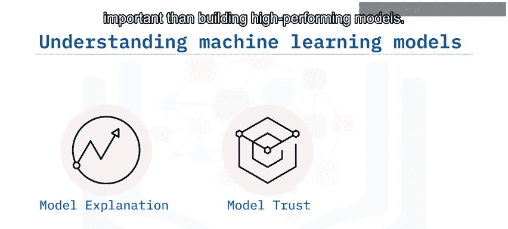

## 模型的两种类型：自解释型与非自解释型 📊

上一节我们探讨了可解释性的重要性，本节中我们来对模型类型进行分类。

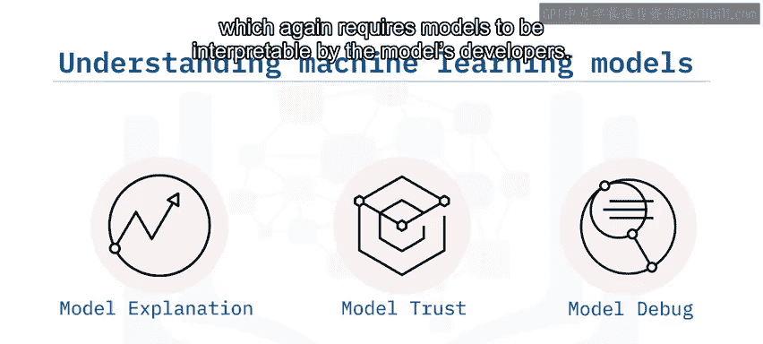

基本上，就可解释性而言，机器学习模型可以分为两类。

**自解释型模型**指的是那些结构简单直观、无需额外解释方法就能轻易被人类理解的模型。

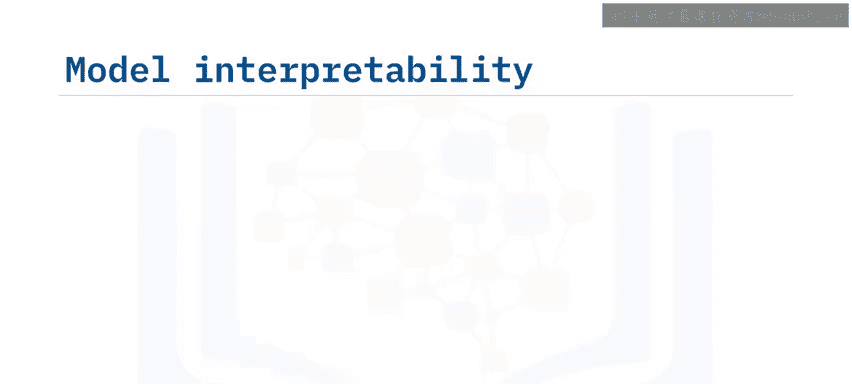

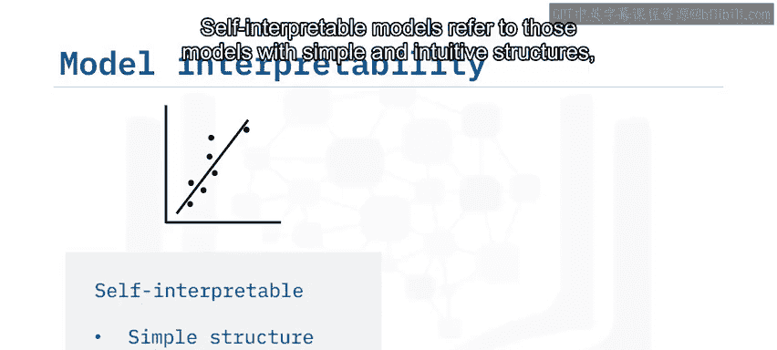

以下是自解释型模型的例子：
*   **线性回归**：其预测基于特征的加权和，权重（系数）直接表示特征对结果的影响。公式可表示为：`y = β₀ + β₁x₁ + β₂x₂ + ... + βₙxₙ`
*   **逻辑回归**：虽然用于分类，但其决策逻辑仍基于特征的线性组合，通过sigmoid函数转化为概率。
*   **决策树**：通过一系列`if-then`规则进行预测，其决策路径可以像流程图一样被跟踪和理解。

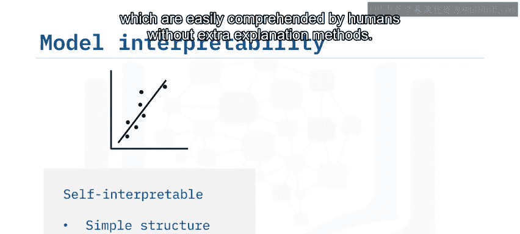

自解释型模型通常在高风险领域（如金融或健康）更受青睐，因为人类也能理解模型的逻辑并做出类似的预测。

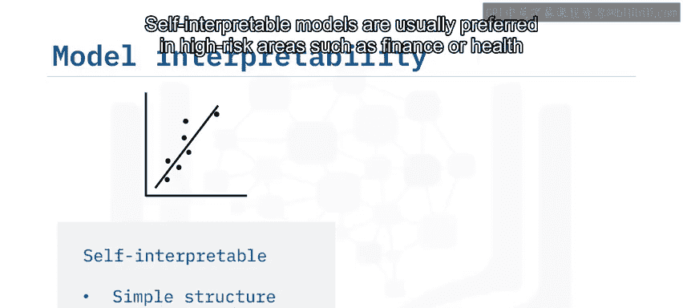

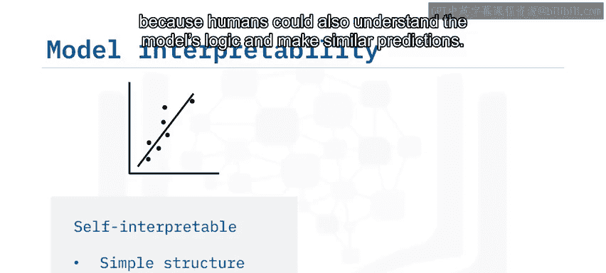

相比之下，**非自解释型模型**是那些结构复杂、可被描述为黑盒的模型。我们使用这些复杂模型的主要原因是，它们通常能在特定问题（如自然语言翻译、图像识别和交通模式分析）上达到最先进的性能。

以下是非自解释型模型的例子：
*   **随机森林**：由大量决策树集成，单个树可解释，但整体模型的预测是众多树投票或平均的结果，难以追踪单一决策路径。
*   **深度神经网络**：包含多层非线性变换，中间表示和权重矩阵难以直接对应到人类可理解的概念。
*   **梯度提升机（如XGBoost）**：通过顺序添加弱学习器（通常是树）来修正前序模型的错误，最终预测是所有弱学习器输出的加权和，整体逻辑复杂。

---

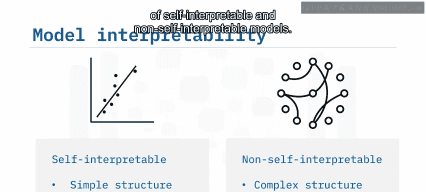

## 总结 📝

本节课中，我们一起学习了机器学习模型可解释性的核心概念。我们了解到，只有当模型是可理解的，我们才能信任并有效地调试它们。机器学习模型可以分为**自解释型模型**（如线性回归、决策树）和**非自解释型模型**（如随机森林、深度神经网络）。在选择模型时，需要根据应用场景在性能与可解释性之间做出权衡。