# 146：自解释与非自解释模型示例 🧠

在本节课中，我们将学习自解释模型与非自解释模型的概念，并通过具体示例了解它们的区别。我们还将探讨两种主要的模型解释方法。

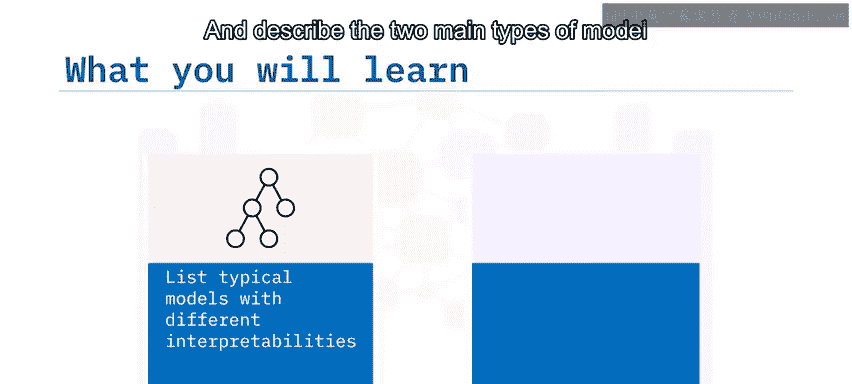

---

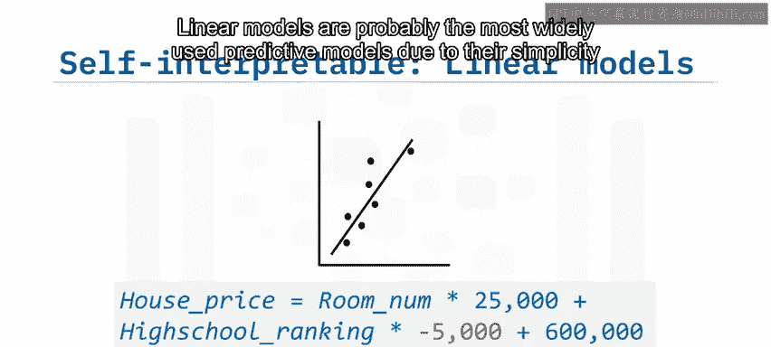

## 线性模型：经典的自解释模型

上一节我们介绍了模型可解释性的概念，本节中我们来看看最典型的自解释模型——线性模型。

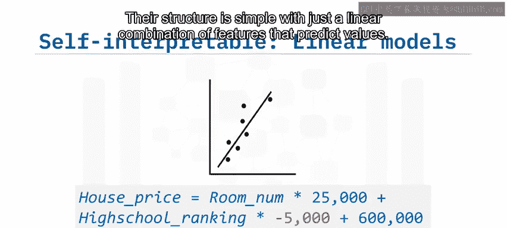

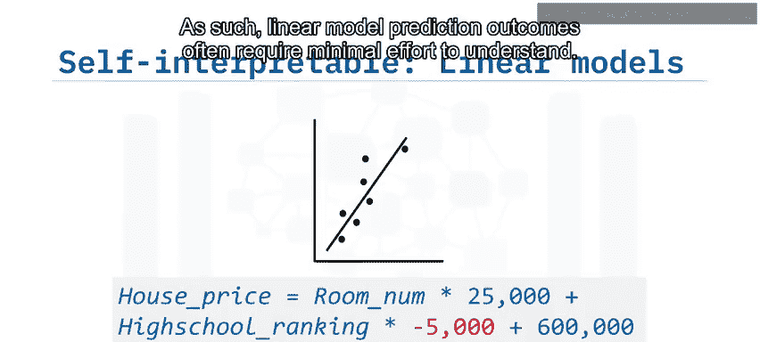

线性模型因其简单性和有效性，可能是使用最广泛的预测模型，尤其是在金融行业。其结构简单，仅通过特征的线性组合来预测值。因此，理解线性模型的预测结果通常只需付出最少的努力。

例如，假设我们有一个房价预测的线性回归模型。我们可以通过添加特征来轻松预测房屋价格，例如房间数量（正相关），以及关联的高中排名（负相关，意味着学校排名越接近第一，房屋成本越高）。

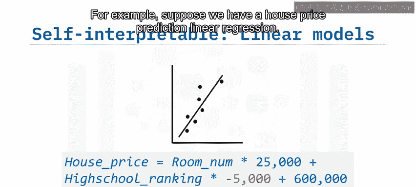

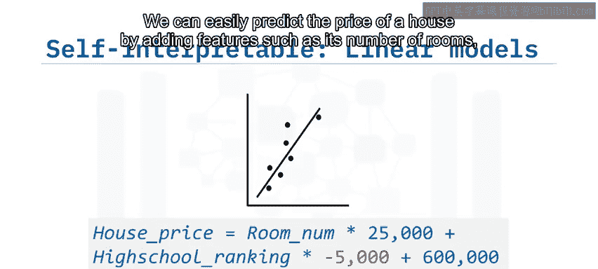

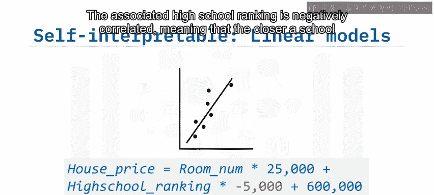

**一个注意事项是**：即使是一个线性模型，如果包含过多特征，也会变得难以理解。有时甚至超过10个特征就会过于复杂，无法自我解释。使其更易于理解的一个有效方法是使用特征选择方法，例如Lasso回归分析，这样模型就只包含重要特征，从而既提高了可解释性，又降低了过拟合的风险。

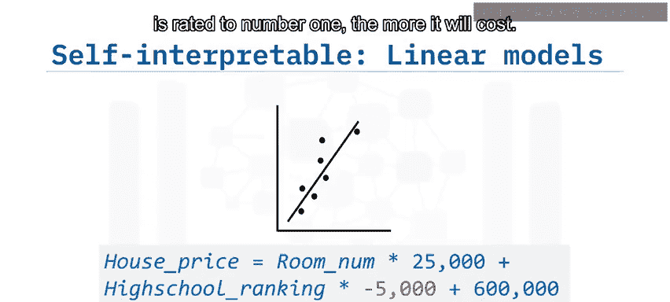

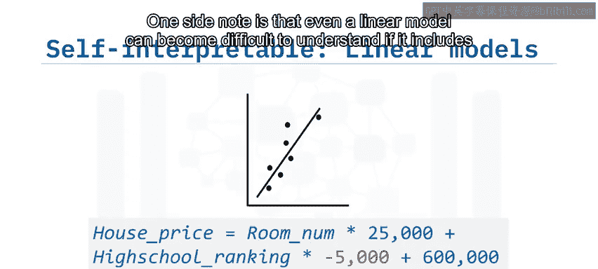

---

## 树模型：基于规则的自解释模型

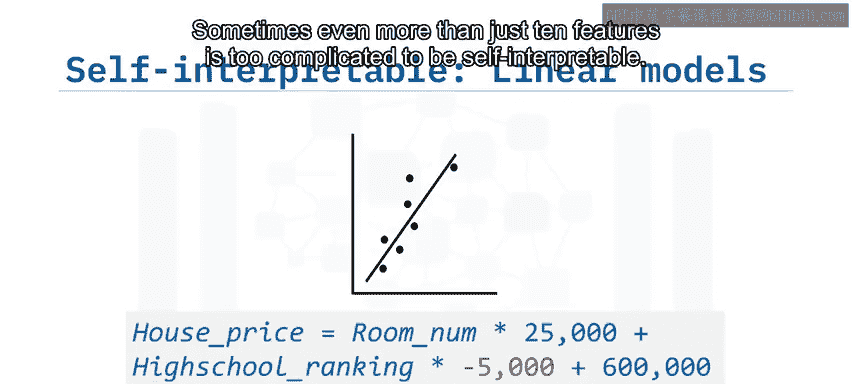

了解了线性模型后，我们来看看另一种流行的自解释模型——树模型。

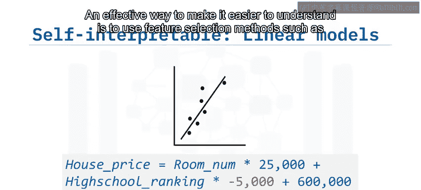

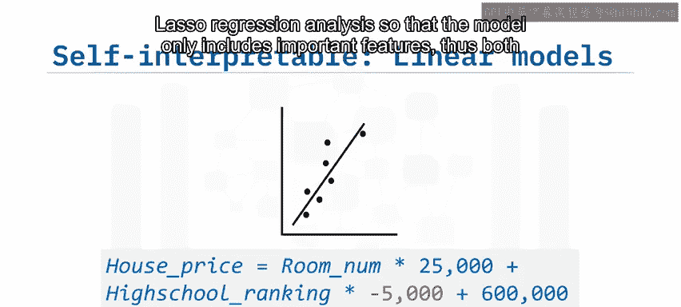

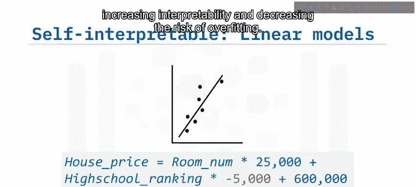

树模型（如决策树）是另一种流行的自解释模型类型。树模型的主要特征是通过创建一组“如果-那么-否则”规则来模拟人类的推理过程。

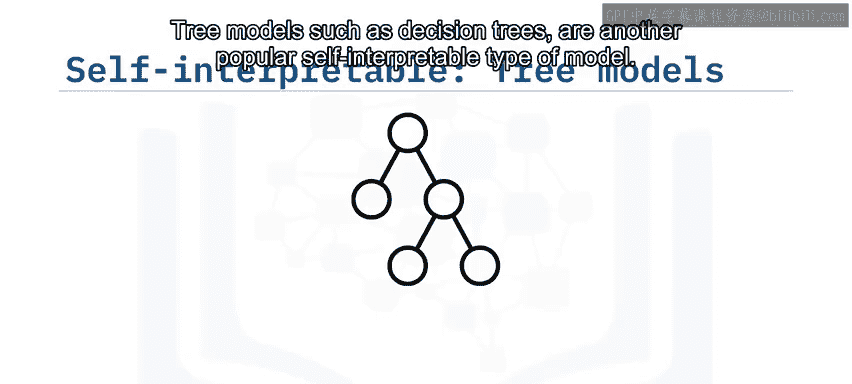

例如，如果一个房子有超过四个房间，并且其关联的学校排名在前10名以内，那么它的估计房价是85万美元。然而，与线性模型类似，具有较大宽度和深度的大型树模型也会变得难以理解，并且容易出现过拟合。树剪枝是减少生成树大小的一种方法。

---

## K近邻模型：基于相似度的自解释模型

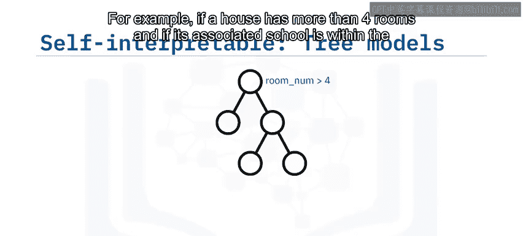

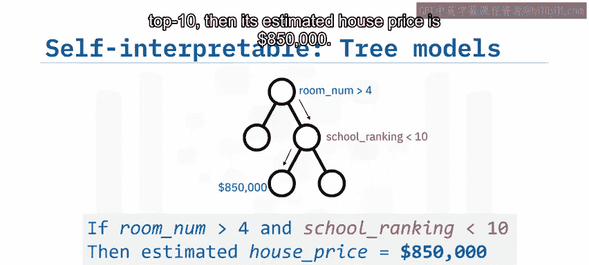

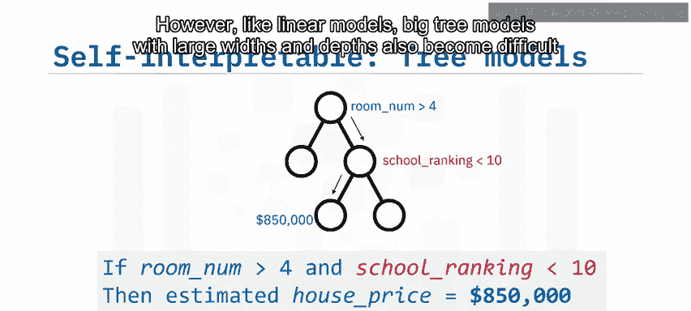

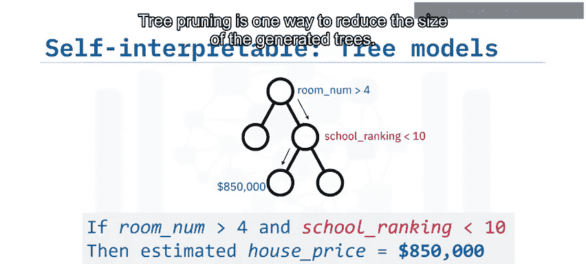

接下来，我们探讨另一种在特定条件下可被视为自解释的模型——K近邻模型。

如果特征空间易于理解且保持较小，K近邻模型（KNN）也可以被视为自解释模型。例如，假设我们想预测一个拥有4个房间、关联高中排名第10的房子的价格。一个训练好的KNN模型基于其三个邻居的平均值，预测房子0的价格为85.5万美元。这样的预测过程符合我们的直觉和常识，因为我们也会检查附近售出的类似房屋作为基准。

同样，与线性和树模型类似，如果特征空间很大，KNN模型也会变得难以理解。我们可以减少邻居实例和特征的数量来简化KNN，使其更具可解释性。

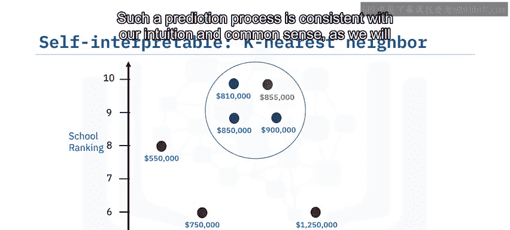

---

## 非自解释模型示例：随机森林

现在，让我们看一个非自解释模型的例子。

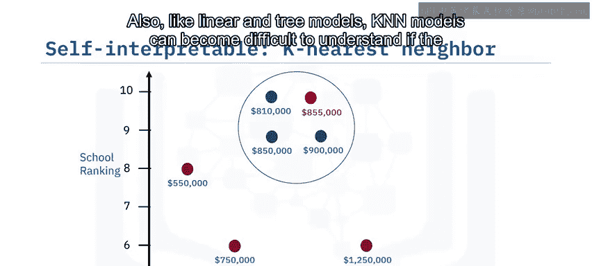

假设我们有一个包含250棵不同树、总共150个特征的随机森林。每棵树都是基于随机选择的特征和数据子集构建的。每棵树生成自己的预测，例如1或0。

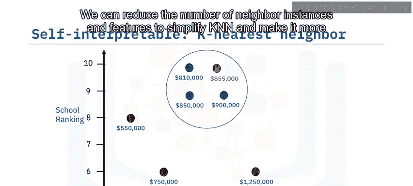

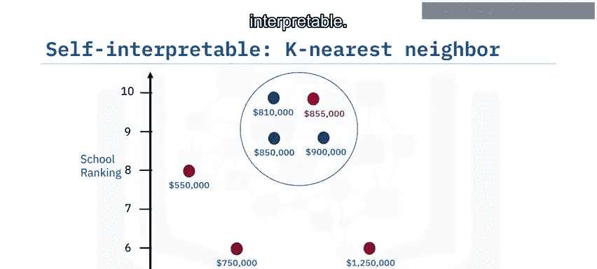

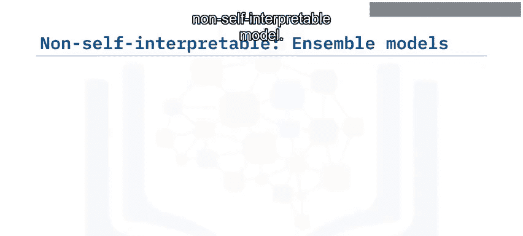

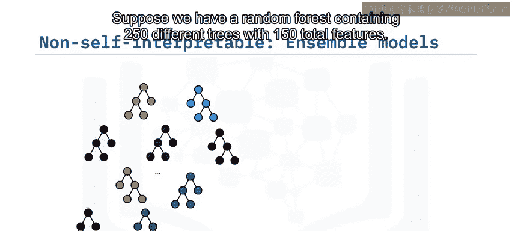

模型的最终预测结果基于所有250棵树的投票。对于模型使用者来说，审查每棵树并找出250棵树中共享的共同规则集，以弄清楚最终的集成决策是如何生成的，这是不可行的。

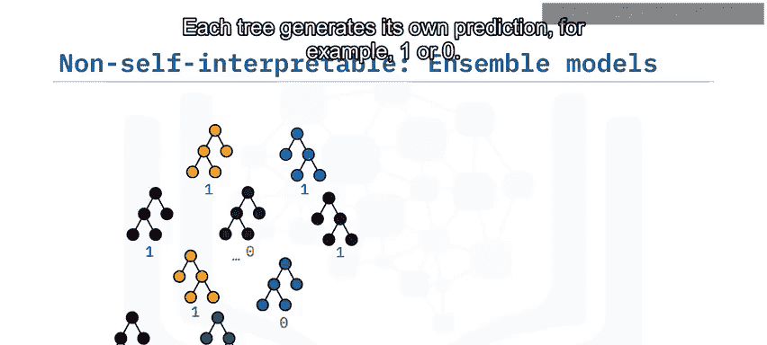

因此，随机森林模型被认为是一种非自解释模型。还有许多其他非自解释模型，例如线性支持向量机和深度神经网络。对于这些复杂模型，我们可能需要付出额外的努力来解释和理解它们的预测。

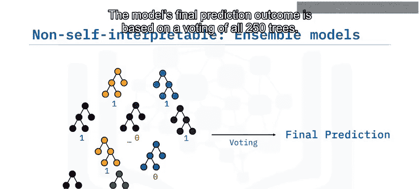

---

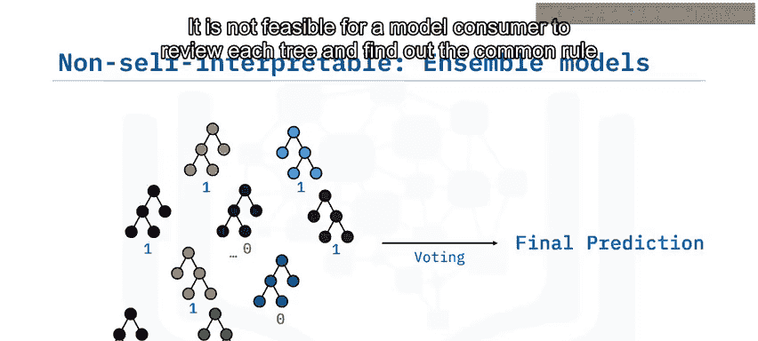

## 模型解释方法的两种类型

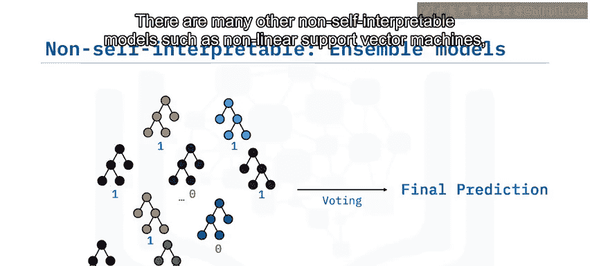

在介绍了不同类型的模型后，我们来总结一下解释它们的方法。

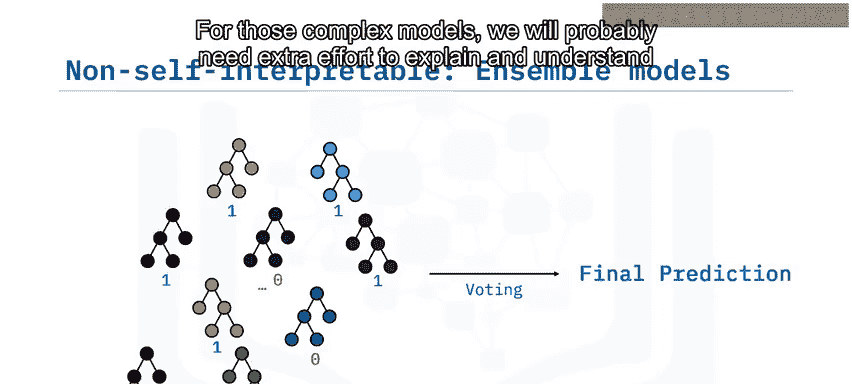

通常，模型解释方法可以分为两类：**内在方法**和**事后方法**。

*   **内在方法**主要应用于自解释模型，如线性模型、树模型和KNN。尽管这些模型本身具有很高的可解释性，但如果包含过多特征，它们也可能变得复杂。因此，内在方法的主要目标是使用正则化或剪枝等方法简化模型。
*   **事后方法**用于解释那些使用“黑箱”模型训练后的模型。换句话说，就是用于解释非自解释模型，如随机森林、非线性SVM和深度神经网络。

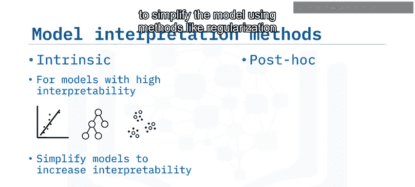

---

## 总结

本节课中，我们一起学习了自解释模型与非自解释模型的核心区别。

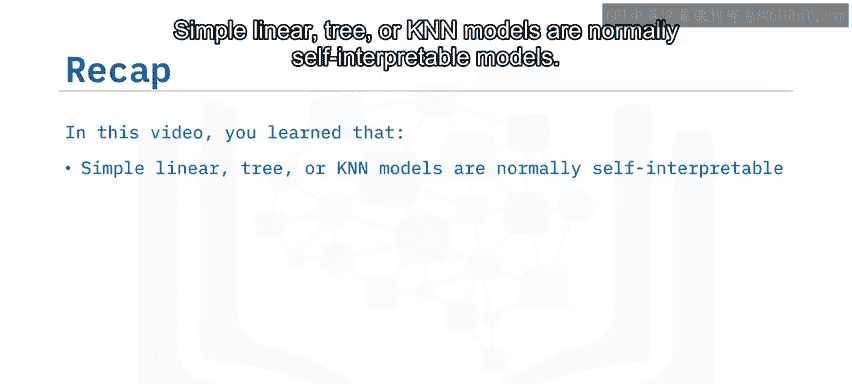

*   简单的线性、树或KNN模型通常是**自解释模型**。
*   复杂的模型，如大型集成模型或SVM，通常是**非自解释模型**。
*   主要有两种类型的解释方法：**内在方法**（用于自解释模型）和**事后方法**（用于解释非自解释的“黑箱”模型）。

理解模型的解释能力对于在实际应用中信任和有效使用机器学习模型至关重要。