# 147：模型无关性解释 🧠

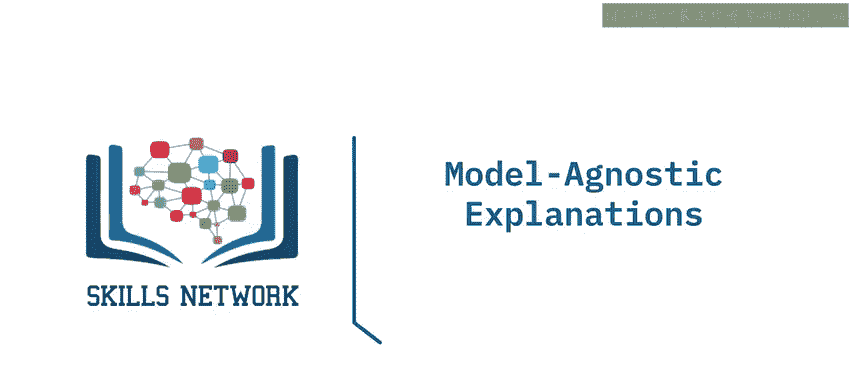

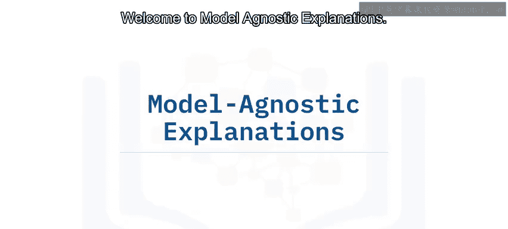

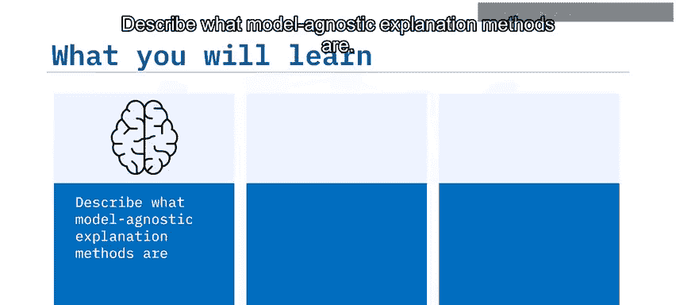

在本节课中，我们将要学习模型无关性解释方法。我们将了解什么是模型无关性解释，并学习两种具体的方法：排列特征重要性和部分依赖图。这些方法能帮助我们理解任何复杂的机器学习模型，无论其内部结构如何。

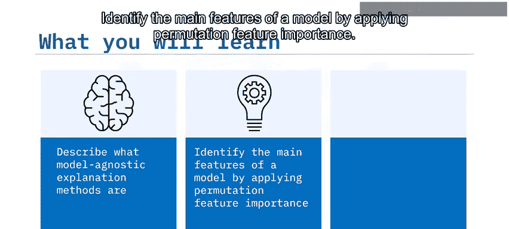

---

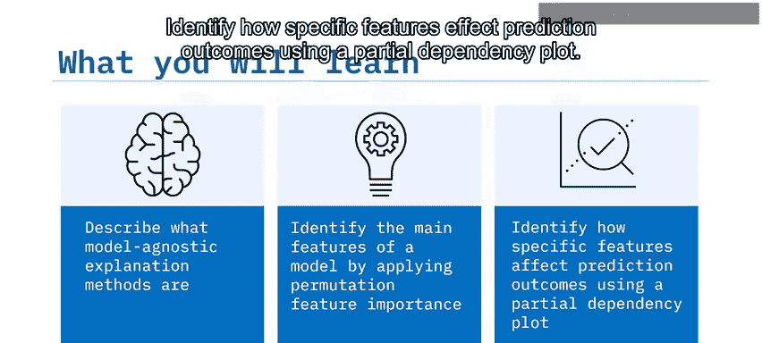

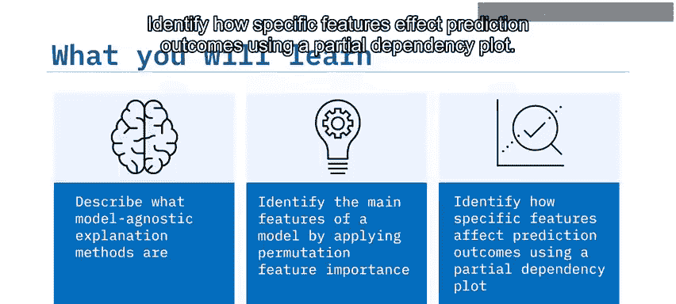

## 模型无关性解释概述

到目前为止，我们已经学习了许多具有不同结构、训练方法和结果呈现方式的机器学习模型。我们通常需要针对特定模型进行解释。例如，我们使用特征系数来解释线性模型，或使用从根节点到叶节点的树路径来解释基于树的模型。这使得模型可解释性过程变得非常具有挑战性，因为我们需要为每种模型类型使用不同的解释方法。

为了应对这种模型特定解释的挑战，我们可以使用统一的或模型无关的解释方法来解释不同类型的机器学习模型，无论它们多么复杂，并生成具有相同格式和呈现方式的有效模型解释。

---

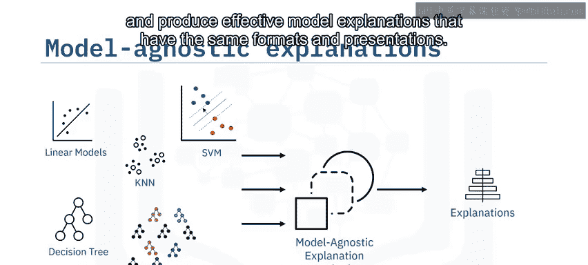

## 一个分类任务示例

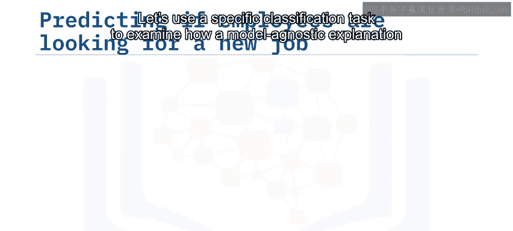

让我们用一个具体的分类任务来研究模型无关性解释方法是如何工作的。

在这个例子中，假设我们使用员工的个人资料（如城市发展指数、公司规模和类型、教育水平和经验水平等）构建了一个准确但复杂的分类模型，用于预测他们是否正在寻找新工作。

现在，让我们看看几种流行的模型无关性解释方法如何解释这个分类模型。

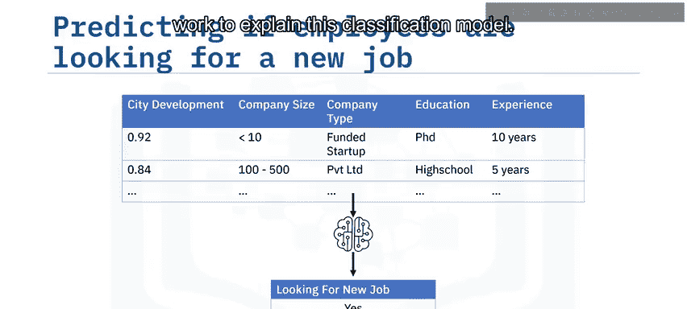

---

## 排列特征重要性 🔍

解释机器学习模型的一种常见方法是识别其最显著的特征。这带来两个好处。

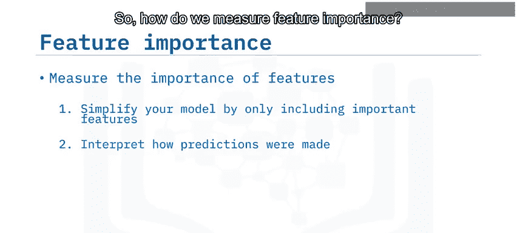

首先，你可能希望通过仅包含重要特征来简化模型，以降低过拟合的风险。其次，你可以通过分析模型最重要的特征来解释模型是如何做出决策的。

那么，我们如何衡量特征重要性呢？有许多算法，例如排列特征重要性、基于不纯度的特征重要性以及称为SHAP值的沙普利加性解释等。它们都遵循相似的原则。在本视频中，我们将重点介绍最流行的方法：排列特征重要性。

### 排列特征重要性的基本思想

排列特征重要性的基本思想非常简单。对于每个特征，我们打乱其特征值，并使用模型基于打乱后的值进行预测。在大多数情况下，预测误差会增加。打乱重要或有影响力的特征往往会产生较大的预测误差，而不太重要的特征往往只会产生较小的误差增加。因此，可以通过计算打乱前后预测误差的差异来衡量特征重要性。

让我们回到预测员工是否会寻找新工作的例子。假设我们想衡量打乱城市发展指数特征后的预测误差。

首先，我们打乱或置换其特征值。这可以是随机置换，也可以基于某些分布。由于这种特征值的变化，模型的预测会变差，从而导致预测误差增加。因此，我们可以通过衡量置换其值所引起的预测误差差异来计算城市发展特征的重要性。

此外，我们可以计算所有特征的排列重要性并进行排序，并使用条形图或箱线图将其可视化。

如下图所示，我们可以立即找到用于预测员工是否会寻找新工作的前五个最重要特征。这五个最重要的特征是：城市发展、公司规模、教育、经验以及公司类型是否为私营有限公司。

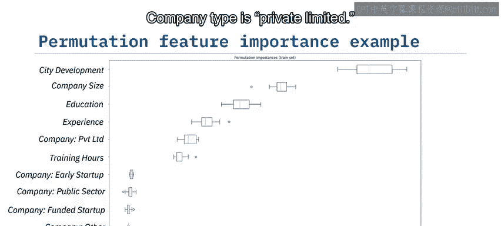

---

## 部分依赖图 📊

到目前为止，你已经学会了如何使用排列特征重要性来查找每个特征的相对重要性。然而，有时仅仅找出重要性还不够，我们可能还想了解感兴趣的特征与模型结果之间的关系，例如关系是线性的、非线性的还是单调的等。这将帮助我们更多地了解这些重要特征。

例如，在预测工作变动时，我们知道经验很重要，但我们可能还想知道资深员工是否比初级员工更有可能寻求工作变动。

部分依赖图是说明特征与模型结果之间关系的有效方法。它本质上是可视化特征的边际效应，即显示当特定特征在其分布范围内变化时，模型结果如何变化。

请注意，在改变感兴趣的特征时，我们保持其余特征不变。例如，我们想看到经验与模型结果之间的关系，那么我们只需要将经验值从其范围（例如0到20）内改变，同时保持其他特征不变，并计算所有实例的平均预测值。

如果我们使用折线图可视化经验特征的边际效应，那么我们就可以得到部分依赖图。正如我们在这个PDP中所看到的，员工经验与工作变动概率之间存在粗略的线性关系，下降的线表明员工资历越深，他们更换当前工作的可能性就越小。

---

## 总结

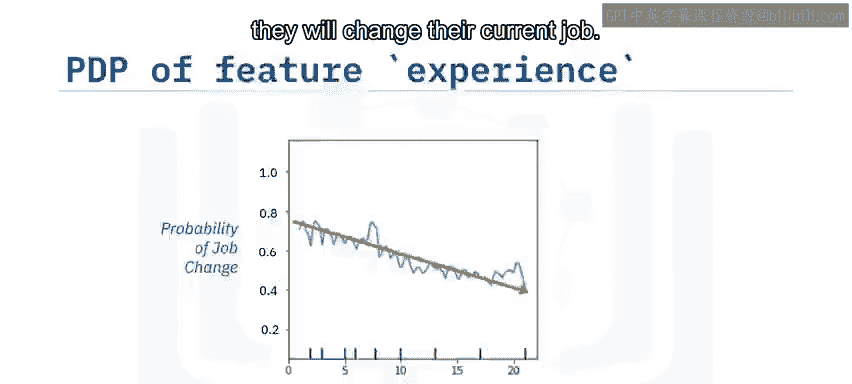

在本视频中，你学习了可以使用模型无关性解释方法来理解不同的模型，无论其结构如何。

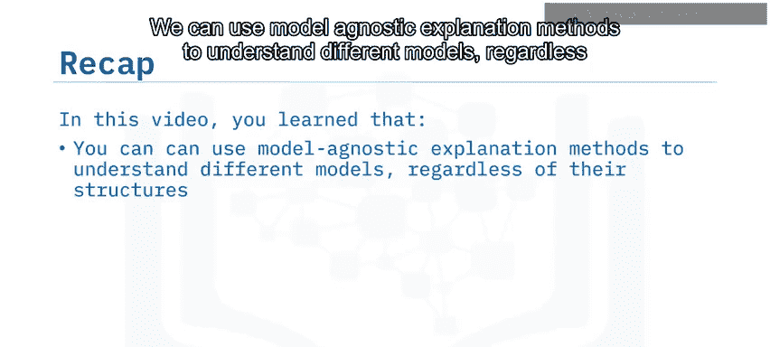

你可以使用排列特征重要性来计算和排序特征重要性。

你可以使用部分依赖图来说明感兴趣的特征与模型结果之间的关系。