# 148：替代模型 🧩

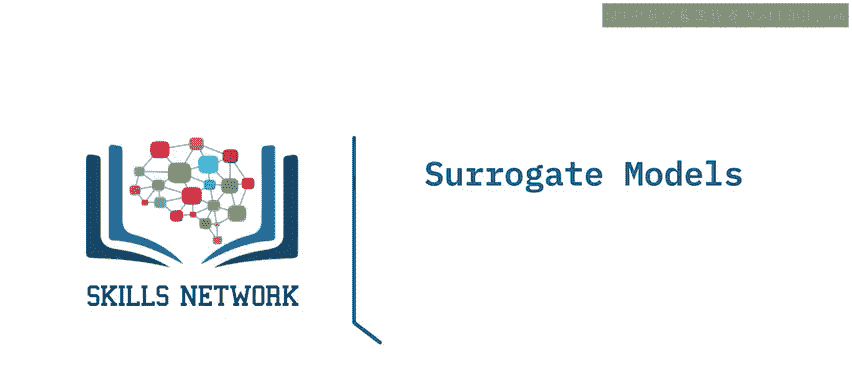

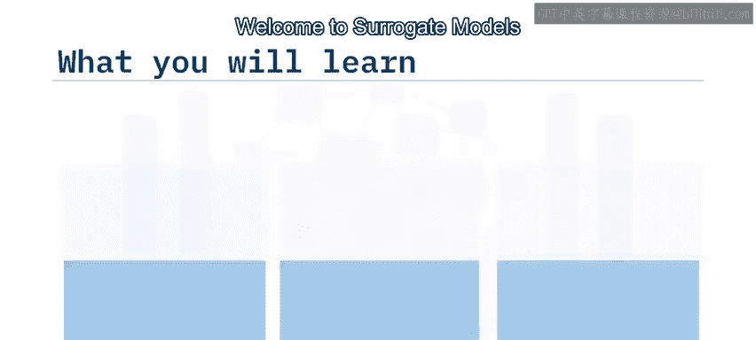

在本节课中，我们将学习一种解释复杂机器学习模型的方法——替代模型。我们将了解什么是全局替代模型，如何构建它们，以及如何使用局部可解释模型无关解释（LIME）来理解模型对特定数据实例的预测。

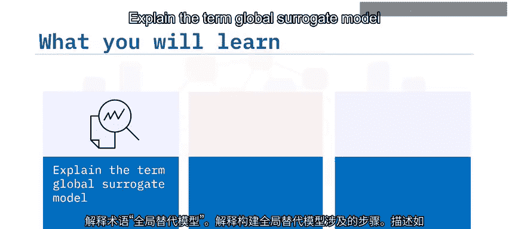

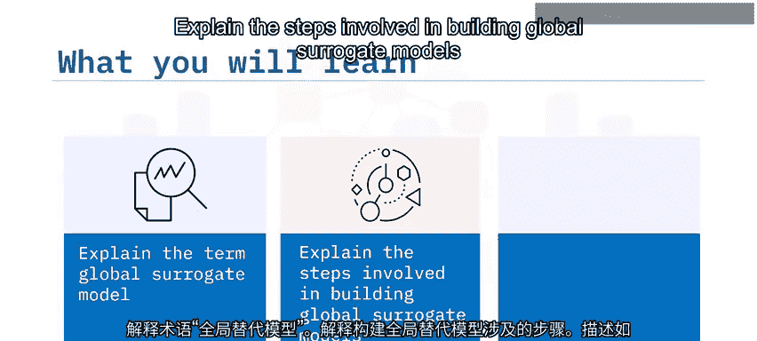

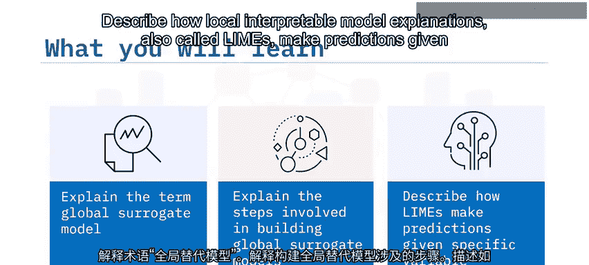

---

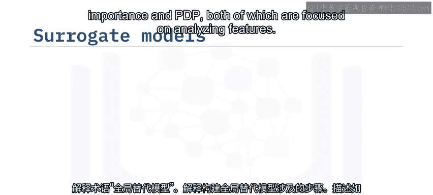

## 概述

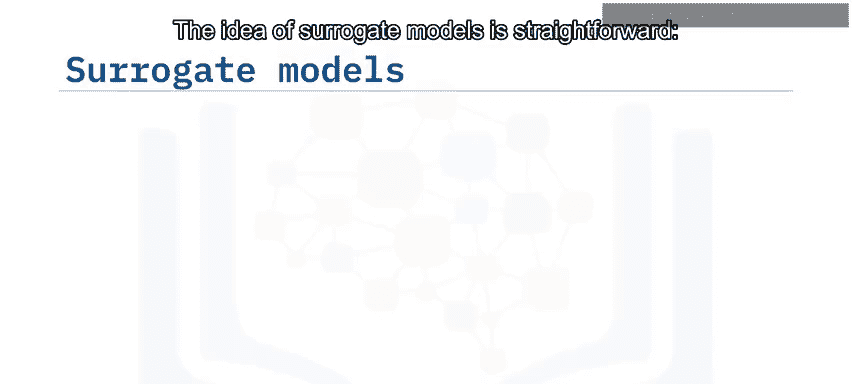

之前我们已经学习了通过分析特征重要性和部分依赖图来解释复杂机器学习模型的方法，这两种方法都侧重于分析特征本身。

接下来，我们将学习另一种解释方法，称为替代模型。其核心思想是：用一个简单、可解释的模型（如线性模型或决策树）去近似模拟一个复杂“黑箱”模型的输入输出关系。如果替代模型的预测结果与黑箱模型足够接近，我们就可以通过解释这个简单的替代模型来理解复杂的原始模型。

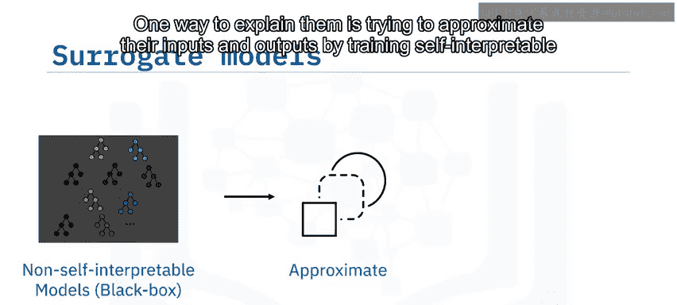

---

## 全局替代模型 🌍

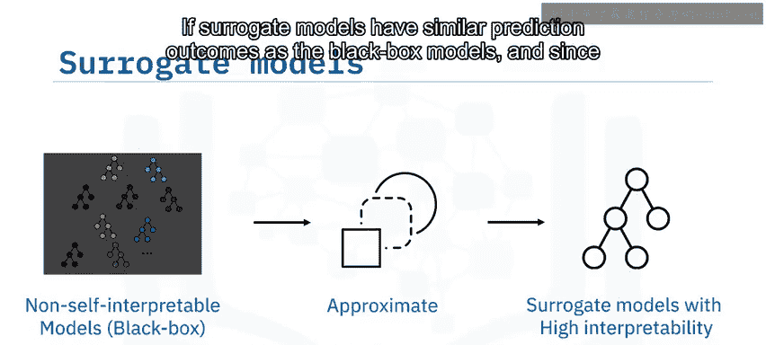

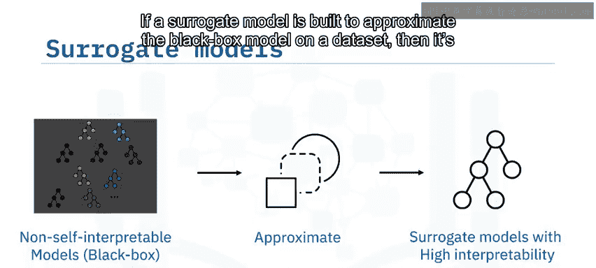

全局替代模型旨在用整个数据集来近似模拟黑箱模型的全局行为。

构建全局替代模型通常遵循以下步骤：

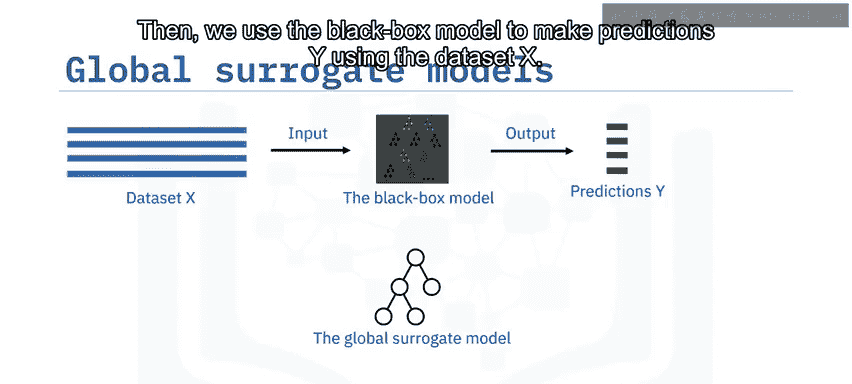

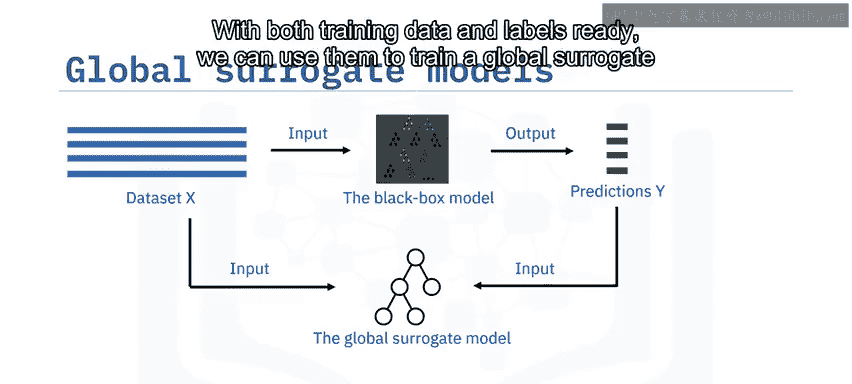

1.  **选择数据集**：选取一个数据集 `X` 作为输入。
2.  **获取黑箱模型预测**：使用黑箱模型对数据集 `X` 进行预测，得到预测结果 `Y`。
3.  **训练替代模型**：将 `X` 作为特征，`Y` 作为标签，训练一个可解释的模型（如线性回归或决策树）。这个替代模型会产生自己的预测 `Y'`。
4.  **评估近似效果**：计算 `Y` 和 `Y'` 之间的差异，例如使用 **R²值**、**Kappa系数** 或 **分类交叉熵损失**。如果差异较小，说明替代模型很好地近似了黑箱模型，此时我们可以转而解释这个简单的替代模型。

全局替代模型构建简单，在解释黑箱模型方面可能很有效。

然而，它也存在局限性。如果复杂的黑箱模型与简单的替代模型之间存在较大的预测不一致性，或者数据集中存在许多不同的实例群组或簇，导致替代模型过度泛化而无法准确反映特定数据模式，全局替代模型就可能失效。这两种情况在现实世界的数据中相当常见，因此有时难以构建有效的全局替代模型。

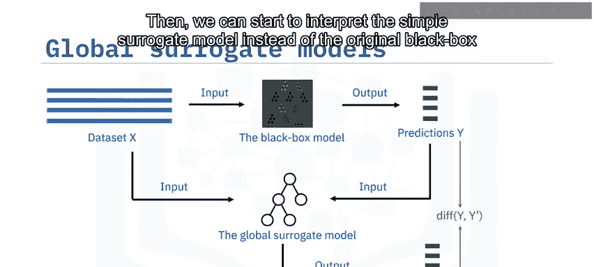

---

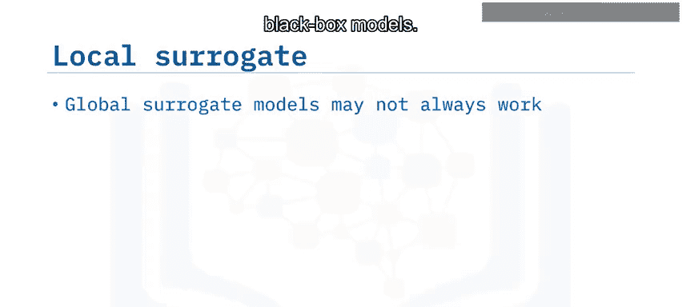

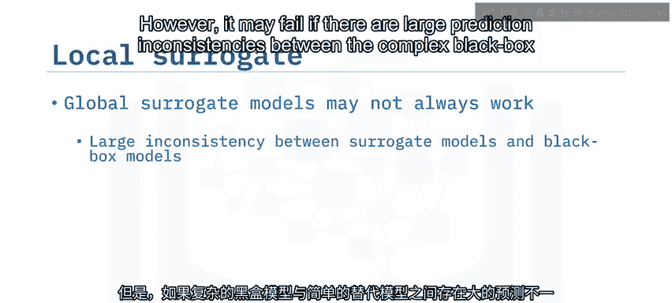

## 局部替代模型与LIME 🔍

有时，我们更关心黑箱模型如何对某些特定的数据实例进行预测。通过理解这些典型例子，我们可以在不完全理解模型全局行为的情况下获得有价值的洞见。

因此，我们希望仅使用一个或少数几个实例来构建局部替代模型。但用如此少量的数据训练模型是否可行呢？

局部可解释模型无关解释（Local Interpretable Model-agnostic Explanations, **LIME**）就是一种用于构建局部替代模型的流行方法。

LIME与构建全局替代模型的主要区别在于，LIME首先会基于选定的数据实例生成一个**人工数据集**。

假设我们选择了一个代表性的数据实例，并希望通过构建局部替代模型来理解黑箱模型如何对该实例进行预测。我们可以将这个单一实例作为“种子”，通过特征置换来生成一个足够大的人工数据集，具体步骤如下：

以下是构建LIME局部替代模型的关键步骤：

1.  **生成人工数据**：以选定的“种子”实例为基础，对每个特征，根据其特征值的分布进行随机采样，生成新的数据实例，构成人工数据集 `X`。这类似于我们在排列特征重要性中使用的方法。
2.  **获取黑箱预测**：将人工数据集 `X` 输入黑箱模型，得到对应的预测结果 `Y`。
3.  **计算实例权重**：根据人工数据集中每个实例与“种子”实例的相似度，为每个实例分配权重。与“种子”实例越相似的实例，权重越大。这样做的好处是，权重大的实例在模型训练中影响更大，从而使训练出的模型更能反映黑箱模型在“种子”实例附近的行为。
4.  **训练局部模型**：使用加权后的人工数据集 `X'` 和对应的预测 `Y`，训练一个局部可解释模型（如线性模型）。

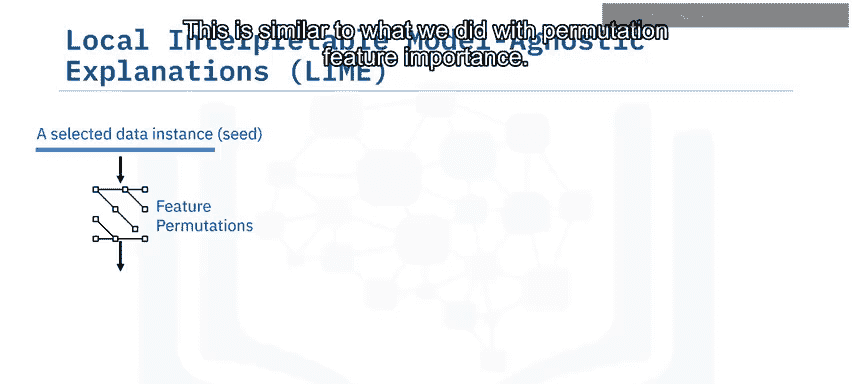

通过分析这个局部替代模型，我们就能解释原始黑箱模型是如何对选定的数据实例做出预测的。

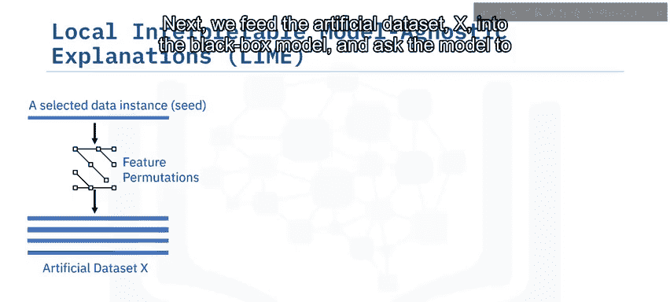

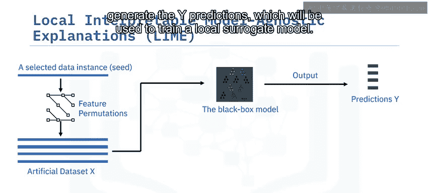

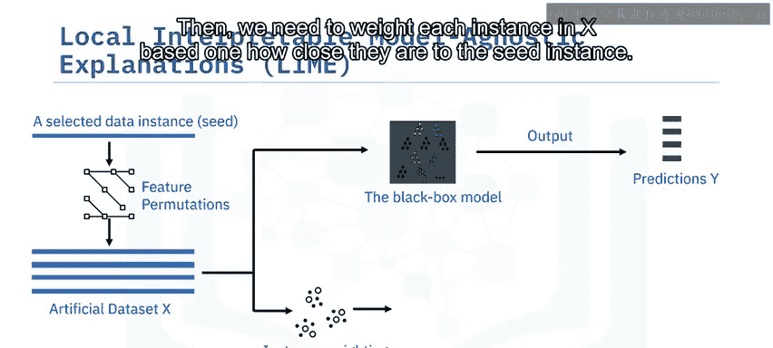

---

## LIME实例分析 📊

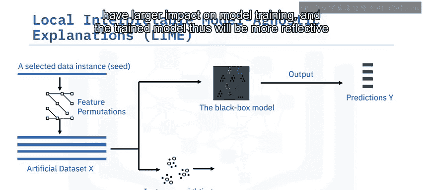

让我们看一个例子。假设我们有一个员工数据实例，黑箱模型预测该员工“很有可能正在寻找新工作”。我们使用LIME来解释这个决策是如何做出的。

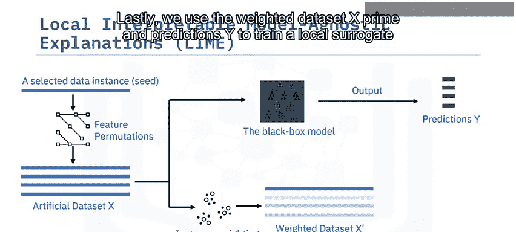

LIME生成的可视化结果是一个用颜色标记的水平条形图，显示了每个特征及其取值对预测结果的贡献度，其中**绿色表示正向贡献**，**红色表示负向贡献**。

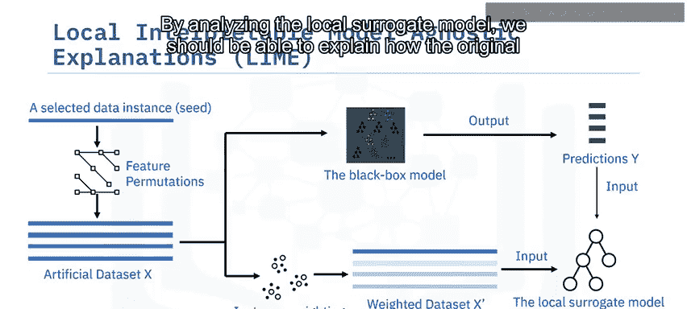

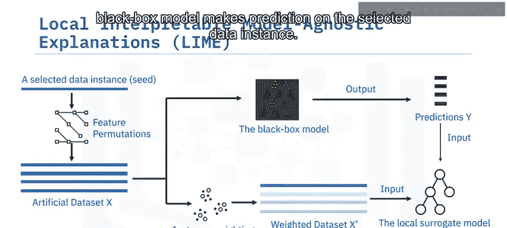

从图中我们可以看到：
*   **公司类型（私营有限公司）** 贡献了约45%。
*   其次是**城市发展指数**。
*   接着是**公司规模**。
*   然后是**研究生学历**。

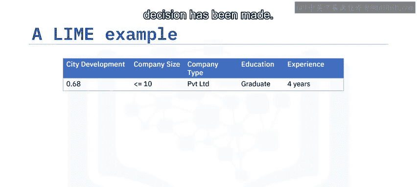

值得注意的是，“公司不属于公共部门”这一特征做出了负向贡献。这意味着，由于该员工不在公共部门公司，他换工作的可能性会降低一些。

通过分析LIME的结果，我们可以得出一个合理的解释：该员工之所以在寻找新工作，主要是因为他任职于一家规模很小的私营公司，且公司所在城市的发展水平不高。由于此人拥有大学学历，在同一个公司工作了大约四年后，他很可能会决定寻找新的机会。

---

## 总结

本节课我们一起学习了替代模型这一解释复杂机器学习模型的方法。

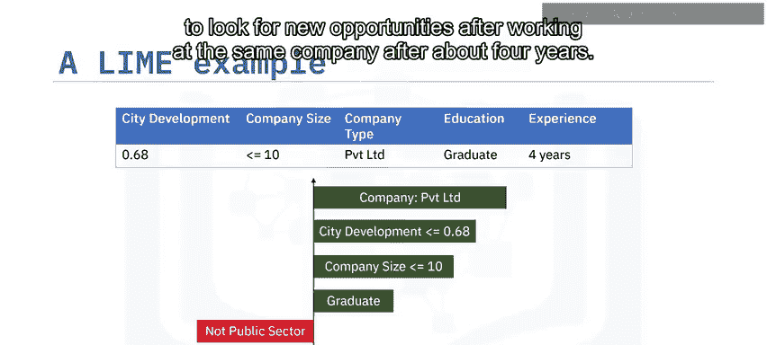

*   我们了解到，**替代模型**是通过训练简单的可解释模型来近似模拟复杂黑箱模型行为的一种方法。
*   我们掌握了构建**全局替代模型**的一般步骤。
*   我们还学习了如何使用**LIME算法**来构建**局部替代模型**，以解释模型对特定实例的预测。

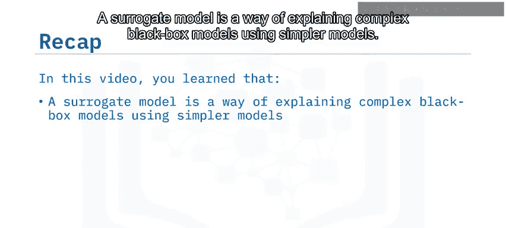

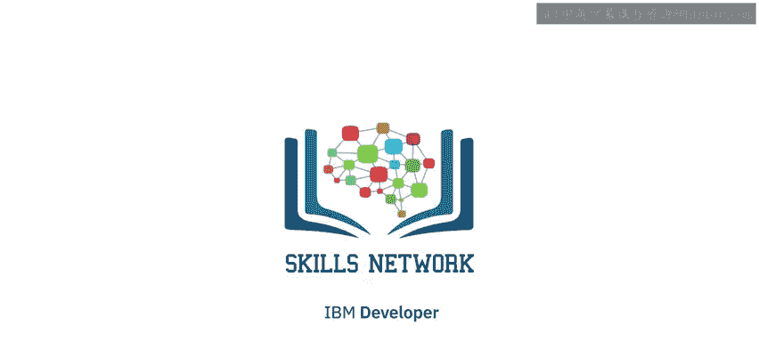

通过替代模型，我们可以在不牺牲模型预测能力的前提下，获得对模型决策过程更深入的理解。