# 149：不平衡类别简介 ⚖️

在本节课中，我们将要学习如何处理分类任务中的不平衡类别问题。我们将首先探讨不平衡类别带来的常见挑战，然后介绍几种平衡数据集的核心方法，包括上采样、下采样和重采样。

---

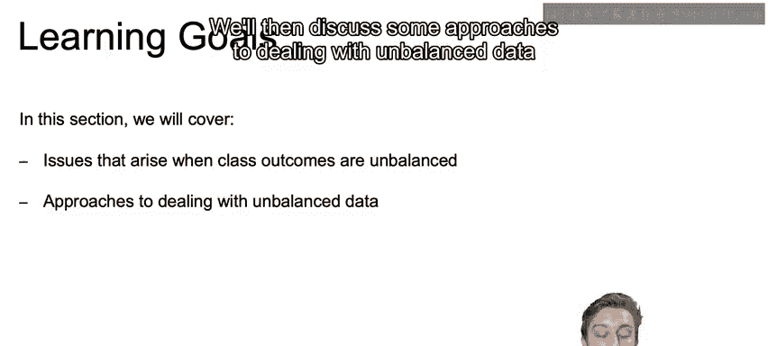

## 概述

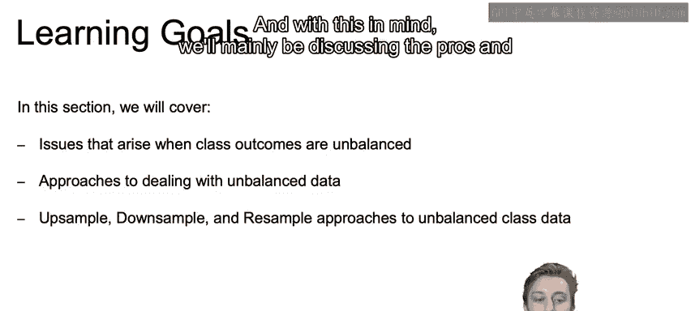

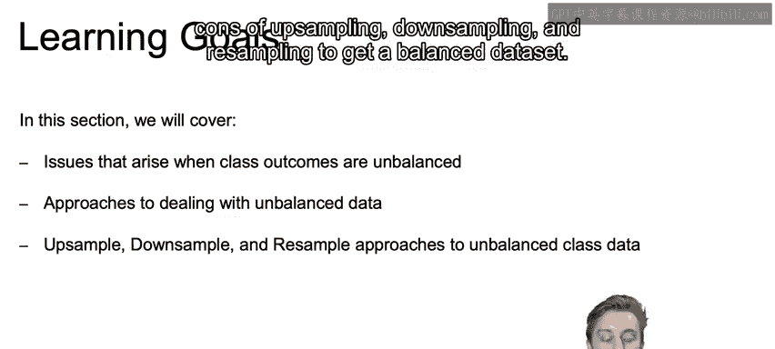

在接下来的视频中，我们将重点讨论对不平衡类别进行分类时的最佳实践。本节将快速介绍处理不平衡数据时出现的一些常见问题，并从较高层面探讨处理不平衡数据的方法。我们将主要讨论上采样、下采样和重采样这三种平衡数据集方法的优缺点。

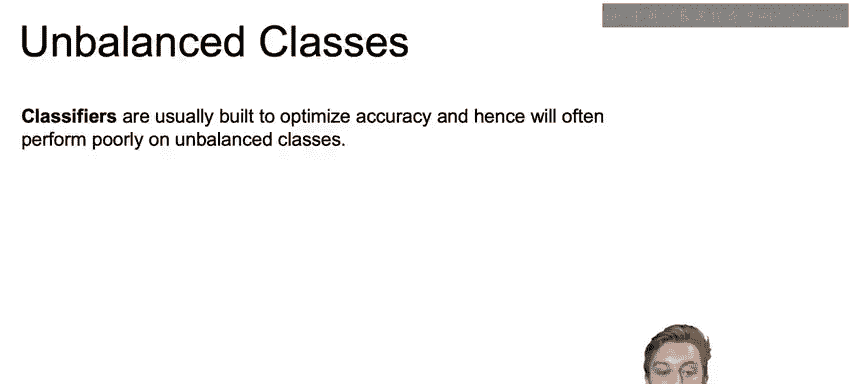

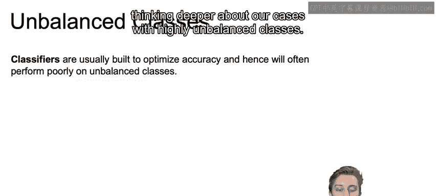

---

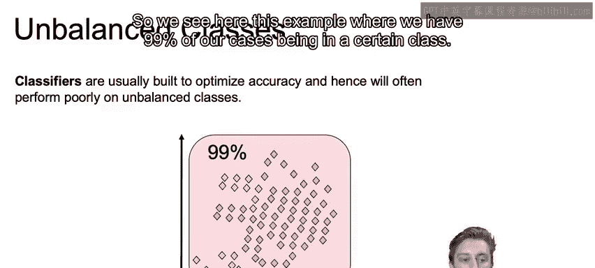

## 不平衡类别带来的问题

上一节我们介绍了评估分类模型的各种指标。本节中，我们来看看当类别高度不平衡时，模型训练会遇到哪些具体问题。

考虑一个例子，数据集中99%的样本属于某个特定类别。尽管我们可以使用准确率以外的评分函数（如F1分数、召回率）来衡量不平衡类别的误差，甚至可以对不同的超参数进行网格搜索，但分类器本身在学习和决策时，其内置的优化目标通常是**准确率**。

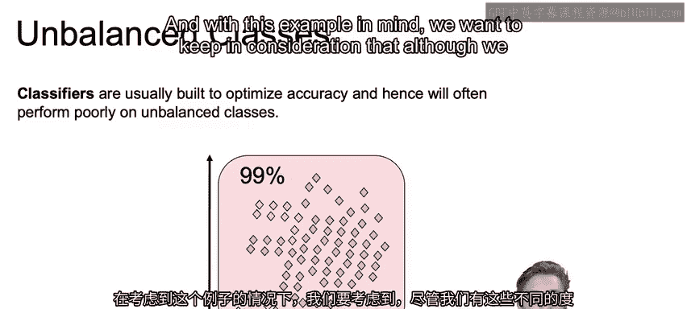

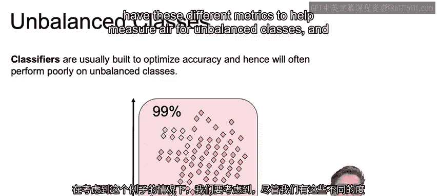

这意味着分类器的设计目标是尽可能多地预测正确，而不考虑类别是否平衡。因此，模型通常在样本数量较少的类别（即少数类）上表现不佳。这就是我们需要解决的问题。

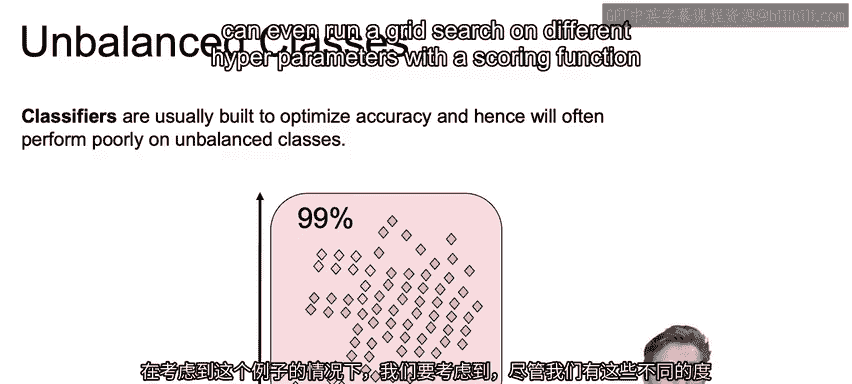

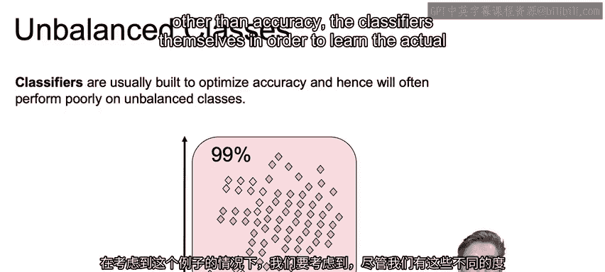

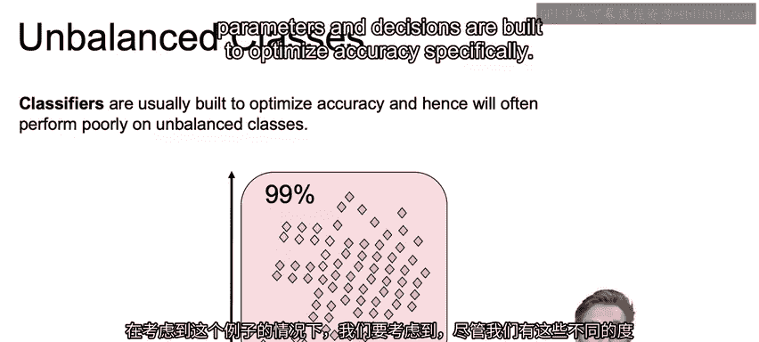

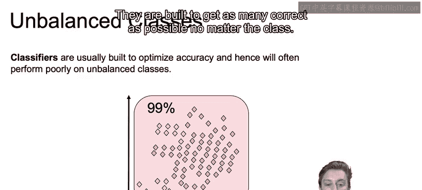

---

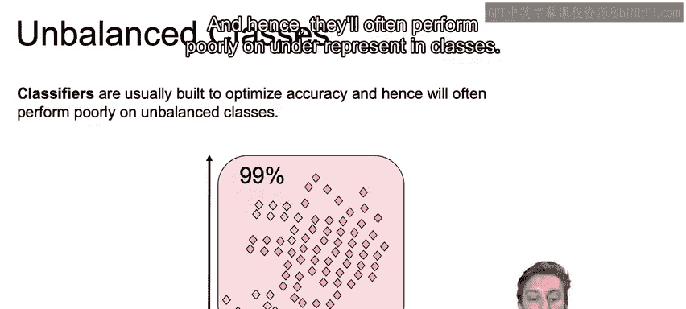

## 处理不平衡数据集的解决方案

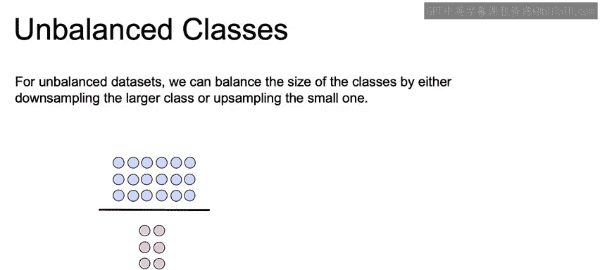

核心思路是：在拟合模型之前，设法平衡我们的数据集。以下是三种主要方法。

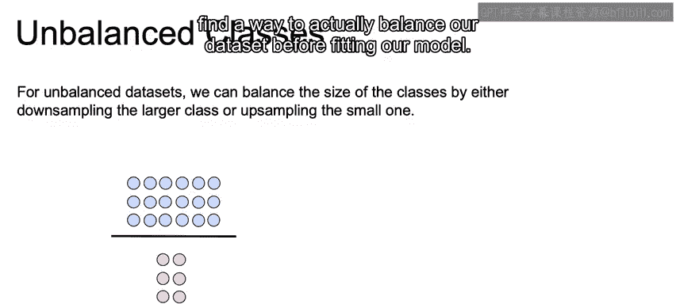

### 1. 下采样

下采样意味着从多数类中随机选取与少数类数量相同的样本。

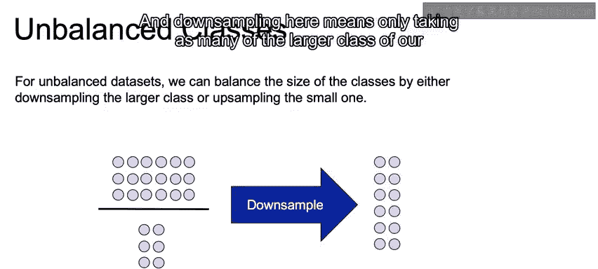

例如，假设多数类有18个样本，少数类有6个样本。下采样会从18个多数类样本中随机选择6个，从而得到一个平衡的数据集。

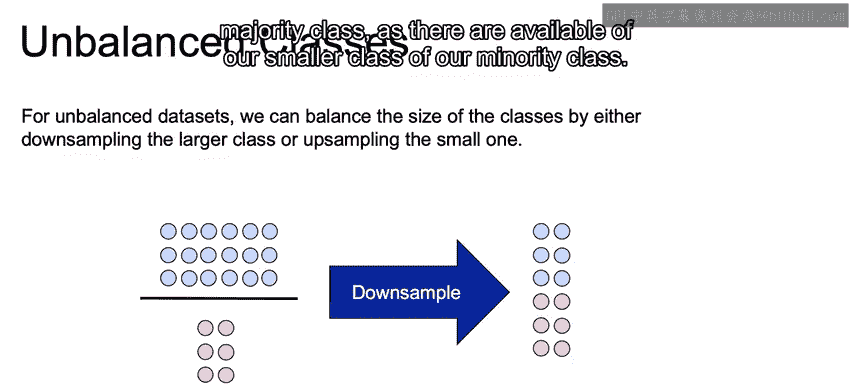

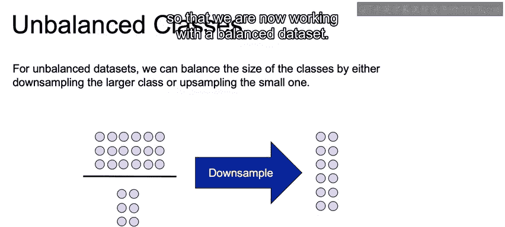

**公式/概念描述**：
设多数类样本数为 `N_majority`，少数类样本数为 `N_minority`。
下采样后，多数类样本数变为 `N_minority`。

### 2. 上采样

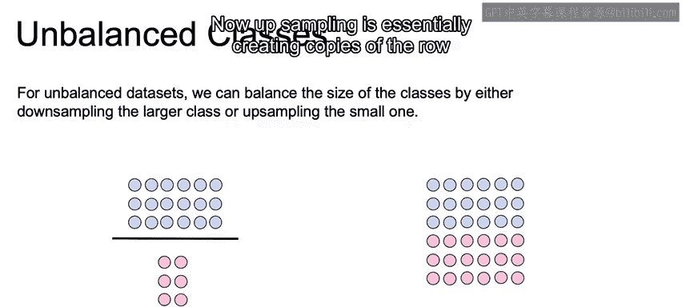

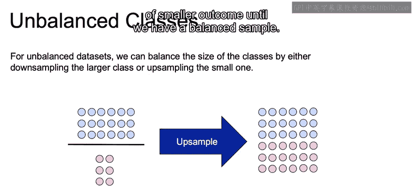

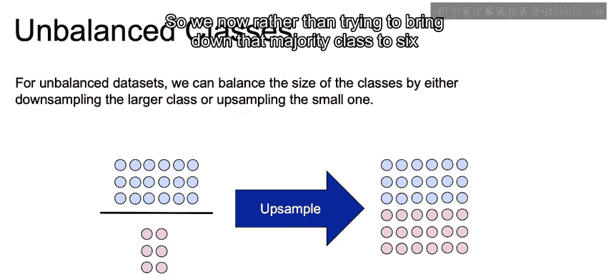

上采样是指复制少数类的样本，直到其数量与多数类持平。

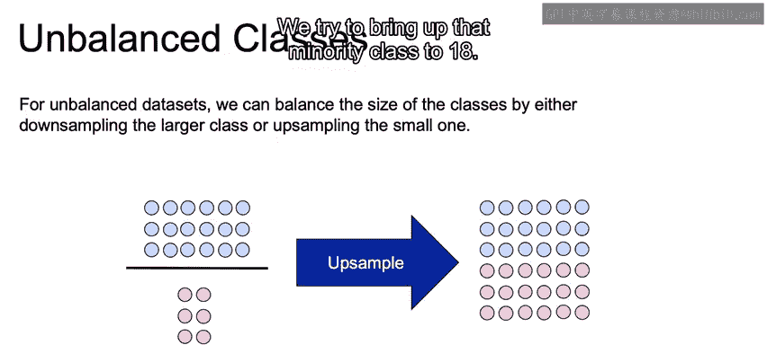

沿用上面的例子，少数类有6个样本，多数类有18个样本。上采样会通过复制少数类的样本来将其数量增加到18个，从而平衡数据集。

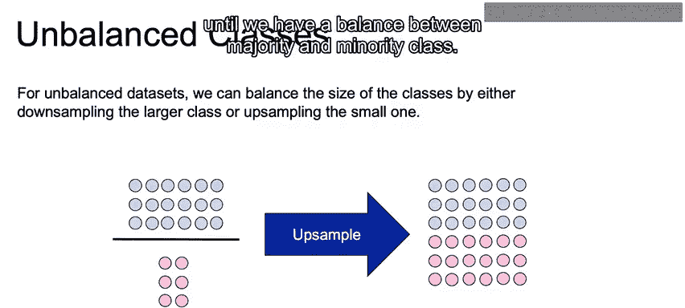

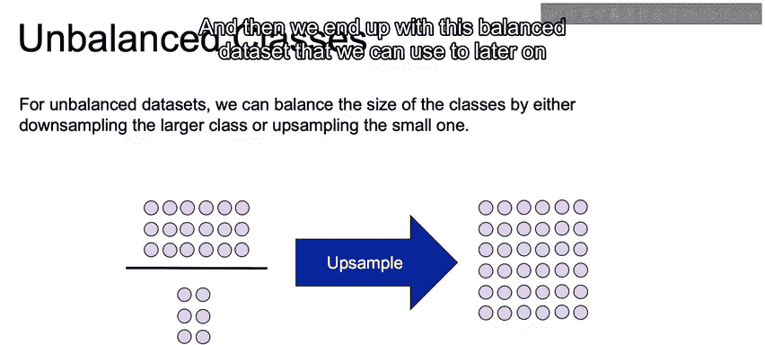

**公式/概念描述**：
上采样后，少数类样本数变为 `N_majority`。

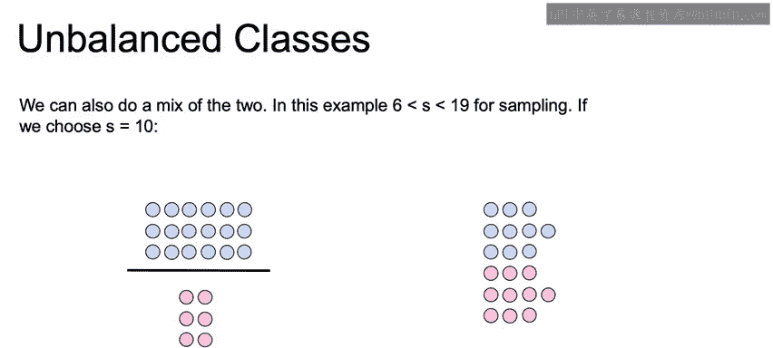

### 3. 重采样

重采样是上采样和下采样的混合方法。它通过同时减少多数类样本和增加少数类样本，使两个类别达到一个预设的平衡数量。

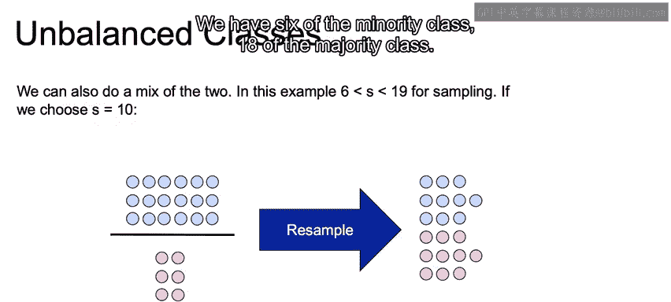

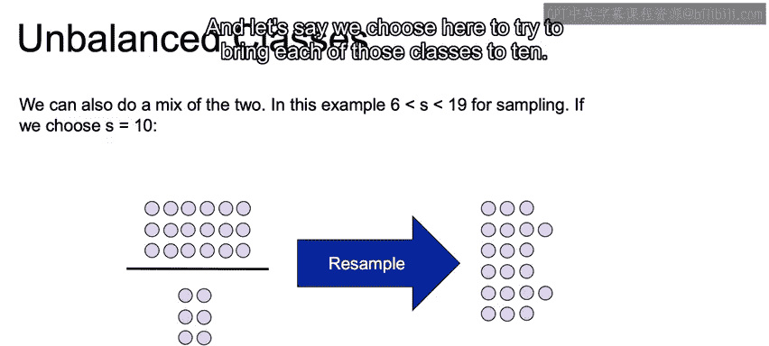

例如，少数类有6个样本，多数类有18个样本。我们可以设定目标，让每个类别都达到10个样本。
*   首先，从多数类的18个样本中随机下采样，选出10个。
*   然后，通过复制少数类的4个样本（使其从6个增加到10个）来进行上采样。
最终，我们得到一个两个类别各有10个样本的平衡数据集。

**公式/概念描述**：
设目标样本数为 `N_target`。
对多数类进行下采样：`N_majority -> N_target`
对少数类进行上采样：`N_minority -> N_target`

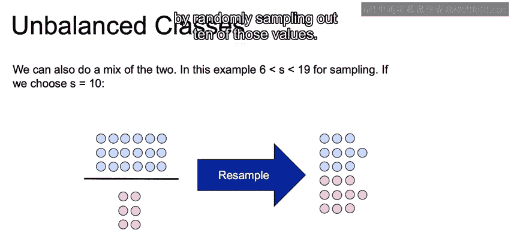

---

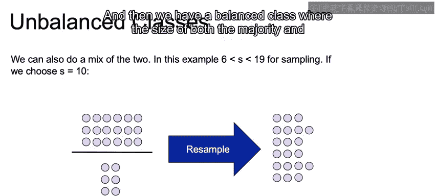

## 总结

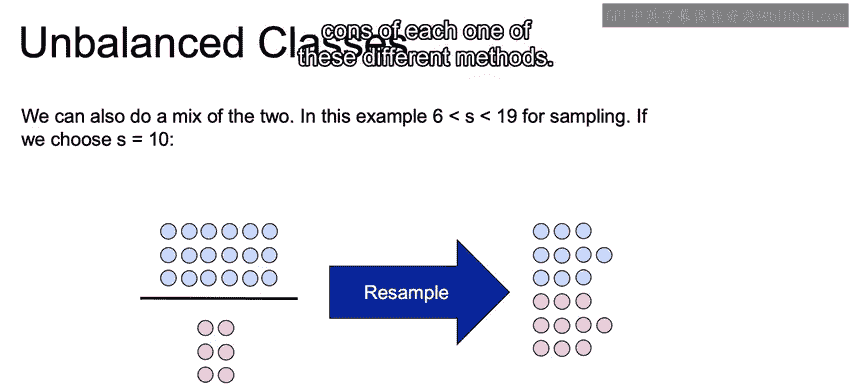

本节课中，我们一起学习了不平衡类别问题及其对模型训练的负面影响。我们了解到，由于分类器默认优化整体准确率，它们在少数类上的表现往往不佳。为了解决这个问题，我们介绍了三种在训练前平衡数据集的核心方法：**下采样**、**上采样**和**重采样**。在接下来的课程中，我们将进一步深入探讨每种方法的优缺点。