# 151：加权与分层抽样 📊

在本节课中，我们将学习处理不平衡数据集的更复杂且常用的建模方法。不平衡数据集是指其中某一类别的样本数量远多于其他类别的数据集，这可能导致机器学习模型在学习和预测时偏向多数类，从而影响模型性能。

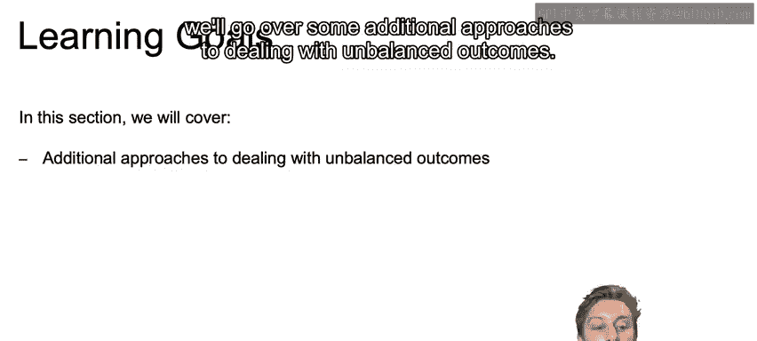

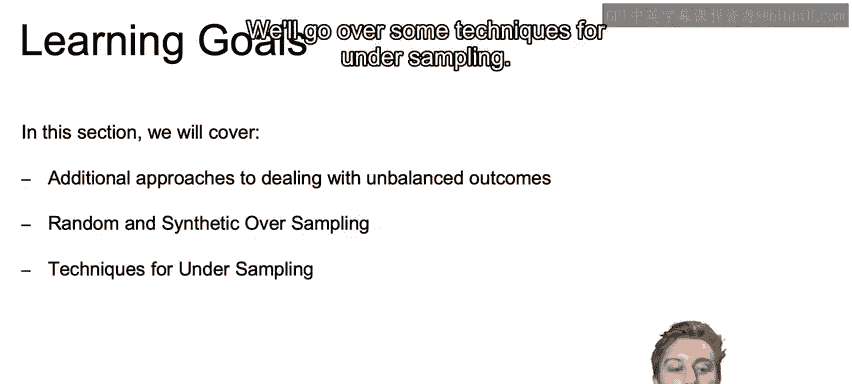

上一节我们介绍了不平衡数据集带来的问题，本节中我们来看看如何通过加权和分层抽样等技术来应对这些挑战。

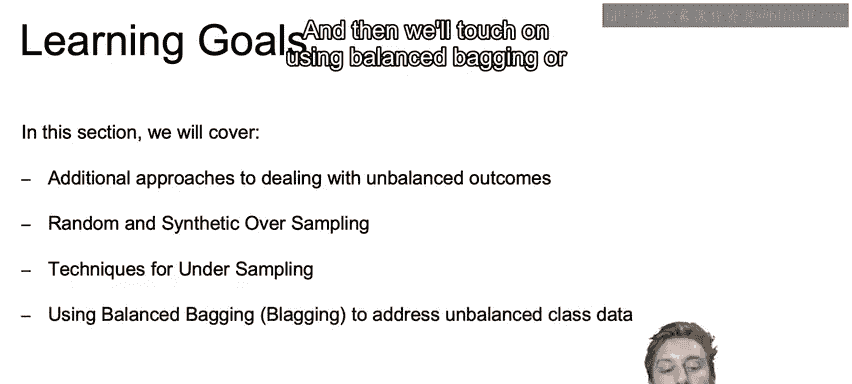

## 不平衡数据的问题 🤔

当处理不平衡类别时，核心问题在于机器学习模型的学习阶段及其最终做出的预测，很容易受到不平衡数据的影响。

例如，支持向量机在不同不平衡程度下的表现显示，对于像此处顶部两个所示的不平衡数据集，模型最终会严重偏向多数类，从而无法正确分类少数类中的值。

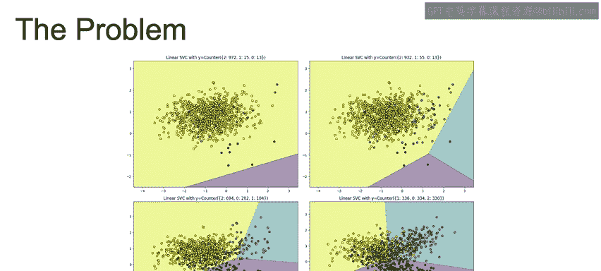

## 处理不平衡数据的方法概览 🛠️

为了纠正这个问题，在实践中我们可以使用多种方法。

以下是几种主要的方法：

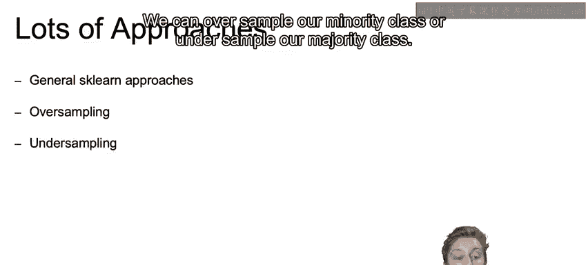

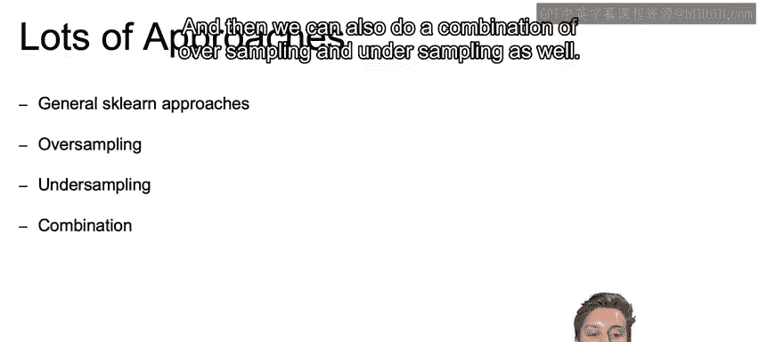

*   **Scikit-learn通用方法**：许多模型都提供了一个名为`class_weight`的超参数。默认情况下，它设置为`None`，但我们可以将其设置为字符串`'balanced'`，以帮助平衡归属于少数类和多数类的误差。
    *   代码示例：`model = LogisticRegression(class_weight='balanced')`
*   **过采样**：增加少数类样本的数量。
*   **欠采样**：减少多数类样本的数量。
*   **组合方法**：同时进行过采样和欠采样。
*   **集成方法**：利用过采样或欠采样技术，确保每个类别之间的平衡。

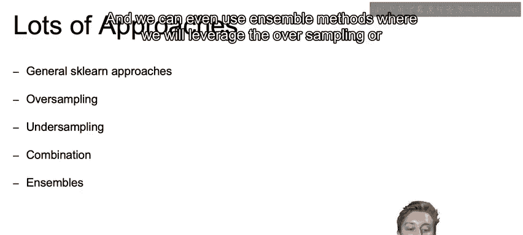

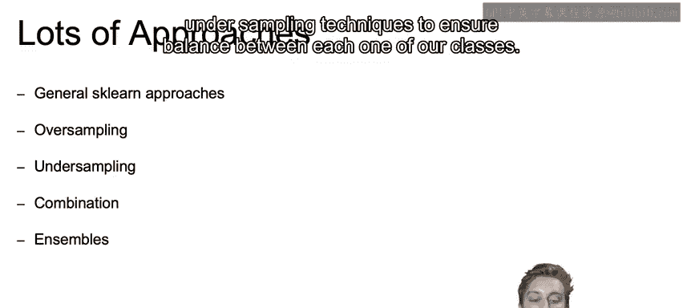

## 加权观测值 ⚖️

正如前面提到的，许多模型允许对观测值进行加权。我们可以通过将`class_weight`超参数设置为`'balanced'`（即这个字符串）或使用您选择的其他特定权重，来调整这些权重，使得各个类别的总权重相等。

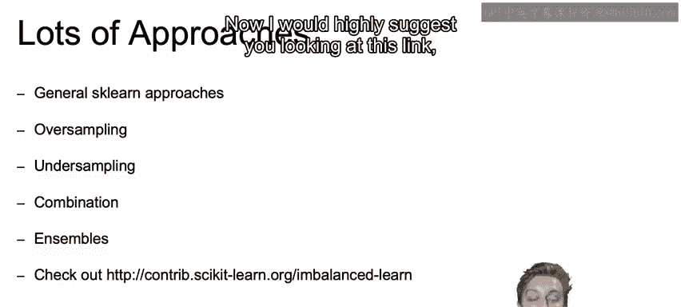

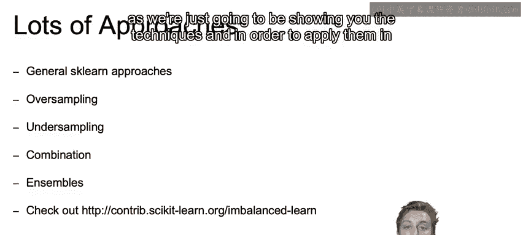

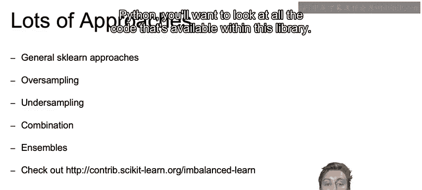

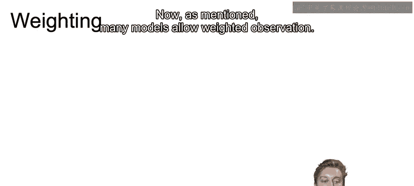

这种方法很方便，因为只要该特定模型支持，它就很容易实现，并且无需通过过采样或欠采样来牺牲数据。

## 分层抽样 📈

在处理不平衡数据集时，我们也可以并且应该对样本进行分层。这确保了我们的类别平衡在训练集和测试集中保持一致。

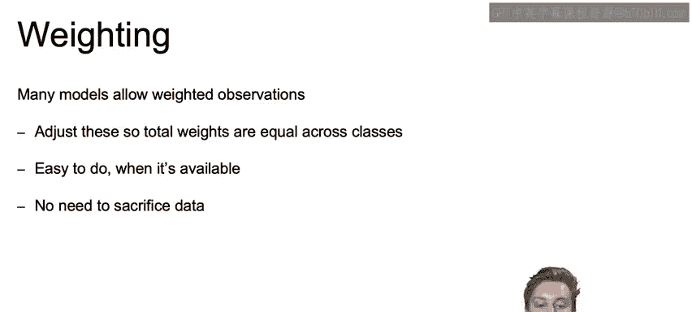

以下是Python中可用的选项：

*   在`train_test_split`函数中使用`stratify`参数。
    *   代码示例：`X_train, X_test, y_train, y_test = train_test_split(X, y, test_size=0.2, stratify=y)`
*   使用`StratifiedShuffleSplit`方法，这在我们许多笔记中都用过，它允许我们根据结果变量的平衡情况进行分层。
*   使用`StratifiedKFold`或`RepeatedStratifiedKFold`来创建许多同样经过分层处理的不同训练集和测试集。

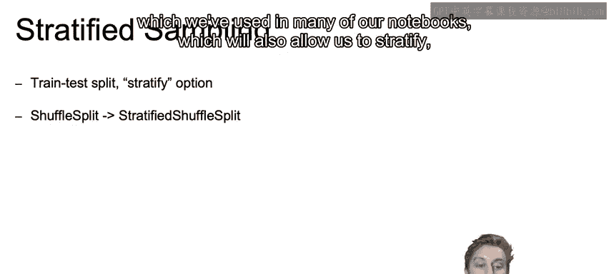

## 总结与下节预告 🎯

本节课中我们一起学习了处理不平衡数据集的两种重要技术：通过`class_weight`参数进行加权，以及通过`stratify`参数进行分层抽样。这些方法有助于确保模型在学习时不会过度偏向多数类，从而提升对少数类的识别能力。

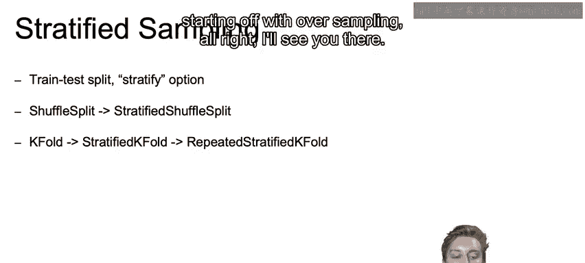

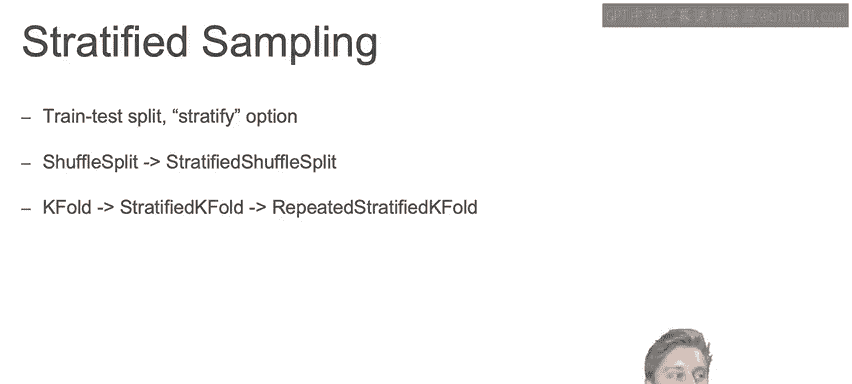

在下一个视频中，我们将开始介绍更技术性的平衡数据集的方法，首先从过采样开始。