# 153：近邻方法 👨‍🏫

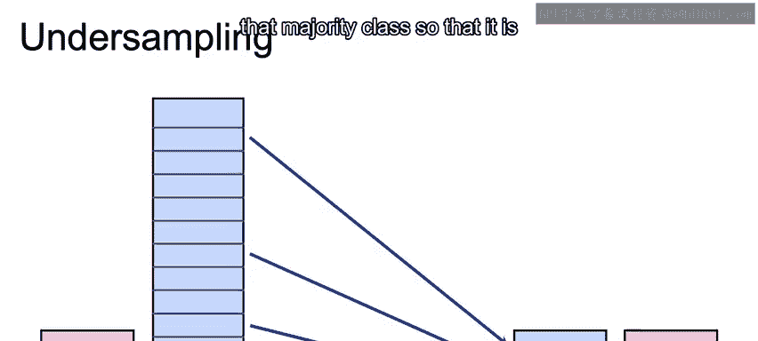

在本节课中，我们将要学习处理类别不平衡数据的一种重要技术：欠采样。具体来说，我们将深入探讨几种基于“近邻”概念的欠采样方法，了解它们如何通过减少多数类样本的数量来平衡数据集，并分析各自的优缺点。

上一节我们介绍了欠采样的基本概念，本节中我们来看看几种具体的近邻欠采样方法。

## 欠采样与近邻方法概述 📊

欠采样的核心目标是减少多数类样本的数量，使其规模与少数类相近。基于近邻思想的欠采样方法，其关键在于有选择地保留多数类中那些与少数类“关系密切”的样本点。

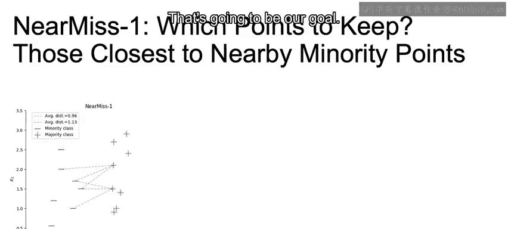

## 近邻缺失法 1 (Near Miss 1) 🎯

近邻缺失法 1 的目标是保留多数类中那些最靠近少数类边界点的样本。其选择标准是：对于多数类中的每个正样本，计算其到最近的 N 个少数类负样本的平均距离，然后保留那些平均距离最小的正样本。

**核心思想公式**：
对于多数类样本 `x_i`，计算其到最近的 `k` 个少数类样本的平均距离 `d_i`。选择 `d_i` 值最小的一批样本进行保留。

```
d_i = (1/k) * Σ distance(x_i, nearest_negatives_k)
```

这种方法旨在保留决策边界附近的点，有助于模型学习更清晰的分类边界。

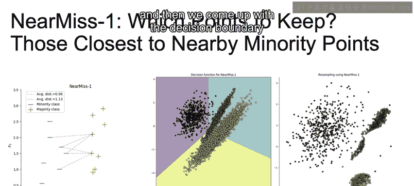

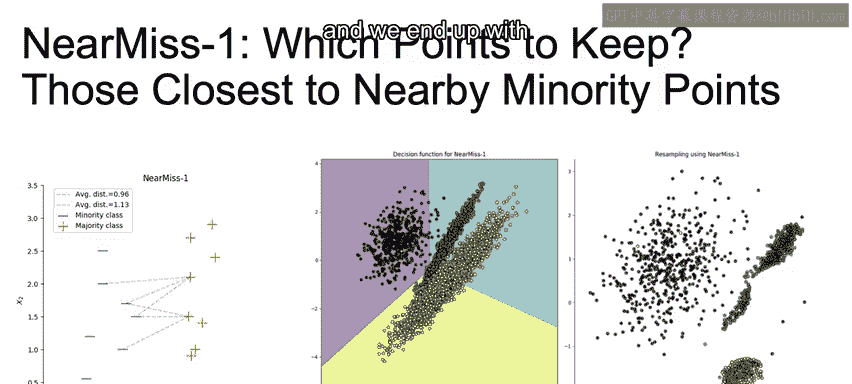

然而，这种方法存在一个明显的缺点：它很容易受到异常值或噪声点的干扰。如果少数类中存在一些远离主集群的异常点，那么多数类中靠近这些异常点的样本就会被优先保留，从而导致最终得到的决策边界发生扭曲，并非最优。

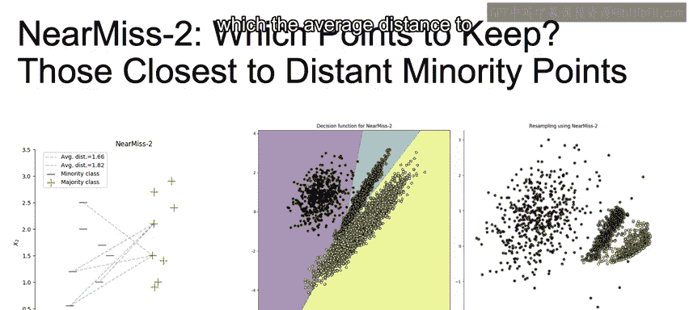

## 近邻缺失法 2 (Near Miss 2) 🛡️

为了克服 Near Miss 1 对异常值敏感的问题，近邻缺失法 2 采用了不同的策略。它选择那些到最远的少数类样本的平均距离最小的多数类样本。

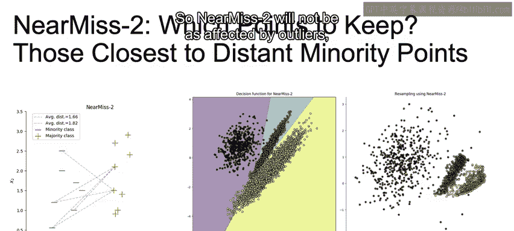

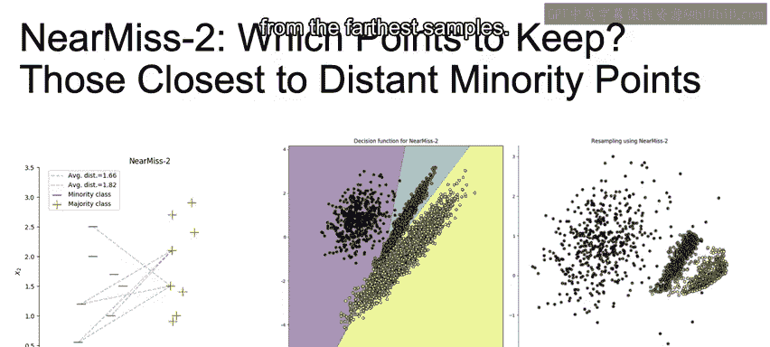

**核心思想公式**：
对于多数类样本 `x_i`，计算其到最远的 `k` 个少数类样本的平均距离 `d_i`。选择 `d_i` 值最小的一批样本进行保留。

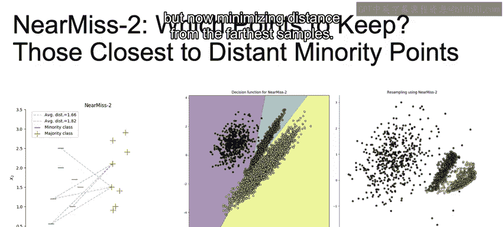

```
d_i = (1/k) * Σ distance(x_i, farthest_negatives_k)
```

由于该方法关注的是到“最远”样本的距离，而非“最近”的，因此受少数类中局部异常点的影响较小。它仍然在最小化距离，但目标变成了最小化到最远样本的距离，这有助于减轻噪声的影响，通常能得到比 Near Miss 1 更好的分类效果。但需要注意的是，它仍然可能受到边缘异常值的影响。


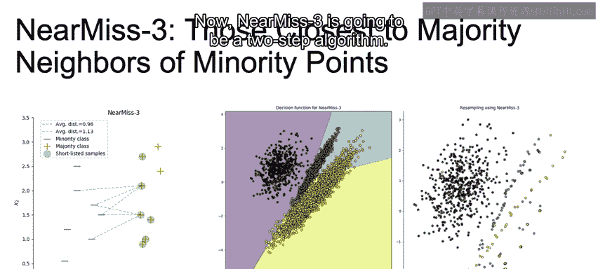

## 近邻缺失法 3 (Near Miss 3) ⚙️

近邻缺失法 3 是一个两步算法，旨在进一步降低噪声的影响。

以下是该算法的两个步骤：
1.  **第一步（为少数类找近邻）**：对于每个少数类（负样本），找到其在多数类（正样本）中的 M 个最近邻。
2.  **第二步（选择多数类样本）**：从第一步找到的这些正样本近邻中，选择那些到其 N 个最近邻（指其他正样本）的平均距离**最大**的样本。

**核心思想描述**：
首先通过少数类样本定位到多数类中潜在的边界区域（第一步），然后在该区域中选择彼此相距较远的点（第二步）。这种“先定位，再分散”的策略，使得 Near Miss 3 对异常值和噪声的鲁棒性更强，通常能产生更清晰、更合理的决策边界。

## Tomek Links 方法 🔗

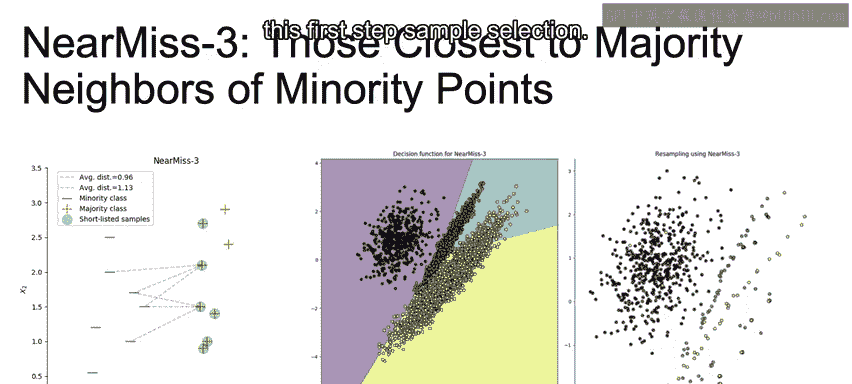

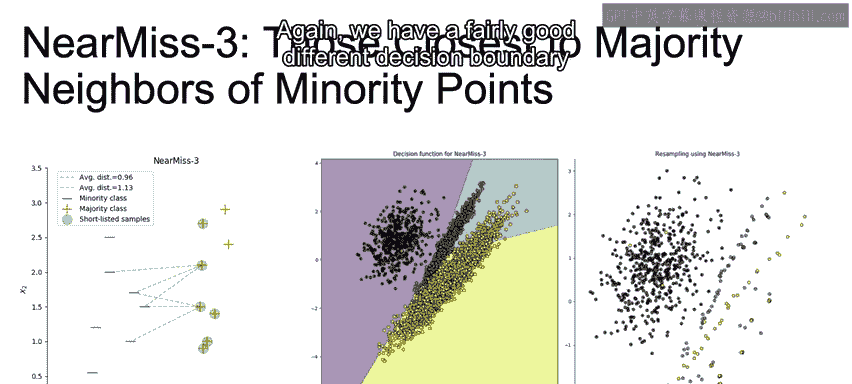

Tomek Link 的定义是：如果两个来自不同类别的样本互为彼此的最远邻，那么它们就构成一个 Tomek Link。

处理 Tomek Links 有两种常见策略：
*   **移除多数类样本**：只删除构成 Tomek Link 的多数类样本。
*   **移除双方样本**：将构成 Tomek Link 的两个样本（一个多数类，一个少数类）都删除。

这种方法的目的在于移除那些彼此过于接近、容易造成分类模糊的样本对，从而使类别之间的界限更加分明。

## 编辑最近邻法 (Edited Nearest Neighbors) ✂️

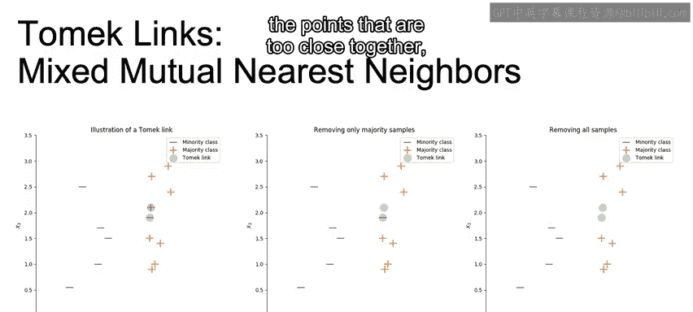

编辑最近邻法是一种基于分类结果进行清洗的方法。其过程非常简单：

1.  使用 K-最近邻算法（通常设 K=1）对训练集进行分类。
2.  检查多数类中的样本，如果某个样本被 KNN 错误地分类到了少数类，则将该样本从训练集中移除。

通过移除那些在原始分布下容易被误分类的多数类样本（通常是边界上的噪声点或重叠点），我们能够得到类别簇更加分明、边界更清晰的新数据集，从而有助于提升后续模型的性能。

## 总结 📝

本节课中我们一起学习了五种基于近邻的欠采样方法：
*   **Near Miss 1**：保留离少数类最近的多数类样本，但对异常值敏感。
*   **Near Miss 2**：保留离少数类最远样本最近的多数类样本，对异常值鲁棒性更强。
*   **Near Miss 3**：通过两步法选择边界区域且彼此分散的样本，抗噪声能力最佳。
*   **Tomek Links**：通过移除互为最近邻的异类样本对，来清晰化类间边界。
*   **Edited Nearest Neighbors**：利用 KNN 分类结果，移除多数类中被误分类的样本。

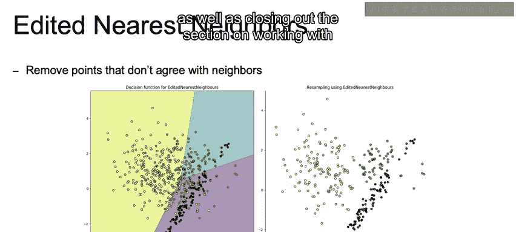

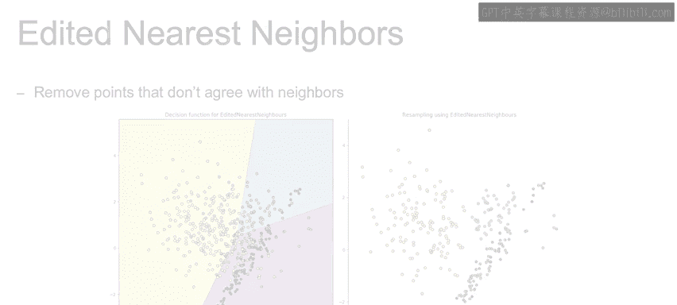

这些方法各有特点，适用于不同的数据场景。理解它们的原理和差异，能帮助我们在处理类别不平衡问题时做出更合适的技术选择。在接下来的课程中，我们将简要探讨如何结合过采样与欠采样技术，并结束关于处理不平衡类别的章节。