# 154：处理不平衡数据集的建模方法 🎯

在本节课中，我们将学习如何处理机器学习中常见的不平衡数据集问题。我们将探讨上采样、下采样以及集成方法，并介绍在实践中的重要步骤和评估指标。

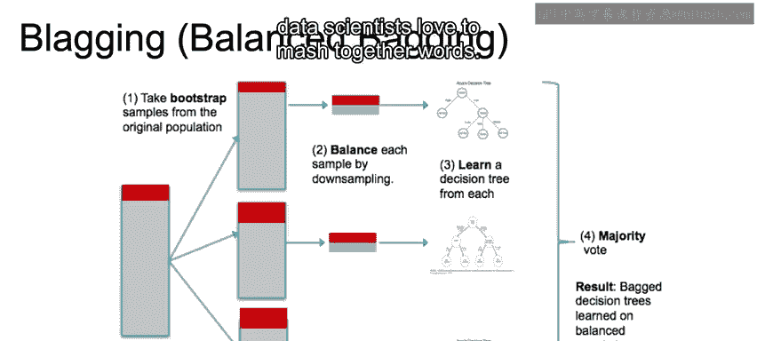

## 混合采样方法 🔄

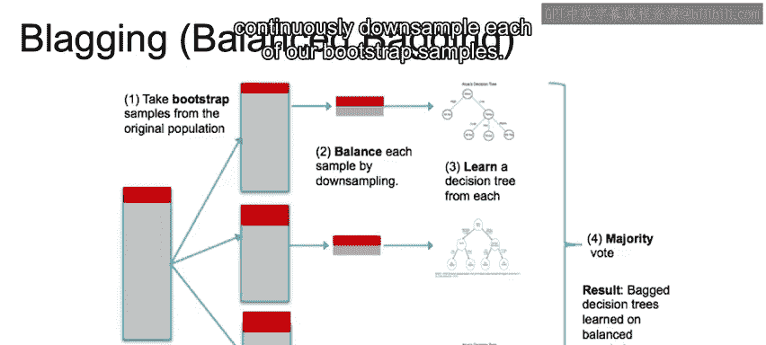

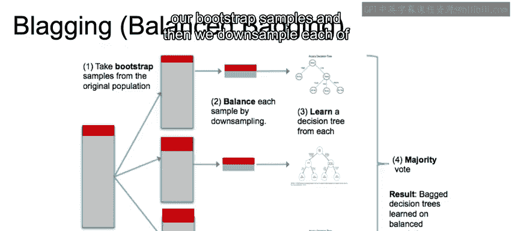

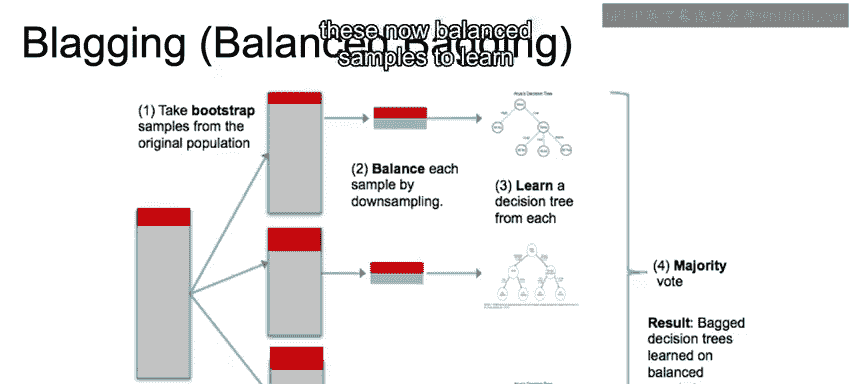

上一节我们讨论了上采样和下采样的基本概念。本节中我们来看看如何将两者结合使用。

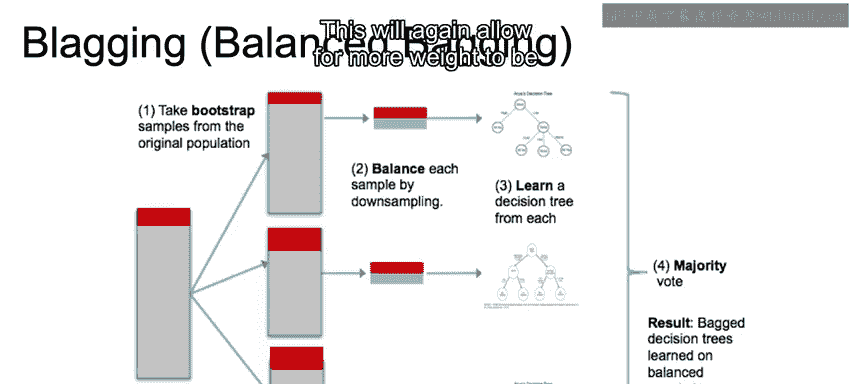

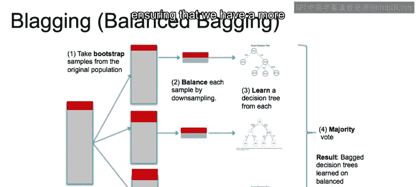

我们可以使用SMOTE进行上采样，然后为了移除噪声样本并避免过度上采样，我们也可以对多数类进行下采样。下采样可以通过Tomek Links或Edited Nearest Neighbors方法移除数据点来实现。

## 平衡装袋法 🧰

接下来，我们简要介绍一种针对不平衡数据集的直观集成技术，称为平衡装袋法。

这种方法的核心思想是确保对每个自助采样样本持续进行下采样。具体流程如下：

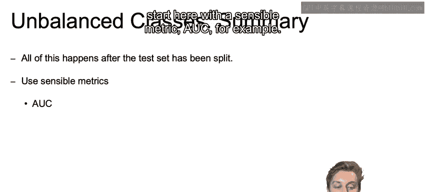

以下是平衡装袋法的步骤：
1.  生成自助采样样本。
2.  对每个样本中的多数类进行下采样。
3.  使用这些平衡后的样本来训练每一个独立的决策树。

这种方法能为少数类赋予更多权重，确保决策更加平衡。

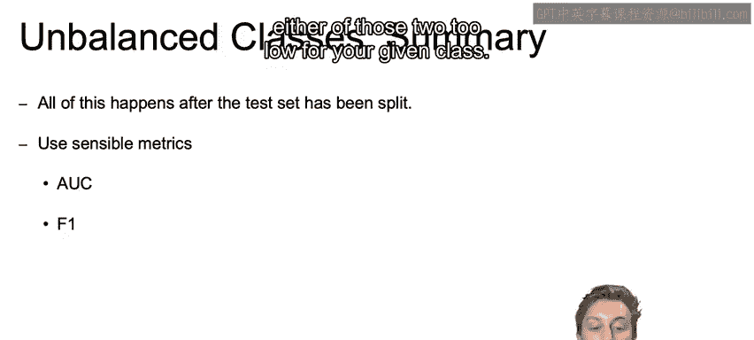

## 处理不平衡数据集的关键步骤 📝

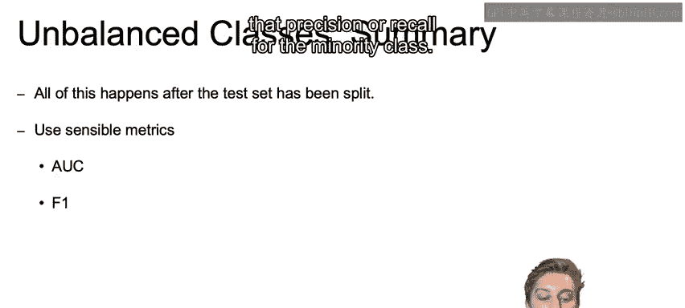

在开始应用上述技术之前，有几个关键步骤必须牢记。

以下是处理不平衡数据集时必须遵循的步骤：
1.  **首先进行训练集-测试集分割**：在进行任何上采样或下采样操作之前，必须首先分割数据集。如果先进行上采样，可能会导致某些值同时出现在训练集和测试集中，从而造成数据泄露和过拟合。即使是合成生成的新样本，其值也会非常接近训练集样本，仍然可能导致过拟合。
2.  **使用合理的评估指标**：对于不平衡数据集，选择合适的评估指标至关重要。

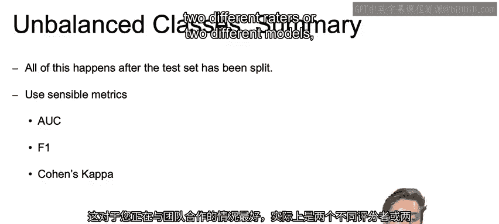

以下是几个推荐的评估指标：
*   **AUC（ROC曲线下面积）**：例如，AUC是一个合理的指标。它能展示少数类的真正例率和假正例率之间的权衡，并通过不同阈值让我们全面了解分类器的性能，甚至可以帮助确定符合业务目标的最佳阈值。
*   **精确率-召回率曲线与F1分数**：同样可以考虑精确率和召回率。我们也可以使用**F1分数**，因为它能平衡精确率和召回率，并且当某个类别的这两个值过低时会给予更严厉的惩罚。与准确率不同，F1分数不会因为类别不平衡而产生偏差（前提是针对少数类进行计算）。
*   **科恩卡帕系数**：这是一个我们尚未讨论的新指标。如果你在团队中工作，这个指标很有用。它衡量的是两个不同评分者或模型之间的一致性。每个评分者会将n个项目分类到互斥的类别中。该系数的目标是计算两个模型之间观察到的一致性与纯粹偶然达成一致的概率之比。对于不平衡类别，我们希望确保模型间有很强的一致性，并且这种一致性优于偶然达成的一致。科恩卡帕系数值越高，就越可以信任这两个模型达成一致的预测结果。
3.  **避免使用准确率**：在处理不平衡数据时，务必不要使用准确率作为评估指标，因为它很容易被误导。

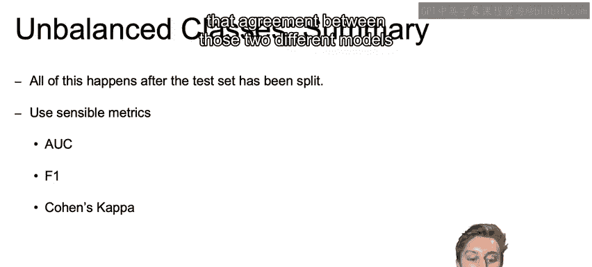

## 总结与回顾 📚

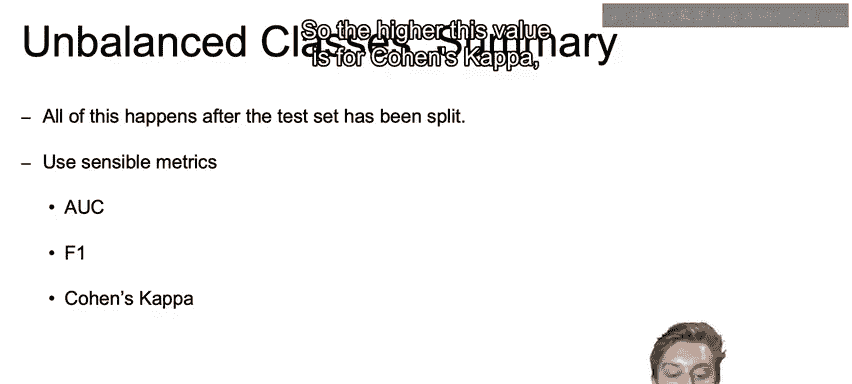

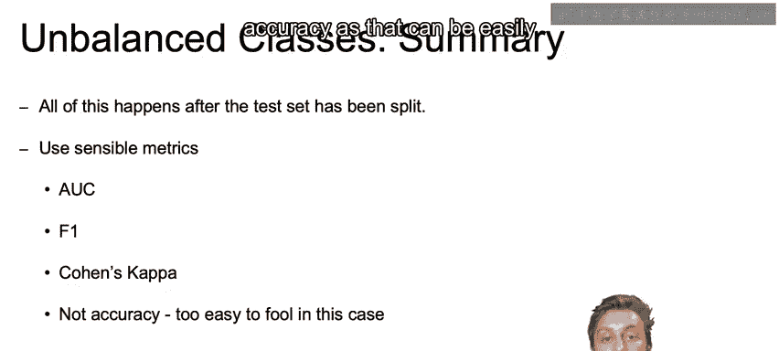

本节课中我们一起学习了处理不平衡数据的多种方法。

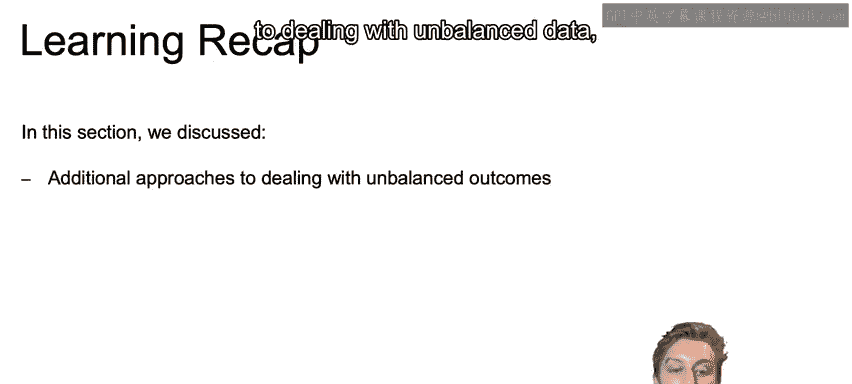

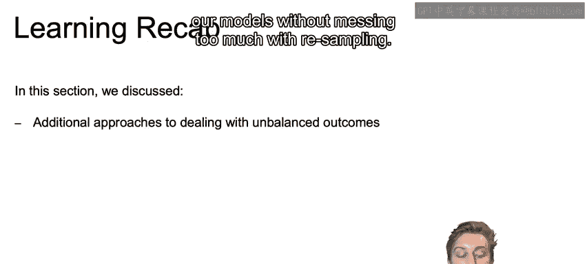

首先，我们讨论了在不进行重采样的情况下，直接为许多模型使用**类别权重超参数**的方法。

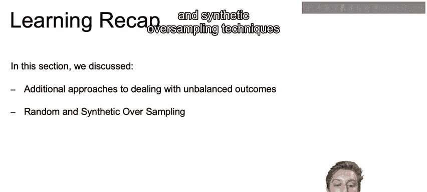

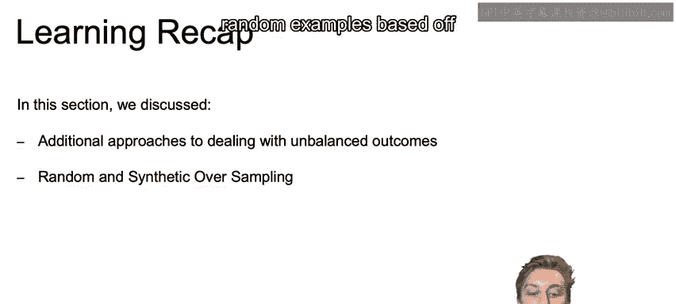

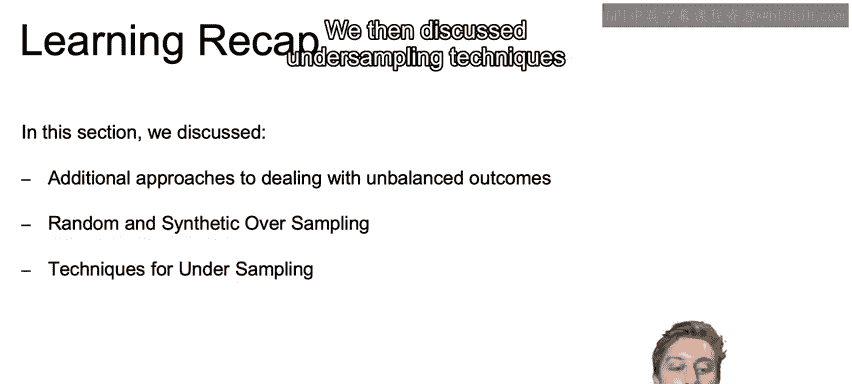

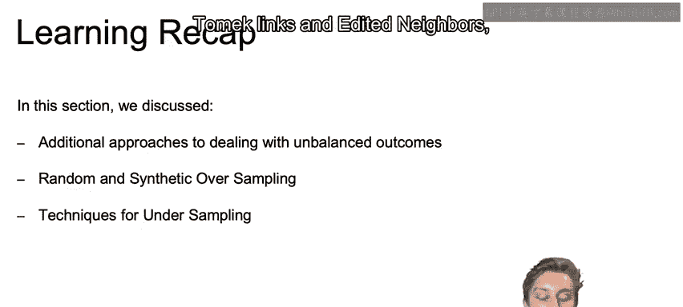

接着，我们深入探讨了随机和合成的**上采样技术**，如SMOTE和ADASYN，它们都基于K近邻算法生成随机样本。

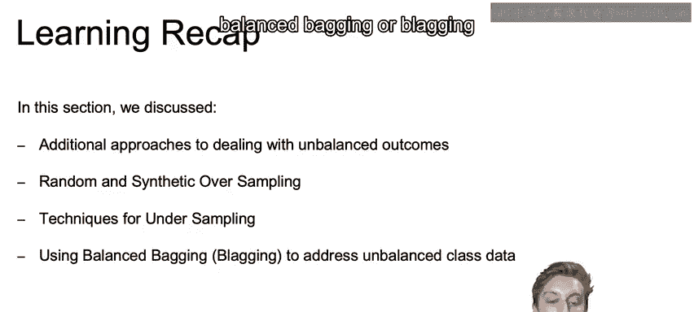

然后，我们介绍了**下采样技术**，如NearMiss、Tomek Links和Edited Nearest Neighbors。

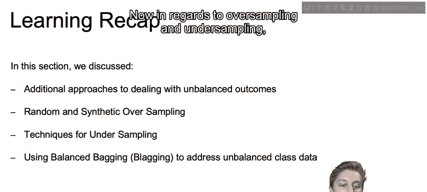

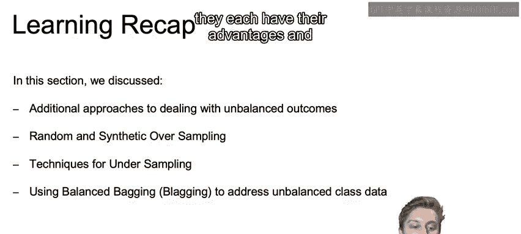

此外，我们还简要讨论了使用**平衡装袋法**来处理不平衡类别数据。

关于上采样和下采样，需要注意在实践中它们各有优势。通常很难在不进行交叉验证的情况下，仅凭直觉判断该使用哪种具体技术，因为我们几乎无法像示例中那样清晰地可视化数据。

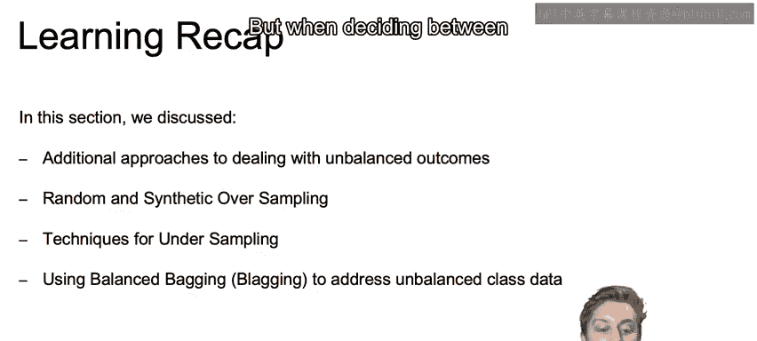

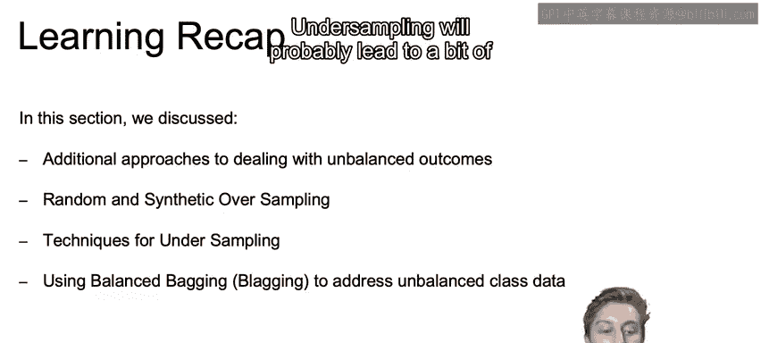

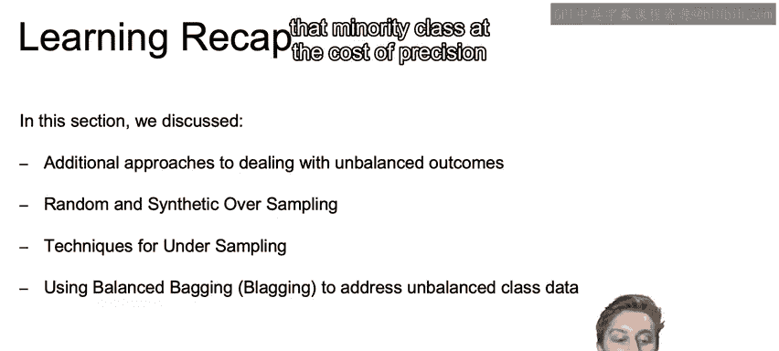

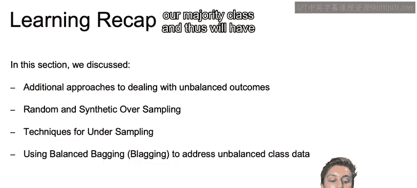

但在总体上决定使用上采样还是下采样时，请记住我们之前的讨论：下采样可能会以牺牲精确率为代价，为少数类带来更高的召回率；而上采样会保留多数类的所有样本，因此其召回率可能略低于下采样，但对这些预测的精确率会更好。

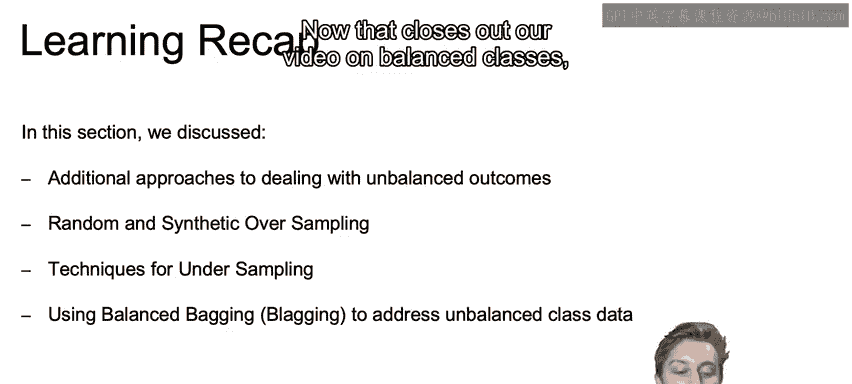

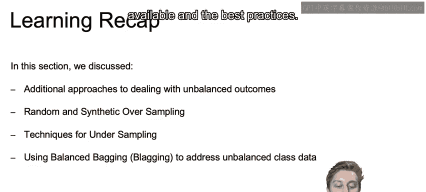

最后，作为一名实践中的数据科学家，对每种模型的工作原理有直观的理解，将极大地帮助您及时、有效地选择和调整模型。

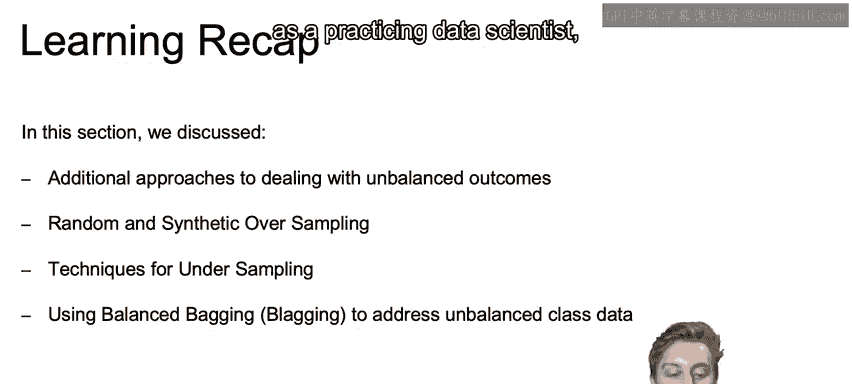

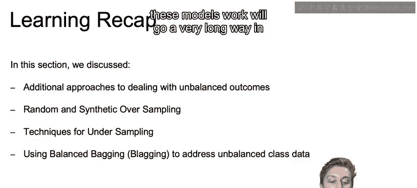

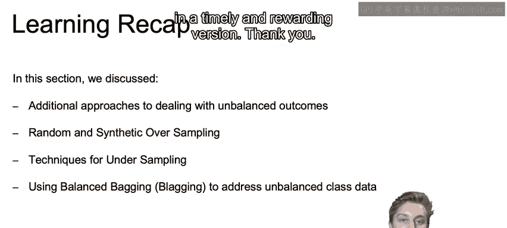

感谢学习。