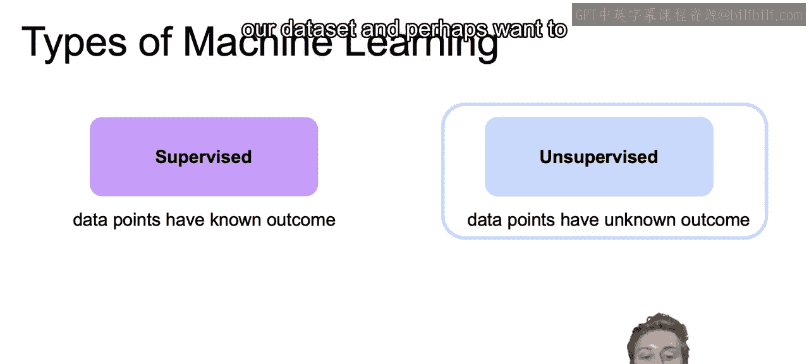
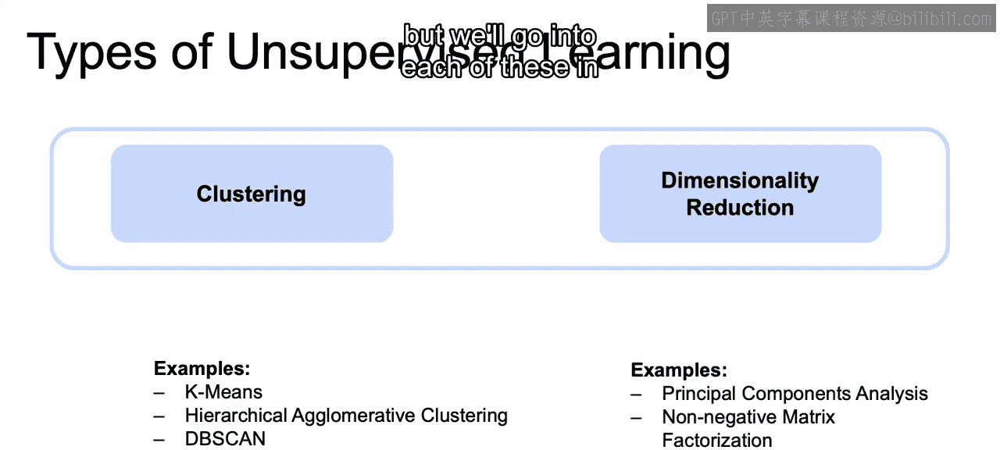
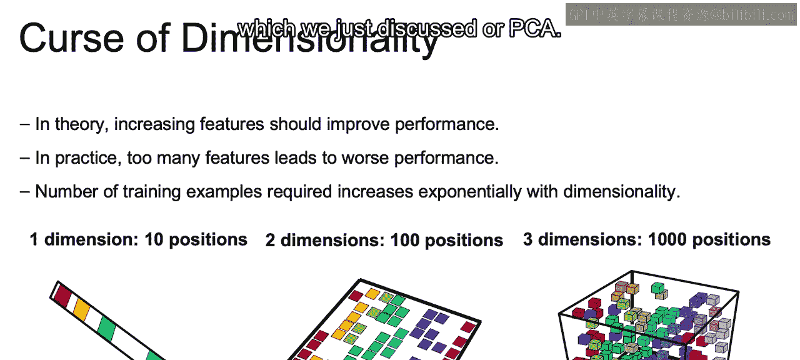
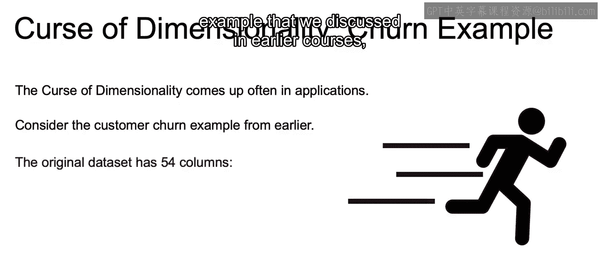
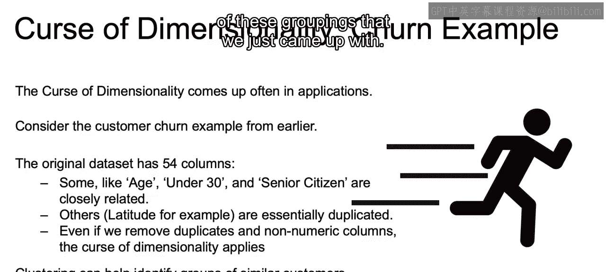
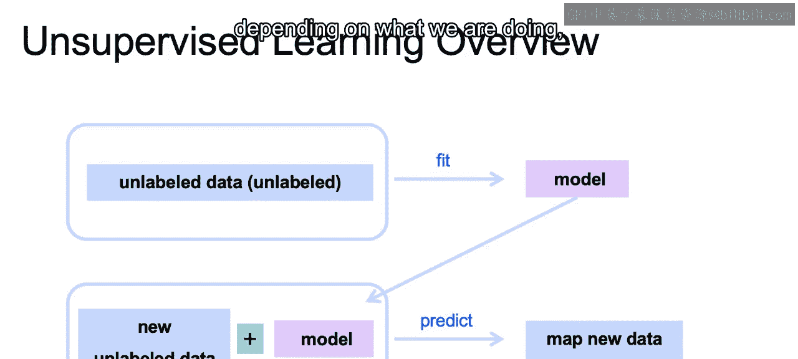
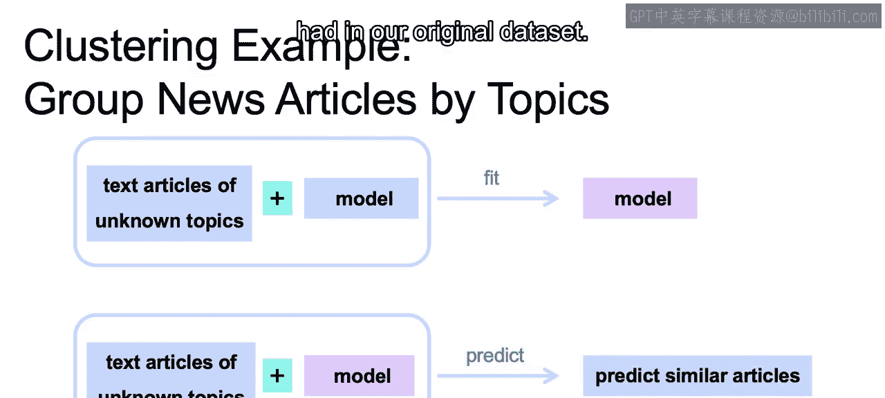

# 002：IBM《机器学习（无监督学习、深度学习和强化学习、毕业项目）｜machine learning》中英字幕 p02 1_无监督学习概述.zh_en -BV1eu4m1F7oz_p2-

In this set of videos， we will reintroduce the concept of unsupervised learning and what it entails。

 And this will serve as the foundation for the remainder of this specific course。

So in the last set of courses， we dove into the algorithms available。

 assuming that we have the known outcome available in our data set。In this course。

 we're going to talk about a whole other class of machine learning algorithms called unsupervised learning。

This class of algorithms are relevant when we don't have outcomes we are trying to predict。

But rather， we're interested in finding structures within our data set and perhaps want to partition our data into smaller pieces。

Now there can be a couple of use cases for this unsupervised learning。

One popular use case is called clustering， where we use our unlabeled data to identify an unknown structure。

 And an example this may be segmenting our customers into different groups。

The other major use case for unsupervised algorithms is for dimensionality reduction。

 namely using structural characteristics to reduce the size of our data set without losing much information contained in that original data set。

Now， in regards to clustering， we'll be covering the K means algorithm。

Herarchical agglomerative clustering algorithm， the D B scan algorithm and the mean shift algorithm。

And then in regards to dimensionality reduction， we'll be covering principal component analysis or PC。

 as well as non negative matrix factorization。 Now， we don't go into this at all over here。

 but we'll go into each of these in more depth as we get through these videos。

Now， just to give you some intuition as to why dimensionality reduction will be important。

 Let's talk about that infamous curse of dimensionality or infamous for those of us in these circles。

Now， dimensionality refers to the number of features in our data and theoretically and in ideal situations。

 the more features we have， the better the model should perform。

 since models have more things to learn from so they should therefore be more successful。However。

 real life is more complicated than that。 And there are several reasons why too many features may end up leading to worse performance in practice。

If you have too many features， several things can go wrong。

 Maybe some of those features are spurious correlations， meaning they correlate within your data set。

 but maybe not outside your data set as new data comes in。

Too many features may create more noise and signal algorithmgorithms find it harder to sort through non meaningful features if you have too many features。

And then the number of training examples required will increase exponentially with the dimensionality。

So this becomes especially clear when we think about distance based algorithms such as the canest neighbors that we talked about in our last course。

So if we look here and we imagine that we have a survey with 10 possible responses。

And for those 10 possible responses to get 60% coverage， we only need six answers。

We only need six different people to answer that us。

If we add on another survey with 10 possible response values。

That in order to get that same 60% coverage so that your can nearest neighbors of the same distance from whatever the new value coming in is。

We would need 60 people to respond， so we need 60 different rows of data in order to get our same coverage that we had when we just had six with one dimension。

And then you can imagine once we increase that to three dimensions。

And we have three different surveys， each one with 10 possible positions。

 Then in order to get that same coverage for each neighbor to be equally distance as it was for that original one dimension with only 10 positions。

 we would need 600 different rows。So you see how the more dimensions you add on。

The more rows you need， the more data you need to get that same amount of coverage。Now。

 on top of that。Higher dimensions will often lead to slower performance。

 as dealing with more columns is going to be more computationally expensive。And also。

 it'll lead to the incidence of outliers increasing as that number of dimensions increases。

So to mitigate some， not all the problems I just mentioned。

 one usually needs a lot of rows to train on， as I just mentioned。

Which may not be possible in real life。 You may not be able to gather these 600 different examples。

 or if you imagine， obviously you would increase to multiple dimensions much more than three。

 and we need that many more rows to get a certain amount of coverage。Therefore。

 it often becomes a need to reduce the dimension of one data set。

So far we have seen feature selection as a way of achieving this， and in this course。

 we'll discuss how we can accomplish the same goal using unsupervised machine learning models such as principal component analysis。

 which we just discussed our PCA。

Now， to think about this in a real life example， now this curse of dimensionality comes up often in applications。

So if we consider that customer churn example that we discussed in earlier courses。

The original data set had 54 different columns， so 54 different features。

And some like age or under 30 or senior citizen will obviously be very closely related。

Others such as latitude， for example， are essentially duplicated。

 We have those duplicated throughout。 And even if we remove duplicates and nonnumeric columns。

 this cursd dimensionality can still apply。 We can still have too many columns。

 even if they are not necessarily perfectly correlated。Now。

 things that we can do with this churn data set clustering can help identify groups of similar customers。

Without us thinking about whether or not they churn or not。

 maybe that allows to segment our customers into different groupings。

And then dimensionality reduction can improve both the performance because it can speed it up as we reduce the number of features and the interpretpretability of each of these groupings that we just came up with。

Now， just a high level overview。So when we're working with unsupervised learning。

 we start off with an unlabeled data set。We then fit that unlabeled data set dependent on the model that we choose。

And we get our model。 And then once we have that model， we can look at new， again， unlabeled data。

 We're still working with unlabeled data， but we can look at this new data。

Use that model that we just fit。Right from just before。

And then use that to predict our new groupings that we now have or the new dimensionality reduction。

 depending on which we are doing， whether it's dimensionality reduction or a clustering。

So an example for clustering， if we want to group news articles by topics and we don't have those topics as labels。

 So we have our starting point of text articles of unknown topics。We then create our model。

 whether that's K means or whatever other models that we will discuss in order to see what kind of groupings we will naturally find in our data set。

We fit that to the data set so that we have our model fitted to figure out according to certain features that are within these articles。

 according to certain words showing up。 We come up with certain groupings。

We then take another group of text articles of unknown topics。We use that model that we just fit。

And then we can use that again， that model took certain words。

 certain features in order to determine the groupings。

 we can then predict similar articles according to the articles that we had in our original data set。

