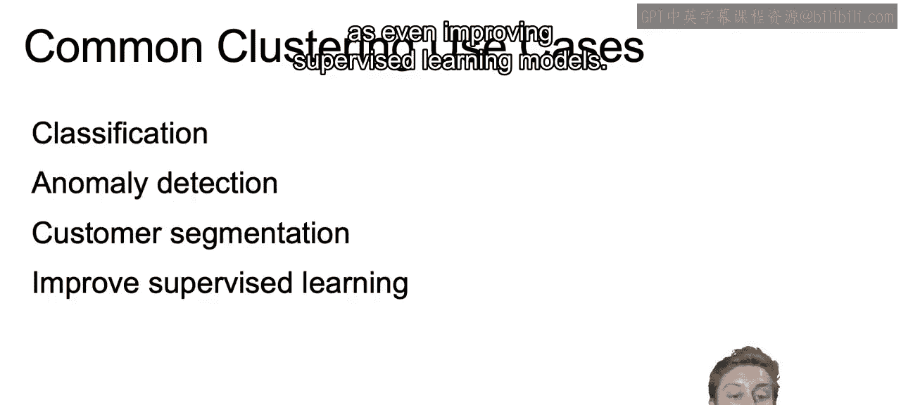
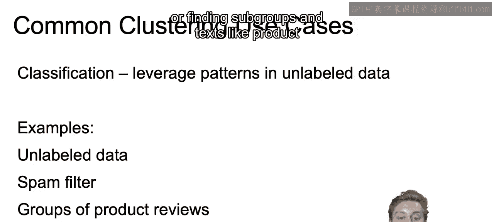
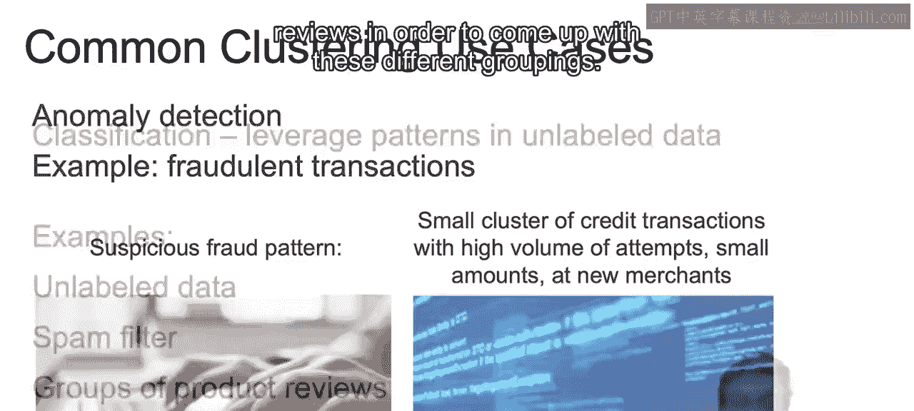
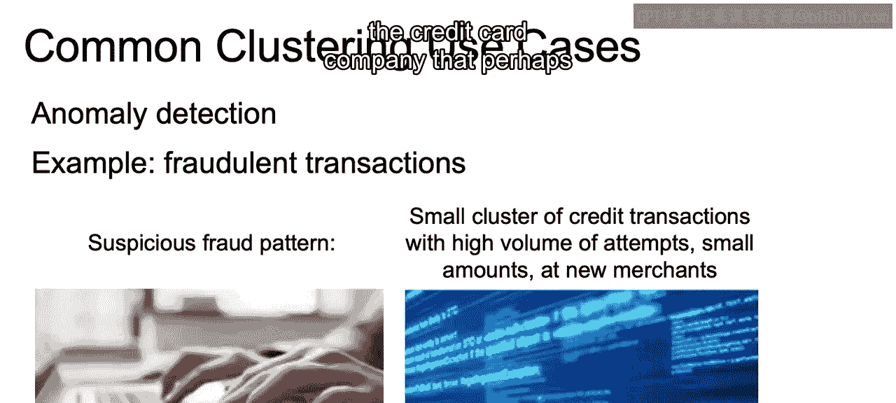
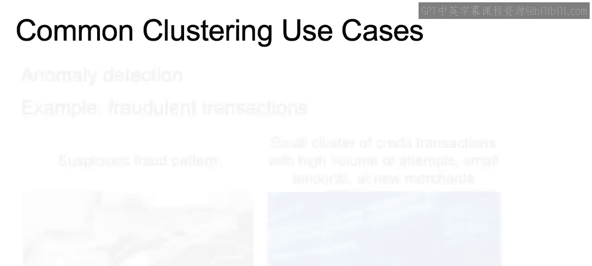
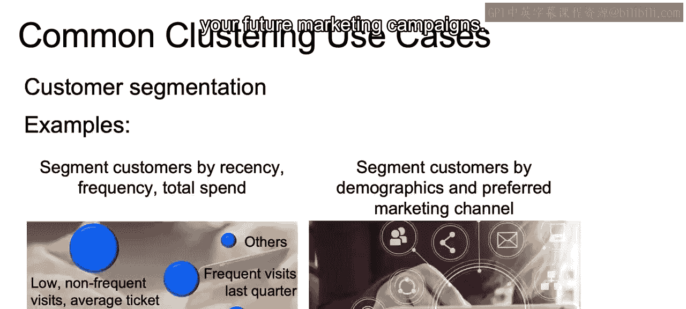
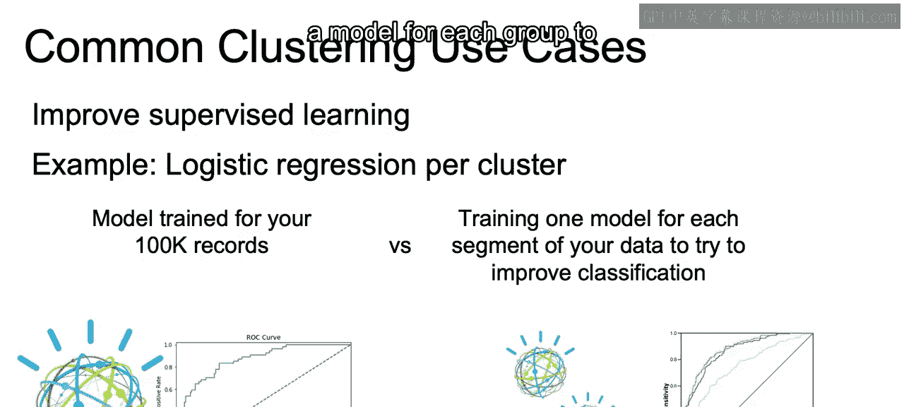
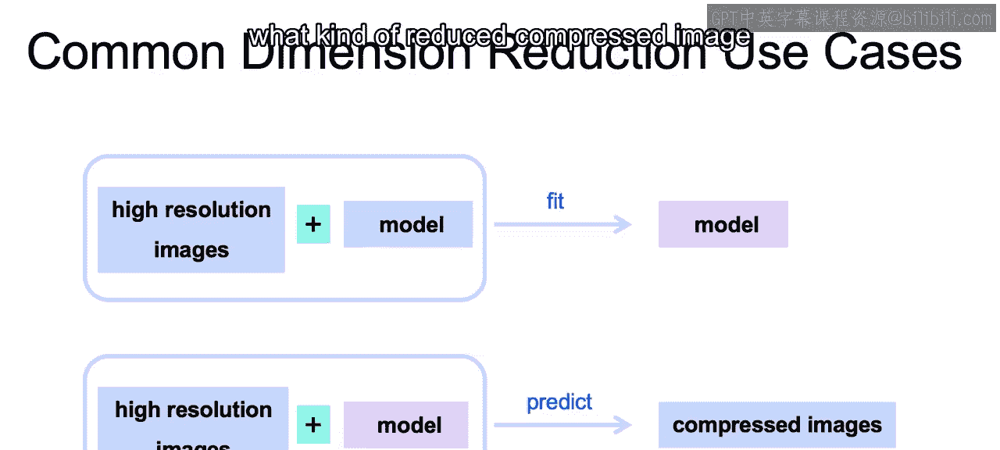
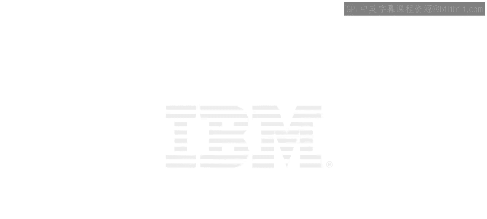

# 003：IBM《机器学习（无监督学习、深度学习和强化学习、毕业项目）｜machine learning》中英字幕 p03 2_无监督学习的聚类用例.zh_en -BV1eu4m1F7oz_p3-

Now let's talk about some common use cases out in the real world for using clustering。

So clustering will be used for classification， for anomaly detection， for customer segmentation。

 as well as even improving supervised learning models。

So a common use case to start is classification， as we mentioned， for data that is not labeled。

 so even if your data does not have a column that specifies the classes。

 clustering algorithms will try to find heterogeneous groupings within your dataset set。

And examples of this used for unlabeled data include finding groupings that are different than your normal emails to help you identify spam。

 so again， assume you don't have labels available。Or finding subgroups and text like product reviews in order to come up with these different groupings。

Now， another common use case for cluster will be anomaly detection。

Imagine that we are working with credit card transactions， and we have a certain user。

 and we see that there's a small cluster compared to the rest of those users transactions thats high volume of attempts。

 or perhaps now there' smaller volume of attempts or at new merchants。

 This would create its own new cluster。 And that would present an anomaly within the data set。

 and perhaps that would indicate to the credit card company that perhaps there's fraudulent transactions happening。

😊。

Another common use case will be customer segmentation。 So think of finding， for example。

 groupings that help you find out how many type of customers your business has based on the recency。

 the frequency and average amount of visits in the last three months。

 And it takes a combination of each one of those different features and comes up with different segments。

Or another common segmentation is by demographics and that level of engagement， for example。

 you can come up with groups for single customers， new parents， empty neters， etc。

 and determine for a combination of each or clustering those together in some way their preferred marketing channel and use these insights to drive your future marketing campaigns。

And then another common use case， or final common use case will be to help improve supervised learning。

 So， for example， you can check a good model， a good， say。

 logistic regression model that you trained on your entire dataset set and see how well that performs compared to models trained for sub segmentseg of your data that you found through clustering。

And perhaps you'll be able to improve your performance if you look at each one of these different classes and come up with different predictions for each one of these different groupings。

 Now， there's no guarantee that this will always work。

 but it is common practice to segment the data to find these heterogeneous groups and then train a model for each group to help improve that classification。

😊。

Now， again， the other type of unsupervised learning that we discussed is going to be dimension reduction。

And we will use this often for high resolution images。We take our high resolution images。

 We add on our model。 we fit our model to those different high resolution images。

In order to come up with a reduced， more compact version of those images that still hopefully contains most of the data that tells us what that image actually contains。

And then with that model that we fit。We can then take high resolution images that we haven't seen before and again come up with these smaller。

 reduced versions of those images as well。And then we can predict what that compressed image should be like。

 use those algorithms in order to determine what kind of reduced compressed image will still work in best practice。

So common reduction use cases here in image processing。

 this will be probably one of the most common use cases for PCA。

Both compressing images and in computer vision for image tracking as it will reduce the noise to the primary factors that are relevant in your video capture if we're talking about image tracking。

And with the reduced size of the data set can greatly speed up the computational efficiency of your detection algorithms。

Now， with that， we close out our introduction to unsupervised learning， and in the next video。

 we'll begin to hone in on the concept of clustering to help prepare us conceptually for our first unsupervised model。

 decay Ka means algorithm。 All right， I'll see you there。😊。

