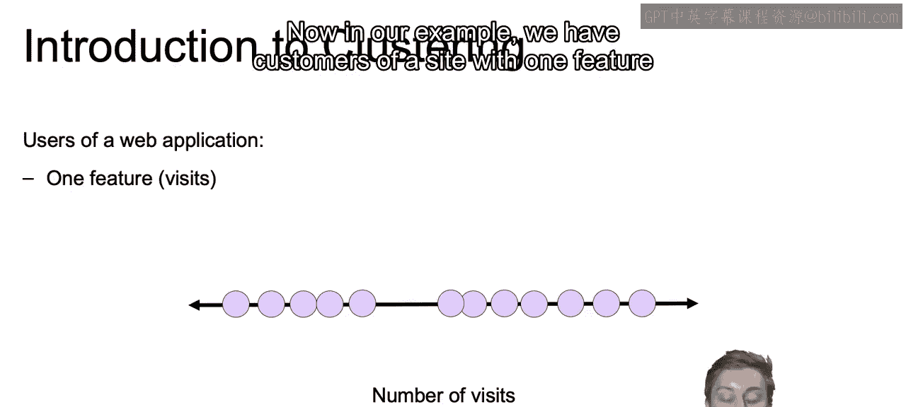
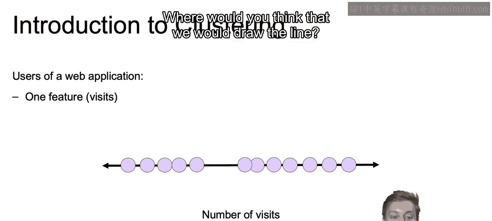
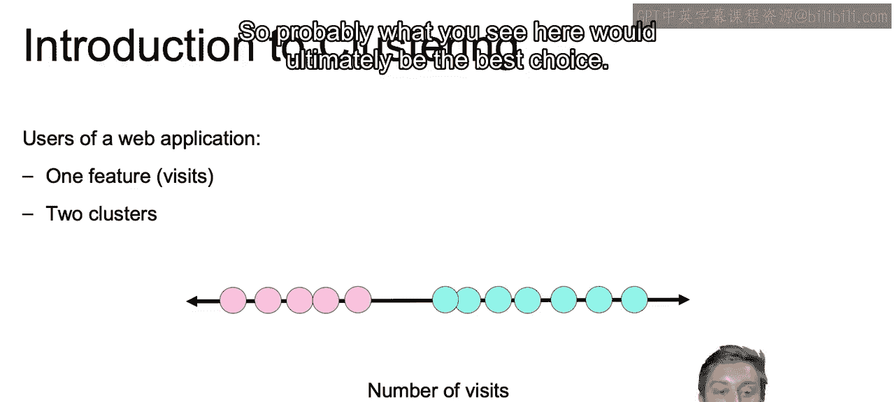
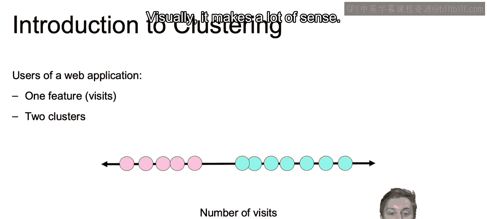
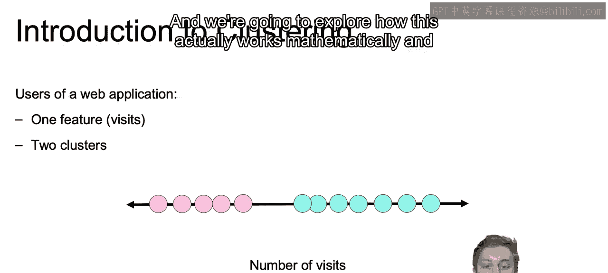
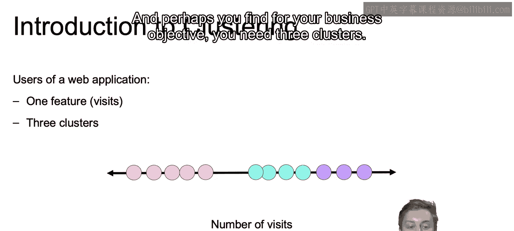
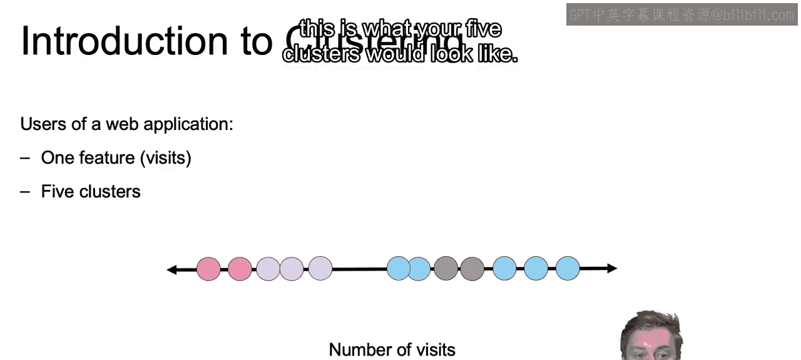
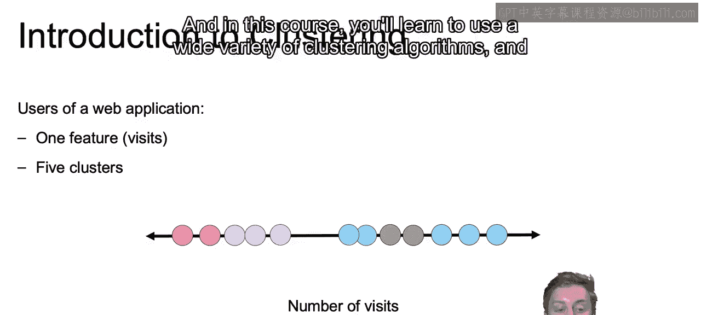
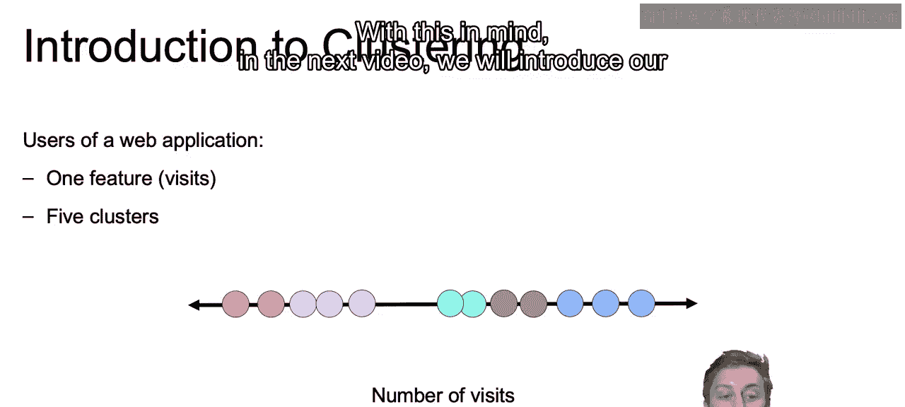
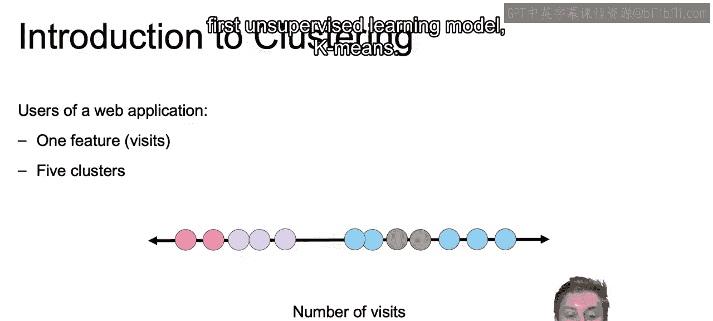

# 004：IBM《机器学习（无监督学习、深度学习和强化学习、毕业项目）｜machine learning》中英字幕 p04 3_聚类简介.zh_en -BV1eu4m1F7oz_p4-

Now， we're going to start with a simple example in order to introduce this concept of clustering。

 Now， in our example， we have customers of a site with one feature in order to segment these customers。

 The number of visits of that customer。

Now， if we were to use clustering to segment the users of the app into two groups。

 where would you think that we would draw the line。

So probably what you see here would ultimately be the best choice。 Visly， it makes a lot of sense。

 These are our two clusters， and we're going to explore how this actually works mathematically and algorithmically in just a bit。

And perhaps you find for your business objective， you need three clusters。

 and this is what your three clusters would look like。

Or maybe you need five clusters and this is what your five clusters would look like。

And in this course， you'll learn to use a wide variety of clustering algorithms and how to actually select the correct number of clusters that best suit your data。

With this in mind， in the next video， we will introduce our first unsupervised learning model。

 Ka Mes。

