# 005：IBM《机器学习（无监督学习、深度学习和强化学习、毕业项目）｜machine learning》中英字幕 p05 4_K-均值算法.zh_en -BV1eu4m1F7oz_p5-

Here we will introduce our first unsupervised machine learning algorithm used for clustering K means。

Now， we're going to use a similar example to what we just saw in the last video。 But this time。

 we have two features。 We have the number of visits that we had before to our site。

 And in the recency， how recently did that customer come to our store。And visually。

 hopefully you can see that there are already two clusters that you can come up with according to the data points that we have。

Now that answer is obvious to us， but our goal here with K means is to see how we can come up with this algorithmically。

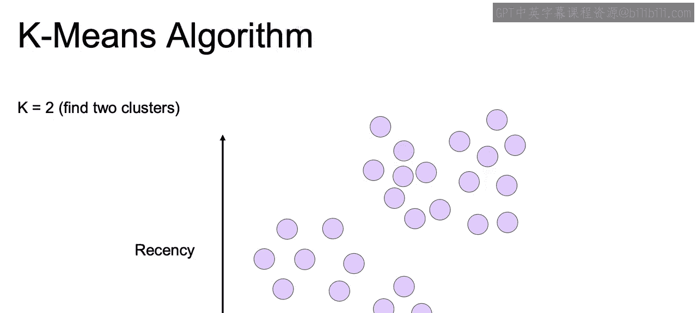

So the way that K means works。Is that since we prescribing two clusters we're going to initialize our algorithm by picking two random points。

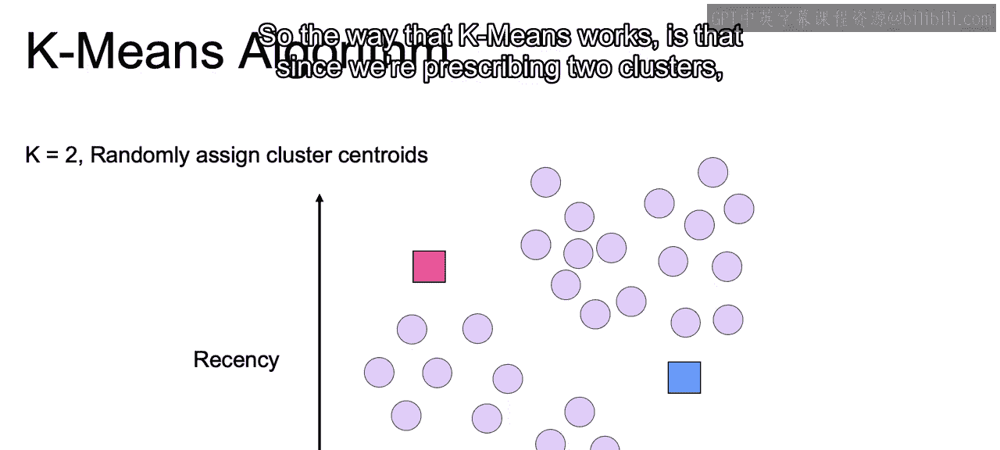

And these are going to act as the centroids of our clusters。

So we have our clusters in blue and our clusters in pink that are going to be coming from these two centroids。

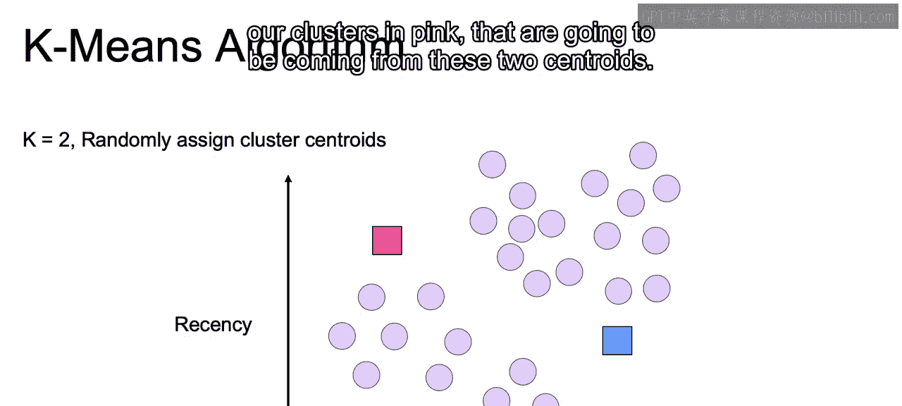

Then with our centroids initiative， we take each example in our space and determine which cluster it belongs to by computing the distance to the nearest centroid and seeing which ones closer。

So here in the first iteration， the examples are color coded as we see here。

And now every point belongs to a cluster。Now， obviously， hopefully。

 thinking back to the clusters that you thought of when you first looked at this data set。

We are not done yet， as this assignment is somewhat arbitrary and it hasn't converged and will explain what it looks like when it converged and what it means when it converges in just a bit。

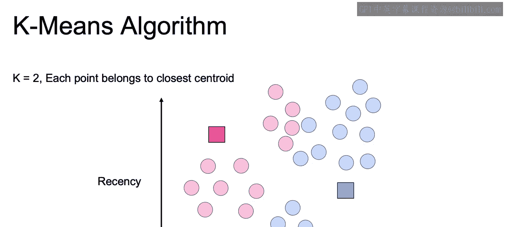

So the second step is then to adjust the points， to adjust those cents that we just discussed to the new mean of our clusters。

 So the new location of the pink square is right in the middle of all of the pink circles and same for the blue。

So we move our centroid so that theyre in the center of our defined points。

 We're now through the first iteration， and we're going to keep repeating this process until no example is assigned to a different cluster。

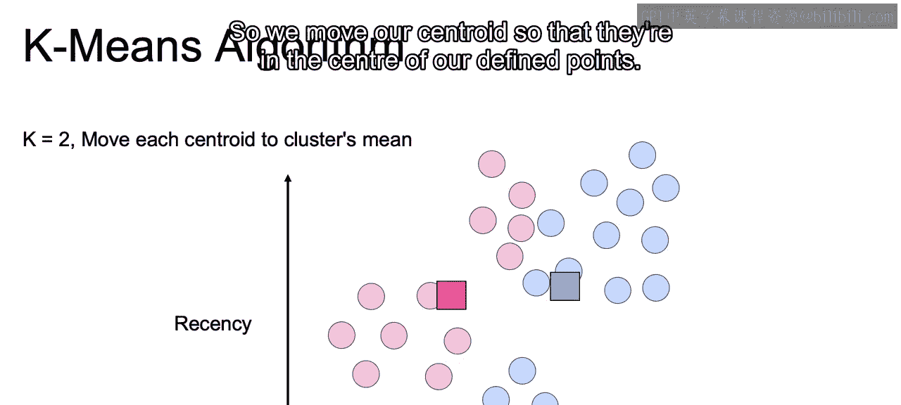

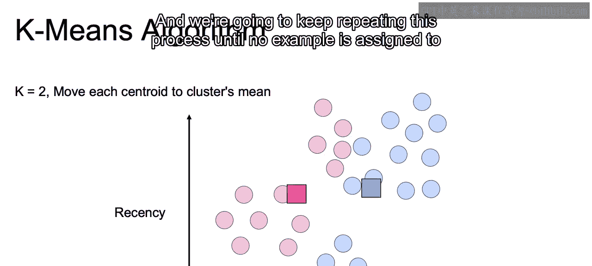

So let's see the first step of the second iteration with our new cluster centroids in place。

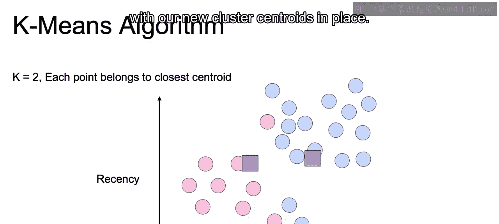

We are then going to identify which cluster each point belongs to again。

 so we see that they have moved， according to which one is closer to our new centroid。

 given the means of that last cluster。

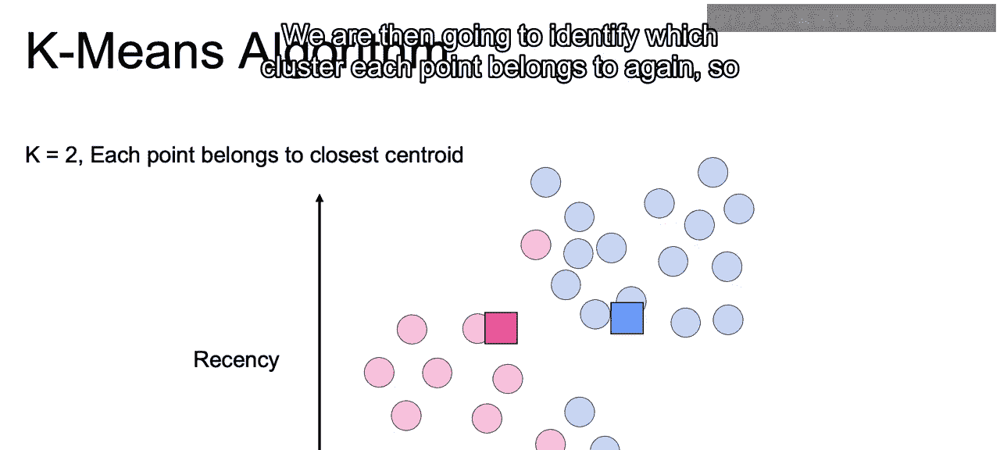

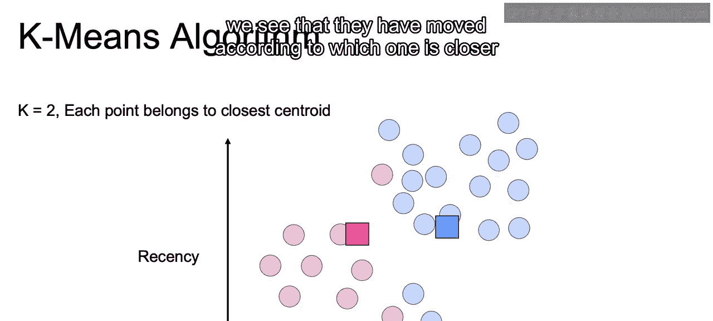

And then we'd move our centroids again to the new mean of our centroids of our data points that are within our two groupings now。

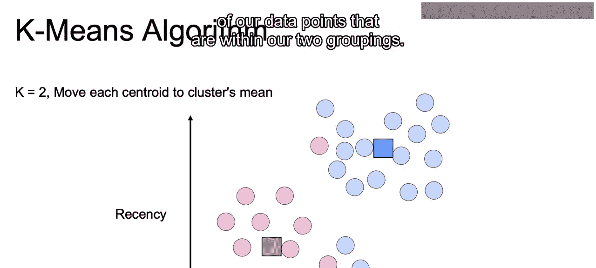

And then we do this for a third iteration。And we see again， the colors have changed。

And now the cluster sentries don't move anymore。And once we have that。

 that's the sign of convergence。 It found the visual structure in the dataset set automatically by continuously iterating。

 moving to the mean of those identified points that were closest until it was not able to move any more。

 though sentry stayed in place。 And we have our two clusters。

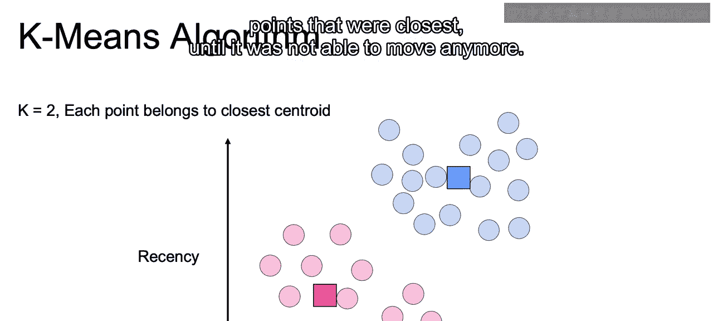

Now， for three clusters， the clusters can look like this。

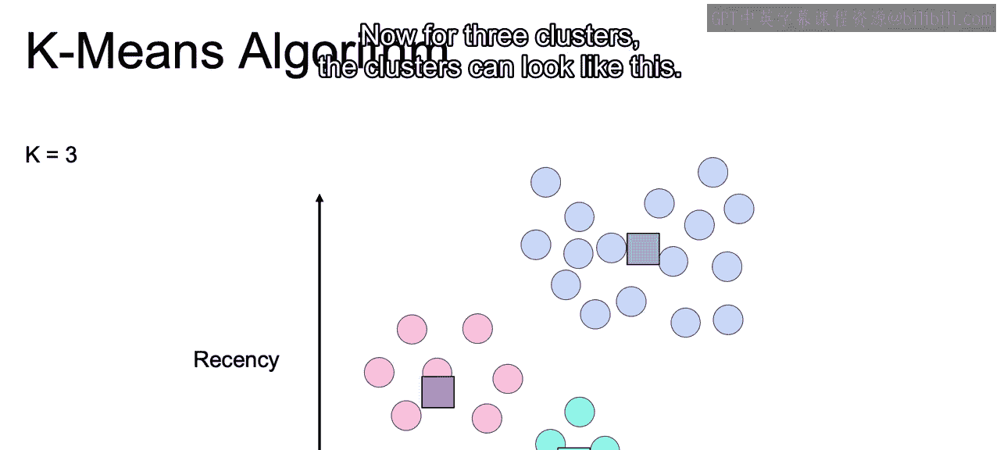

However， there can be multiple solutions。Such as what we see here。

And when we say that there's multiple solutions， what we mean here is that it's not going to move any more。

 We have converged。

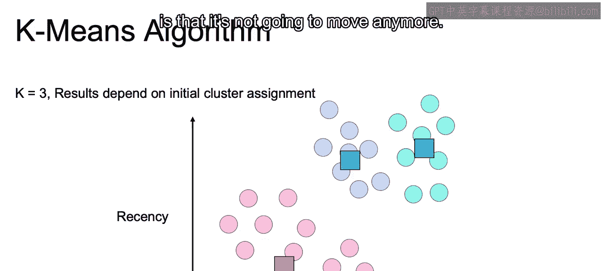

But we can converge in different places where we will no longer move those centroids。

 So the problem with Kaine's algorithm is that it's sensitive to a choice of those initial points。

 So different initial configurations may yield different results。

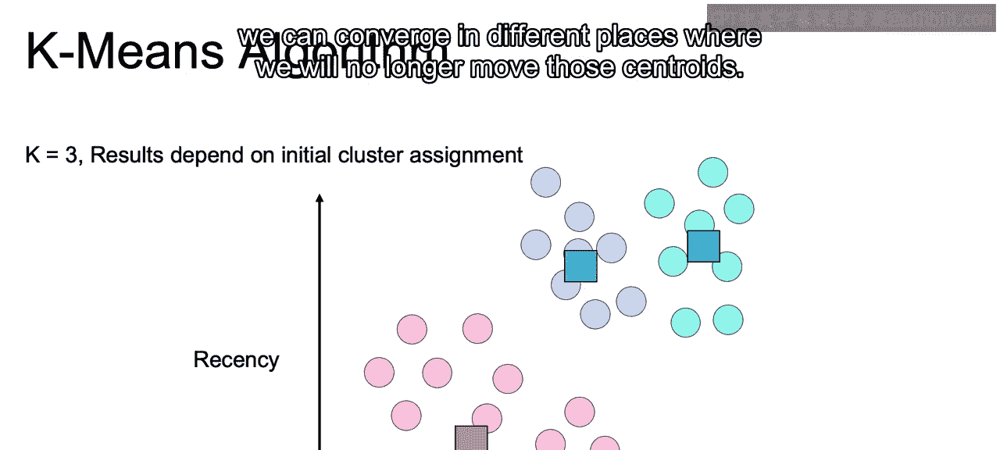

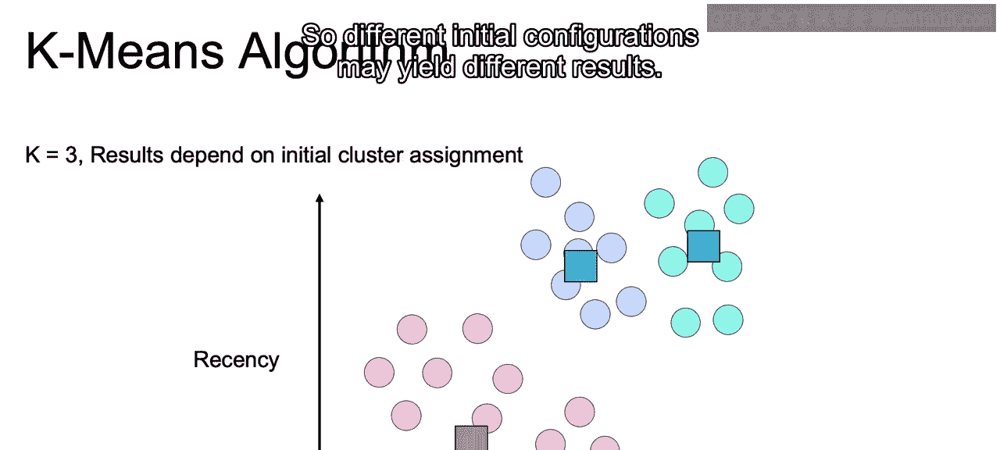

So I'll pause here and in the next video， we will discuss how to choose the right model in regards to which one of these different converges make the most sense。

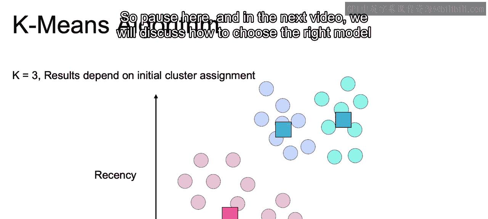

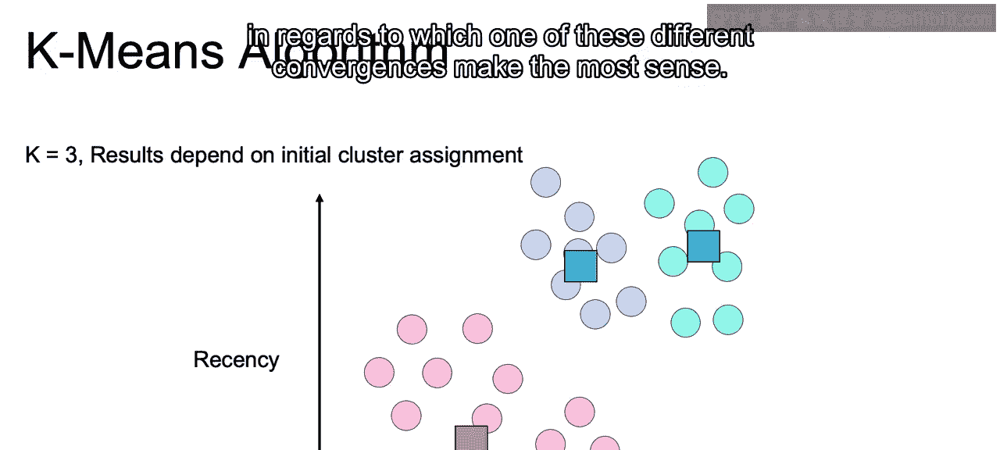

