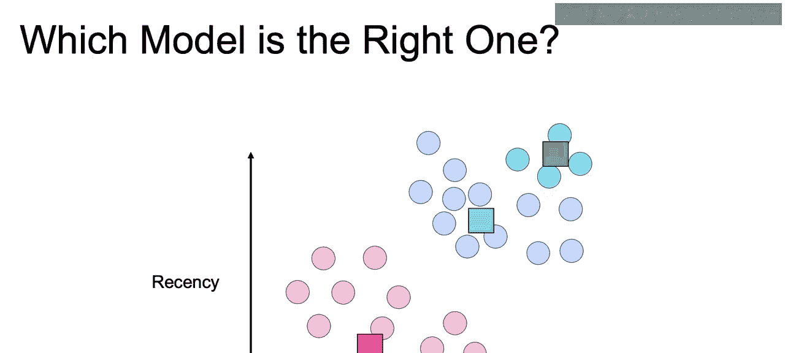
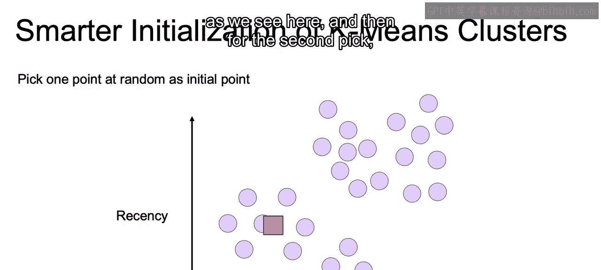
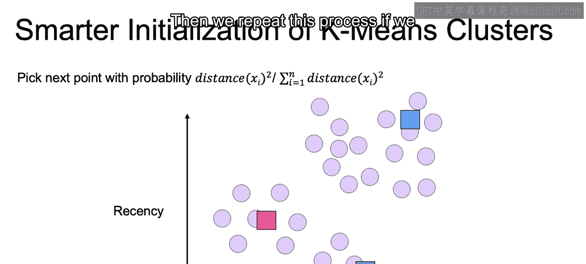
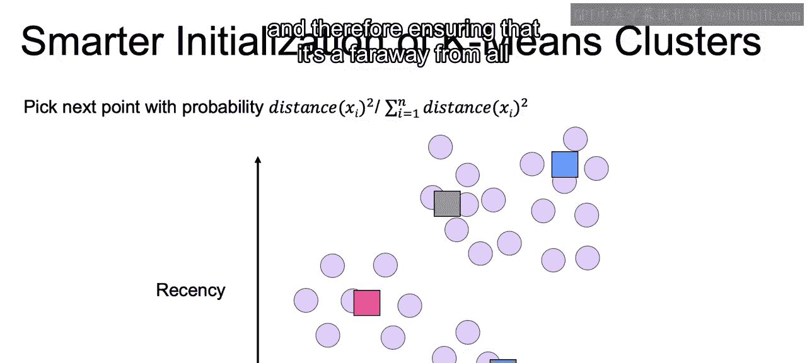
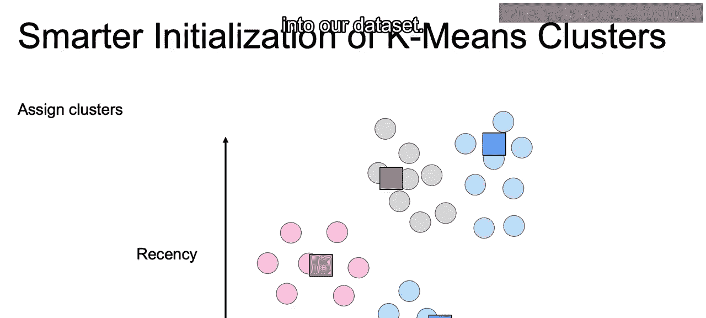

# 006：IBM《机器学习（无监督学习、深度学习和强化学习、毕业项目）｜machine learning》中英字幕 p06 5_K-均值算法的初始化.zh_en -BV1eu4m1F7oz_p6-

Now， as discussed， we may end up with different clusters every time we run this Ka means algorithm。

 as again， the process is to take three centuries。Find the nearest points。

Take the average of each one of those points that are closer to that centroid than any other centroid and set that average that we have as the new centroid and view the closest points to that new centroid。

And this movement towards that average， as we keep reinitiating that centroid after avi iteration。

Is going to stop once that centroid no longer moves。

 and this is going to happen at different points depending on where we initiate our centroids。

So we need a way of judging the converge results and rank them according to goodness。

Now， on top of that， another idea to ensure that we get to a better optimization of this Ka means algorithm is to initialize it in a smarter way。

So local Opima or just nonop solutions you can think of often happen when two cluster ss are initialized close to each other。

 so men being initialized close to each other lead to local optima， not optimal solutions。

So we can make an effort， therefore， to initialize with points that are far away enough from one another。

 So how do we do this。We can start by a random initial point as we see here。

And then for the second pick， instead of getting it randomly。

We're going to prioritize faraway points by assigning a probability of the distance of each point squared。

Over the sum of all the distances squared for each point from that initial centroid。

So we look at every single point， square the distance from the original centroid。

 and we put a lot more weight if you look at this formula to those that are far away because that'll take up a larger proportion of the total distance squared of all of our points。

So we'll be more likely to end up with a not so close point。

 such as the blue one as our second cluster centroid。

And then we'll repeat this process if we want three different clusters。

This time the distance calculation is calculated as the minimum distance of that point to any of the two clusters。

So rather than the distance just being from one cluster。

 it's a minimum distance between those two clusters to ensure that we are far away from both of our current clusters that we have。

And then we can do this one more time or as many more times as we need。

 depending on the K that we define。 And again， the distance measures now the minimum distance from all three of our initiated clusters and therefore ensuring that it's a far away from all three of the different centroids that we have initiated。

This algorithm with this smarter initialization is called K means plus plus。

And it helps avoid getting stuck at these local optima。

 And this is actually going to be the default implementation of K means in S K learn that we will be using later。

So here we've discussed getting a better initialization point。In the next video。

 we'll talk through picking the correct number of clusters as well in terms of how many clusters are actually built into our data set。

All right， I'll see you there。

